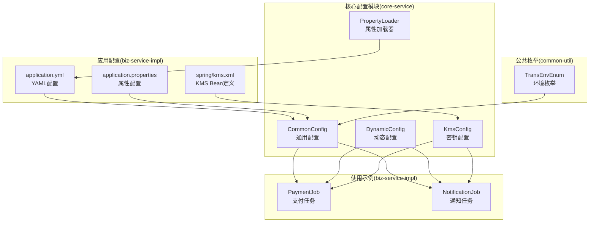
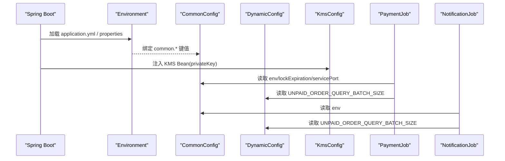
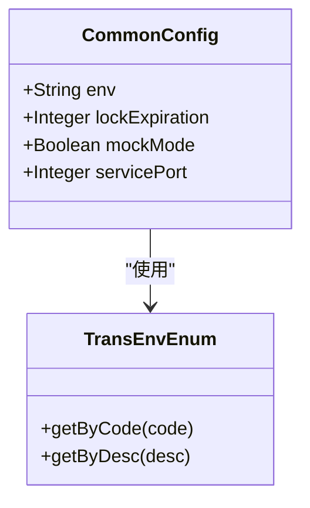
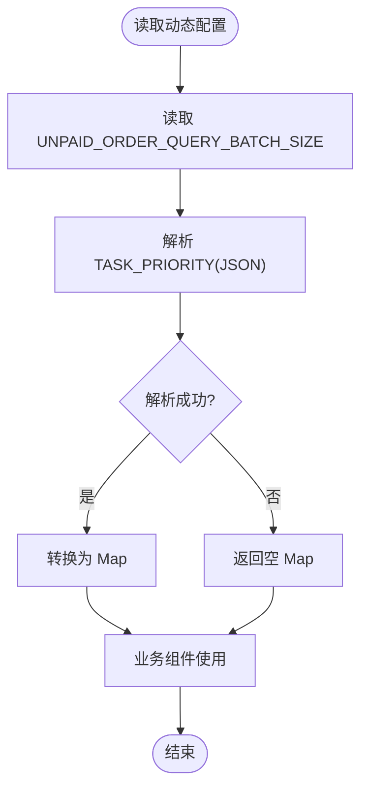
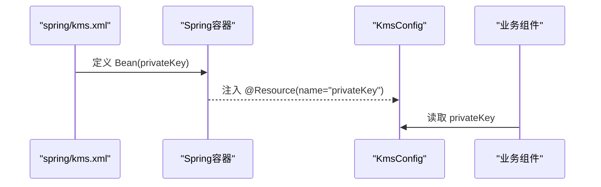
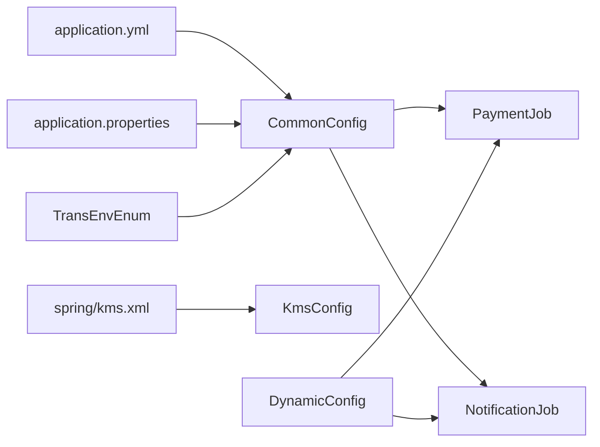

# 配置管理

<cite>
**本文引用的文件**
- [CommonConfig.java](file://core-service/src/main/java/com/magicliang/transaction/sys/core/config/CommonConfig.java)
- [DynamicConfig.java](file://core-service/src/main/java/com/magicliang/transaction/sys/core/config/DynamicConfig.java)
- [KmsConfig.java](file://core-service/src/main/java/com/magicliang/transaction/sys/core/config/KmsConfig.java)
- [PropertyLoader.java](file://core-service/src/main/java/com/magicliang/transaction/sys/core/config/PropertyLoader.java)
- [TransEnvEnum.java](file://common-util/src/main/java/com/magicliang/transaction/sys/common/enums/TransEnvEnum.java)
- [application.yml](file://biz-service-impl/src/main/resources/application.yml)
- [application.properties](file://biz-service-impl/src/main/resources/application.properties)
- [kms.xml](file://biz-service-impl/src/main/resources/spring/kms.xml)
- [PaymentJob.java](file://biz-service-impl/src/main/java/com/magicliang/transaction/sys/biz/service/impl/job/PaymentJob.java)
- [NotificationJob.java](file://biz-service-impl/src/main/java/com/magicliang/transaction/sys/biz/service/impl/job/NotificationJob.java)
</cite>

## 目录
1. [简介](#简介)
2. [项目结构](#项目结构)
3. [核心组件](#核心组件)
4. [架构总览](#架构总览)
5. [详细组件分析](#详细组件分析)
6. [依赖分析](#依赖分析)
7. [性能考量](#性能考量)
8. [故障排查指南](#故障排查指南)
9. [结论](#结论)
10. [附录](#附录)

## 简介
本文件围绕配置管理主题，系统梳理并深入解析以下关键配置类与机制：
- 通用配置：CommonConfig
- 动态配置：DynamicConfig
- 密钥管理配置：KmsConfig
- 属性加载器：PropertyLoader
- 环境枚举：TransEnvEnum
- 配置来源与优先级：application.yml、application.properties、Kubernetes ConfigMap/Secret 环境变量覆盖
- 实际使用场景：定时任务中对动态配置的消费
- 最佳实践：配置分类、环境隔离、安全与密钥管理、热更新、配置验证与回滚策略

## 项目结构
配置管理涉及的核心文件分布如下：
- 配置类与加载器：core-service 模块的 core/config 包
- 环境枚举：common-util 模块的 common/enums 包
- 配置来源：biz-service-impl 模块的 resources 下的 application.yml、application.properties、spring/kms.xml
- 使用示例：biz-service-impl 模块的 job 包中的 PaymentJob、NotificationJob

图表来源
- [CommonConfig.java:1-45](file://core-service/src/main/java/com/magicliang/transaction/sys/core/config/CommonConfig.java#L1-L45)
- [DynamicConfig.java:1-44](file://core-service/src/main/java/com/magicliang/transaction/sys/core/config/DynamicConfig.java#L1-L44)
- [KmsConfig.java:1-26](file://core-service/src/main/java/com/magicliang/transaction/sys/core/config/KmsConfig.java#L1-L26)
- [PropertyLoader.java:1-55](file://core-service/src/main/java/com/magicliang/transaction/sys/core/config/PropertyLoader.java#L1-L55)
- [TransEnvEnum.java:1-87](file://common-util/src/main/java/com/magicliang/transaction/sys/common/enums/TransEnvEnum.java#L1-L87)
- [application.yml:1-216](file://biz-service-impl/src/main/resources/application.yml#L1-L216)
- [application.properties:1-14](file://biz-service-impl/src/main/resources/application.properties#L1-L14)
- [kms.xml:1-9](file://biz-service-impl/src/main/resources/spring/kms.xml#L1-L9)
- [PaymentJob.java:1-66](file://biz-service-impl/src/main/java/com/magicliang/transaction/sys/biz/service/impl/job/PaymentJob.java#L1-L66)
- [NotificationJob.java:1-70](file://biz-service-impl/src/main/java/com/magicliang/transaction/sys/biz/service/impl/job/NotificationJob.java#L1-L70)

章节来源
- [application.yml:1-216](file://biz-service-impl/src/main/resources/application.yml#L1-L216)
- [application.properties:1-14](file://biz-service-impl/src/main/resources/application.properties#L1-L14)
- [kms.xml:1-9](file://biz-service-impl/src/main/resources/spring/kms.xml#L1-L9)

## 核心组件
本节聚焦三个核心配置类的设计与职责：
- CommonConfig：承载通用系统参数，如环境、分布式锁过期时间、是否进入挡板测试模式、服务端口等，并通过@ConfigurationProperties绑定到“common”命名空间。
- DynamicConfig：承载运行期可调整的动态参数，如未支付订单查询批次大小、任务优先级映射等，采用volatile静态字段便于跨组件共享与热更新。
- KmsConfig：通过@Resource注入来自KMS系统的敏感配置（如私钥），用于加密/签名等安全场景。

章节来源
- [CommonConfig.java:1-45](file://core-service/src/main/java/com/magicliang/transaction/sys/core/config/CommonConfig.java#L1-L45)
- [DynamicConfig.java:1-44](file://core-service/src/main/java/com/magicliang/transaction/sys/core/config/DynamicConfig.java#L1-L44)
- [KmsConfig.java:1-26](file://core-service/src/main/java/com/magicliang/transaction/sys/core/config/KmsConfig.java#L1-L26)

## 架构总览
配置管理在系统中的作用：
- 环境隔离：通过Spring Profile与YAML多档配置实现本地、Staging、生产等环境的差异化。
- 参数绑定：CommonConfig将“common”命名空间的键值绑定到Java对象，供业务组件直接注入使用。
- 动态参数：DynamicConfig提供运行期可调参数，结合JSON字符串映射为Map，便于按业务标识码设置线程优先级等。
- 密钥管理：KmsConfig通过Spring资源注入机制从KMS系统获取敏感信息，避免硬编码。
- 属性加载：PropertyLoader负责将PropertySources接入Spring Environment，支持扩展如Hocon等格式（注释中预留）。

图表来源
- [application.yml:52-58](file://biz-service-impl/src/main/resources/application.yml#L52-L58)
- [application.yml:142-143](file://biz-service-impl/src/main/resources/application.yml#L142-L143)
- [application.properties:1-14](file://biz-service-impl/src/main/resources/application.properties#L1-L14)
- [kms.xml:5-8](file://biz-service-impl/src/main/resources/spring/kms.xml#L5-L8)
- [CommonConfig.java:18-27](file://core-service/src/main/java/com/magicliang/transaction/sys/core/config/CommonConfig.java#L18-L27)
- [DynamicConfig.java:24-29](file://core-service/src/main/java/com/magicliang/transaction/sys/core/config/DynamicConfig.java#L24-L29)
- [KmsConfig.java:23-24](file://core-service/src/main/java/com/magicliang/transaction/sys/core/config/KmsConfig.java#L23-L24)
- [PaymentJob.java:60-62](file://biz-service-impl/src/main/java/com/magicliang/transaction/sys/biz/service/impl/job/PaymentJob.java#L60-L62)
- [NotificationJob.java:64-66](file://biz-service-impl/src/main/java/com/magicliang/transaction/sys/biz/service/impl/job/NotificationJob.java#L64-L66)

## 详细组件分析

### 通用配置：CommonConfig
- 设计要点
  - 使用@ConfigurationProperties(prefix = "common")将配置键统一归集到common命名空间。
  - 字段涵盖环境标识、分布式锁过期时间、挡板测试开关、服务端口等。
  - 与TransEnvEnum配合，确保环境值的合法性与一致性。
- 关键行为
  - 通过Spring容器注入，供业务层（如Job）直接使用。
  - 与application.yml中的common.*键值对应，实现环境隔离与差异化配置。

图表来源
- [CommonConfig.java:18-44](file://core-service/src/main/java/com/magicliang/transaction/sys/core/config/CommonConfig.java#L18-L44)
- [TransEnvEnum.java:57-85](file://common-util/src/main/java/com/magicliang/transaction/sys/common/enums/TransEnvEnum.java#L57-L85)

章节来源
- [CommonConfig.java:1-45](file://core-service/src/main/java/com/magicliang/transaction/sys/core/config/CommonConfig.java#L1-L45)
- [application.yml:52-58](file://biz-service-impl/src/main/resources/application.yml#L52-L58)

### 动态配置：DynamicConfig
- 设计要点
  - 提供运行期可调参数，如未支付订单查询批次大小、任务优先级映射等。
  - 采用volatile静态字段，保证多线程可见性；通过JsonUtils将JSON字符串转换为Map。
  - 提供getTaskPriorities()方法，若解析失败返回空集合，避免空指针。
- 关键行为
  - 业务组件（如PaymentJob、NotificationJob）直接读取静态字段，实现“热更新”效果。
  - 建议后续引入Apollo或Spring Config等动态配置中心，实现集中化与灰度发布。

图表来源
- [DynamicConfig.java:24-42](file://core-service/src/main/java/com/magicliang/transaction/sys/core/config/DynamicConfig.java#L24-L42)

章节来源
- [DynamicConfig.java:1-44](file://core-service/src/main/java/com/magicliang/transaction/sys/core/config/DynamicConfig.java#L1-L44)
- [PaymentJob.java:60-62](file://biz-service-impl/src/main/java/com/magicliang/transaction/sys/biz/service/impl/job/PaymentJob.java#L60-L62)
- [NotificationJob.java:64-66](file://biz-service-impl/src/main/java/com/magicliang/transaction/sys/biz/service/impl/job/NotificationJob.java#L64-L66)

### 密钥管理配置：KmsConfig
- 设计要点
  - 通过@Resource(name = "privateKey")注入KMS系统提供的私钥。
  - kms.xml中定义了名为privateKey的Bean，作为KMS资源的占位符。
- 关键行为
  - 业务组件可通过KmsConfig获取私钥，用于签名、解密等安全操作。
  - 生产环境建议由Kubernetes Secret或外部KMS系统注入真实值，避免明文存储。

图表来源
- [kms.xml:5-8](file://biz-service-impl/src/main/resources/spring/kms.xml#L5-L8)
- [KmsConfig.java:23-24](file://core-service/src/main/java/com/magicliang/transaction/sys/core/config/KmsConfig.java#L23-L24)

章节来源
- [KmsConfig.java:1-26](file://core-service/src/main/java/com/magicliang/transaction/sys/core/config/KmsConfig.java#L1-L26)
- [kms.xml:1-9](file://biz-service-impl/src/main/resources/spring/kms.xml#L1-L9)

### 属性加载器：PropertyLoader
- 设计要点
  - 通过PropertySourcesPlaceholderConfigurer将PropertySources接入Environment。
  - 预留对Hocon配置的支持（注释中给出示例），便于未来扩展非YAML格式配置。
- 关键行为
  - 使Spring能够解析并合并多来源属性，为CommonConfig等配置类提供基础。

章节来源
- [PropertyLoader.java:1-55](file://core-service/src/main/java/com/magicliang/transaction/sys/core/config/PropertyLoader.java#L1-L55)

### 环境枚举：TransEnvEnum
- 设计要点
  - 提供环境枚举值及按code/desc检索的方法，用于将配置中的字符串环境映射为内部枚举。
- 关键行为
  - PaymentJob/NotificationJob通过该枚举将CommonConfig.env转换为内部使用的整型环境码。

章节来源
- [TransEnvEnum.java:1-87](file://common-util/src/main/java/com/magicliang/transaction/sys/common/enums/TransEnvEnum.java#L1-L87)
- [PaymentJob.java](file://biz-service-impl/src/main/java/com/magicliang/transaction/sys/biz/service/impl/job/PaymentJob.java#L62)
- [NotificationJob.java](file://biz-service-impl/src/main/java/com/magicliang/transaction/sys/biz/service/impl/job/NotificationJob.java#L66)

## 依赖分析
- 配置类之间的依赖
  - CommonConfig依赖TransEnvEnum进行环境值校验与转换。
  - PaymentJob/NotificationJob依赖CommonConfig与DynamicConfig进行批处理参数构建。
  - KmsConfig依赖kms.xml中定义的privateKey Bean。
- 配置来源与优先级
  - application.yml：通过profiles激活不同环境配置，common.*键值绑定到CommonConfig。
  - application.properties：提供Tomcat线程池、Jackson序列化、OTLP观测等属性。
  - K8s环境变量：通过ConfigMap/Secret覆盖数据库URL、用户名、密码等敏感信息。

图表来源
- [application.yml:52-58](file://biz-service-impl/src/main/resources/application.yml#L52-L58)
- [application.yml:142-143](file://biz-service-impl/src/main/resources/application.yml#L142-L143)
- [application.properties:1-14](file://biz-service-impl/src/main/resources/application.properties#L1-L14)
- [kms.xml:5-8](file://biz-service-impl/src/main/resources/spring/kms.xml#L5-L8)
- [CommonConfig.java:18-44](file://core-service/src/main/java/com/magicliang/transaction/sys/core/config/CommonConfig.java#L18-L44)
- [DynamicConfig.java:24-42](file://core-service/src/main/java/com/magicliang/transaction/sys/core/config/DynamicConfig.java#L24-L42)
- [KmsConfig.java:23-24](file://core-service/src/main/java/com/magicliang/transaction/sys/core/config/KmsConfig.java#L23-L24)
- [TransEnvEnum.java:57-85](file://common-util/src/main/java/com/magicliang/transaction/sys/common/enums/TransEnvEnum.java#L57-L85)
- [PaymentJob.java:60-62](file://biz-service-impl/src/main/java/com/magicliang/transaction/sys/biz/service/impl/job/PaymentJob.java#L60-L62)
- [NotificationJob.java:64-66](file://biz-service-impl/src/main/java/com/magicliang/transaction/sys/biz/service/impl/job/NotificationJob.java#L64-L66)

章节来源
- [application.yml:1-216](file://biz-service-impl/src/main/resources/application.yml#L1-L216)
- [application.properties:1-14](file://biz-service-impl/src/main/resources/application.properties#L1-L14)
- [kms.xml:1-9](file://biz-service-impl/src/main/resources/spring/kms.xml#L1-L9)

## 性能考量
- 动态配置的热更新
  - DynamicConfig采用volatile静态字段，读取路径简单、开销低，适合高频读取场景。
  - 建议在大规模并发下，对频繁变更的配置增加缓存与版本控制，避免频繁解析JSON带来的GC压力。
- 环境隔离与配置合并
  - application.yml中通过profiles激活不同环境配置，合理拆分common.*键值，减少不必要的属性扫描。
- 密钥注入
  - KmsConfig通过Spring资源注入，避免在内存中长期持有敏感字符串，降低泄露风险。

## 故障排查指南
- 环境配置不生效
  - 检查application.yml中是否正确激活目标profile，确认common.env与TransEnvEnum的取值一致。
  - 参考：[application.yml:6-8](file://biz-service-impl/src/main/resources/application.yml#L6-L8)、[application.yml:142-143](file://biz-service-impl/src/main/resources/application.yml#L142-L143)
- 动态配置未生效
  - 确认DynamicConfig.UNPAID_ORDER_QUERY_BATCH_SIZE是否被正确赋值，检查JSON字符串TASK_PRIORITY是否可被JsonUtils解析。
  - 参考：[DynamicConfig.java:24-42](file://core-service/src/main/java/com/magicliang/transaction/sys/core/config/DynamicConfig.java#L24-L42)
- 密钥为空
  - 检查kms.xml中privateKey Bean是否正确声明，确认Spring容器是否成功注入。
  - 参考：[kms.xml:5-8](file://biz-service-impl/src/main/resources/spring/kms.xml#L5-L8)、[KmsConfig.java:23-24](file://core-service/src/main/java/com/magicliang/transaction/sys/core/config/KmsConfig.java#L23-L24)
- 观测与调试
  - application.properties中已配置OTLP导出器为none，避免在非观测环境下产生额外开销。
  - 参考：[application.properties:1-7](file://biz-service-impl/src/main/resources/application.properties#L1-L7)

章节来源
- [application.yml:1-216](file://biz-service-impl/src/main/resources/application.yml#L1-L216)
- [application.properties:1-14](file://biz-service-impl/src/main/resources/application.properties#L1-L14)
- [kms.xml:1-9](file://biz-service-impl/src/main/resources/spring/kms.xml#L1-L9)
- [DynamicConfig.java:1-44](file://core-service/src/main/java/com/magicliang/transaction/sys/core/config/DynamicConfig.java#L1-L44)
- [KmsConfig.java:1-26](file://core-service/src/main/java/com/magicliang/transaction/sys/core/config/KmsConfig.java#L1-L26)

## 结论
本配置管理体系通过CommonConfig、DynamicConfig、KmsConfig与PropertyLoader协同工作，实现了：
- 环境隔离与参数绑定：基于Spring Profile与@ConfigurationProperties的组合，确保不同环境的差异化配置。
- 动态参数与热更新：通过volatile静态字段与JSON映射，满足运行期快速调整需求。
- 安全与密钥管理：借助KMS与Spring资源注入，避免敏感信息硬编码。
- 可扩展性：PropertyLoader预留对Hocon等格式的支持，便于未来扩展。

## 附录
- 配置最佳实践
  - 配置分类：将通用参数、动态参数、安全参数分层管理，避免混杂。
  - 环境隔离：使用Spring Profile与YAML多档配置，明确本地、Staging、生产三档差异。
  - 安全考虑：敏感信息通过KMS或Kubernetes Secret注入，禁止明文存储。
  - 热更新：对高频读取的动态参数增加缓存与版本控制，避免频繁解析。
  - 配置验证：在启动阶段对关键配置进行校验，失败即阻断启动。
  - 配置回滚：采用版本化配置与灰度发布策略，出现问题可快速回退。