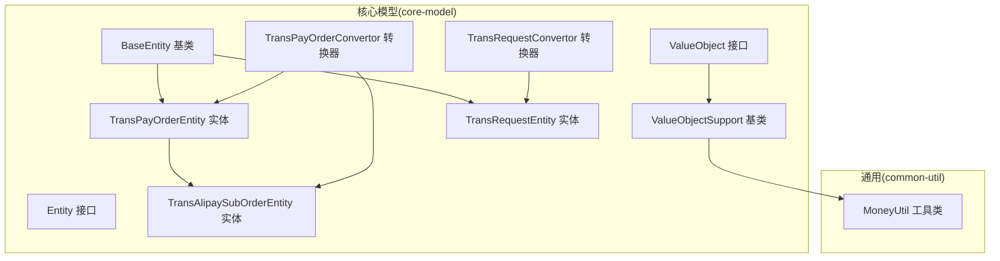
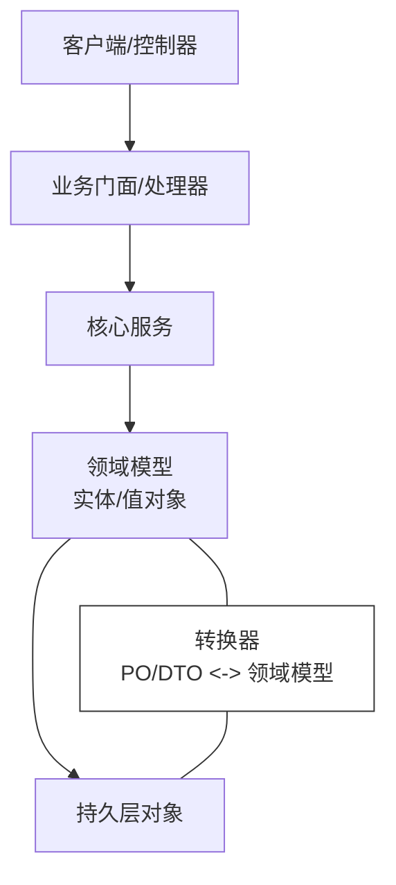
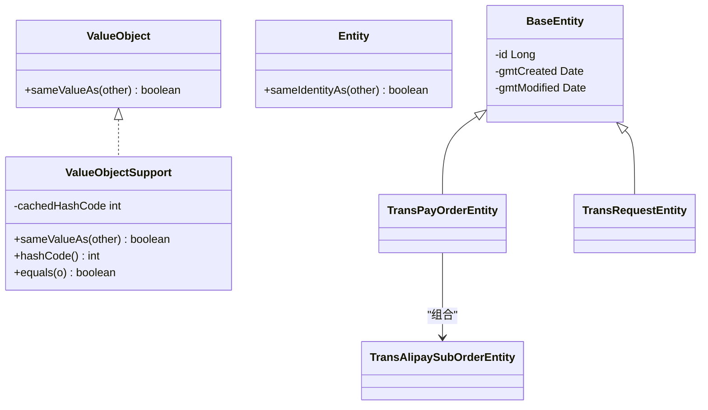
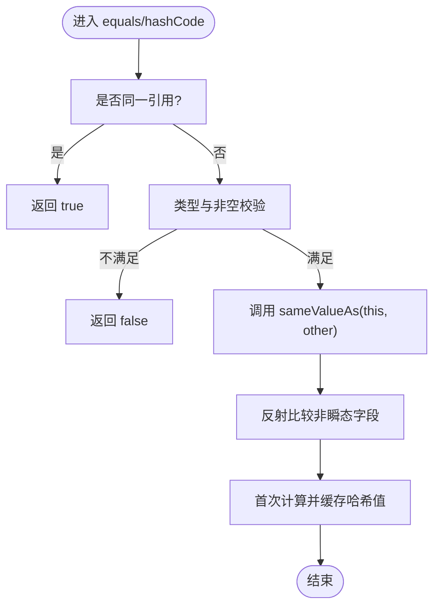
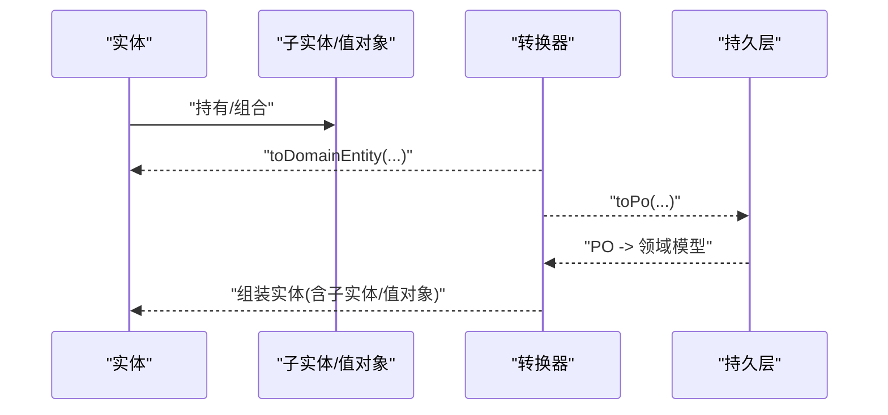
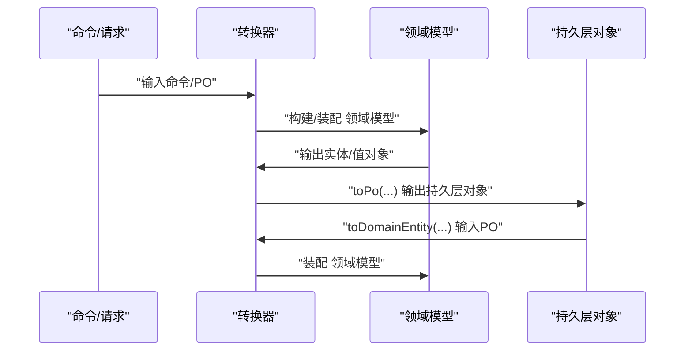
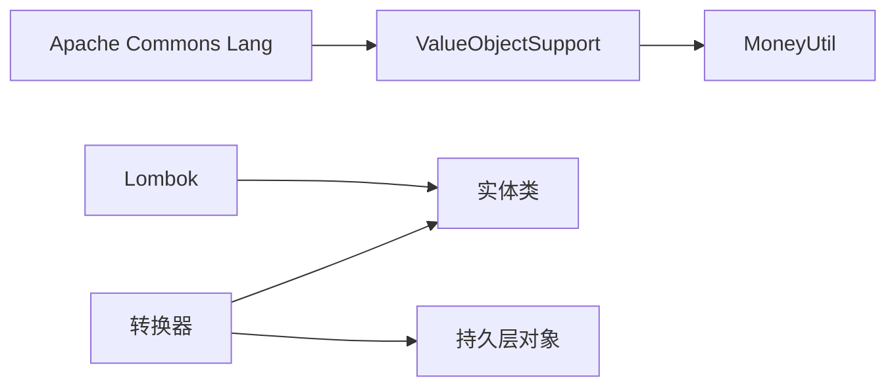

# 值对象与实体分离

<cite>
**本文引用的文件**
- [ValueObject.java](file://core-model/src/main/java/com/magicliang/transaction/sys/core/shared/ValueObject.java)
- [Entity.java](file://core-model/src/main/java/com/magicliang/transaction/sys/core/shared/Entity.java)
- [ValueObjectSupport.java](file://core-model/src/main/java/com/magicliang/transaction/sys/core/shared/experimental/ValueObjectSupport.java)
- [BaseEntity.java](file://core-model/src/main/java/com/magicliang/transaction/sys/core/model/entity/BaseEntity.java)
- [TransPayOrderEntity.java](file://core-model/src/main/java/com/magicliang/transaction/sys/core/model/entity/TransPayOrderEntity.java)
- [TransRequestEntity.java](file://core-model/src/main/java/com/magicliang/transaction/sys/core/model/entity/TransRequestEntity.java)
- [TransAlipaySubOrderEntity.java](file://core-model/src/main/java/com/magicliang/transaction/sys/core/model/entity/TransAlipaySubOrderEntity.java)
- [TransPayOrderConvertor.java](file://core-model/src/main/java/com/magicliang/transaction/sys/core/model/entity/convertor/TransPayOrderConvertor.java)
- [TransRequestConvertor.java](file://core-model/src/main/java/com/magicliang/transaction/sys/core/model/entity/convertor/TransRequestConvertor.java)
- [MoneyUtil.java](file://common-util/src/main/java/com/magicliang/transaction/sys/common/util/MoneyUtil.java)
- [DomainObjectUtils.java](file://core-model/src/main/java/com/magicliang/transaction/sys/core/shared/DomainObjectUtils.java)
- [AbstractNameValue.java](file://core-model/src/main/java/com/magicliang/transaction/sys/core/factory/AbstractNameValue.java)
- [StringValue.java](file://core-model/src/main/java/com/magicliang/transaction/sys/core/factory/StringValue.java)
</cite>

## 目录
1. [引言](#引言)
2. [项目结构](#项目结构)
3. [核心组件](#核心组件)
4. [架构总览](#架构总览)
5. [详细组件分析](#详细组件分析)
6. [依赖分析](#依赖分析)
7. [性能考虑](#性能考虑)
8. [故障排查指南](#故障排查指南)
9. [结论](#结论)
10. [附录](#附录)

## 引言
本文件围绕领域驱动设计（DDD）中的“值对象与实体分离”主题展开，结合代码库中的接口、基类与实体实现，系统阐述以下要点：
- 值对象与实体的概念边界与设计原则
- 为什么需要将不可变的值对象从可变实体中分离
- ValueObject基类的设计与不可变性保障机制
- 如何通过equals/hashCode的正确实现确保值对象相等性判断
- 实体与值对象的生命周期差异与共享/缓存策略
- 常见值对象实现模式（Money、Address等）与转换器模式
- 值对象在领域模型中的作用与最佳实践

## 项目结构
本项目采用多模块分层组织，核心模型位于core-model，通用工具位于common-util，业务共享请求与转换器位于biz-shared与core-model的convertor包中。值对象与实体的分离体现在：
- shared包定义了ValueObject与Entity的统一契约
- experimental包提供了ValueObjectSupport基类，示范不可变值对象的equals/hashCode实现
- model.entity包定义了多种实体，并通过组合关系承载值对象或子实体
- convertor包提供领域模型与持久层对象之间的双向转换

图表来源
- [ValueObject.java:1-18](file://core-model/src/main/java/com/magicliang/transaction/sys/core/shared/ValueObject.java#L1-L18)
- [Entity.java:1-17](file://core-model/src/main/java/com/magicliang/transaction/sys/core/shared/Entity.java#L1-L17)
- [ValueObjectSupport.java:1-65](file://core-model/src/main/java/com/magicliang/transaction/sys/core/shared/experimental/ValueObjectSupport.java#L1-L65)
- [BaseEntity.java:1-37](file://core-model/src/main/java/com/magicliang/transaction/sys/core/model/entity/BaseEntity.java#L1-L37)
- [TransPayOrderEntity.java:1-216](file://core-model/src/main/java/com/magicliang/transaction/sys/core/model/entity/TransPayOrderEntity.java#L1-L216)
- [TransRequestEntity.java:1-122](file://core-model/src/main/java/com/magicliang/transaction/sys/core/model/entity/TransRequestEntity.java#L1-L122)
- [TransAlipaySubOrderEntity.java:1-24](file://core-model/src/main/java/com/magicliang/transaction/sys/core/model/entity/TransAlipaySubOrderEntity.java#L1-L24)
- [TransPayOrderConvertor.java:1-62](file://core-model/src/main/java/com/magicliang/transaction/sys/core/model/entity/convertor/TransPayOrderConvertor.java#L1-L62)
- [TransRequestConvertor.java:1-43](file://core-model/src/main/java/com/magicliang/transaction/sys/core/model/entity/convertor/TransRequestConvertor.java#L1-L43)
- [MoneyUtil.java:1-154](file://common-util/src/main/java/com/magicliang/transaction/sys/common/util/MoneyUtil.java#L1-L154)

章节来源
- [ValueObject.java:1-18](file://core-model/src/main/java/com/magicliang/transaction/sys/core/shared/ValueObject.java#L1-L18)
- [Entity.java:1-17](file://core-model/src/main/java/com/magicliang/transaction/sys/core/shared/Entity.java#L1-L17)
- [ValueObjectSupport.java:1-65](file://core-model/src/main/java/com/magicliang/transaction/sys/core/shared/experimental/ValueObjectSupport.java#L1-L65)
- [BaseEntity.java:1-37](file://core-model/src/main/java/com/magicliang/transaction/sys/core/model/entity/BaseEntity.java#L1-L37)
- [TransPayOrderEntity.java:1-216](file://core-model/src/main/java/com/magicliang/transaction/sys/core/model/entity/TransPayOrderEntity.java#L1-L216)
- [TransRequestEntity.java:1-122](file://core-model/src/main/java/com/magicliang/transaction/sys/core/model/entity/TransRequestEntity.java#L1-L122)
- [TransAlipaySubOrderEntity.java:1-24](file://core-model/src/main/java/com/magicliang/transaction/sys/core/model/entity/TransAlipaySubOrderEntity.java#L1-L24)
- [TransPayOrderConvertor.java:1-62](file://core-model/src/main/java/com/magicliang/transaction/sys/core/model/entity/convertor/TransPayOrderConvertor.java#L1-L62)
- [TransRequestConvertor.java:1-43](file://core-model/src/main/java/com/magicliang/transaction/sys/core/model/entity/convertor/TransRequestConvertor.java#L1-L43)
- [MoneyUtil.java:1-154](file://common-util/src/main/java/com/magicliang/transaction/sys/common/util/MoneyUtil.java#L1-L154)

## 核心组件
- 值对象契约与基类
  - ValueObject接口：定义按属性值比较的契约sameValueAs
  - ValueObjectSupport基类：提供不可变值对象的equals/hashCode实现，使用反射比较字段，带缓存哈希值避免重复计算
- 实体契约与基类
  - Entity接口：定义按身份比较的契约sameIdentityAs
  - BaseEntity：提供实体通用的id、创建/修改时间等基础字段
- 实体模型
  - TransPayOrderEntity：聚合根，包含状态、版本、时间戳、子订单、请求等组合关系
  - TransRequestEntity：交易请求实体，包含重试次数、状态、环境等
  - TransAlipaySubOrderEntity：支付宝子订单实体，扩展目标账户字段
- 转换器
  - TransPayOrderConvertor：支付订单与持久层对象的双向转换，含子订单组合
  - TransRequestConvertor：请求实体与持久层对象的双向转换
- 工具与工厂
  - MoneyUtil：金额工具，提供分/元转换、取整等
  - AbstractNameValue/StringValue：工厂Bean，演示值对象的构建与预填充

章节来源
- [ValueObject.java:1-18](file://core-model/src/main/java/com/magicliang/transaction/sys/core/shared/ValueObject.java#L1-L18)
- [ValueObjectSupport.java:1-65](file://core-model/src/main/java/com/magicliang/transaction/sys/core/shared/experimental/ValueObjectSupport.java#L1-L65)
- [Entity.java:1-17](file://core-model/src/main/java/com/magicliang/transaction/sys/core/shared/Entity.java#L1-L17)
- [BaseEntity.java:1-37](file://core-model/src/main/java/com/magicliang/transaction/sys/core/model/entity/BaseEntity.java#L1-L37)
- [TransPayOrderEntity.java:1-216](file://core-model/src/main/java/com/magicliang/transaction/sys/core/model/entity/TransPayOrderEntity.java#L1-L216)
- [TransRequestEntity.java:1-122](file://core-model/src/main/java/com/magicliang/transaction/sys/core/model/entity/TransRequestEntity.java#L1-L122)
- [TransAlipaySubOrderEntity.java:1-24](file://core-model/src/main/java/com/magicliang/transaction/sys/core/model/entity/TransAlipaySubOrderEntity.java#L1-L24)
- [TransPayOrderConvertor.java:1-62](file://core-model/src/main/java/com/magicliang/transaction/sys/core/model/entity/convertor/TransPayOrderConvertor.java#L1-L62)
- [TransRequestConvertor.java:1-43](file://core-model/src/main/java/com/magicliang/transaction/sys/core/model/entity/convertor/TransRequestConvertor.java#L1-L43)
- [MoneyUtil.java:1-154](file://common-util/src/main/java/com/magicliang/transaction/sys/common/util/MoneyUtil.java#L1-L154)
- [AbstractNameValue.java:1-88](file://core-model/src/main/java/com/magicliang/transaction/sys/core/factory/AbstractNameValue.java#L1-L88)
- [StringValue.java:1-32](file://core-model/src/main/java/com/magicliang/transaction/sys/core/factory/StringValue.java#L1-L32)

## 架构总览
下图展示了值对象与实体在领域模型中的交互关系，以及转换器在不同层次间的桥梁作用。

图表来源
- [TransPayOrderConvertor.java:1-62](file://core-model/src/main/java/com/magicliang/transaction/sys/core/model/entity/convertor/TransPayOrderConvertor.java#L1-L62)
- [TransRequestConvertor.java:1-43](file://core-model/src/main/java/com/magicliang/transaction/sys/core/model/entity/convertor/TransRequestConvertor.java#L1-L43)

## 详细组件分析

### 值对象与实体的契约与基类
- 值对象接口与基类
  - ValueObject接口：定义sameValueAs，强调按属性值比较，无身份
  - ValueObjectSupport基类：提供final equals/hashCode实现，使用反射比较非瞬态字段；缓存哈希值，提升性能且保证线程安全读取
- 实体接口与基类
  - Entity接口：定义sameIdentityAs，强调按身份比较
  - BaseEntity：提供id、创建/修改时间等通用字段，便于实体统一管理

图表来源
- [ValueObject.java:1-18](file://core-model/src/main/java/com/magicliang/transaction/sys/core/shared/ValueObject.java#L1-L18)
- [ValueObjectSupport.java:1-65](file://core-model/src/main/java/com/magicliang/transaction/sys/core/shared/experimental/ValueObjectSupport.java#L1-L65)
- [Entity.java:1-17](file://core-model/src/main/java/com/magicliang/transaction/sys/core/shared/Entity.java#L1-L17)
- [BaseEntity.java:1-37](file://core-model/src/main/java/com/magicliang/transaction/sys/core/model/entity/BaseEntity.java#L1-L37)
- [TransPayOrderEntity.java:1-216](file://core-model/src/main/java/com/magicliang/transaction/sys/core/model/entity/TransPayOrderEntity.java#L1-L216)
- [TransRequestEntity.java:1-122](file://core-model/src/main/java/com/magicliang/transaction/sys/core/model/entity/TransRequestEntity.java#L1-L122)
- [TransAlipaySubOrderEntity.java:1-24](file://core-model/src/main/java/com/magicliang/transaction/sys/core/model/entity/TransAlipaySubOrderEntity.java#L1-L24)

章节来源
- [ValueObject.java:1-18](file://core-model/src/main/java/com/magicliang/transaction/sys/core/shared/ValueObject.java#L1-L18)
- [ValueObjectSupport.java:1-65](file://core-model/src/main/java/com/magicliang/transaction/sys/core/shared/experimental/ValueObjectSupport.java#L1-L65)
- [Entity.java:1-17](file://core-model/src/main/java/com/magicliang/transaction/sys/core/shared/Entity.java#L1-L17)
- [BaseEntity.java:1-37](file://core-model/src/main/java/com/magicliang/transaction/sys/core/model/entity/BaseEntity.java#L1-L37)

### 不可变性与相等性保障机制
- 不可变性
  - ValueObjectSupport通过final方法阻止子类覆盖equals/hashCode，确保行为一致
  - 缓存哈希值，避免重复计算，同时保证值对象不可变前提下的线程安全
- 相等性判断
  - equals先做快速相等与类型校验，再委托sameValueAs
  - sameValueAs使用反射比较所有非瞬态字段，确保属性完全一致才认为相等

图表来源
- [ValueObjectSupport.java:19-62](file://core-model/src/main/java/com/magicliang/transaction/sys/core/shared/experimental/ValueObjectSupport.java#L19-L62)

章节来源
- [ValueObjectSupport.java:19-62](file://core-model/src/main/java/com/magicliang/transaction/sys/core/shared/experimental/ValueObjectSupport.java#L19-L62)

### 实体与值对象的生命周期与共享策略
- 生命周期差异
  - 实体：可变，存在身份标识，状态可能随时间变化，适合持久化与数据库映射
  - 值对象：不可变，仅由属性决定相等性，适合在内存中自由传递与复用
- 共享与缓存
  - 值对象不可变，可安全共享与缓存，无需深拷贝；实体可被修改，需谨慎共享
- 组合关系
  - 实体可组合值对象或子实体，如TransPayOrderEntity组合TransAlipaySubOrderEntity与多个TransRequestEntity

图表来源
- [TransPayOrderEntity.java:174-190](file://core-model/src/main/java/com/magicliang/transaction/sys/core/model/entity/TransPayOrderEntity.java#L174-L190)
- [TransPayOrderConvertor.java:54-59](file://core-model/src/main/java/com/magicliang/transaction/sys/core/model/entity/convertor/TransPayOrderConvertor.java#L54-L59)

章节来源
- [TransPayOrderEntity.java:174-190](file://core-model/src/main/java/com/magicliang/transaction/sys/core/model/entity/TransPayOrderEntity.java#L174-L190)
- [TransPayOrderConvertor.java:54-59](file://core-model/src/main/java/com/magicliang/transaction/sys/core/model/entity/convertor/TransPayOrderConvertor.java#L54-L59)

### 常见值对象设计模式与示例
- 金额值对象（Money）
  - 设计要点：封装分/元转换、精度控制、取整策略；通过工具类MoneyUtil提供转换与格式化
  - 不可变性：对外暴露只读视图，内部以最小单位（分）存储，避免浮点误差
- 地址值对象（Address）
  - 设计要点：由国家、省份、城市、街道、邮编等字段组成；按值比较，适合跨模块共享
  - 不可变性：构造后不可修改，必要时提供派生新值对象的方法
- 金额工具（MoneyUtil）
  - 提供分/元互转、字符串格式化、向下取整、整十规则等方法，支撑值对象的构造与运算

章节来源
- [MoneyUtil.java:1-154](file://common-util/src/main/java/com/magicliang/transaction/sys/common/util/MoneyUtil.java#L1-L154)

### 转换器模式：实体与值对象的相互转换
- 转换器职责
  - 将外部请求/持久层对象转换为领域模型（实体/值对象）
  - 在序列化/持久化时，将领域模型还原为PO/DTO
- 示例
  - TransPayOrderConvertor：支持支付订单+子订单的组合转换
  - TransRequestConvertor：支持请求实体与持久层对象的双向转换

图表来源
- [TransPayOrderConvertor.java:26-59](file://core-model/src/main/java/com/magicliang/transaction/sys/core/model/entity/convertor/TransPayOrderConvertor.java#L26-L59)
- [TransRequestConvertor.java:24-42](file://core-model/src/main/java/com/magicliang/transaction/sys/core/model/entity/convertor/TransRequestConvertor.java#L24-L42)

章节来源
- [TransPayOrderConvertor.java:26-59](file://core-model/src/main/java/com/magicliang/transaction/sys/core/model/entity/convertor/TransPayOrderConvertor.java#L26-L59)
- [TransRequestConvertor.java:24-42](file://core-model/src/main/java/com/magicliang/transaction/sys/core/model/entity/convertor/TransRequestConvertor.java#L24-L42)

### 值对象在领域模型中的作用与最佳实践
- 作用
  - 封装业务不变量，降低实体复杂度
  - 提升可读性与可维护性，明确语义边界
  - 便于测试与复用，减少副作用
- 最佳实践
  - 值对象应不可变，避免setter；提供构造期校验
  - equals/hashCode基于业务关键字段，使用反射工具简化实现
  - 值对象可自由共享与缓存，实体间组合使用
  - 通过转换器隔离外部输入与领域模型，保持内聚

章节来源
- [ValueObjectSupport.java:19-62](file://core-model/src/main/java/com/magicliang/transaction/sys/core/shared/experimental/ValueObjectSupport.java#L19-L62)
- [DomainObjectUtils.java:1-30](file://core-model/src/main/java/com/magicliang/transaction/sys/core/shared/DomainObjectUtils.java#L1-L30)

## 依赖分析
- 组件耦合
  - 值对象与实体通过组合关系耦合，值对象不可变，耦合度低
  - 转换器作为适配层，解耦外部输入与领域模型
- 外部依赖
  - Apache Commons Lang用于反射比较与哈希计算
  - Lombok用于实体的getter/setter/构造器生成

图表来源
- [ValueObjectSupport.java:3-4](file://core-model/src/main/java/com/magicliang/transaction/sys/core/shared/experimental/ValueObjectSupport.java#L3-L4)
- [TransPayOrderEntity.java:13-16](file://core-model/src/main/java/com/magicliang/transaction/sys/core/model/entity/TransPayOrderEntity.java#L13-L16)
- [TransRequestEntity.java:3-9](file://core-model/src/main/java/com/magicliang/transaction/sys/core/model/entity/TransRequestEntity.java#L3-L9)
- [TransPayOrderConvertor.java:3-5](file://core-model/src/main/java/com/magicliang/transaction/sys/core/model/entity/convertor/TransPayOrderConvertor.java#L3-L5)

章节来源
- [ValueObjectSupport.java:3-4](file://core-model/src/main/java/com/magicliang/transaction/sys/core/shared/experimental/ValueObjectSupport.java#L3-L4)
- [TransPayOrderEntity.java:13-16](file://core-model/src/main/java/com/magicliang/transaction/sys/core/model/entity/TransPayOrderEntity.java#L13-L16)
- [TransRequestEntity.java:3-9](file://core-model/src/main/java/com/magicliang/transaction/sys/core/model/entity/TransRequestEntity.java#L3-L9)
- [TransPayOrderConvertor.java:3-5](file://core-model/src/main/java/com/magicliang/transaction/sys/core/model/entity/convertor/TransPayOrderConvertor.java#L3-L5)

## 性能考虑
- 哈希缓存
  - 值对象不可变，首次计算后缓存哈希值，避免重复计算，提升集合操作性能
- 反射比较
  - 使用反射比较字段，实现简单但成本较高；建议在热点路径谨慎使用，或对关键字段建立索引/缓存
- 线程安全
  - 哈希缓存采用单次读取策略，避免返回0的危险值，保证并发安全

章节来源
- [ValueObjectSupport.java:27-45](file://core-model/src/main/java/com/magicliang/transaction/sys/core/shared/experimental/ValueObjectSupport.java#L27-L45)

## 故障排查指南
- 值对象相等性异常
  - 检查是否覆盖equals/hashCode；确认sameValueAs使用的字段是否正确
  - 若使用反射比较，确保字段非瞬态且类型稳定
- 实体状态不一致
  - 检查状态变更逻辑与版本字段；确保状态迁移符合业务规则
- 转换器问题
  - 核对PO与领域模型字段映射；注意空值处理与默认值填充

章节来源
- [ValueObjectSupport.java:19-62](file://core-model/src/main/java/com/magicliang/transaction/sys/core/shared/experimental/ValueObjectSupport.java#L19-L62)
- [TransPayOrderEntity.java:197-204](file://core-model/src/main/java/com/magicliang/transaction/sys/core/model/entity/TransPayOrderEntity.java#L197-L204)
- [TransRequestEntity.java:113-120](file://core-model/src/main/java/com/magicliang/transaction/sys/core/model/entity/TransRequestEntity.java#L113-L120)
- [TransPayOrderConvertor.java:26-45](file://core-model/src/main/java/com/magicliang/transaction/sys/core/model/entity/convertor/TransPayOrderConvertor.java#L26-L45)

## 结论
通过将值对象与实体分离，项目实现了清晰的语义边界与良好的可维护性。值对象以不可变性为基础，提供稳定的相等性与可共享特性；实体承载可变状态并通过转换器与外部系统解耦。遵循本文的设计原则与最佳实践，可在复杂领域中保持模型一致性与高性能。

## 附录
- 工厂Bean与值对象构建
  - AbstractNameValue/StringValue演示了通过工厂Bean预填充与转换值对象的方式，适合在Spring容器中统一管理值对象实例

章节来源
- [AbstractNameValue.java:17-86](file://core-model/src/main/java/com/magicliang/transaction/sys/core/factory/AbstractNameValue.java#L17-L86)
- [StringValue.java:14-31](file://core-model/src/main/java/com/magicliang/transaction/sys/core/factory/StringValue.java#L14-L31)