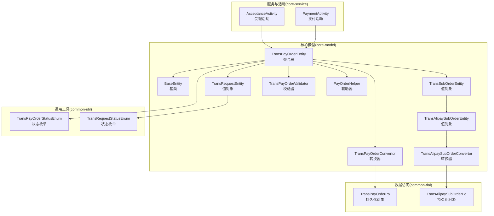
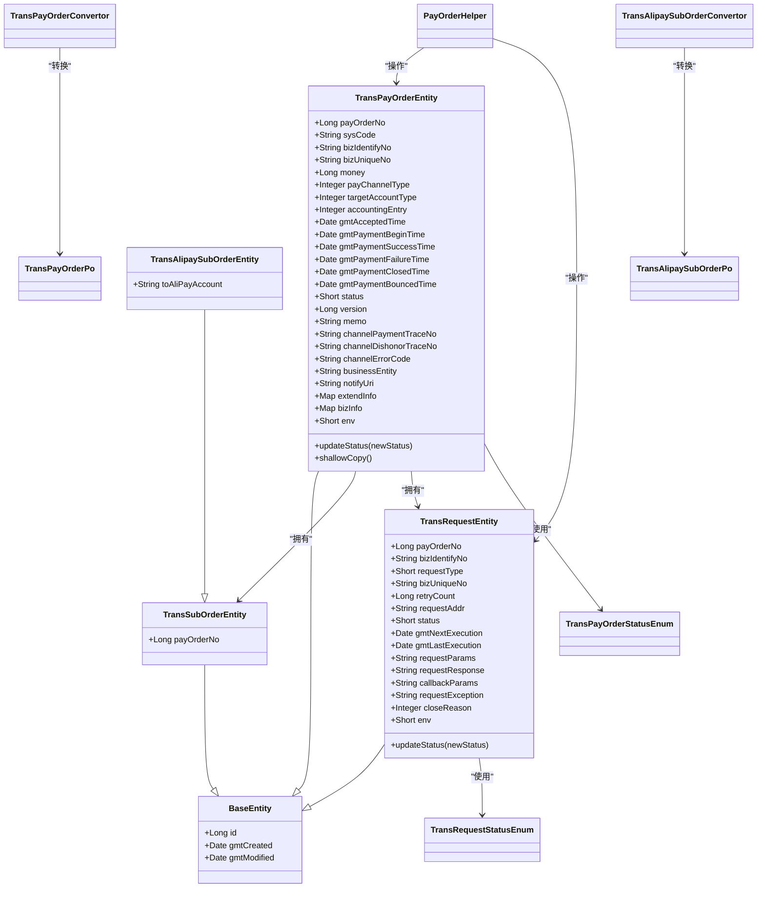
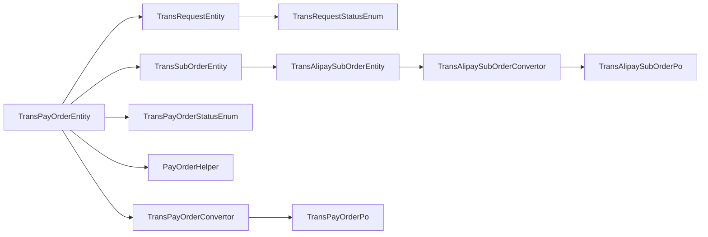

# 实体设计与聚合根

<cite>
**本文引用的文件**   
- [TransPayOrderEntity.java](file://core-model/src/main/java/com/magicliang/transaction/sys/core/model/entity/TransPayOrderEntity.java)
- [BaseEntity.java](file://core-model/src/main/java/com/magicliang/transaction/sys/core/model/entity/BaseEntity.java)
- [TransSubOrderEntity.java](file://core-model/src/main/java/com/magicliang/transaction/sys/core/model/entity/TransSubOrderEntity.java)
- [TransAlipaySubOrderEntity.java](file://core-model/src/main/java/com/magicliang/transaction/sys/core/model/entity/TransAlipaySubOrderEntity.java)
- [TransRequestEntity.java](file://core-model/src/main/java/com/magicliang/transaction/sys/core/model/entity/TransRequestEntity.java)
- [TransPayOrderStatusEnum.java](file://common-util/src/main/java/com/magicliang/transaction/sys/common/enums/TransPayOrderStatusEnum.java)
- [TransRequestStatusEnum.java](file://common-util/src/main/java/com/magicliang/transaction/sys/common/enums/TransRequestStatusEnum.java)
- [TransPayOrderValidator.java](file://core-model/src/main/java/com/magicliang/transaction/sys/core/model/entity/validator/TransPayOrderValidator.java)
- [PayOrderHelper.java](file://core-model/src/main/java/com/magicliang/transaction/sys/core/model/entity/helper/PayOrderHelper.java)
- [TransPayOrderConvertor.java](file://core-model/src/main/java/com/magicliang/transaction/sys/core/model/entity/convertor/TransPayOrderConvertor.java)
- [TransAlipaySubOrderConvertor.java](file://core-model/src/main/java/com/magicliang/transaction/sys/core/model/entity/convertor/TransAlipaySubOrderConvertor.java)
- [TransPayOrderPo.java](file://common-dal/src/main/java/com/magicliang/transaction/sys/common/dal/mybatis/po/TransPayOrderPo.java)
- [TransAlipaySubOrderPo.java](file://common-dal/src/main/java/com/magicliang/transaction/sys/common/dal/mybatis/po/TransAlipaySubOrderPo.java)
- [AcceptanceActivity.java](file://core-service/src/main/java/com/magicliang/transaction/sys/core/domain/activity/acceptance/AcceptanceActivity.java)
- [PaymentActivity.java](file://core-service/src/main/java/com/magicliang/transaction/sys/core/domain/activity/payment/PaymentActivity.java)
</cite>

## 目录
1. [引言](#引言)
2. [项目结构](#项目结构)
3. [核心组件](#核心组件)
4. [架构总览](#架构总览)
5. [详细组件分析](#详细组件分析)
6. [依赖分析](#依赖分析)
7. [性能考量](#性能考量)
8. [故障排查指南](#故障排查指南)
9. [结论](#结论)
10. [附录](#附录)

## 引言
本文件围绕领域驱动设计中的实体与聚合根展开，重点阐述 TransPayOrderEntity 作为支付订单聚合根的设计理念与实现细节。内容涵盖：
- 聚合根的职责与边界：以支付订单为核心，协调子订单与支付请求等附属对象。
- 关键属性的业务含义与约束：如支付订单号、金额、状态、版本等。
- 聚合根与值对象的关系：子订单、支付请求等如何作为附属对象被聚合根管理。
- BaseEntity 基类提供的通用能力：时间戳与版本控制。
- 状态转换机制：updateStatus 的状态验证逻辑与状态机约束。
- 实际使用场景：创建、更新与状态变更的典型流程与代码路径。

## 项目结构
该系统采用分层与模块划分清晰的结构，实体与值对象位于 core-model 模块，枚举与工具位于 common-util，持久化对象位于 common-dal，服务与活动位于 core-service。下图给出与本文主题相关的模块与文件映射关系。

图表来源
- [TransPayOrderEntity.java:32-215](file://core-model/src/main/java/com/magicliang/transaction/sys/core/model/entity/TransPayOrderEntity.java#L32-L215)
- [BaseEntity.java:20-36](file://core-model/src/main/java/com/magicliang/transaction/sys/core/model/entity/BaseEntity.java#L20-L36)
- [TransSubOrderEntity.java:17-23](file://core-model/src/main/java/com/magicliang/transaction/sys/core/model/entity/TransSubOrderEntity.java#L17-L23)
- [TransAlipaySubOrderEntity.java:17-23](file://core-model/src/main/java/com/magicliang/transaction/sys/core/model/entity/TransAlipaySubOrderEntity.java#L17-L23)
- [TransRequestEntity.java:22-121](file://core-model/src/main/java/com/magicliang/transaction/sys/core/model/entity/TransRequestEntity.java#L22-L121)
- [TransPayOrderValidator.java:19-52](file://core-model/src/main/java/com/magicliang/transaction/sys/core/model/entity/validator/TransPayOrderValidator.java#L19-L52)
- [PayOrderHelper.java:25-203](file://core-model/src/main/java/com/magicliang/transaction/sys/core/model/entity/helper/PayOrderHelper.java#L25-L203)
- [TransPayOrderConvertor.java:17-61](file://core-model/src/main/java/com/magicliang/transaction/sys/core/model/entity/convertor/TransPayOrderConvertor.java#L17-L61)
- [TransAlipaySubOrderConvertor.java:15-43](file://core-model/src/main/java/com/magicliang/transaction/sys/core/model/entity/convertor/TransAlipaySubOrderConvertor.java#L15-L43)
- [TransPayOrderPo.java:9-800](file://common-dal/src/main/java/com/magicliang/transaction/sys/common/dal/mybatis/po/TransPayOrderPo.java#L9-L800)
- [TransAlipaySubOrderPo.java:9-257](file://common-dal/src/main/java/com/magicliang/transaction/sys/common/dal/mybatis/po/TransAlipaySubOrderPo.java#L9-L257)
- [AcceptanceActivity.java:43-197](file://core-service/src/main/java/com/magicliang/transaction/sys/core/domain/activity/acceptance/AcceptanceActivity.java#L43-L197)
- [PaymentActivity.java:38-200](file://core-service/src/main/java/com/magicliang/transaction/sys/core/domain/activity/payment/PaymentActivity.java#L38-L200)

章节来源
- [TransPayOrderEntity.java:32-215](file://core-model/src/main/java/com/magicliang/transaction/sys/core/model/entity/TransPayOrderEntity.java#L32-L215)
- [TransPayOrderPo.java:9-800](file://common-dal/src/main/java/com/magicliang/transaction/sys/common/dal/mybatis/po/TransPayOrderPo.java#L9-L800)

## 核心组件
- 聚合根：TransPayOrderEntity
  - 职责：承载支付订单的业务规则与状态变迁；协调子订单与支付请求；维护版本与时间戳；提供状态变更入口。
  - 边界：聚合内的一致性边界，对外通过转换器与持久化对象交互。
- 值对象：
  - TransSubOrderEntity：子订单，承载与支付订单关联的子订单信息。
  - TransAlipaySubOrderEntity：支付宝子订单，扩展目标账户等信息。
  - TransRequestEntity：支付请求，承载一次支付请求的上下文与状态。
- 基类：BaseEntity
  - 提供 id、创建时间、最后修改时间等通用字段。
- 状态枚举：
  - TransPayOrderStatusEnum：支付订单状态机与迁移规则。
  - TransRequestStatusEnum：支付请求状态机与迁移规则。
- 辅助器：PayOrderHelper
  - 提供轻量订单判断、关闭订单、更新订单版本与时间、构建通知请求等辅助逻辑。
- 转换器：TransPayOrderConvertor、TransAlipaySubOrderConvertor
  - 负责领域模型与持久化对象之间的双向转换。
- 校验器：TransPayOrderValidator
  - 负责插入前的实体完整性校验。

章节来源
- [TransPayOrderEntity.java:32-215](file://core-model/src/main/java/com/magicliang/transaction/sys/core/model/entity/TransPayOrderEntity.java#L32-L215)
- [BaseEntity.java:20-36](file://core-model/src/main/java/com/magicliang/transaction/sys/core/model/entity/BaseEntity.java#L20-L36)
- [TransSubOrderEntity.java:17-23](file://core-model/src/main/java/com/magicliang/transaction/sys/core/model/entity/TransSubOrderEntity.java#L17-L23)
- [TransAlipaySubOrderEntity.java:17-23](file://core-model/src/main/java/com/magicliang/transaction/sys/core/model/entity/TransAlipaySubOrderEntity.java#L17-L23)
- [TransRequestEntity.java:22-121](file://core-model/src/main/java/com/magicliang/transaction/sys/core/model/entity/TransRequestEntity.java#L22-L121)
- [TransPayOrderStatusEnum.java:26-204](file://common-util/src/main/java/com/magicliang/transaction/sys/common/enums/TransPayOrderStatusEnum.java#L26-L204)
- [TransRequestStatusEnum.java:27-162](file://common-util/src/main/java/com/magicliang/transaction/sys/common/enums/TransRequestStatusEnum.java#L27-L162)
- [PayOrderHelper.java:25-203](file://core-model/src/main/java/com/magicliang/transaction/sys/core/model/entity/helper/PayOrderHelper.java#L25-L203)
- [TransPayOrderConvertor.java:17-61](file://core-model/src/main/java/com/magicliang/transaction/sys/core/model/entity/convertor/TransPayOrderConvertor.java#L17-L61)
- [TransAlipaySubOrderConvertor.java:15-43](file://core-model/src/main/java/com/magicliang/transaction/sys/core/model/entity/convertor/TransAlipaySubOrderConvertor.java#L15-L43)
- [TransPayOrderValidator.java:19-52](file://core-model/src/main/java/com/magicliang/transaction/sys/core/model/entity/validator/TransPayOrderValidator.java#L19-L52)

## 架构总览
下图展示聚合根与值对象、状态枚举、辅助器与转换器之间的交互关系，以及与服务活动的协作。

图表来源
- [TransPayOrderEntity.java:32-215](file://core-model/src/main/java/com/magicliang/transaction/sys/core/model/entity/TransPayOrderEntity.java#L32-L215)
- [BaseEntity.java:20-36](file://core-model/src/main/java/com/magicliang/transaction/sys/core/model/entity/BaseEntity.java#L20-L36)
- [TransSubOrderEntity.java:17-23](file://core-model/src/main/java/com/magicliang/transaction/sys/core/model/entity/TransSubOrderEntity.java#L17-L23)
- [TransAlipaySubOrderEntity.java:17-23](file://core-model/src/main/java/com/magicliang/transaction/sys/core/model/entity/TransAlipaySubOrderEntity.java#L17-L23)
- [TransRequestEntity.java:22-121](file://core-model/src/main/java/com/magicliang/transaction/sys/core/model/entity/TransRequestEntity.java#L22-L121)
- [TransPayOrderStatusEnum.java:26-204](file://common-util/src/main/java/com/magicliang/transaction/sys/common/enums/TransPayOrderStatusEnum.java#L26-L204)
- [TransRequestStatusEnum.java:27-162](file://common-util/src/main/java/com/magicliang/transaction/sys/common/enums/TransRequestStatusEnum.java#L27-L162)
- [PayOrderHelper.java:25-203](file://core-model/src/main/java/com/magicliang/transaction/sys/core/model/entity/helper/PayOrderHelper.java#L25-L203)
- [TransPayOrderConvertor.java:17-61](file://core-model/src/main/java/com/magicliang/transaction/sys/core/model/entity/convertor/TransPayOrderConvertor.java#L17-L61)
- [TransAlipaySubOrderConvertor.java:15-43](file://core-model/src/main/java/com/magicliang/transaction/sys/core/model/entity/convertor/TransAlipaySubOrderConvertor.java#L15-L43)
- [TransPayOrderPo.java:9-800](file://common-dal/src/main/java/com/magicliang/transaction/sys/common/dal/mybatis/po/TransPayOrderPo.java#L9-L800)
- [TransAlipaySubOrderPo.java:9-257](file://common-dal/src/main/java/com/magicliang/transaction/sys/common/dal/mybatis/po/TransAlipaySubOrderPo.java#L9-L257)

## 详细组件分析

### 聚合根：TransPayOrderEntity
- 设计理念
  - 作为支付订单聚合根，负责维护支付订单的业务一致性与状态机规则，协调子订单与支付请求等附属对象。
  - 通过 updateStatus 方法统一管理状态变更，确保状态迁移符合 TransPayOrderStatusEnum 的约束。
- 关键属性与业务含义
  - 支付订单号：业务主键，全局唯一，用于跨系统识别与幂等。
  - 金额：单位为分，必须为正数，体现金额约束。
  - 状态：短整型，受状态枚举约束，支持初始化、支付中、成功、失败、退票、关闭等。
  - 版本：长整型，用于并发控制与乐观锁。
  - 时间戳：受理时间、支付开始时间、成功/失败/关闭/退票时间等，用于审计与流程追踪。
  - 通知地址：回调地址，用于后续通知。
  - 扩展信息：平台能力与业务能力的 JSON 字段，分别用于平台内部与透传。
- 附属对象
  - 子订单：当前一个主订单只关联一个子订单，未来若支持多子订单需扩展成员。
  - 支付请求：一次支付请求的上下文。
  - 通知请求：通常只有一个通知请求，退票场景可能有两个。
- 状态变更
  - updateStatus(newStatus)：若当前状态为空则直接赋值；否则通过状态枚举校验迁移合法性后再赋值。
- 复制
  - shallowCopy()：基于 Lombok Builder 的浅拷贝，便于在不变性前提下生成新实例。

章节来源
- [TransPayOrderEntity.java:32-215](file://core-model/src/main/java/com/magicliang/transaction/sys/core/model/entity/TransPayOrderEntity.java#L32-L215)
- [TransPayOrderStatusEnum.java:175-203](file://common-util/src/main/java/com/magicliang/transaction/sys/common/enums/TransPayOrderStatusEnum.java#L175-L203)

### 值对象：TransSubOrderEntity 与 TransAlipaySubOrderEntity
- TransSubOrderEntity
  - 继承 BaseEntity，包含 payOrderNo 引用，表示与支付订单的关联。
- TransAlipaySubOrderEntity
  - 继承 TransSubOrderEntity，扩展支付宝目标账户字段，体现渠道差异化。

章节来源
- [TransSubOrderEntity.java:17-23](file://core-model/src/main/java/com/magicliang/transaction/sys/core/model/entity/TransSubOrderEntity.java#L17-L23)
- [TransAlipaySubOrderEntity.java:17-23](file://core-model/src/main/java/com/magicliang/transaction/sys/core/model/entity/TransAlipaySubOrderEntity.java#L17-L23)

### 值对象：TransRequestEntity
- 职责：承载一次支付请求的上下文，包括请求类型、地址、参数、响应、异常、重试次数与下次执行时间等。
- 状态变更：updateStatus(newStatus) 通过 TransRequestStatusEnum 校验迁移合法性。
- 时间与重试：维护最近执行时间与重试次数，支持任务调度框架。

章节来源
- [TransRequestEntity.java:22-121](file://core-model/src/main/java/com/magicliang/transaction/sys/core/model/entity/TransRequestEntity.java#L22-L121)
- [TransRequestStatusEnum.java:137-161](file://common-util/src/main/java/com/magicliang/transaction/sys/common/enums/TransRequestStatusEnum.java#L137-L161)

### 基类：BaseEntity
- 提供 id、创建时间、最后修改时间等通用字段，所有实体共享这些元数据。

章节来源
- [BaseEntity.java:20-36](file://core-model/src/main/java/com/magicliang/transaction/sys/core/model/entity/BaseEntity.java#L20-L36)

### 状态机与状态验证
- 支付订单状态机
  - 支持初始化、支付中、成功（终态）、失败（终态）、关闭（终态）、退票（终态）。
  - validateStatusBeforeUpdate(oldStatus, newStatus) 确保状态迁移合法：仅允许从非终态迁移到其他状态；INIT 只能回到 INIT；PENDING 只能从非终态迁移到在途态；SUCCESS 才能迁移到 BOUNCED；其他终态只能从非终态跃迁而来。
- 支付请求状态机
  - 支持初始化、请求中、成功（终态）、失败、关闭（终态）。
  - validateStatusBeforeUpdate(oldStatus, newStatus) 确保迁移合法：仅允许从非终态迁移到在途或失败；成功/关闭只能从非终态迁入。

章节来源
- [TransPayOrderStatusEnum.java:175-203](file://common-util/src/main/java/com/magicliang/transaction/sys/common/enums/TransPayOrderStatusEnum.java#L175-L203)
- [TransRequestStatusEnum.java:137-161](file://common-util/src/main/java/com/magicliang/transaction/sys/common/enums/TransRequestStatusEnum.java#L137-L161)

### 辅助器：PayOrderHelper
- 轻量订单判断：根据子订单、支付请求与状态判断是否为轻量订单。
- 关闭订单：将支付订单置为失败并关闭支付请求。
- 更新订单：更新最后修改时间并递增版本号。
- 通知请求构建：按类型构建基础通知与退票通知请求，设置默认执行时间与环境等。
- 未发送通知过滤：筛选出尚未完成的通知请求。

章节来源
- [PayOrderHelper.java:40-202](file://core-model/src/main/java/com/magicliang/transaction/sys/core/model/entity/helper/PayOrderHelper.java#L40-L202)

### 转换器：TransPayOrderConvertor 与 TransAlipaySubOrderConvertor
- 将领域模型与持久化对象相互转换，支持支付订单与支付宝子订单的组合转换。
- 转换器为静态方法，便于在不同层之间传递数据。

章节来源
- [TransPayOrderConvertor.java:17-61](file://core-model/src/main/java/com/magicliang/transaction/sys/core/model/entity/convertor/TransPayOrderConvertor.java#L17-L61)
- [TransAlipaySubOrderConvertor.java:15-43](file://core-model/src/main/java/com/magicliang/transaction/sys/core/model/entity/convertor/TransAlipaySubOrderConvertor.java#L15-L43)

### 校验器：TransPayOrderValidator
- 插入前校验：确保支付订单号、系统编码、业务标识、业务唯一号、金额、会计分录、通知地址等字段有效。

章节来源
- [TransPayOrderValidator.java:33-51](file://core-model/src/main/java/com/magicliang/transaction/sys/core/model/entity/validator/TransPayOrderValidator.java#L33-L51)

### 服务活动中的应用
- 受理活动（AcceptanceActivity）
  - 在受理阶段填充支付订单与支付请求的时间、状态与版本，并设置环境。
- 支付活动（PaymentActivity）
  - 在支付前迁移支付订单与支付请求状态，更新时间戳与重试次数，并根据响应决定通知活动是否完成。

章节来源
- [AcceptanceActivity.java:169-196](file://core-service/src/main/java/com/magicliang/transaction/sys/core/domain/activity/acceptance/AcceptanceActivity.java#L169-L196)
- [PaymentActivity.java:176-200](file://core-service/src/main/java/com/magicliang/transaction/sys/core/domain/activity/payment/PaymentActivity.java#L176-L200)

## 依赖分析
- 聚合根与值对象
  - TransPayOrderEntity 组合 TransSubOrderEntity 与 TransRequestEntity，形成强一致的聚合边界。
- 状态枚举与校验
  - 状态迁移严格依赖状态枚举的校验方法，避免非法状态变更。
- 辅助器与转换器
  - PayOrderHelper 提供聚合内的业务辅助，转换器负责跨层数据转换。
- 服务活动
  - AcceptanceActivity 与 PaymentActivity 在各自阶段对聚合根进行装配与状态迁移。

图表来源
- [TransPayOrderEntity.java:32-215](file://core-model/src/main/java/com/magicliang/transaction/sys/core/model/entity/TransPayOrderEntity.java#L32-L215)
- [TransSubOrderEntity.java:17-23](file://core-model/src/main/java/com/magicliang/transaction/sys/core/model/entity/TransSubOrderEntity.java#L17-L23)
- [TransRequestEntity.java:22-121](file://core-model/src/main/java/com/magicliang/transaction/sys/core/model/entity/TransRequestEntity.java#L22-L121)
- [TransPayOrderStatusEnum.java:26-204](file://common-util/src/main/java/com/magicliang/transaction/sys/common/enums/TransPayOrderStatusEnum.java#L26-L204)
- [TransRequestStatusEnum.java:27-162](file://common-util/src/main/java/com/magicliang/transaction/sys/common/enums/TransRequestStatusEnum.java#L27-L162)
- [PayOrderHelper.java:25-203](file://core-model/src/main/java/com/magicliang/transaction/sys/core/model/entity/helper/PayOrderHelper.java#L25-L203)
- [TransPayOrderConvertor.java:17-61](file://core-model/src/main/java/com/magicliang/transaction/sys/core/model/entity/convertor/TransPayOrderConvertor.java#L17-L61)
- [TransAlipaySubOrderEntity.java:17-23](file://core-model/src/main/java/com/magicliang/transaction/sys/core/model/entity/TransAlipaySubOrderEntity.java#L17-L23)
- [TransAlipaySubOrderConvertor.java:15-43](file://core-model/src/main/java/com/magicliang/transaction/sys/core/model/entity/convertor/TransAlipaySubOrderConvertor.java#L15-L43)
- [TransPayOrderPo.java:9-800](file://common-dal/src/main/java/com/magicliang/transaction/sys/common/dal/mybatis/po/TransPayOrderPo.java#L9-L800)
- [TransAlipaySubOrderPo.java:9-257](file://common-dal/src/main/java/com/magicliang/transaction/sys/common/dal/mybatis/po/TransAlipaySubOrderPo.java#L9-L257)

## 性能考量
- 版本控制与乐观锁
  - 通过版本号递增与最后修改时间更新，结合数据库层面的乐观锁，降低并发冲突带来的回滚成本。
- 状态迁移校验
  - 在内存中进行状态迁移校验，避免无效状态写入数据库，减少无效更新。
- 轻量订单判断
  - 通过 PayOrderHelper.isLite 判断是否为轻量订单，有助于在查询与处理时减少不必要的加载与计算。

## 故障排查指南
- 状态迁移异常
  - 若出现状态迁移失败，请检查 TransPayOrderStatusEnum.validateStatusBeforeUpdate 或 TransRequestStatusEnum.validateStatusBeforeUpdate 的约束条件，确认旧状态与新状态是否满足迁移规则。
- 订单完整性校验失败
  - 插入前校验失败通常由必填字段缺失或格式不正确导致，参考 TransPayOrderValidator.validateBeforeInsert 的断言信息定位问题。
- 并发更新冲突
  - 若出现版本号不匹配或更新失败，请检查 PayOrderHelper.updatePayOrder 的版本递增逻辑与数据库事务隔离级别。
- 通知请求异常
  - 若通知请求状态异常，检查 PayOrderHelper.getUnsentNotificationRequests 的过滤逻辑与 TransRequestStatusEnum.isFinalStatus 的终态判断。

章节来源
- [TransPayOrderStatusEnum.java:175-203](file://common-util/src/main/java/com/magicliang/transaction/sys/common/enums/TransPayOrderStatusEnum.java#L175-L203)
- [TransRequestStatusEnum.java:137-161](file://common-util/src/main/java/com/magicliang/transaction/sys/common/enums/TransRequestStatusEnum.java#L137-L161)
- [TransPayOrderValidator.java:33-51](file://core-model/src/main/java/com/magicliang/transaction/sys/core/model/entity/validator/TransPayOrderValidator.java#L33-L51)
- [PayOrderHelper.java:73-90](file://core-model/src/main/java/com/magicliang/transaction/sys/core/model/entity/helper/PayOrderHelper.java#L73-L90)
- [PayOrderHelper.java:189-202](file://core-model/src/main/java/com/magicliang/transaction/sys/core/model/entity/helper/PayOrderHelper.java#L189-L202)

## 结论
TransPayOrderEntity 作为支付订单聚合根，通过明确的职责边界、严格的领域状态机与完备的辅助工具，实现了支付流程的高内聚与可演进性。配合 BaseEntity 的通用元数据、状态枚举的迁移约束、校验器的前置保障与转换器的跨层适配，形成了从模型到持久化的完整闭环。在实际开发中，遵循聚合根的不变性与状态迁移规则，将显著提升系统的可靠性与可维护性。

## 附录
- 实际使用示例（代码路径）
  - 创建与装配支付订单与支付请求
    - [AcceptanceActivity.java:169-196](file://core-service/src/main/java/com/magicliang/transaction/sys/core/domain/activity/acceptance/AcceptanceActivity.java#L169-L196)
  - 支付前状态迁移与时间戳更新
    - [PaymentActivity.java:176-200](file://core-service/src/main/java/com/magicliang/transaction/sys/core/domain/activity/payment/PaymentActivity.java#L176-L200)
  - 状态变更与校验
    - [TransPayOrderEntity.java:197-204](file://core-model/src/main/java/com/magicliang/transaction/sys/core/model/entity/TransPayOrderEntity.java#L197-L204)
    - [TransRequestEntity.java:113-120](file://core-model/src/main/java/com/magicliang/transaction/sys/core/model/entity/TransRequestEntity.java#L113-L120)
  - 版本更新与时间戳更新
    - [PayOrderHelper.java:84-90](file://core-model/src/main/java/com/magicliang/transaction/sys/core/model/entity/helper/PayOrderHelper.java#L84-L90)
  - 轻量订单判断
    - [PayOrderHelper.java:40-51](file://core-model/src/main/java/com/magicliang/transaction/sys/core/model/entity/helper/PayOrderHelper.java#L40-L51)
  - 通知请求构建
    - [PayOrderHelper.java:164-181](file://core-model/src/main/java/com/magicliang/transaction/sys/core/model/entity/helper/PayOrderHelper.java#L164-L181)
  - 领域模型与持久化对象转换
    - [TransPayOrderConvertor.java:33-59](file://core-model/src/main/java/com/magicliang/transaction/sys/core/model/entity/convertor/TransPayOrderConvertor.java#L33-L59)
    - [TransAlipaySubOrderConvertor.java:30-42](file://core-model/src/main/java/com/magicliang/transaction/sys/core/model/entity/convertor/TransAlipaySubOrderConvertor.java#L30-L42)
  - 数据库持久化对象字段映射
    - [TransPayOrderPo.java:9-800](file://common-dal/src/main/java/com/magicliang/transaction/sys/common/dal/mybatis/po/TransPayOrderPo.java#L9-L800)
    - [TransAlipaySubOrderPo.java:9-257](file://common-dal/src/main/java/com/magicliang/transaction/sys/common/dal/mybatis/po/TransAlipaySubOrderPo.java#L9-L257)