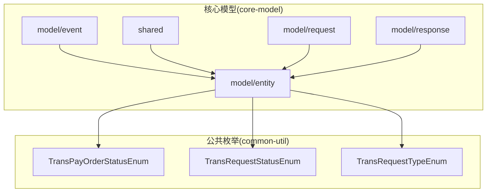
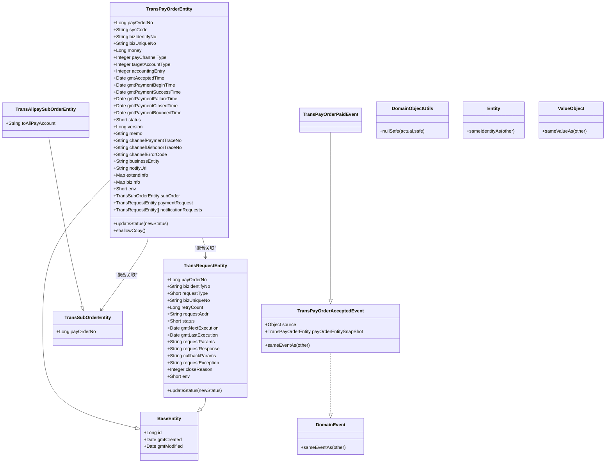
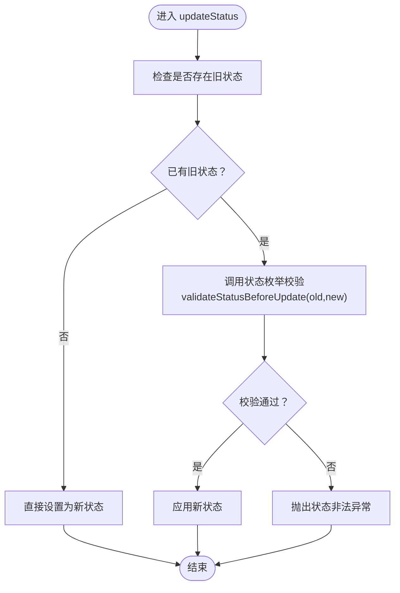
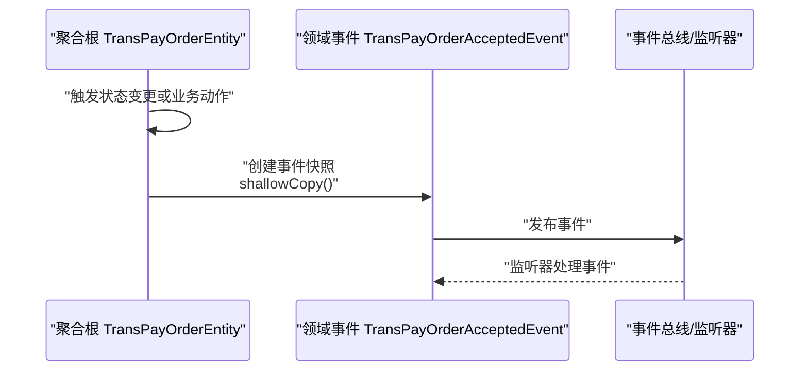
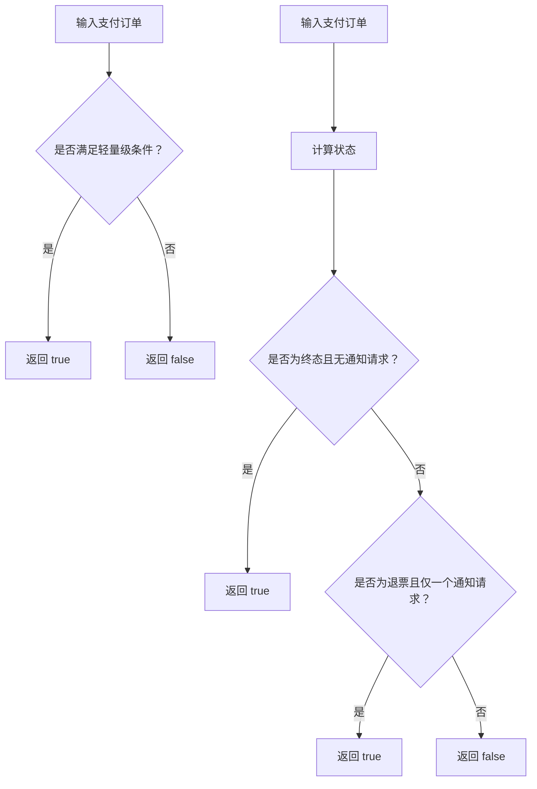
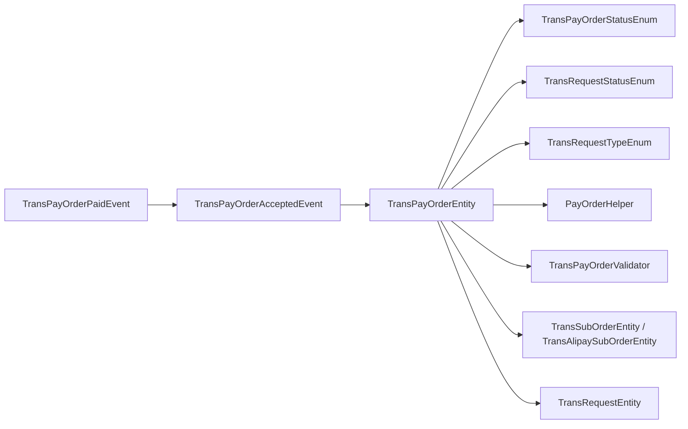

# 核心领域模型层

<cite>
**本文引用的文件**
- [BaseEntity.java](file://core-model/src/main/java/com/magicliang/transaction/sys/core/model/entity/BaseEntity.java)
- [TransPayOrderEntity.java](file://core-model/src/main/java/com/magicliang/transaction/sys/core/model/entity/TransPayOrderEntity.java)
- [TransRequestEntity.java](file://core-model/src/main/java/com/magicliang/transaction/sys/core/model/entity/TransRequestEntity.java)
- [TransSubOrderEntity.java](file://core-model/src/main/java/com/magicliang/transaction/sys/core/model/entity/TransSubOrderEntity.java)
- [TransAlipaySubOrderEntity.java](file://core-model/src/main/java/com/magicliang/transaction/sys/core/model/entity/TransAlipaySubOrderEntity.java)
- [TransPayOrderAcceptedEvent.java](file://core-model/src/main/java/com/magicliang/transaction/sys/core/model/event/TransPayOrderAcceptedEvent.java)
- [TransPayOrderPaidEvent.java](file://core-model/src/main/java/com/magicliang/transaction/sys/core/model/event/TransPayOrderPaidEvent.java)
- [DomainObjectUtils.java](file://core-model/src/main/java/com/magicliang/transaction/sys/core/shared/DomainObjectUtils.java)
- [Entity.java](file://core-model/src/main/java/com/magicliang/transaction/sys/core/shared/Entity.java)
- [ValueObject.java](file://core-model/src/main/java/com/magicliang/transaction/sys/core/shared/ValueObject.java)
- [DomainEvent.java](file://core-model/src/main/java/com/magicliang/transaction/sys/core/shared/DomainEvent.java)
- [TransPayOrderValidator.java](file://core-model/src/main/java/com/magicliang/transaction/sys/core/model/entity/validator/TransPayOrderValidator.java)
- [TransPayOrderConvertor.java](file://core-model/src/main/java/com/magicliang/transaction/sys/core/model/entity/convertor/TransPayOrderConvertor.java)
- [PayOrderHelper.java](file://core-model/src/main/java/com/magicliang/transaction/sys/core/model/entity/helper/PayOrderHelper.java)
- [TransPayOrderStatusEnum.java](file://common-util/src/main/java/com/magicliang/transaction/sys/common/enums/TransPayOrderStatusEnum.java)
- [TransRequestStatusEnum.java](file://common-util/src/main/java/com/magicliang/transaction/sys/common/enums/TransRequestStatusEnum.java)
- [TransRequestTypeEnum.java](file://common-util/src/main/java/com/magicliang/transaction/sys/common/enums/TransRequestTypeEnum.java)
</cite>

## 目录
1. [引言](#引言)
2. [项目结构](#项目结构)
3. [核心组件](#核心组件)
4. [架构总览](#架构总览)
5. [详细组件分析](#详细组件分析)
6. [依赖分析](#依赖分析)
7. [性能考虑](#性能考虑)
8. [故障排查指南](#故障排查指南)
9. [结论](#结论)
10. [附录](#附录)

## 引言
本文件聚焦于核心领域模型层（core-model），系统性阐述领域驱动设计（DDD）在该系统中的落地实践，重点覆盖以下方面：
- 聚合根、实体、值对象的建模与职责边界
- 核心实体的设计与属性定义，如支付订单聚合根与交易请求实体
- 实体间的关系与约束，以及聚合内一致性保证策略
- 基类 BaseEntity 的通用能力与约定
- 工具类 DomainObjectUtils 的作用与使用场景
- 领域事件的定义与使用，如支付订单受理事件与支付完成事件
- 实体生命周期管理与状态转换，如何通过领域模型表达复杂业务规则

## 项目结构
core-model 模块采用按“模型”维度划分的组织方式，核心目录如下：
- model/entity：实体与值对象、聚合根、转换器、验证器、辅助器
- model/event：领域事件
- shared：DDD 基础接口与工具类
- model/request/response：请求/响应模型（用于跨层交互）

**图示来源**
- [TransPayOrderEntity.java:1-216](file://core-model/src/main/java/com/magicliang/transaction/sys/core/model/entity/TransPayOrderEntity.java#L1-L216)
- [TransRequestEntity.java:1-122](file://core-model/src/main/java/com/magicliang/transaction/sys/core/model/entity/TransRequestEntity.java#L1-L122)
- [TransPayOrderAcceptedEvent.java:1-54](file://core-model/src/main/java/com/magicliang/transaction/sys/core/model/event/TransPayOrderAcceptedEvent.java#L1-L54)
- [TransPayOrderStatusEnum.java:1-205](file://common-util/src/main/java/com/magicliang/transaction/sys/common/enums/TransPayOrderStatusEnum.java#L1-L205)
- [TransRequestStatusEnum.java:1-163](file://common-util/src/main/java/com/magicliang/transaction/sys/common/enums/TransRequestStatusEnum.java#L1-L163)
- [TransRequestTypeEnum.java:1-99](file://common-util/src/main/java/com/magicliang/transaction/sys/common/enums/TransRequestTypeEnum.java#L1-L99)

**章节来源**
- [TransPayOrderEntity.java:1-216](file://core-model/src/main/java/com/magicliang/transaction/sys/core/model/entity/TransPayOrderEntity.java#L1-L216)
- [TransRequestEntity.java:1-122](file://core-model/src/main/java/com/magicliang/transaction/sys/core/model/entity/TransRequestEntity.java#L1-L122)
- [TransPayOrderAcceptedEvent.java:1-54](file://core-model/src/main/java/com/magicliang/transaction/sys/core/model/event/TransPayOrderAcceptedEvent.java#L1-L54)

## 核心组件
本节对核心领域模型的关键构件进行深入解析，涵盖实体、值对象、事件与共享基础设施。

- 基类 BaseEntity：统一承载持久化主键与时间戳字段，确保所有实体具备一致的生命周期元数据。
- 聚合根 TransPayOrderEntity：支付订单聚合根，负责聚合内状态一致性与业务规则校验；聚合内包含子订单与交易请求，并提供状态更新与浅拷贝能力。
- 实体 TransRequestEntity：交易请求实体，承载通知/回调等下游交互请求的状态与调度信息。
- 值对象与子订单：TransSubOrderEntity 及其具体实现 TransAlipaySubOrderEntity，封装与支付通道相关的子订单信息。
- 领域事件：TransPayOrderAcceptedEvent、TransPayOrderPaidEvent，用于表达业务事实与解耦后续处理。
- 共享接口与工具：Entity、ValueObject、DomainEvent 接口与 DomainObjectUtils 工具类，提供 DDD 基础契约与实用方法。
- 辅助器与验证器：PayOrderHelper 提供聚合内状态判断、通知请求构建与过滤等；TransPayOrderValidator 提供插入前的完整性校验。
- 转换器：TransPayOrderConvertor 提供领域模型与持久层对象之间的双向转换入口。

**章节来源**
- [BaseEntity.java:1-37](file://core-model/src/main/java/com/magicliang/transaction/sys/core/model/entity/BaseEntity.java#L1-L37)
- [TransPayOrderEntity.java:1-216](file://core-model/src/main/java/com/magicliang/transaction/sys/core/model/entity/TransPayOrderEntity.java#L1-L216)
- [TransRequestEntity.java:1-122](file://core-model/src/main/java/com/magicliang/transaction/sys/core/model/entity/TransRequestEntity.java#L1-L122)
- [TransSubOrderEntity.java:1-24](file://core-model/src/main/java/com/magicliang/transaction/sys/core/model/entity/TransSubOrderEntity.java#L1-L24)
- [TransAlipaySubOrderEntity.java:1-24](file://core-model/src/main/java/com/magicliang/transaction/sys/core/model/entity/TransAlipaySubOrderEntity.java#L1-L24)
- [TransPayOrderAcceptedEvent.java:1-54](file://core-model/src/main/java/com/magicliang/transaction/sys/core/model/event/TransPayOrderAcceptedEvent.java#L1-L54)
- [TransPayOrderPaidEvent.java:1-20](file://core-model/src/main/java/com/magicliang/transaction/sys/core/model/event/TransPayOrderPaidEvent.java#L1-L20)
- [DomainObjectUtils.java:1-30](file://core-model/src/main/java/com/magicliang/transaction/sys/core/shared/DomainObjectUtils.java#L1-L30)
- [Entity.java:1-17](file://core-model/src/main/java/com/magicliang/transaction/sys/core/shared/Entity.java#L1-L17)
- [ValueObject.java:1-19](file://core-model/src/main/java/com/magicliang/transaction/sys/core/shared/ValueObject.java#L1-L19)
- [DomainEvent.java:1-18](file://core-model/src/main/java/com/magicliang/transaction/sys/core/shared/DomainEvent.java#L1-L18)
- [PayOrderHelper.java:1-204](file://core-model/src/main/java/com/magicliang/transaction/sys/core/model/entity/helper/PayOrderHelper.java#L1-L204)
- [TransPayOrderValidator.java:1-53](file://core-model/src/main/java/com/magicliang/transaction/sys/core/model/entity/validator/TransPayOrderValidator.java#L1-L53)
- [TransPayOrderConvertor.java:1-62](file://core-model/src/main/java/com/magicliang/transaction/sys/core/model/entity/convertor/TransPayOrderConvertor.java#L1-L62)

## 架构总览
下图展示了核心领域模型层的类关系与依赖方向，强调聚合根、实体、事件与共享基础设施之间的协作。

**图示来源**
- [BaseEntity.java:1-37](file://core-model/src/main/java/com/magicliang/transaction/sys/core/model/entity/BaseEntity.java#L1-L37)
- [TransPayOrderEntity.java:1-216](file://core-model/src/main/java/com/magicliang/transaction/sys/core/model/entity/TransPayOrderEntity.java#L1-L216)
- [TransRequestEntity.java:1-122](file://core-model/src/main/java/com/magicliang/transaction/sys/core/model/entity/TransRequestEntity.java#L1-L122)
- [TransSubOrderEntity.java:1-24](file://core-model/src/main/java/com/magicliang/transaction/sys/core/model/entity/TransSubOrderEntity.java#L1-L24)
- [TransAlipaySubOrderEntity.java:1-24](file://core-model/src/main/java/com/magicliang/transaction/sys/core/model/entity/TransAlipaySubOrderEntity.java#L1-L24)
- [TransPayOrderAcceptedEvent.java:1-54](file://core-model/src/main/java/com/magicliang/transaction/sys/core/model/event/TransPayOrderAcceptedEvent.java#L1-L54)
- [TransPayOrderPaidEvent.java:1-20](file://core-model/src/main/java/com/magicliang/transaction/sys/core/model/event/TransPayOrderPaidEvent.java#L1-L20)
- [DomainObjectUtils.java:1-30](file://core-model/src/main/java/com/magicliang/transaction/sys/core/shared/DomainObjectUtils.java#L1-L30)
- [Entity.java:1-17](file://core-model/src/main/java/com/magicliang/transaction/sys/core/shared/Entity.java#L1-L17)
- [ValueObject.java:1-19](file://core-model/src/main/java/com/magicliang/transaction/sys/core/shared/ValueObject.java#L1-L19)
- [DomainEvent.java:1-18](file://core-model/src/main/java/com/magicliang/transaction/sys/core/shared/DomainEvent.java#L1-L18)

## 详细组件分析

### 聚合根：TransPayOrderEntity（支付订单）
- 职责与边界
  - 作为支付订单聚合根，负责维护聚合内状态一致性与关键业务规则。
  - 聚合内包含子订单与交易请求，并维护通知请求列表。
- 关键属性
  - 业务主键与来源系统标识：payOrderNo、sysCode、bizIdentifyNo、bizUniqueNo
  - 金额与会计分录：money、accountingEntry
  - 时间戳与状态：受理、支付开始、成功、失败、关闭、退票等时间字段；status 字段
  - 版本号与并发控制：version
  - 通知地址与扩展信息：notifyUri、extendInfo、bizInfo
  - 环境标识：env
  - 聚合内对象：subOrder、paymentRequest、notificationRequests
- 状态管理
  - updateStatus(newStatus)：在聚合内校验状态迁移合法性后再更新状态，确保状态机正确性。
  - shallowCopy()：基于 Lombok Builder 的浅拷贝，便于事件发布时生成快照。
- 与外部依赖
  - 依赖状态枚举 TransPayOrderStatusEnum 进行状态合法性校验。
  - 依赖 PayOrderHelper 进行聚合内行为编排（如通知请求构建、过滤、关闭等）。

**图示来源**
- [TransPayOrderEntity.java:197-204](file://core-model/src/main/java/com/magicliang/transaction/sys/core/model/entity/TransPayOrderEntity.java#L197-L204)
- [TransPayOrderStatusEnum.java:175-203](file://common-util/src/main/java/com/magicliang/transaction/sys/common/enums/TransPayOrderStatusEnum.java#L175-L203)

**章节来源**
- [TransPayOrderEntity.java:1-216](file://core-model/src/main/java/com/magicliang/transaction/sys/core/model/entity/TransPayOrderEntity.java#L1-L216)
- [TransPayOrderStatusEnum.java:1-205](file://common-util/src/main/java/com/magicliang/transaction/sys/common/enums/TransPayOrderStatusEnum.java#L1-L205)

### 实体：TransRequestEntity（交易请求）
- 职责与边界
  - 表达一次上游发起的请求（如支付、通知等），并承载请求的调度与执行状态。
- 关键属性
  - 关联字段：payOrderNo、bizIdentifyNo、bizUniqueNo
  - 请求类型：requestType（对应 TransRequestTypeEnum）
  - 调度与执行：retryCount、gmtNextExecution、gmtLastExecution
  - 参数与响应：requestParams、requestResponse、callbackParams、requestException
  - 关闭原因：closeReason
  - 环境标识：env
  - 状态管理：updateStatus(newStatus)，依赖 TransRequestStatusEnum 校验状态迁移。
- 与聚合的关系
  - 作为 TransPayOrderEntity 的聚合内实体之一，参与通知请求的构建与过滤。

**章节来源**
- [TransRequestEntity.java:1-122](file://core-model/src/main/java/com/magicliang/transaction/sys/core/model/entity/TransRequestEntity.java#L1-L122)
- [TransRequestStatusEnum.java:1-163](file://common-util/src/main/java/com/magicliang/transaction/sys/common/enums/TransRequestStatusEnum.java#L1-L163)
- [TransRequestTypeEnum.java:1-99](file://common-util/src/main/java/com/magicliang/transaction/sys/common/enums/TransRequestTypeEnum.java#L1-L99)

### 值对象与子订单：TransSubOrderEntity 与 TransAlipaySubOrderEntity
- 设计意图
  - 将与支付通道相关的子订单信息抽象为值对象风格的实体，强调其不可变性与可替换性。
- 层次关系
  - TransSubOrderEntity 为抽象基类，TransAlipaySubOrderEntity 为具体实现，承载特定通道的账户信息。
- 与聚合的关系
  - 作为 TransPayOrderEntity 的聚合附属对象，用于表达多渠道支付场景下的子订单信息。

**章节来源**
- [TransSubOrderEntity.java:1-24](file://core-model/src/main/java/com/magicliang/transaction/sys/core/model/entity/TransSubOrderEntity.java#L1-L24)
- [TransAlipaySubOrderEntity.java:1-24](file://core-model/src/main/java/com/magicliang/transaction/sys/core/model/entity/TransAlipaySubOrderEntity.java#L1-L24)

### 领域事件：TransPayOrderAcceptedEvent 与 TransPayOrderPaidEvent
- 设计要点
  - 事件承载业务事实，采用快照方式传递聚合状态，避免事件发布后对象被再次修改带来的不一致。
  - 事件实现 DomainEvent 接口，提供 sameEventAs 方法用于事件去重与相等性判定。
  - TransPayOrderPaidEvent 继承自 TransPayOrderAcceptedEvent，体现事件的层次化表达。
- 发布时机
  - 在支付订单受理、支付完成等关键节点发布相应事件，供后续处理（如通知、审计、监控）使用。

**图示来源**
- [TransPayOrderEntity.java:211-214](file://core-model/src/main/java/com/magicliang/transaction/sys/core/model/entity/TransPayOrderEntity.java#L211-L214)
- [TransPayOrderAcceptedEvent.java:28-39](file://core-model/src/main/java/com/magicliang/transaction/sys/core/model/event/TransPayOrderAcceptedEvent.java#L28-L39)
- [TransPayOrderPaidEvent.java:16-18](file://core-model/src/main/java/com/magicliang/transaction/sys/core/model/event/TransPayOrderPaidEvent.java#L16-L18)

**章节来源**
- [TransPayOrderAcceptedEvent.java:1-54](file://core-model/src/main/java/com/magicliang/transaction/sys/core/model/event/TransPayOrderAcceptedEvent.java#L1-L54)
- [TransPayOrderPaidEvent.java:1-20](file://core-model/src/main/java/com/magicliang/transaction/sys/core/model/event/TransPayOrderPaidEvent.java#L1-L20)

### 基类 BaseEntity 与共享基础设施
- BaseEntity
  - 统一承载 id、创建与修改时间戳，确保所有实体具备一致的生命周期元数据。
- DomainObjectUtils
  - 提供空安全的值选择工具方法 nullSafe，简化空值处理。
- Entity、ValueObject、DomainEvent
  - 定义 DDD 基础契约：实体以身份比较、值对象以属性值比较、领域事件以事实相等性比较。

**章节来源**
- [BaseEntity.java:1-37](file://core-model/src/main/java/com/magicliang/transaction/sys/core/model/entity/BaseEntity.java#L1-L37)
- [DomainObjectUtils.java:1-30](file://core-model/src/main/java/com/magicliang/transaction/sys/core/shared/DomainObjectUtils.java#L1-L30)
- [Entity.java:1-17](file://core-model/src/main/java/com/magicliang/transaction/sys/core/shared/Entity.java#L1-L17)
- [ValueObject.java:1-19](file://core-model/src/main/java/com/magicliang/transaction/sys/core/shared/ValueObject.java#L1-L19)
- [DomainEvent.java:1-18](file://core-model/src/main/java/com/magicliang/transaction/sys/core/shared/DomainEvent.java#L1-L18)

### 辅助器与验证器：PayOrderHelper 与 TransPayOrderValidator
- PayOrderHelper
  - isLite：判断支付订单是否为轻量级（无子订单或请求，或满足终态/退票条件）
  - closePayOrder：将支付订单置为失败并关闭支付请求
  - updatePayOrder：更新版本号与修改时间
  - needBasicNotification / needBouncedNotification：判断是否需要基础通知或退票通知
  - buildInitialNotificationRequest：初始化通知请求（基础通知/退票通知）
  - getUnsentNotificationRequests：过滤未发送通知请求
- TransPayOrderValidator
  - validateBeforeInsert：插入前校验支付订单实体的关键字段与业务约束（如金额、通知地址、会计分录等）

**图示来源**
- [PayOrderHelper.java:40-51](file://core-model/src/main/java/com/magicliang/transaction/sys/core/model/entity/helper/PayOrderHelper.java#L40-L51)

**章节来源**
- [PayOrderHelper.java:1-204](file://core-model/src/main/java/com/magicliang/transaction/sys/core/model/entity/helper/PayOrderHelper.java#L1-L204)
- [TransPayOrderValidator.java:1-53](file://core-model/src/main/java/com/magicliang/transaction/sys/core/model/entity/validator/TransPayOrderValidator.java#L1-L53)

### 转换器：TransPayOrderConvertor
- 职责
  - 提供领域模型与持久层对象之间的转换方法，确保跨层数据形态的一致性。
- 注意事项
  - 文档注释明确：非插入的更新流程在调用转换前需先调用 PayOrderHelper.updatePayOrder 更新版本与时间戳。

**章节来源**
- [TransPayOrderConvertor.java:1-62](file://core-model/src/main/java/com/magicliang/transaction/sys/core/model/entity/convertor/TransPayOrderConvertor.java#L1-L62)

## 依赖分析
- 内聚与耦合
  - 聚合根 TransPayOrderEntity 与其实体/值对象保持高内聚，状态迁移与行为通过 Helper 与 Validator 协作，降低重复逻辑。
  - 事件与聚合解耦，通过快照传递状态，避免事件监听侧对聚合内部状态的误用。
- 外部依赖
  - 公共枚举（状态枚举）为状态机提供强约束，确保状态迁移合法。
  - 工具类与接口提供 DDD 基础能力，提升代码复用与一致性。

**图示来源**
- [TransPayOrderEntity.java:1-216](file://core-model/src/main/java/com/magicliang/transaction/sys/core/model/entity/TransPayOrderEntity.java#L1-L216)
- [TransPayOrderStatusEnum.java:1-205](file://common-util/src/main/java/com/magicliang/transaction/sys/common/enums/TransPayOrderStatusEnum.java#L1-L205)
- [TransRequestStatusEnum.java:1-163](file://common-util/src/main/java/com/magicliang/transaction/sys/common/enums/TransRequestStatusEnum.java#L1-L163)
- [TransRequestTypeEnum.java:1-99](file://common-util/src/main/java/com/magicliang/transaction/sys/common/enums/TransRequestTypeEnum.java#L1-L99)
- [PayOrderHelper.java:1-204](file://core-model/src/main/java/com/magicliang/transaction/sys/core/model/entity/helper/PayOrderHelper.java#L1-L204)
- [TransPayOrderValidator.java:1-53](file://core-model/src/main/java/com/magicliang/transaction/sys/core/model/entity/validator/TransPayOrderValidator.java#L1-L53)
- [TransSubOrderEntity.java:1-24](file://core-model/src/main/java/com/magicliang/transaction/sys/core/model/entity/TransSubOrderEntity.java#L1-L24)
- [TransAlipaySubOrderEntity.java:1-24](file://core-model/src/main/java/com/magicliang/transaction/sys/core/model/entity/TransAlipaySubOrderEntity.java#L1-L24)
- [TransRequestEntity.java:1-122](file://core-model/src/main/java/com/magicliang/transaction/sys/core/model/entity/TransRequestEntity.java#L1-L122)
- [TransPayOrderAcceptedEvent.java:1-54](file://core-model/src/main/java/com/magicliang/transaction/sys/core/model/event/TransPayOrderAcceptedEvent.java#L1-L54)
- [TransPayOrderPaidEvent.java:1-20](file://core-model/src/main/java/com/magicliang/transaction/sys/core/model/event/TransPayOrderPaidEvent.java#L1-L20)

**章节来源**
- [TransPayOrderEntity.java:1-216](file://core-model/src/main/java/com/magicliang/transaction/sys/core/model/entity/TransPayOrderEntity.java#L1-L216)
- [TransRequestEntity.java:1-122](file://core-model/src/main/java/com/magicliang/transaction/sys/core/model/entity/TransRequestEntity.java#L1-L122)
- [TransPayOrderAcceptedEvent.java:1-54](file://core-model/src/main/java/com/magicliang/transaction/sys/core/model/event/TransPayOrderAcceptedEvent.java#L1-L54)

## 性能考虑
- 状态迁移校验
  - 在聚合内进行状态校验，避免无效状态导致的回滚与重试风暴。
- 事件快照
  - 事件发布时生成快照，避免监听器读取到后续修改后的状态，减少并发问题。
- 版本号与乐观锁
  - 通过 version 字段与 Helper.updatePayOrder 协作，实现乐观锁更新，降低并发冲突。
- 通知请求过滤
  - 通过 Helper.getUnsentNotificationRequests 过滤未发送通知，减少无效任务调度。

[本节为通用指导，无需列出具体文件来源]

## 故障排查指南
- 状态迁移异常
  - 现象：更新状态时报错提示非法状态迁移
  - 排查：确认旧状态与新状态是否满足 TransPayOrderStatusEnum.validateStatusBeforeUpdate 或 TransRequestStatusEnum.validateStatusBeforeUpdate 的约束
  - 参考文件：
    - [TransPayOrderStatusEnum.java:175-203](file://common-util/src/main/java/com/magicliang/transaction/sys/common/enums/TransPayOrderStatusEnum.java#L175-L203)
    - [TransRequestStatusEnum.java:137-161](file://common-util/src/main/java/com/magicliang/transaction/sys/common/enums/TransRequestStatusEnum.java#L137-L161)
- 插入失败
  - 现象：插入支付订单报错
  - 排查：核对必填字段（如业务主键、来源系统、金额、会计分录、通知地址等）
  - 参考文件：
    - [TransPayOrderValidator.java:33-51](file://core-model/src/main/java/com/magicliang/transaction/sys/core/model/entity/validator/TransPayOrderValidator.java#L33-L51)
- 并发更新冲突
  - 现象：更新失败或版本号不一致
  - 排查：确保在转换前调用 PayOrderHelper.updatePayOrder 更新版本号与修改时间
  - 参考文件：
    - [PayOrderHelper.java:84-90](file://core-model/src/main/java/com/magicliang/transaction/sys/core/model/entity/helper/PayOrderHelper.java#L84-L90)
    - [TransPayOrderConvertor.java:28-35](file://core-model/src/main/java/com/magicliang/transaction/sys/core/model/entity/convertor/TransPayOrderConvertor.java#L28-L35)

**章节来源**
- [TransPayOrderStatusEnum.java:175-203](file://common-util/src/main/java/com/magicliang/transaction/sys/common/enums/TransPayOrderStatusEnum.java#L175-L203)
- [TransRequestStatusEnum.java:137-161](file://common-util/src/main/java/com/magicliang/transaction/sys/common/enums/TransRequestStatusEnum.java#L137-L161)
- [TransPayOrderValidator.java:33-51](file://core-model/src/main/java/com/magicliang/transaction/sys/core/model/entity/validator/TransPayOrderValidator.java#L33-L51)
- [PayOrderHelper.java:84-90](file://core-model/src/main/java/com/magicliang/transaction/sys/core/model/entity/helper/PayOrderHelper.java#L84-L90)
- [TransPayOrderConvertor.java:28-35](file://core-model/src/main/java/com/magicliang/transaction/sys/core/model/entity/convertor/TransPayOrderConvertor.java#L28-L35)

## 结论
core-model 模块通过清晰的 DDD 分层与聚合边界，将支付订单、交易请求、子订单与领域事件有机整合，形成可演进、可测试、可维护的领域模型。借助状态枚举、辅助器与验证器，系统在保证业务规则正确性的同时，提供了良好的扩展性与可读性。建议在后续迭代中持续完善事件处理与状态机细节，进一步增强系统的韧性与可观测性。

[本节为总结性内容，无需列出具体文件来源]

## 附录
- 相关枚举与常量
  - 支付订单状态：INIT、PENDING、SUCCESS、FAILED、CLOSED、BOUNCED
  - 交易请求状态：INIT、PENDING、SUCCESS、FAILED、CLOSED
  - 交易请求类型：PAYMENT、BASIC_NOTIFICATION、BOUNCED_NOTIFICATION

**章节来源**
- [TransPayOrderStatusEnum.java:26-62](file://common-util/src/main/java/com/magicliang/transaction/sys/common/enums/TransPayOrderStatusEnum.java#L26-L62)
- [TransRequestStatusEnum.java:27-55](file://common-util/src/main/java/com/magicliang/transaction/sys/common/enums/TransRequestStatusEnum.java#L27-L55)
- [TransRequestTypeEnum.java:22-38](file://common-util/src/main/java/com/magicliang/transaction/sys/common/enums/TransRequestTypeEnum.java#L22-L38)