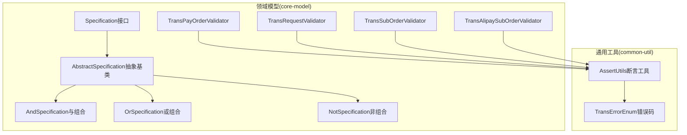
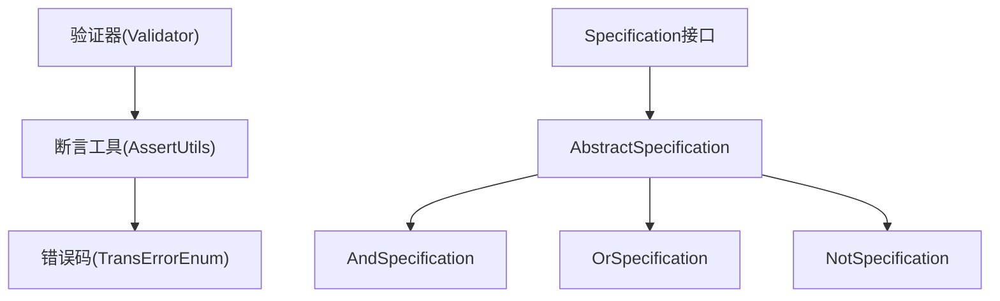
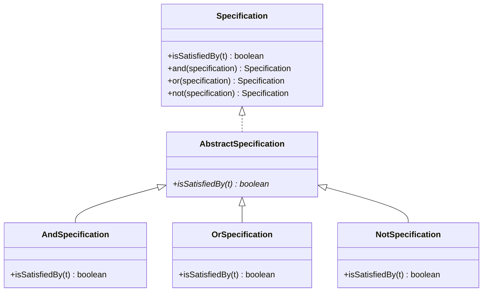
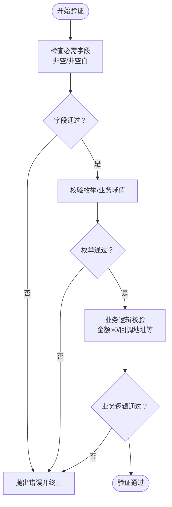
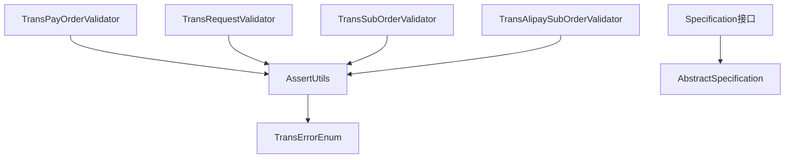
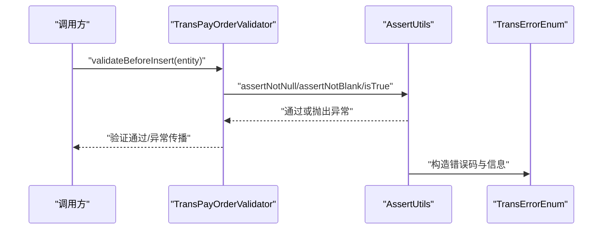

# 模型验证与约束

<cite>
**本文引用的文件**
- [Specification.java](file://core-model/src/main/java/com/magicliang/transaction/sys/core/shared/Specification.java)
- [AbstractSpecification.java](file://core-model/src/main/java/com/magicliang/transaction/sys/core/shared/AbstractSpecification.java)
- [AndSpecification.java](file://core-model/src/main/java/com/magicliang/transaction/sys/core/shared/AndSpecification.java)
- [OrSpecification.java](file://core-model/src/main/java/com/magicliang/transaction/sys/core/shared/OrSpecification.java)
- [NotSpecification.java](file://core-model/src/main/java/com/magicliang/transaction/sys/core/shared/NotSpecification.java)
- [TransPayOrderValidator.java](file://core-model/src/main/java/com/magicliang/transaction/sys/core/model/entity/validator/TransPayOrderValidator.java)
- [TransRequestValidator.java](file://core-model/src/main/java/com/magicliang/transaction/sys/core/model/entity/validator/TransRequestValidator.java)
- [TransSubOrderValidator.java](file://core-model/src/main/java/com/magicliang/transaction/sys/core/model/entity/validator/TransSubOrderValidator.java)
- [TransAlipaySubOrderValidator.java](file://core-model/src/main/java/com/magicliang/transaction/sys/core/model/entity/validator/TransAlipaySubOrderValidator.java)
- [AssertUtils.java](file://common-util/src/main/java/com/magicliang/transaction/sys/common/util/AssertUtils.java)
- [TransErrorEnum.java](file://common-util/src/main/java/com/magicliang/transaction/sys/common/enums/TransErrorEnum.java)
</cite>

## 目录
1. [引言](#引言)
2. [项目结构](#项目结构)
3. [核心组件](#核心组件)
4. [架构总览](#架构总览)
5. [详细组件分析](#详细组件分析)
6. [依赖分析](#依赖分析)
7. [性能考虑](#性能考虑)
8. [故障排查指南](#故障排查指南)
9. [结论](#结论)
10. [附录](#附录)

## 引言
本文件聚焦于领域模型中的验证机制与业务规则约束，系统性阐述验证器的设计与使用方法，展示Specification模式在领域验证中的应用，并解释验证规则的层次结构与优先级处理。文档以TransPayOrderValidator、TransRequestValidator等验证器为核心，结合Specification组合规则，给出实体创建与状态变更场景下的验证实践，同时说明验证失败的处理机制与错误信息的国际化支持思路，以及验证规则与业务流程的集成方式。

## 项目结构
验证与约束相关能力主要分布在以下模块与包中：
- 领域共享层（Specification体系）：位于core-model的shared包，提供Specification接口及与/或/非组合实现。
- 领域实体验证器：位于core-model的model/entity/validator包，包含支付订单、请求、子订单及其支付宝子订单的验证器。
- 通用断言与错误定义：位于common-util的util与enums包，提供统一的断言工具与错误码枚举。

图表来源
- [Specification.java:1-43](file://core-model/src/main/java/com/magicliang/transaction/sys/core/shared/Specification.java#L1-L43)
- [AbstractSpecification.java:1-41](file://core-model/src/main/java/com/magicliang/transaction/sys/core/shared/AbstractSpecification.java#L1-L41)
- [AndSpecification.java:1-30](file://core-model/src/main/java/com/magicliang/transaction/sys/core/shared/AndSpecification.java#L1-L30)
- [OrSpecification.java:1-30](file://core-model/src/main/java/com/magicliang/transaction/sys/core/shared/OrSpecification.java#L1-L30)
- [NotSpecification.java:1-27](file://core-model/src/main/java/com/magicliang/transaction/sys/core/shared/NotSpecification.java#L1-L27)
- [TransPayOrderValidator.java:1-53](file://core-model/src/main/java/com/magicliang/transaction/sys/core/model/entity/validator/TransPayOrderValidator.java#L1-L53)
- [TransRequestValidator.java:1-43](file://core-model/src/main/java/com/magicliang/transaction/sys/core/model/entity/validator/TransRequestValidator.java#L1-L43)
- [TransSubOrderValidator.java:1-44](file://core-model/src/main/java/com/magicliang/transaction/sys/core/model/entity/validator/TransSubOrderValidator.java#L1-L44)
- [TransAlipaySubOrderValidator.java:1-37](file://core-model/src/main/java/com/magicliang/transaction/sys/core/model/entity/validator/TransAlipaySubOrderValidator.java#L1-L37)
- [AssertUtils.java:1-109](file://common-util/src/main/java/com/magicliang/transaction/sys/common/util/AssertUtils.java#L1-L109)
- [TransErrorEnum.java:1-327](file://common-util/src/main/java/com/magicliang/transaction/sys/common/enums/TransErrorEnum.java#L1-L327)

章节来源
- [Specification.java:1-43](file://core-model/src/main/java/com/magicliang/transaction/sys/core/shared/Specification.java#L1-L43)
- [AbstractSpecification.java:1-41](file://core-model/src/main/java/com/magicliang/transaction/sys/core/shared/AbstractSpecification.java#L1-L41)
- [AndSpecification.java:1-30](file://core-model/src/main/java/com/magicliang/transaction/sys/core/shared/AndSpecification.java#L1-L30)
- [OrSpecification.java:1-30](file://core-model/src/main/java/com/magicliang/transaction/sys/core/shared/OrSpecification.java#L1-L30)
- [NotSpecification.java:1-27](file://core-model/src/main/java/com/magicliang/transaction/sys/core/shared/NotSpecification.java#L1-L27)
- [TransPayOrderValidator.java:1-53](file://core-model/src/main/java/com/magicliang/transaction/sys/core/model/entity/validator/TransPayOrderValidator.java#L1-L53)
- [TransRequestValidator.java:1-43](file://core-model/src/main/java/com/magicliang/transaction/sys/core/model/entity/validator/TransRequestValidator.java#L1-L43)
- [TransSubOrderValidator.java:1-44](file://core-model/src/main/java/com/magicliang/transaction/sys/core/model/entity/validator/TransSubOrderValidator.java#L1-L44)
- [TransAlipaySubOrderValidator.java:1-37](file://core-model/src/main/java/com/magicliang/transaction/sys/core/model/entity/validator/TransAlipaySubOrderValidator.java#L1-L37)
- [AssertUtils.java:1-109](file://common-util/src/main/java/com/magicliang/transaction/sys/common/util/AssertUtils.java#L1-L109)
- [TransErrorEnum.java:1-327](file://common-util/src/main/java/com/magicliang/transaction/sys/common/enums/TransErrorEnum.java#L1-L327)

## 核心组件
- Specification接口与组合实现：提供isSatisfiedBy判定与and/or/not组合能力，作为领域验证规则的抽象基础。
- 验证器类族：针对不同实体（支付订单、请求、子订单、支付宝子订单）提供validateBeforeInsert等静态校验入口，集中执行字段非空、非空白、数值范围、枚举合法性等规则。
- 断言工具与错误码：AssertUtils封装了统一的断言方法，配合TransErrorEnum提供结构化的错误信息与可重试标记，便于在验证失败时抛出带语义的异常。

章节来源
- [Specification.java:1-43](file://core-model/src/main/java/com/magicliang/transaction/sys/core/shared/Specification.java#L1-L43)
- [AbstractSpecification.java:1-41](file://core-model/src/main/java/com/magicliang/transaction/sys/core/shared/AbstractSpecification.java#L1-L41)
- [AndSpecification.java:1-30](file://core-model/src/main/java/com/magicliang/transaction/sys/core/shared/AndSpecification.java#L1-L30)
- [OrSpecification.java:1-30](file://core-model/src/main/java/com/magicliang/transaction/sys/core/shared/OrSpecification.java#L1-L30)
- [NotSpecification.java:1-27](file://core-model/src/main/java/com/magicliang/transaction/sys/core/shared/NotSpecification.java#L1-L27)
- [TransPayOrderValidator.java:1-53](file://core-model/src/main/java/com/magicliang/transaction/sys/core/model/entity/validator/TransPayOrderValidator.java#L1-L53)
- [TransRequestValidator.java:1-43](file://core-model/src/main/java/com/magicliang/transaction/sys/core/model/entity/validator/TransRequestValidator.java#L1-L43)
- [TransSubOrderValidator.java:1-44](file://core-model/src/main/java/com/magicliang/transaction/sys/core/model/entity/validator/TransSubOrderValidator.java#L1-L44)
- [TransAlipaySubOrderValidator.java:1-37](file://core-model/src/main/java/com/magicliang/transaction/sys/core/model/entity/validator/TransAlipaySubOrderValidator.java#L1-L37)
- [AssertUtils.java:1-109](file://common-util/src/main/java/com/magicliang/transaction/sys/common/util/AssertUtils.java#L1-L109)
- [TransErrorEnum.java:1-327](file://common-util/src/main/java/com/magicliang/transaction/sys/common/enums/TransErrorEnum.java#L1-L327)

## 架构总览
下图展示了验证体系的整体架构：验证器通过断言工具执行规则，错误码用于统一表达错误语义；Specification提供组合规则的能力，可在更复杂的业务场景中复用与扩展。

图表来源
- [TransPayOrderValidator.java:1-53](file://core-model/src/main/java/com/magicliang/transaction/sys/core/model/entity/validator/TransPayOrderValidator.java#L1-L53)
- [TransRequestValidator.java:1-43](file://core-model/src/main/java/com/magicliang/transaction/sys/core/model/entity/validator/TransRequestValidator.java#L1-L43)
- [TransSubOrderValidator.java:1-44](file://core-model/src/main/java/com/magicliang/transaction/sys/core/model/entity/validator/TransSubOrderValidator.java#L1-L44)
- [TransAlipaySubOrderValidator.java:1-37](file://core-model/src/main/java/com/magicliang/transaction/sys/core/model/entity/validator/TransAlipaySubOrderValidator.java#L1-L37)
- [AssertUtils.java:1-109](file://common-util/src/main/java/com/magicliang/transaction/sys/common/util/AssertUtils.java#L1-L109)
- [TransErrorEnum.java:1-327](file://common-util/src/main/java/com/magicliang/transaction/sys/common/enums/TransErrorEnum.java#L1-L327)
- [Specification.java:1-43](file://core-model/src/main/java/com/magicliang/transaction/sys/core/shared/Specification.java#L1-L43)
- [AbstractSpecification.java:1-41](file://core-model/src/main/java/com/magicliang/transaction/sys/core/shared/AbstractSpecification.java#L1-L41)
- [AndSpecification.java:1-30](file://core-model/src/main/java/com/magicliang/transaction/sys/core/shared/AndSpecification.java#L1-L30)
- [OrSpecification.java:1-30](file://core-model/src/main/java/com/magicliang/transaction/sys/core/shared/OrSpecification.java#L1-L30)
- [NotSpecification.java:1-27](file://core-model/src/main/java/com/magicliang/transaction/sys/core/shared/NotSpecification.java#L1-L27)

## 详细组件分析

### 验证器类族与使用方法
- TransPayOrderValidator：负责支付订单实体插入前的完整性校验，覆盖主键、系统码、业务标识、金额、会计分录类型、回调地址等关键字段与业务枚举合法性检查。
- TransRequestValidator：负责交易请求实体插入前的校验，覆盖订单号、请求类型、业务标识、请求来源地址等字段的合法性检查。
- TransSubOrderValidator：负责子订单实体插入前的校验，并根据子订单类型（如支付宝子订单）委派到具体子订单验证器。
- TransAlipaySubOrderValidator：负责支付宝子订单的差异化校验（例如特定账户字段的非空校验）。

这些验证器均采用静态方法入口validateBeforeInsert，在实体创建或状态变更前调用，确保数据进入持久层之前满足业务规则。

章节来源
- [TransPayOrderValidator.java:1-53](file://core-model/src/main/java/com/magicliang/transaction/sys/core/model/entity/validator/TransPayOrderValidator.java#L1-L53)
- [TransRequestValidator.java:1-43](file://core-model/src/main/java/com/magicliang/transaction/sys/core/model/entity/validator/TransRequestValidator.java#L1-L43)
- [TransSubOrderValidator.java:1-44](file://core-model/src/main/java/com/magicliang/transaction/sys/core/model/entity/validator/TransSubOrderValidator.java#L1-L44)
- [TransAlipaySubOrderValidator.java:1-37](file://core-model/src/main/java/com/magicliang/transaction/sys/core/model/entity/validator/TransAlipaySubOrderValidator.java#L1-L37)

### Specification模式在领域验证中的应用
- Specification接口定义了isSatisfiedBy判定方法与and/or/not组合方法，AbstractSpecification提供了默认组合实现，AndSpecification/OrSpecification/NotSpecification分别实现了与/或/非的组合规则。
- 在复杂业务场景中，可通过组合多个Specification来构建复合验证规则，提升规则复用与可维护性。例如：先组合“字段非空”与“格式正确”，再与“业务域值合法”组合，形成完整的验证链。

图表来源
- [Specification.java:1-43](file://core-model/src/main/java/com/magicliang/transaction/sys/core/shared/Specification.java#L1-L43)
- [AbstractSpecification.java:1-41](file://core-model/src/main/java/com/magicliang/transaction/sys/core/shared/AbstractSpecification.java#L1-L41)
- [AndSpecification.java:1-30](file://core-model/src/main/java/com/magicliang/transaction/sys/core/shared/AndSpecification.java#L1-L30)
- [OrSpecification.java:1-30](file://core-model/src/main/java/com/magicliang/transaction/sys/core/shared/OrSpecification.java#L1-L30)
- [NotSpecification.java:1-27](file://core-model/src/main/java/com/magicliang/transaction/sys/core/shared/NotSpecification.java#L1-L27)

### 验证规则的层次结构与优先级处理
- 字段级校验（必需字段、格式）：通过断言工具的非空/非空白/布尔条件断言，保证字段存在且符合基本格式要求。
- 枚举与业务域值校验：通过枚举解析方法校验业务域值是否有效，避免非法枚举值进入系统。
- 业务逻辑校验：在满足字段与枚举合法性的前提下，进一步校验金额正数、回调地址非空等业务约束。
- 层次化优先级：字段级校验优先于枚举与业务逻辑校验，确保后续校验建立在基础数据有效的基础上。

图表来源
- [AssertUtils.java:1-109](file://common-util/src/main/java/com/magicliang/transaction/sys/common/util/AssertUtils.java#L1-L109)
- [TransPayOrderValidator.java:1-53](file://core-model/src/main/java/com/magicliang/transaction/sys/core/model/entity/validator/TransPayOrderValidator.java#L1-L53)
- [TransRequestValidator.java:1-43](file://core-model/src/main/java/com/magicliang/transaction/sys/core/model/entity/validator/TransRequestValidator.java#L1-L43)
- [TransSubOrderValidator.java:1-44](file://core-model/src/main/java/com/magicliang/transaction/sys/core/model/entity/validator/TransSubOrderValidator.java#L1-L44)
- [TransAlipaySubOrderValidator.java:1-37](file://core-model/src/main/java/com/magicliang/transaction/sys/core/model/entity/validator/TransAlipaySubOrderValidator.java#L1-L37)

### 具体验证示例与使用场景
- 实体创建时的验证：在服务层或应用层准备好待创建的实体后，调用对应验证器的validateBeforeInsert方法，确保所有字段与业务规则满足后再写入持久层。
- 子订单差异化验证：当子订单为支付宝类型时，TransSubOrderValidator会委派至TransAlipaySubOrderValidator执行特定字段的校验，体现多态与委派的层次化设计。

章节来源
- [TransPayOrderValidator.java:1-53](file://core-model/src/main/java/com/magicliang/transaction/sys/core/model/entity/validator/TransPayOrderValidator.java#L1-L53)
- [TransRequestValidator.java:1-43](file://core-model/src/main/java/com/magicliang/transaction/sys/core/model/entity/validator/TransRequestValidator.java#L1-L43)
- [TransSubOrderValidator.java:1-44](file://core-model/src/main/java/com/magicliang/transaction/sys/core/model/entity/validator/TransSubOrderValidator.java#L1-L44)
- [TransAlipaySubOrderValidator.java:1-37](file://core-model/src/main/java/com/magicliang/transaction/sys/core/model/entity/validator/TransAlipaySubOrderValidator.java#L1-L37)

### 验证失败的处理机制与错误信息国际化支持
- 失败处理机制：断言工具在不满足条件时抛出带错误码与错误信息的领域异常，异常中包含错误码、错误描述与可重试标记，便于上层统一捕获与处理。
- 国际化支持：错误码由TransErrorEnum统一管理，包含错误类型、具体错误码与默认错误信息。在需要国际化时，可在上层根据错误码映射到本地化的错误消息资源，保持错误信息与业务语义一致。

章节来源
- [AssertUtils.java:1-109](file://common-util/src/main/java/com/magicliang/transaction/sys/common/util/AssertUtils.java#L1-L109)
- [TransErrorEnum.java:1-327](file://common-util/src/main/java/com/magicliang/transaction/sys/common/enums/TransErrorEnum.java#L1-L327)

### 验证规则与业务流程的集成方式
- 在业务流程的关键节点（如创建、受理、支付、通知）调用相应的验证器，确保每个环节的数据质量与一致性。
- 对于可重试的系统错误或第三方错误，错误码中带有可重试标记，便于上层在策略层决定是否重试或降级处理。
- 通过Specification组合规则，可将通用验证规则与业务规则解耦，提升验证规则的复用性与可测试性。

章节来源
- [Specification.java:1-43](file://core-model/src/main/java/com/magicliang/transaction/sys/core/shared/Specification.java#L1-L43)
- [AbstractSpecification.java:1-41](file://core-model/src/main/java/com/magicliang/transaction/sys/core/shared/AbstractSpecification.java#L1-L41)
- [AndSpecification.java:1-30](file://core-model/src/main/java/com/magicliang/transaction/sys/core/shared/AndSpecification.java#L1-L30)
- [OrSpecification.java:1-30](file://core-model/src/main/java/com/magicliang/transaction/sys/core/shared/OrSpecification.java#L1-L30)
- [NotSpecification.java:1-27](file://core-model/src/main/java/com/magicliang/transaction/sys/core/shared/NotSpecification.java#L1-L27)
- [TransErrorEnum.java:1-327](file://common-util/src/main/java/com/magicliang/transaction/sys/common/enums/TransErrorEnum.java#L1-L327)

## 依赖分析
验证器与断言工具、错误码之间存在直接依赖关系；Specification体系彼此独立，但通过组合能力相互协作，形成可扩展的验证规则网络。

图表来源
- [TransPayOrderValidator.java:1-53](file://core-model/src/main/java/com/magicliang/transaction/sys/core/model/entity/validator/TransPayOrderValidator.java#L1-L53)
- [TransRequestValidator.java:1-43](file://core-model/src/main/java/com/magicliang/transaction/sys/core/model/entity/validator/TransRequestValidator.java#L1-L43)
- [TransSubOrderValidator.java:1-44](file://core-model/src/main/java/com/magicliang/transaction/sys/core/model/entity/validator/TransSubOrderValidator.java#L1-L44)
- [TransAlipaySubOrderValidator.java:1-37](file://core-model/src/main/java/com/magicliang/transaction/sys/core/model/entity/validator/TransAlipaySubOrderValidator.java#L1-L37)
- [AssertUtils.java:1-109](file://common-util/src/main/java/com/magicliang/transaction/sys/common/util/AssertUtils.java#L1-L109)
- [TransErrorEnum.java:1-327](file://common-util/src/main/java/com/magicliang/transaction/sys/common/enums/TransErrorEnum.java#L1-L327)
- [Specification.java:1-43](file://core-model/src/main/java/com/magicliang/transaction/sys/core/shared/Specification.java#L1-L43)
- [AbstractSpecification.java:1-41](file://core-model/src/main/java/com/magicliang/transaction/sys/core/shared/AbstractSpecification.java#L1-L41)

章节来源
- [TransPayOrderValidator.java:1-53](file://core-model/src/main/java/com/magicliang/transaction/sys/core/model/entity/validator/TransPayOrderValidator.java#L1-L53)
- [TransRequestValidator.java:1-43](file://core-model/src/main/java/com/magicliang/transaction/sys/core/model/entity/validator/TransRequestValidator.java#L1-L43)
- [TransSubOrderValidator.java:1-44](file://core-model/src/main/java/com/magicliang/transaction/sys/core/model/entity/validator/TransSubOrderValidator.java#L1-L44)
- [TransAlipaySubOrderValidator.java:1-37](file://core-model/src/main/java/com/magicliang/transaction/sys/core/model/entity/validator/TransAlipaySubOrderValidator.java#L1-L37)
- [AssertUtils.java:1-109](file://common-util/src/main/java/com/magicliang/transaction/sys/common/util/AssertUtils.java#L1-L109)
- [TransErrorEnum.java:1-327](file://common-util/src/main/java/com/magicliang/transaction/sys/common/enums/TransErrorEnum.java#L1-L327)
- [Specification.java:1-43](file://core-model/src/main/java/com/magicliang/transaction/sys/core/shared/Specification.java#L1-L43)
- [AbstractSpecification.java:1-41](file://core-model/src/main/java/com/magicliang/transaction/sys/core/shared/AbstractSpecification.java#L1-L41)

## 性能考虑
- 验证器采用静态方法，避免实例化开销，适合在高频创建与状态变更场景中使用。
- 断言工具基于简单条件判断与字符串/集合工具库，整体开销较低；建议在边界处（如HTTP入口、RPC入口）集中执行验证，减少重复校验。
- 对于复杂业务规则，优先通过Specification组合实现，避免在验证器中编写过长的分支逻辑，提高可维护性与可测试性。

## 故障排查指南
- 验证失败定位：根据错误码与错误信息快速定位失败原因（字段缺失、格式不符、枚举非法等），结合调用栈确认触发点。
- 可重试性判断：依据错误码的可重试标记决定是否重试或降级处理，避免对不可重试错误进行盲目重试。
- 规则扩展：若需新增验证规则，优先通过Specification组合实现，确保与既有规则协同工作；必要时在验证器中补充特定字段的校验。

章节来源
- [AssertUtils.java:1-109](file://common-util/src/main/java/com/magicliang/transaction/sys/common/util/AssertUtils.java#L1-L109)
- [TransErrorEnum.java:1-327](file://common-util/src/main/java/com/magicliang/transaction/sys/common/enums/TransErrorEnum.java#L1-L327)

## 结论
该验证体系以验证器为核心，结合断言工具与错误码，实现了从字段级到业务逻辑级的多层次校验；通过Specification模式提供的组合能力，进一步提升了规则的复用性与可扩展性。在实际业务流程中，验证器应贯穿实体创建与状态变更的关键节点，确保领域模型的一致性与稳定性。

## 附录
- 验证器调用序列（以支付订单为例）

图表来源
- [TransPayOrderValidator.java:1-53](file://core-model/src/main/java/com/magicliang/transaction/sys/core/model/entity/validator/TransPayOrderValidator.java#L1-L53)
- [AssertUtils.java:1-109](file://common-util/src/main/java/com/magicliang/transaction/sys/common/util/AssertUtils.java#L1-L109)
- [TransErrorEnum.java:1-327](file://common-util/src/main/java/com/magicliang/transaction/sys/common/enums/TransErrorEnum.java#L1-L327)