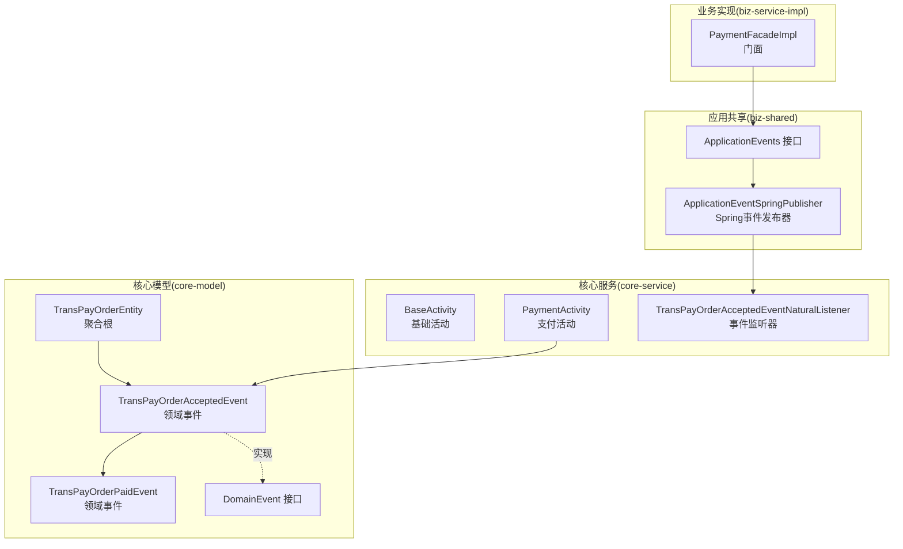
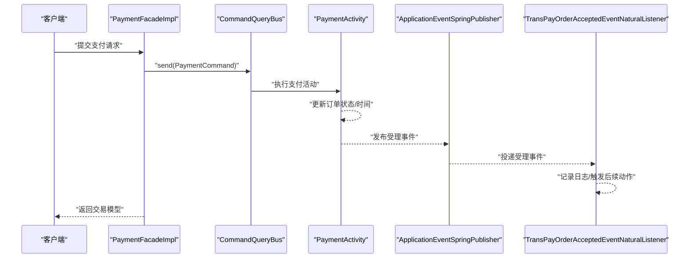
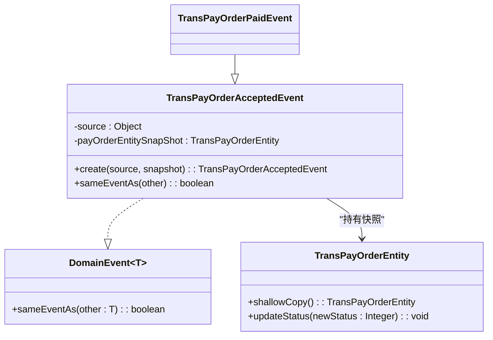
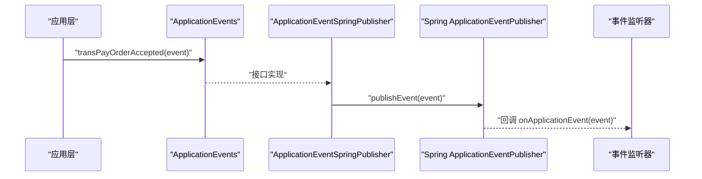
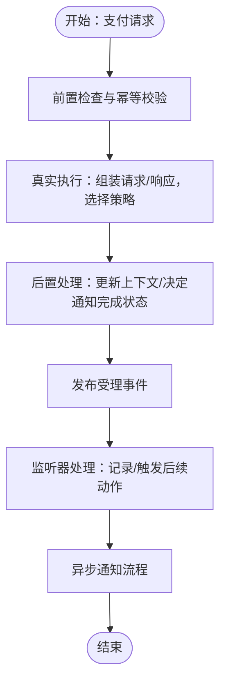
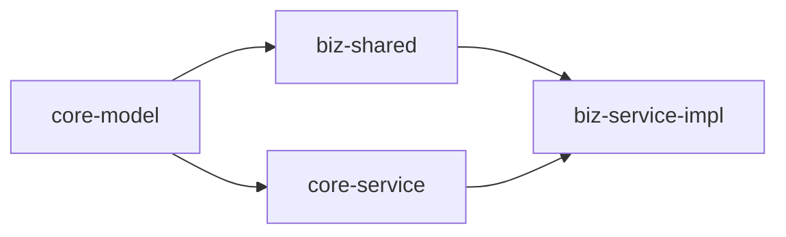

# 领域事件与事件驱动

<cite>
**本文引用的文件**
- [TransPayOrderAcceptedEvent.java](file://core-model/src/main/java/com/magicliang/transaction/sys/core/model/event/TransPayOrderAcceptedEvent.java)
- [TransPayOrderPaidEvent.java](file://core-model/src/main/java/com/magicliang/transaction/sys/core/model/event/TransPayOrderPaidEvent.java)
- [DomainEvent.java（核心共享接口）](file://core-model/src/main/java/com/magicliang/transaction/sys/core/shared/DomainEvent.java)
- [TransPayOrderAcceptedEventNaturalListener.java](file://core-service/src/main/java/com/magicliang/transaction/sys/core/event/TransPayOrderAcceptedEventNaturalListener.java)
- [ApplicationEvents.java](file://biz-shared/src/main/java/com/magicliang/transaction/sys/biz/shared/event/ApplicationEvents.java)
- [ApplicationEventSpringPublisher.java](file://biz-shared/src/main/java/com/magicliang/transaction/sys/biz/shared/event/ApplicationEventSpringPublisher.java)
- [TransPayOrderEntity.java](file://core-model/src/main/java/com/magicliang/transaction/sys/core/model/entity/TransPayOrderEntity.java)
- [BaseActivity.java](file://core-service/src/main/java/com/magicliang/transaction/sys/core/domain/activity/BaseActivity.java)
- [PaymentActivity.java](file://core-service/src/main/java/com/magicliang/transaction/sys/core/domain/activity/payment/PaymentActivity.java)
- [PaymentFacadeImpl.java](file://biz-service-impl/src/main/java/com/magicliang/transaction/sys/biz/service/impl/facade/impl/PaymentFacadeImpl.java)
- [TransPayOrderAcceptedEventTest.java](file://core-model/src/test/java/com/magicliang/transaction/sys/core/model/event/TransPayOrderAcceptedEventTest.java)
- [DomainDrivenTransactionSysApplicationIntegrationTest.java](file://biz-service-impl/src/test/integration/java/com/magicliang/transaction/sys/DomainDrivenTransactionSysApplicationIntegrationTest.java)
</cite>

## 目录
1. [引言](#引言)
2. [项目结构](#项目结构)
3. [核心组件](#核心组件)
4. [架构总览](#架构总览)
5. [详细组件分析](#详细组件分析)
6. [依赖分析](#依赖分析)
7. [性能考量](#性能考量)
8. [故障排查指南](#故障排查指南)
9. [结论](#结论)
10. [附录](#附录)

## 引言
本文件围绕领域事件与事件驱动展开，结合代码库中的实际实现，系统阐述：
- 领域事件在DDD中的定位与设计原则
- 事件如何捕获业务变化，以及与命令的区别
- 具体事件定义与触发时机（如 TransPayOrderAcceptedEvent、TransPayOrderPaidEvent）
- DomainEvent 基类设计与事件序列化机制
- 事件监听与处理（发布、订阅、处理）
- 事件驱动在支付系统中的应用（订单状态变更通知、业务流程编排）
- 事件溯源可能性与版本管理、兼容性处理建议

## 项目结构
该仓库采用模块化分层组织，事件相关的关键位置如下：
- core-model：领域模型与事件定义
- core-service：领域活动与事件监听
- biz-shared：应用层事件接口与Spring事件发布器
- biz-service-impl：门面与集成测试，演示事件发布与消费

图表来源
- [TransPayOrderEntity.java:1-216](file://core-model/src/main/java/com/magicliang/transaction/sys/core/model/entity/TransPayOrderEntity.java#L1-L216)
- [TransPayOrderAcceptedEvent.java:1-54](file://core-model/src/main/java/com/magicliang/transaction/sys/core/model/event/TransPayOrderAcceptedEvent.java#L1-L54)
- [TransPayOrderPaidEvent.java:1-20](file://core-model/src/main/java/com/magicliang/transaction/sys/core/model/event/TransPayOrderPaidEvent.java#L1-L20)
- [DomainEvent.java（核心共享接口）:1-18](file://core-model/src/main/java/com/magicliang/transaction/sys/core/shared/DomainEvent.java#L1-L18)
- [BaseActivity.java:1-139](file://core-service/src/main/java/com/magicliang/transaction/sys/core/domain/activity/BaseActivity.java#L1-L139)
- [PaymentActivity.java:1-202](file://core-service/src/main/java/com/magicliang/transaction/sys/core/domain/activity/payment/PaymentActivity.java#L1-L202)
- [TransPayOrderAcceptedEventNaturalListener.java:1-33](file://core-service/src/main/java/com/magicliang/transaction/sys/core/event/TransPayOrderAcceptedEventNaturalListener.java#L1-L33)
- [ApplicationEvents.java:1-22](file://biz-shared/src/main/java/com/magicliang/transaction/sys/biz/shared/event/ApplicationEvents.java#L1-L22)
- [ApplicationEventSpringPublisher.java:1-32](file://biz-shared/src/main/java/com/magicliang/transaction/sys/biz/shared/event/ApplicationEventSpringPublisher.java#L1-L32)
- [PaymentFacadeImpl.java:1-166](file://biz-service-impl/src/main/java/com/magicliang/transaction/sys/biz/service/impl/facade/impl/PaymentFacadeImpl.java#L1-L166)

章节来源
- [TransPayOrderEntity.java:1-216](file://core-model/src/main/java/com/magicliang/transaction/sys/core/model/entity/TransPayOrderEntity.java#L1-L216)
- [TransPayOrderAcceptedEvent.java:1-54](file://core-model/src/main/java/com/magicliang/transaction/sys/core/model/event/TransPayOrderAcceptedEvent.java#L1-L54)
- [TransPayOrderPaidEvent.java:1-20](file://core-model/src/main/java/com/magicliang/transaction/sys/core/model/event/TransPayOrderPaidEvent.java#L1-L20)
- [DomainEvent.java（核心共享接口）:1-18](file://core-model/src/main/java/com/magicliang/transaction/sys/core/shared/DomainEvent.java#L1-L18)
- [BaseActivity.java:1-139](file://core-service/src/main/java/com/magicliang/transaction/sys/core/domain/activity/BaseActivity.java#L1-L139)
- [PaymentActivity.java:1-202](file://core-service/src/main/java/com/magicliang/transaction/sys/core/domain/activity/payment/PaymentActivity.java#L1-L202)
- [TransPayOrderAcceptedEventNaturalListener.java:1-33](file://core-service/src/main/java/com/magicliang/transaction/sys/core/event/TransPayOrderAcceptedEventNaturalListener.java#L1-L33)
- [ApplicationEvents.java:1-22](file://biz-shared/src/main/java/com/magicliang/transaction/sys/biz/shared/event/ApplicationEvents.java#L1-L22)
- [ApplicationEventSpringPublisher.java:1-32](file://biz-shared/src/main/java/com/magicliang/transaction/sys/biz/shared/event/ApplicationEventSpringPublisher.java#L1-L32)
- [PaymentFacadeImpl.java:1-166](file://biz-service-impl/src/main/java/com/magicliang/transaction/sys/biz/service/impl/facade/impl/PaymentFacadeImpl.java#L1-L166)

## 核心组件
- 领域事件基类与契约
  - DomainEvent 接口定义事件相等性判定方法 sameEventAs，用于识别重复事件或同一事件的不同表示。
- 具体事件
  - TransPayOrderAcceptedEvent：支付订单被受理事件，携带支付订单实体快照，确保事件不可变性与可追溯性。
  - TransPayOrderPaidEvent：继承自受理事件，代表支付完成事件，体现事件演进与继承关系。
- 事件发布与订阅
  - ApplicationEvents 接口定义应用层事件契约；ApplicationEventSpringPublisher 通过Spring事件总线发布事件。
  - TransPayOrderAcceptedEventNaturalListener 订阅受理事件，实现事件处理入口。
- 领域活动与事件触发
  - PaymentActivity 在支付流程中更新订单状态并影响后续通知活动的完成状态，间接体现事件驱动的流程编排。

章节来源
- [DomainEvent.java（核心共享接口）:1-18](file://core-model/src/main/java/com/magicliang/transaction/sys/core/shared/DomainEvent.java#L1-L18)
- [TransPayOrderAcceptedEvent.java:1-54](file://core-model/src/main/java/com/magicliang/transaction/sys/core/model/event/TransPayOrderAcceptedEvent.java#L1-L54)
- [TransPayOrderPaidEvent.java:1-20](file://core-model/src/main/java/com/magicliang/transaction/sys/core/model/event/TransPayOrderPaidEvent.java#L1-L20)
- [ApplicationEvents.java:1-22](file://biz-shared/src/main/java/com/magicliang/transaction/sys/biz/shared/event/ApplicationEvents.java#L1-L22)
- [ApplicationEventSpringPublisher.java:1-32](file://biz-shared/src/main/java/com/magicliang/transaction/sys/biz/shared/event/ApplicationEventSpringPublisher.java#L1-L32)
- [TransPayOrderAcceptedEventNaturalListener.java:1-33](file://core-service/src/main/java/com/magicliang/transaction/sys/core/event/TransPayOrderAcceptedEventNaturalListener.java#L1-L33)
- [PaymentActivity.java:1-202](file://core-service/src/main/java/com/magicliang/transaction/sys/core/domain/activity/payment/PaymentActivity.java#L1-L202)

## 架构总览
事件驱动在支付系统中的流转路径：
- 业务门面（PaymentFacadeImpl）接收支付请求，委托命令查询总线执行
- 领域活动（PaymentActivity）在执行前后更新模型状态
- 事件发布器（ApplicationEventSpringPublisher）将受理事件发布到Spring事件总线
- 事件监听器（TransPayOrderAcceptedEventNaturalListener）异步处理事件
- 门面根据支付结果异步触发通知流程，形成跨模块解耦

图表来源
- [PaymentFacadeImpl.java:1-166](file://biz-service-impl/src/main/java/com/magicliang/transaction/sys/biz/service/impl/facade/impl/PaymentFacadeImpl.java#L1-L166)
- [PaymentActivity.java:1-202](file://core-service/src/main/java/com/magicliang/transaction/sys/core/domain/activity/payment/PaymentActivity.java#L1-L202)
- [ApplicationEventSpringPublisher.java:1-32](file://biz-shared/src/main/java/com/magicliang/transaction/sys/biz/shared/event/ApplicationEventSpringPublisher.java#L1-L32)
- [TransPayOrderAcceptedEventNaturalListener.java:1-33](file://core-service/src/main/java/com/magicliang/transaction/sys/core/event/TransPayOrderAcceptedEventNaturalListener.java#L1-L33)

## 详细组件分析

### 领域事件基类与事件相等性
- 设计要点
  - 通过 DomainEvent<T> 接口统一事件相等性判定，避免重复处理
  - 事件对象携带实体快照（shallowCopy），保证事件不可变性与可追溯性
- 适用场景
  - 幂等处理、去重、事件溯源回放

图表来源
- [DomainEvent.java（核心共享接口）:1-18](file://core-model/src/main/java/com/magicliang/transaction/sys/core/shared/DomainEvent.java#L1-L18)
- [TransPayOrderEntity.java:1-216](file://core-model/src/main/java/com/magicliang/transaction/sys/core/model/entity/TransPayOrderEntity.java#L1-L216)
- [TransPayOrderAcceptedEvent.java:1-54](file://core-model/src/main/java/com/magicliang/transaction/sys/core/model/event/TransPayOrderAcceptedEvent.java#L1-L54)
- [TransPayOrderPaidEvent.java:1-20](file://core-model/src/main/java/com/magicliang/transaction/sys/core/model/event/TransPayOrderPaidEvent.java#L1-L20)

章节来源
- [DomainEvent.java（核心共享接口）:1-18](file://core-model/src/main/java/com/magicliang/transaction/sys/core/shared/DomainEvent.java#L1-L18)
- [TransPayOrderEntity.java:1-216](file://core-model/src/main/java/com/magicliang/transaction/sys/core/model/entity/TransPayOrderEntity.java#L1-L216)
- [TransPayOrderAcceptedEvent.java:1-54](file://core-model/src/main/java/com/magicliang/transaction/sys/core/model/event/TransPayOrderAcceptedEvent.java#L1-L54)
- [TransPayOrderPaidEvent.java:1-20](file://core-model/src/main/java/com/magicliang/transaction/sys/core/model/event/TransPayOrderPaidEvent.java#L1-L20)

### 具体事件定义与触发时机

#### TransPayOrderAcceptedEvent（受理事件）
- 触发时机
  - 支付活动在准备阶段将订单状态迁移到“支付中”，并更新时间戳，随后发布受理事件
- 数据结构
  - 携带 TransPayOrderEntity 的快照，确保事件不可变
  - 提供工厂方法 create，便于统一创建
- 相等性判定
  - 基于订单号判断是否为同一事件

章节来源
- [TransPayOrderAcceptedEvent.java:1-54](file://core-model/src/main/java/com/magicliang/transaction/sys/core/model/event/TransPayOrderAcceptedEvent.java#L1-L54)
- [PaymentActivity.java:1-202](file://core-service/src/main/java/com/magicliang/transaction/sys/core/domain/activity/payment/PaymentActivity.java#L1-L202)

#### TransPayOrderPaidEvent（支付完成事件）
- 继承关系
  - 继承受理事件，表示支付流程的进一步演进
- 触发时机
  - 在支付活动完成后，若订单进入终态，可由上层逻辑决定是否发布完成事件（当前实现以受理事件为主）

章节来源
- [TransPayOrderPaidEvent.java:1-20](file://core-model/src/main/java/com/magicliang/transaction/sys/core/model/event/TransPayOrderPaidEvent.java#L1-L20)
- [PaymentActivity.java:1-202](file://core-service/src/main/java/com/magicliang/transaction/sys/core/domain/activity/payment/PaymentActivity.java#L1-L202)

### 事件发布与订阅机制

#### 应用层事件接口与发布器
- ApplicationEvents：应用层事件契约，定义对外暴露的事件发布方法
- ApplicationEventSpringPublisher：实现 ApplicationEvents，通过 Spring ApplicationEventPublisher 发布事件

图表来源
- [ApplicationEvents.java:1-22](file://biz-shared/src/main/java/com/magicliang/transaction/sys/biz/shared/event/ApplicationEvents.java#L1-L22)
- [ApplicationEventSpringPublisher.java:1-32](file://biz-shared/src/main/java/com/magicliang/transaction/sys/biz/shared/event/ApplicationEventSpringPublisher.java#L1-L32)
- [TransPayOrderAcceptedEventNaturalListener.java:1-33](file://core-service/src/main/java/com/magicliang/transaction/sys/core/event/TransPayOrderAcceptedEventNaturalListener.java#L1-L33)

章节来源
- [ApplicationEvents.java:1-22](file://biz-shared/src/main/java/com/magicliang/transaction/sys/biz/shared/event/ApplicationEvents.java#L1-L22)
- [ApplicationEventSpringPublisher.java:1-32](file://biz-shared/src/main/java/com/magicliang/transaction/sys/biz/shared/event/ApplicationEventSpringPublisher.java#L1-L32)
- [TransPayOrderAcceptedEventNaturalListener.java:1-33](file://core-service/src/main/java/com/magicliang/transaction/sys/core/event/TransPayOrderAcceptedEventNaturalListener.java#L1-L33)

### 事件监听与处理
- 监听器实现
  - TransPayOrderAcceptedEventNaturalListener 实现 Spring ApplicationListener，接收受理事件并记录日志
- 处理建议
  - 将监听器扩展为异步处理，避免阻塞事件发布线程
  - 结合幂等与去重逻辑（sameEventAs）防止重复处理

章节来源
- [TransPayOrderAcceptedEventNaturalListener.java:1-33](file://core-service/src/main/java/com/magicliang/transaction/sys/core/event/TransPayOrderAcceptedEventNaturalListener.java#L1-L33)
- [DomainEvent.java（核心共享接口）:1-18](file://core-model/src/main/java/com/magicliang/transaction/sys/core/shared/DomainEvent.java#L1-L18)

### 事件驱动在支付系统中的应用
- 订单状态变更通知
  - 支付活动完成后，根据订单状态决定是否触发通知活动，形成跨模块解耦
- 业务流程编排
  - 门面层根据支付结果异步触发通知流程，避免同步阻塞
- 解耦与扩展
  - 通过事件总线实现模块间松耦合，新增监听器不影响既有流程

图表来源
- [BaseActivity.java:1-139](file://core-service/src/main/java/com/magicliang/transaction/sys/core/domain/activity/BaseActivity.java#L1-L139)
- [PaymentActivity.java:1-202](file://core-service/src/main/java/com/magicliang/transaction/sys/core/domain/activity/payment/PaymentActivity.java#L1-L202)
- [PaymentFacadeImpl.java:1-166](file://biz-service-impl/src/main/java/com/magicliang/transaction/sys/biz/service/impl/facade/impl/PaymentFacadeImpl.java#L1-L166)

章节来源
- [BaseActivity.java:1-139](file://core-service/src/main/java/com/magicliang/transaction/sys/core/domain/activity/BaseActivity.java#L1-L139)
- [PaymentActivity.java:1-202](file://core-service/src/main/java/com/magicliang/transaction/sys/core/domain/activity/payment/PaymentActivity.java#L1-L202)
- [PaymentFacadeImpl.java:1-166](file://biz-service-impl/src/main/java/com/magicliang/transaction/sys/biz/service/impl/facade/impl/PaymentFacadeImpl.java#L1-L166)

### 事件与命令的区别
- 命令（Command）
  - 表达业务意图，强调“做什么”
  - 通常由应用层封装，传递给领域层执行
- 事件（Event）
  - 描述已经发生的事实，强调“发生了什么”
  - 用于跨边界通知与解耦，适合异步处理

章节来源
- [ApplicationEvents.java:1-22](file://biz-shared/src/main/java/com/magicliang/transaction/sys/biz/shared/event/ApplicationEvents.java#L1-L22)
- [ApplicationEventSpringPublisher.java:1-32](file://biz-shared/src/main/java/com/magicliang/transaction/sys/biz/shared/event/ApplicationEventSpringPublisher.java#L1-L32)

### 事件序列化机制
- 事件对象包含实体快照（shallowCopy），确保事件数据完整且可序列化
- 建议
  - 明确事件字段的序列化策略（如JSON），保证跨进程/跨系统传输一致性
  - 对敏感字段进行脱敏处理

章节来源
- [TransPayOrderAcceptedEvent.java:1-54](file://core-model/src/main/java/com/magicliang/transaction/sys/core/model/event/TransPayOrderAcceptedEvent.java#L1-L54)
- [TransPayOrderEntity.java:1-216](file://core-model/src/main/java/com/magicliang/transaction/sys/core/model/entity/TransPayOrderEntity.java#L1-L216)

### 事件溯源可能性与版本管理
- 事件溯源可行性
  - 事件持久化存储可实现审计与回放，便于合规与问题追踪
- 版本与兼容
  - 事件版本号：在事件头中加入版本字段
  - 向后兼容：新增字段默认值、忽略未知字段
  - 向前兼容：读取时对缺失字段赋予默认值
- 兼容性测试
  - 通过单元测试验证事件泛型类型解析与继承关系，确保监听器泛型匹配正确

章节来源
- [TransPayOrderAcceptedEventTest.java:1-130](file://core-model/src/test/java/com/magicliang/transaction/sys/core/model/event/TransPayOrderAcceptedEventTest.java#L1-L130)

## 依赖分析
- 模块内依赖
  - core-model 定义事件与实体
  - core-service 通过活动触发事件并提供监听器
  - biz-shared 提供应用层事件接口与Spring发布器
  - biz-service-impl 通过门面触发支付并异步通知
- 耦合度与内聚性
  - 事件发布与监听通过Spring接口解耦
  - 领域活动与事件发布分离，职责清晰

图表来源
- [TransPayOrderAcceptedEvent.java:1-54](file://core-model/src/main/java/com/magicliang/transaction/sys/core/model/event/TransPayOrderAcceptedEvent.java#L1-L54)
- [TransPayOrderAcceptedEventNaturalListener.java:1-33](file://core-service/src/main/java/com/magicliang/transaction/sys/core/event/TransPayOrderAcceptedEventNaturalListener.java#L1-L33)
- [ApplicationEventSpringPublisher.java:1-32](file://biz-shared/src/main/java/com/magicliang/transaction/sys/biz/shared/event/ApplicationEventSpringPublisher.java#L1-L32)
- [PaymentFacadeImpl.java:1-166](file://biz-service-impl/src/main/java/com/magicliang/transaction/sys/biz/service/impl/facade/impl/PaymentFacadeImpl.java#L1-L166)

章节来源
- [TransPayOrderAcceptedEvent.java:1-54](file://core-model/src/main/java/com/magicliang/transaction/sys/core/model/event/TransPayOrderAcceptedEvent.java#L1-L54)
- [TransPayOrderAcceptedEventNaturalListener.java:1-33](file://core-service/src/main/java/com/magicliang/transaction/sys/core/event/TransPayOrderAcceptedEventNaturalListener.java#L1-L33)
- [ApplicationEventSpringPublisher.java:1-32](file://biz-shared/src/main/java/com/magicliang/transaction/sys/biz/shared/event/ApplicationEventSpringPublisher.java#L1-L32)
- [PaymentFacadeImpl.java:1-166](file://biz-service-impl/src/main/java/com/magicliang/transaction/sys/biz/service/impl/facade/impl/PaymentFacadeImpl.java#L1-L166)

## 性能考量
- 异步处理
  - 监听器与通知流程应异步执行，避免阻塞事件发布线程
- 幂等与去重
  - 利用 sameEventAs 与外部幂等键（如订单号）防止重复处理
- 批量与并发
  - 门面层对支付请求进行批量与并发控制，结合分布式锁保障一致性

章节来源
- [TransPayOrderAcceptedEvent.java:1-54](file://core-model/src/main/java/com/magicliang/transaction/sys/core/model/event/TransPayOrderAcceptedEvent.java#L1-L54)
- [PaymentFacadeImpl.java:1-166](file://biz-service-impl/src/main/java/com/magicliang/transaction/sys/biz/service/impl/facade/impl/PaymentFacadeImpl.java#L1-L166)

## 故障排查指南
- 事件未被监听
  - 检查监听器是否注册为Spring组件，泛型类型是否与事件一致
- 事件重复处理
  - 校验 sameEventAs 逻辑与幂等键设置
- 事件发布失败
  - 确认 ApplicationEvents 实现与 Spring 事件发布器装配正确
- 集成测试验证
  - 通过集成测试向应用层事件发送受理事件，验证发布与监听链路

章节来源
- [TransPayOrderAcceptedEventNaturalListener.java:1-33](file://core-service/src/main/java/com/magicliang/transaction/sys/core/event/TransPayOrderAcceptedEventNaturalListener.java#L1-L33)
- [ApplicationEvents.java:1-22](file://biz-shared/src/main/java/com/magicliang/transaction/sys/biz/shared/event/ApplicationEvents.java#L1-L22)
- [ApplicationEventSpringPublisher.java:1-32](file://biz-shared/src/main/java/com/magicliang/transaction/sys/biz/shared/event/ApplicationEventSpringPublisher.java#L1-L32)
- [DomainDrivenTransactionSysApplicationIntegrationTest.java:78-83](file://biz-service-impl/src/test/integration/java/com/magicliang/transaction/sys/DomainDrivenTransactionSysApplicationIntegrationTest.java#L78-L83)

## 结论
本项目通过清晰的领域事件模型与Spring事件总线，实现了支付流程的事件驱动解耦。受理事件与监听器配合，结合门面层的异步通知，形成了高内聚、低耦合的业务流程。未来可在事件版本管理、序列化规范与事件溯源方面进一步完善，以满足复杂场景下的审计与回放需求。

## 附录
- 相关测试
  - 事件泛型类型解析与继承关系验证
  - 集成测试验证事件发布与监听链路

章节来源
- [TransPayOrderAcceptedEventTest.java:1-130](file://core-model/src/test/java/com/magicliang/transaction/sys/core/model/event/TransPayOrderAcceptedEventTest.java#L1-L130)
- [DomainDrivenTransactionSysApplicationIntegrationTest.java:78-83](file://biz-service-impl/src/test/integration/java/com/magicliang/transaction/sys/DomainDrivenTransactionSysApplicationIntegrationTest.java#L78-L83)