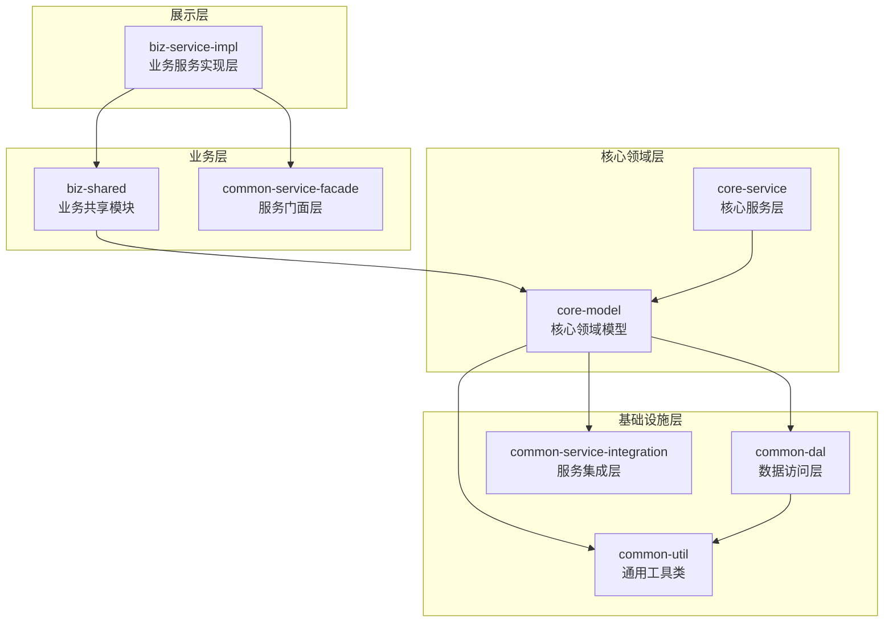
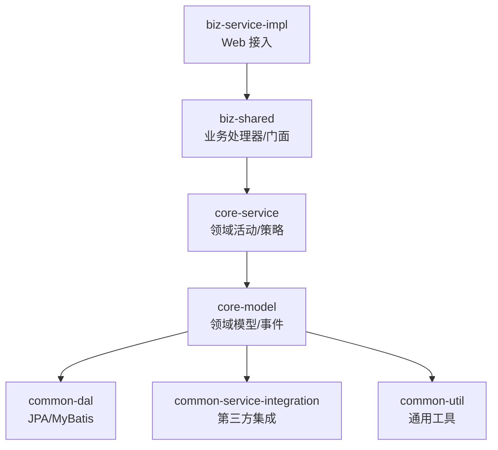
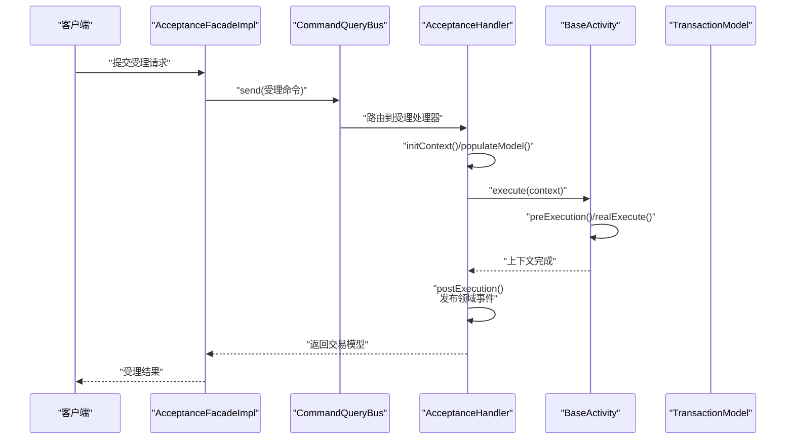
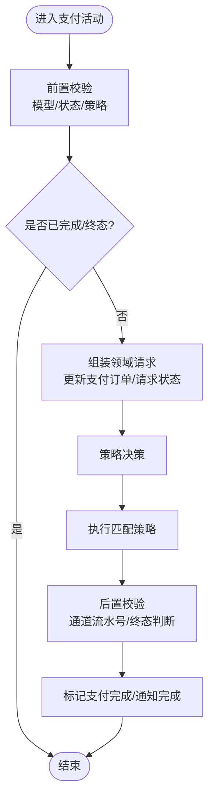
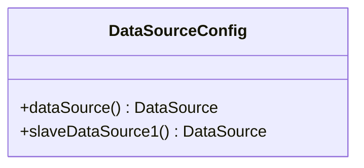
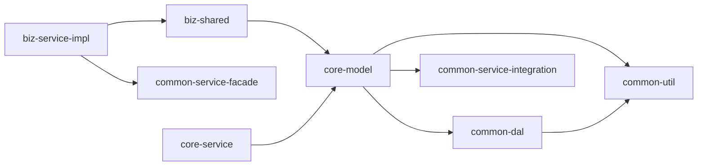

# 模块总览

<cite>
**本文档引用的文件**
- [README.md](file://README.md)
- [settings.gradle](file://settings.gradle)
- [build.gradle](file://build.gradle)
- [biz-service-impl/build.gradle](file://biz-service-impl/build.gradle)
- [core-service/build.gradle](file://core-service/build.gradle)
- [core-model/build.gradle](file://core-model/build.gradle)
- [common-dal/build.gradle](file://common-dal/build.gradle)
- [common-service-facade/build.gradle](file://common-service-facade/build.gradle)
- [biz-shared/src/main/java/com/magicliang/transaction/sys/biz/shared/package-info.java](file://biz-shared/src/main/java/com/magicliang/transaction/sys/biz/shared/package-info.java)
- [core-model/src/main/java/com/magicliang/transaction/sys/core/shared/Entity.java](file://core-model/src/main/java/com/magicliang/transaction/sys/core/shared/Entity.java)
- [core-service/src/main/java/com/magicliang/transaction/sys/core/domain/activity/BaseActivity.java](file://core-service/src/main/java/com/magicliang/transaction/sys/core/domain/activity/BaseActivity.java)
- [common-util/src/main/java/com/magicliang/transaction/sys/common/util/JsonUtils.java](file://common-util/src/main/java/com/magicliang/transaction/sys/common/util/JsonUtils.java)
- [common-service-integration/src/main/java/com/magicliang/transaction/sys/common/service/integration/delegate/alipay/IAlipayDelegate.java](file://common-service-integration/src/main/java/com/magicliang/transaction/sys/common/service/integration/delegate/alipay/IAlipayDelegate.java)
- [common-dal/src/main/java/com/magicliang/transaction/sys/common/dal/datasource/DataSourceConfig.java](file://common-dal/src/main/java/com/magicliang/transaction/sys/common/dal/datasource/DataSourceConfig.java)
- [biz-shared/src/main/java/com/magicliang/transaction/sys/biz/shared/handler/AcceptanceHandler.java](file://biz-shared/src/main/java/com/magicliang/transaction/sys/biz/shared/handler/AcceptanceHandler.java)
- [biz-service-impl/src/main/java/com/magicliang/transaction/sys/biz/service/impl/facade/impl/AcceptanceFacadeImpl.java](file://biz-service-impl/src/main/java/com/magicliang/transaction/sys/biz/service/impl/facade/impl/AcceptanceFacadeImpl.java)
- [core-service/src/main/java/com/magicliang/transaction/sys/core/domain/activity/payment/PaymentActivity.java](file://core-service/src/main/java/com/magicliang/transaction/sys/core/domain/activity/payment/PaymentActivity.java)
- [common-service-facade/src/main/java/com/magicliang/transaction/sys/common/service/facade/PayChannelService.java](file://common-service-facade/src/main/java/com/magicliang/transaction/sys/common/service/facade/PayChannelService.java)
</cite>

## 目录
1. [引言](#引言)
2. [项目结构](#项目结构)
3. [核心模块](#核心模块)
4. [架构总览](#架构总览)
5. [详细组件分析](#详细组件分析)
6. [依赖分析](#依赖分析)
7. [性能考量](#性能考量)
8. [故障排查指南](#故障排查指南)
9. [结论](#结论)
10. [附录](#附录)

## 引言
本项目是一个基于领域驱动设计（DDD）思想的交易系统示例工程，采用 SOFA 分层架构与 Gradle 多模块构建，围绕“受理-支付-通知”主业务流程，提供清晰的模块边界与职责划分。通过模块化设计，系统实现了代码复用、职责分离、测试隔离与团队协作的工程化目标。

## 项目结构
项目采用 Gradle 多模块组织，根工程统一管理版本与依赖，各模块职责明确，形成“展示层应用 → 业务共享层 → 核心领域层 → 基础设施层”的分层架构。

图表来源
- [settings.gradle:7-14](file://settings.gradle#L7-L14)
- [build.gradle:15-34](file://build.gradle#L15-L34)
- [biz-service-impl/build.gradle:8-11](file://biz-service-impl/build.gradle#L8-L11)
- [core-model/build.gradle:2-4](file://core-model/build.gradle#L2-L4)
- [common-dal/build.gradle:28-37](file://common-dal/build.gradle#L28-L37)

章节来源
- [README.md:23-47](file://README.md#L23-L47)
- [settings.gradle:1-16](file://settings.gradle#L1-L16)
- [build.gradle:165-284](file://build.gradle#L165-L284)

## 核心模块
- biz-service-impl：业务服务实现层，提供 Web MVC/WebFlux 接入与可启动能力，向上依赖业务共享与服务门面。
- biz-shared：业务共享模块，承载业务级别的共享组件（请求/响应、处理器、事件、命令查询总线等）。
- core-model：核心领域模型，包含实体、值对象、领域事件、请求/响应模型与规格化工具。
- core-service：核心服务层，实现领域活动（受理、支付、通知等）、策略与领域服务。
- common-dal：数据访问层，集成 JPA/MyBatis，支持多数据源与测试容器。
- common-service-facade：服务门面，定义对外暴露的服务契约（如支付通道服务）。
- common-service-integration：服务集成层，封装第三方对接（如支付宝委托接口）。
- common-util：通用工具类库，提供枚举、异常、断言、JSON 工具、APM 等。

章节来源
- [README.md:37-46](file://README.md#L37-L46)
- [biz-shared/src/main/java/com/magicliang/transaction/sys/biz/shared/package-info.java:1-12](file://biz-shared/src/main/java/com/magicliang/transaction/sys/biz/shared/package-info.java#L1-L12)
- [core-model/src/main/java/com/magicliang/transaction/sys/core/shared/Entity.java:1-17](file://core-model/src/main/java/com/magicliang/transaction/sys/core/shared/Entity.java#L1-L17)
- [common-util/src/main/java/com/magicliang/transaction/sys/common/util/JsonUtils.java:1-293](file://common-util/src/main/java/com/magicliang/transaction/sys/common/util/JsonUtils.java#L1-L293)
- [common-service-integration/src/main/java/com/magicliang/transaction/sys/common/service/integration/delegate/alipay/IAlipayDelegate.java:1-30](file://common-service-integration/src/main/java/com/magicliang/transaction/sys/common/service/integration/delegate/alipay/IAlipayDelegate.java#L1-L30)
- [common-dal/src/main/java/com/magicliang/transaction/sys/common/dal/datasource/DataSourceConfig.java:22-52](file://common-dal/src/main/java/com/magicliang/transaction/sys/common/dal/datasource/DataSourceConfig.java#L22-L52)
- [common-service-facade/src/main/java/com/magicliang/transaction/sys/common/service/facade/PayChannelService.java:1-15](file://common-service-facade/src/main/java/com/magicliang/transaction/sys/common/service/facade/PayChannelService.java#L1-L15)

## 架构总览
系统遵循 SOFA 分层架构，强调“展示层负责请求接入与响应封装，应用层编排业务流程与事务，领域层承载核心业务逻辑，基础层提供数据与第三方集成支撑”。模块间通过清晰的依赖边界实现解耦与复用。

图表来源
- [README.md:547-575](file://README.md#L547-L575)
- [biz-service-impl/build.gradle:8-11](file://biz-service-impl/build.gradle#L8-L11)
- [core-service/build.gradle:2-4](file://core-service/build.gradle#L2-L4)
- [core-model/build.gradle:2-4](file://core-model/build.gradle#L2-L4)
- [common-dal/build.gradle:31-37](file://common-dal/build.gradle#L31-L37)

## 详细组件分析

### 模块职责与协作
- biz-service-impl：对外提供 HTTP 接口，编排业务流程；通过命令查询总线将请求路由至 biz-shared。
- biz-shared：定义业务处理器（如受理处理器），完成上下文初始化、幂等校验、模型填充与领域事件发布。
- core-service：实现领域活动（受理、支付、通知），通过策略模式扩展不同支付渠道与通知方式。
- core-model：定义领域实体、值对象、领域事件与请求/响应模型，承载业务不变量与行为。
- common-dal：提供数据访问能力，支持多数据源与测试容器，屏蔽底层差异。
- common-service-integration：封装第三方对接（如支付宝），提供统一委托接口。
- common-util：提供通用工具（JSON、断言、枚举、异常、APM 等），被上层广泛复用。

章节来源
- [biz-service-impl/src/main/java/com/magicliang/transaction/sys/biz/service/impl/facade/impl/AcceptanceFacadeImpl.java:1-33](file://biz-service-impl/src/main/java/com/magicliang/transaction/sys/biz/service/impl/facade/impl/AcceptanceFacadeImpl.java#L1-L33)
- [biz-shared/src/main/java/com/magicliang/transaction/sys/biz/shared/handler/AcceptanceHandler.java:1-231](file://biz-shared/src/main/java/com/magicliang/transaction/sys/biz/shared/handler/AcceptanceHandler.java#L1-L231)
- [core-service/src/main/java/com/magicliang/transaction/sys/core/domain/activity/BaseActivity.java:1-139](file://core-service/src/main/java/com/magicliang/transaction/sys/core/domain/activity/BaseActivity.java#L1-L139)
- [core-service/src/main/java/com/magicliang/transaction/sys/core/domain/activity/payment/PaymentActivity.java:1-202](file://core-service/src/main/java/com/magicliang/transaction/sys/core/domain/activity/payment/PaymentActivity.java#L1-L202)
- [core-model/src/main/java/com/magicliang/transaction/sys/core/shared/Entity.java:1-17](file://core-model/src/main/java/com/magicliang/transaction/sys/core/shared/Entity.java#L1-L17)
- [common-dal/src/main/java/com/magicliang/transaction/sys/common/dal/datasource/DataSourceConfig.java:22-52](file://common-dal/src/main/java/com/magicliang/transaction/sys/common/dal/datasource/DataSourceConfig.java#L22-L52)
- [common-service-integration/src/main/java/com/magicliang/transaction/sys/common/service/integration/delegate/alipay/IAlipayDelegate.java:1-30](file://common-service-integration/src/main/java/com/magicliang/transaction/sys/common/service/integration/delegate/alipay/IAlipayDelegate.java#L1-L30)
- [common-util/src/main/java/com/magicliang/transaction/sys/common/util/JsonUtils.java:1-293](file://common-util/src/main/java/com/magicliang/transaction/sys/common/util/JsonUtils.java#L1-L293)

### 受理流程时序
受理流程从 Web 接入开始，经门面与业务处理器，最终进入核心领域活动，完成幂等校验、模型生成与领域事件发布。

图表来源
- [biz-service-impl/src/main/java/com/magicliang/transaction/sys/biz/service/impl/facade/impl/AcceptanceFacadeImpl.java:28-31](file://biz-service-impl/src/main/java/com/magicliang/transaction/sys/biz/service/impl/facade/impl/AcceptanceFacadeImpl.java#L28-L31)
- [biz-shared/src/main/java/com/magicliang/transaction/sys/biz/shared/handler/AcceptanceHandler.java:54-79](file://biz-shared/src/main/java/com/magicliang/transaction/sys/biz/shared/handler/AcceptanceHandler.java#L54-L79)
- [core-service/src/main/java/com/magicliang/transaction/sys/core/domain/activity/BaseActivity.java:42-52](file://core-service/src/main/java/com/magicliang/transaction/sys/core/domain/activity/BaseActivity.java#L42-L52)

章节来源
- [biz-service-impl/src/main/java/com/magicliang/transaction/sys/biz/service/impl/facade/impl/AcceptanceFacadeImpl.java:1-33](file://biz-service-impl/src/main/java/com/magicliang/transaction/sys/biz/service/impl/facade/impl/AcceptanceFacadeImpl.java#L1-L33)
- [biz-shared/src/main/java/com/magicliang/transaction/sys/biz/shared/handler/AcceptanceHandler.java:1-231](file://biz-shared/src/main/java/com/magicliang/transaction/sys/biz/shared/handler/AcceptanceHandler.java#L1-L231)
- [core-service/src/main/java/com/magicliang/transaction/sys/core/domain/activity/BaseActivity.java:1-139](file://core-service/src/main/java/com/magicliang/transaction/sys/core/domain/activity/BaseActivity.java#L1-L139)

### 支付活动与策略
支付活动在受理完成后执行，进行前置校验、策略决策与后置处理，确保幂等与终态控制。

图表来源
- [core-service/src/main/java/com/magicliang/transaction/sys/core/domain/activity/payment/PaymentActivity.java:52-87](file://core-service/src/main/java/com/magicliang/transaction/sys/core/domain/activity/payment/PaymentActivity.java#L52-L87)
- [core-service/src/main/java/com/magicliang/transaction/sys/core/domain/activity/payment/PaymentActivity.java:95-108](file://core-service/src/main/java/com/magicliang/transaction/sys/core/domain/activity/payment/PaymentActivity.java#L95-L108)
- [core-service/src/main/java/com/magicliang/transaction/sys/core/domain/activity/payment/PaymentActivity.java:129-133](file://core-service/src/main/java/com/magicliang/transaction/sys/core/domain/activity/payment/PaymentActivity.java#L129-L133)
- [core-service/src/main/java/com/magicliang/transaction/sys/core/domain/activity/payment/PaymentActivity.java:150-169](file://core-service/src/main/java/com/magicliang/transaction/sys/core/domain/activity/payment/PaymentActivity.java#L150-L169)

章节来源
- [core-service/src/main/java/com/magicliang/transaction/sys/core/domain/activity/payment/PaymentActivity.java:1-202](file://core-service/src/main/java/com/magicliang/transaction/sys/core/domain/activity/payment/PaymentActivity.java#L1-L202)

### 数据访问与多数据源
数据访问层通过配置类与测试容器支持多数据源与本地/容器化数据库，满足开发与测试需求。

图表来源
- [common-dal/src/main/java/com/magicliang/transaction/sys/common/dal/datasource/DataSourceConfig.java:22-52](file://common-dal/src/main/java/com/magicliang/transaction/sys/common/dal/datasource/DataSourceConfig.java#L22-L52)

章节来源
- [common-dal/src/main/java/com/magicliang/transaction/sys/common/dal/datasource/DataSourceConfig.java:1-82](file://common-dal/src/main/java/com/magicliang/transaction/sys/common/dal/datasource/DataSourceConfig.java#L1-L82)

## 依赖分析
模块间的依赖关系体现了“上层依赖下层、横向不依赖”的原则，核心依赖链路如下：

图表来源
- [biz-service-impl/build.gradle:8-11](file://biz-service-impl/build.gradle#L8-L11)
- [core-service/build.gradle:2-4](file://core-service/build.gradle#L2-L4)
- [core-model/build.gradle:2-4](file://core-model/build.gradle#L2-L4)
- [common-dal/build.gradle:28-37](file://common-dal/build.gradle#L28-L37)

章节来源
- [build.gradle:165-284](file://build.gradle#L165-L284)
- [biz-service-impl/build.gradle:1-80](file://biz-service-impl/build.gradle#L1-L80)
- [core-service/build.gradle:1-13](file://core-service/build.gradle#L1-L13)
- [core-model/build.gradle:1-15](file://core-model/build.gradle#L1-L15)
- [common-dal/build.gradle:1-62](file://common-dal/build.gradle#L1-L62)

## 性能考量
- 并行测试：根工程启用并行测试，充分利用 CPU 资源，提升测试执行效率。
- JSON 工具：提供多策略 ObjectMapper 实例与缓存开关，兼顾性能与 GC 友好性。
- 数据访问：JPA/MyBatis 双栈结合，配合测试容器与多数据源，降低集成成本。
- 观测性：引入 OpenTelemetry 相关依赖，便于追踪与性能分析。

章节来源
- [build.gradle:253-272](file://build.gradle#L253-L272)
- [common-util/src/main/java/com/magicliang/transaction/sys/common/util/JsonUtils.java:53-81](file://common-util/src/main/java/com/magicliang/transaction/sys/common/util/JsonUtils.java#L53-L81)

## 故障排查指南
- 数据源配置：确认多数据源 Bean 在目标 Profile 下正确创建，避免运行期无法连接数据库。
- 依赖缺失：若出现类找不到错误，检查模块间依赖声明与 API/implementation 使用是否正确。
- 测试执行：如测试卡顿或失败，检查并行度配置与测试容器可用性。
- 日志与可观测性：根据环境切换日志配置，结合 APM 工具定位性能瓶颈。

章节来源
- [common-dal/src/main/java/com/magicliang/transaction/sys/common/dal/datasource/DataSourceConfig.java:33-52](file://common-dal/src/main/java/com/magicliang/transaction/sys/common/dal/datasource/DataSourceConfig.java#L33-L52)
- [build.gradle:253-272](file://build.gradle#L253-L272)

## 结论
本项目通过清晰的模块划分与分层架构，实现了领域驱动交易系统的可维护性与可扩展性。模块化设计提升了代码复用、职责分离与测试隔离能力，为团队协作提供了稳定的基础。建议在后续演进中持续完善领域模型与策略扩展点，增强对多支付渠道与通知方式的适配能力。

## 附录
- 快速开始与测试：参考根工程说明，使用 Gradle 任务进行构建与测试。
- 数据库 Profile：支持本地容器化、嵌入式数据库与外部数据库，按需选择。
- 部署：提供 Docker/Kubernetes 部署清单与一键脚本，支持 dev/staging/prod 三环境。

章节来源
- [README.md:48-82](file://README.md#L48-L82)
- [README.md:84-130](file://README.md#L84-L130)
- [README.md:216-321](file://README.md#L216-L321)