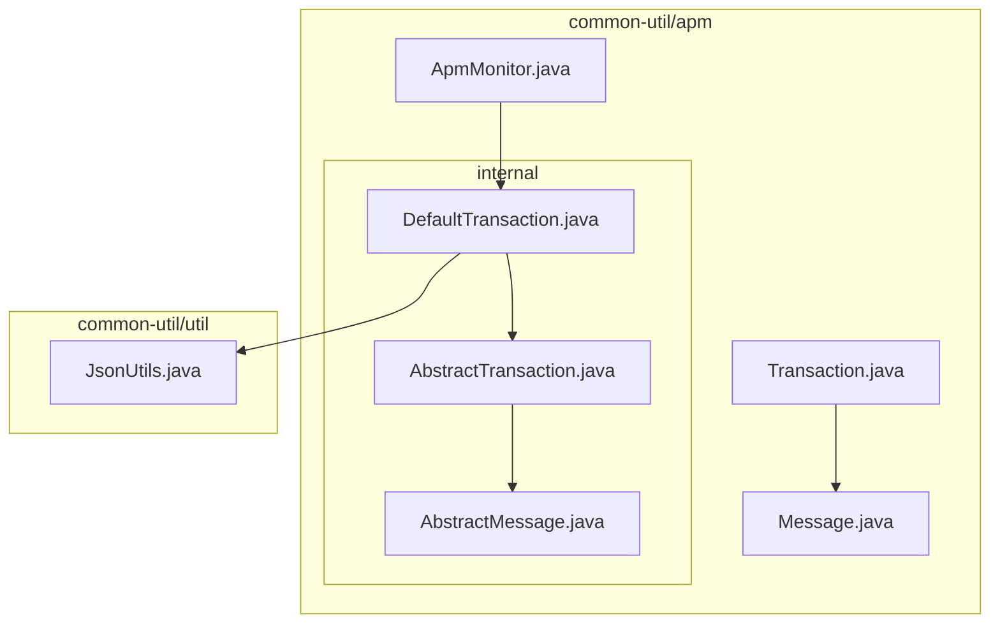
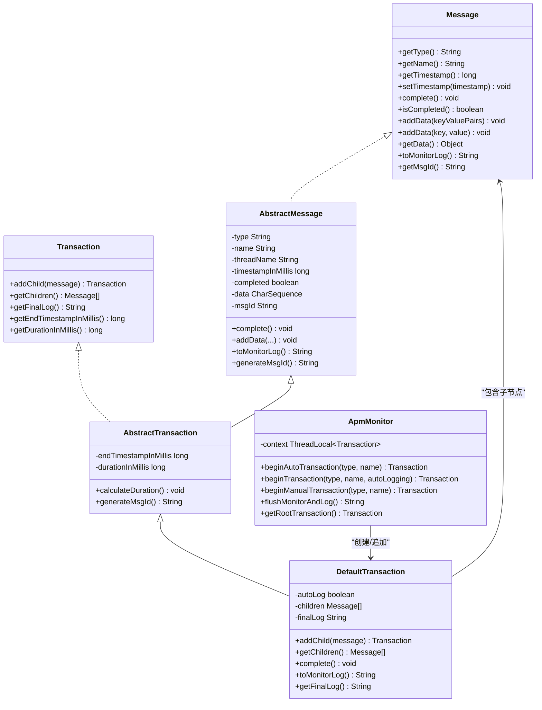
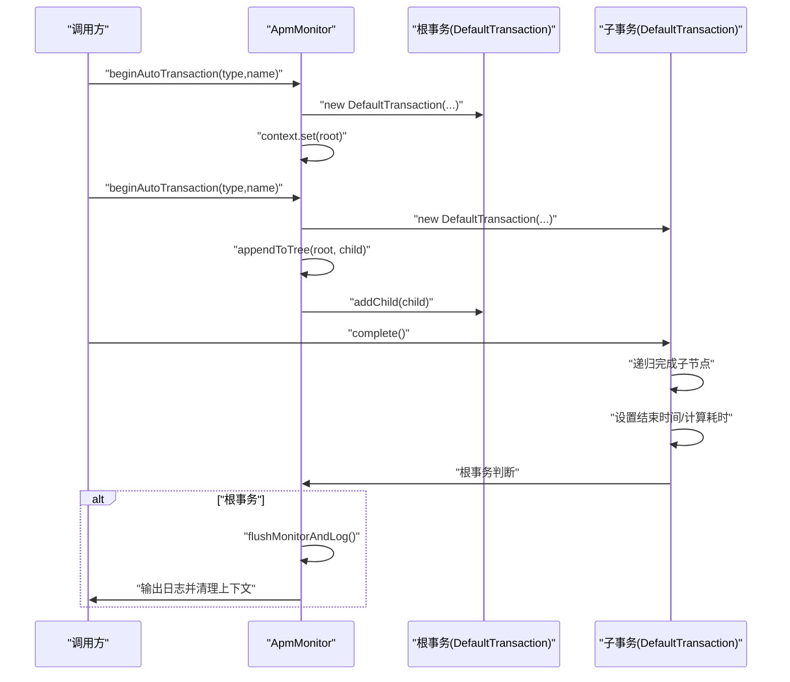
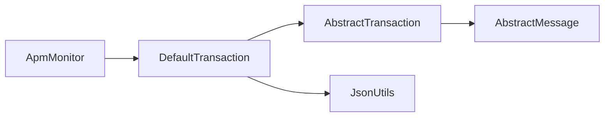

# APM监控

<cite>
**本文引用的文件**
- [ApmMonitor.java](file://common-util/src/main/java/com/magicliang/transaction/sys/common/util/apm/ApmMonitor.java)
- [Transaction.java](file://common-util/src/main/java/com/magicliang/transaction/sys/common/util/apm/Transaction.java)
- [Message.java](file://common-util/src/main/java/com/magicliang/transaction/sys/common/util/apm/Message.java)
- [AbstractTransaction.java](file://common-util/src/main/java/com/magicliang/transaction/sys/common/util/apm/internal/AbstractTransaction.java)
- [DefaultTransaction.java](file://common-util/src/main/java/com/magicliang/transaction/sys/common/util/apm/internal/DefaultTransaction.java)
- [AbstractMessage.java](file://common-util/src/main/java/com/magicliang/transaction/sys/common/util/apm/internal/AbstractMessage.java)
- [TransactionTest.java](file://common-util/src/test/java/com/magicliang/transaction/sys/common/util/apm/TransactionTest.java)
- [JsonUtils.java](file://common-util/src/main/java/com/magicliang/transaction/sys/common/util/JsonUtils.java)
- [build.gradle](file://common-util/build.gradle)
</cite>

## 目录
1. [简介](#简介)
2. [项目结构](#项目结构)
3. [核心组件](#核心组件)
4. [架构总览](#架构总览)
5. [组件详解](#组件详解)
6. [依赖关系分析](#依赖关系分析)
7. [性能考量](#性能考量)
8. [故障排查指南](#故障排查指南)
9. [结论](#结论)
10. [附录](#附录)

## 简介
本文件面向APM监控模块，系统性阐述common-util中应用性能监控（APM）工具的设计与实现，覆盖监控器ApmMonitor、事务对象Transaction、消息对象Message以及内部抽象事务实现等。文档重点说明：
- APM监控体系的架构设计与控制流
- 监控指标采集（时间戳、耗时、附加数据、消息树）
- 性能数据分析与可视化输出
- 告警机制与最佳实践
- 在微服务架构中实现全链路性能监控的思路与落地建议
- 在业务代码中的集成方式、自定义监控指标与配置告警

## 项目结构
APM相关代码位于common-util模块的apm包及其internal子包中，采用接口+抽象实现+具体实现的分层设计，并通过ThreadLocal维护线程上下文，确保单线程场景下的事务树构建与清理。

图表来源
- [ApmMonitor.java:42-233](file://common-util/src/main/java/com/magicliang/transaction/sys/common/util/apm/ApmMonitor.java#L42-L233)
- [Transaction.java:18-61](file://common-util/src/main/java/com/magicliang/transaction/sys/common/util/apm/Transaction.java#L18-L61)
- [Message.java:16-108](file://common-util/src/main/java/com/magicliang/transaction/sys/common/util/apm/Message.java#L16-L108)
- [AbstractTransaction.java:19-99](file://common-util/src/main/java/com/magicliang/transaction/sys/common/util/apm/internal/AbstractTransaction.java#L19-L99)
- [DefaultTransaction.java:27-191](file://common-util/src/main/java/com/magicliang/transaction/sys/common/util/apm/internal/DefaultTransaction.java#L27-L191)
- [AbstractMessage.java:20-228](file://common-util/src/main/java/com/magicliang/transaction/sys/common/util/apm/internal/AbstractMessage.java#L20-L228)
- [JsonUtils.java:30-292](file://common-util/src/main/java/com/magicliang/transaction/sys/common/util/JsonUtils.java#L30-L292)

章节来源
- [ApmMonitor.java:42-233](file://common-util/src/main/java/com/magicliang/transaction/sys/common/util/apm/ApmMonitor.java#L42-L233)
- [build.gradle:8-39](file://common-util/build.gradle#L8-L39)

## 核心组件
- ApmMonitor：监控器，负责事务的创建、树形结构的追加、上下文管理与最终日志输出。
- Message：监控消息接口，定义类型、名称、时间戳、完成态、附加数据与监控日志输出等通用能力。
- Transaction：事务接口，扩展Message，增加子节点管理、最终日志、结束时间与耗时等。
- AbstractMessage：消息抽象基类，统一实现时间戳、完成态、附加数据、消息ID生成等。
- AbstractTransaction：事务抽象基类，扩展AbstractMessage，增加结束时间与耗时计算、消息ID继承逻辑。
- DefaultTransaction：默认事务实现，负责子节点追加、完成时序（递归完成子节点）、根节点上下文清理与自动日志输出。

章节来源
- [Message.java:16-108](file://common-util/src/main/java/com/magicliang/transaction/sys/common/util/apm/Message.java#L16-L108)
- [Transaction.java:18-61](file://common-util/src/main/java/com/magicliang/transaction/sys/common/util/apm/Transaction.java#L18-L61)
- [AbstractMessage.java:20-228](file://common-util/src/main/java/com/magicliang/transaction/sys/common/util/apm/internal/AbstractMessage.java#L20-L228)
- [AbstractTransaction.java:19-99](file://common-util/src/main/java/com/magicliang/transaction/sys/common/util/apm/internal/AbstractTransaction.java#L19-L99)
- [DefaultTransaction.java:27-191](file://common-util/src/main/java/com/magicliang/transaction/sys/common/util/apm/internal/DefaultTransaction.java#L27-L191)
- [ApmMonitor.java:42-233](file://common-util/src/main/java/com/magicliang/transaction/sys/common/util/apm/ApmMonitor.java#L42-L233)

## 架构总览
APM监控体系采用“监控器-事务-消息”的分层架构，结合Composite模式构建事务树，通过ThreadLocal在单线程内维护上下文，最终在根事务完成时统一输出结构化日志。

图表来源
- [Message.java:16-108](file://common-util/src/main/java/com/magicliang/transaction/sys/common/util/apm/Message.java#L16-L108)
- [Transaction.java:18-61](file://common-util/src/main/java/com/magicliang/transaction/sys/common/util/apm/Transaction.java#L18-L61)
- [AbstractMessage.java:20-228](file://common-util/src/main/java/com/magicliang/transaction/sys/common/util/apm/internal/AbstractMessage.java#L20-L228)
- [AbstractTransaction.java:19-99](file://common-util/src/main/java/com/magicliang/transaction/sys/common/util/apm/internal/AbstractTransaction.java#L19-L99)
- [DefaultTransaction.java:27-191](file://common-util/src/main/java/com/magicliang/transaction/sys/common/util/apm/internal/DefaultTransaction.java#L27-L191)
- [ApmMonitor.java:42-233](file://common-util/src/main/java/com/magicliang/transaction/sys/common/util/apm/ApmMonitor.java#L42-L233)

## 组件详解

### ApmMonitor监控器
- 职责
  - 创建事务：支持自动日志与手动日志两种模式；自动模式在根事务完成时自动输出日志并清理上下文。
  - 维护上下文：通过ThreadLocal保存当前线程的根事务，避免跨线程污染。
  - 事务树追加：根据子事务完成状态决定新事务的父节点，形成嵌套树结构。
  - 日志输出：提供统一的flush与log接口，支持外部日志器注入。
- 关键点
  - 根事务判断与上下文清理：根事务完成时清理ThreadLocal，避免泄漏。
  - 完成顺序：先递归完成子节点，再完成自身，最后清理上下文。
  - 自动日志：根事务完成时可选择自动输出监控日志。

图表来源
- [ApmMonitor.java:82-181](file://common-util/src/main/java/com/magicliang/transaction/sys/common/util/apm/ApmMonitor.java#L82-L181)
- [DefaultTransaction.java:100-131](file://common-util/src/main/java/com/magicliang/transaction/sys/common/util/apm/internal/DefaultTransaction.java#L100-L131)

章节来源
- [ApmMonitor.java:42-233](file://common-util/src/main/java/com/magicliang/transaction/sys/common/util/apm/ApmMonitor.java#L42-L233)

### Transaction事务对象
- 能力
  - 子节点管理：添加子消息、获取子节点列表。
  - 结果输出：最终日志、结束时间、耗时。
  - 生命周期：完成态标记，避免重复完成。
- 设计要点
  - 与Message一致的复合模式：事务可嵌套其他事务、事件或心跳。
  - 与AbstractTransaction配合，统一时间戳与耗时计算。

章节来源
- [Transaction.java:18-61](file://common-util/src/main/java/com/magicliang/transaction/sys/common/util/apm/Transaction.java#L18-L61)
- [AbstractTransaction.java:19-99](file://common-util/src/main/java/com/magicliang/transaction/sys/common/util/apm/internal/AbstractTransaction.java#L19-L99)

### Message消息对象
- 能力
  - 基本属性：类型、名称、时间戳、完成态。
  - 数据附加：支持键值对与键值对字符串的追加。
  - 标识：消息ID，用于跨层关联。
  - 日志输出：toMonitorLog默认委托toString。
- 设计要点
  - 通过AbstractMessage统一实现时间戳、完成态、数据缓冲与消息ID生成。
  - 与事务共同构成监控树的基础单元。

章节来源
- [Message.java:16-108](file://common-util/src/main/java/com/magicliang/transaction/sys/common/util/apm/Message.java#L16-L108)
- [AbstractMessage.java:20-228](file://common-util/src/main/java/com/magicliang/transaction/sys/common/util/apm/internal/AbstractMessage.java#L20-L228)

### DefaultTransaction默认事务实现
- 能力
  - 子节点追加：懒加载列表，线程安全添加。
  - 完成时序：先完成子节点，再完成自身，最后根事务清理上下文。
  - 日志输出：toString使用JsonUtils序列化，toMonitorLog缓存最终日志。
  - 时间计算：calculateDuration基于起止时间戳计算耗时。
- 设计要点
  - autoLog控制是否在根事务完成时自动输出日志。
  - 子节点按时间戳排序，便于后续分析与展示。

章节来源
- [DefaultTransaction.java:27-191](file://common-util/src/main/java/com/magicliang/transaction/sys/common/util/apm/internal/DefaultTransaction.java#L27-L191)
- [JsonUtils.java:143-145](file://common-util/src/main/java/com/magicliang/transaction/sys/common/util/JsonUtils.java#L143-L145)

### AbstractTransaction与AbstractMessage
- AbstractMessage
  - 统一时间戳、完成态、数据缓冲、线程名与消息ID生成。
  - 提供addData多种重载，支持高效拼接。
- AbstractTransaction
  - 增加结束时间与耗时字段，提供calculateDuration。
  - 重写generateMsgId，使子事务继承根事务的消息ID，便于跨层关联。

章节来源
- [AbstractMessage.java:20-228](file://common-util/src/main/java/com/magicliang/transaction/sys/common/util/apm/internal/AbstractMessage.java#L20-L228)
- [AbstractTransaction.java:19-99](file://common-util/src/main/java/com/magicliang/transaction/sys/common/util/apm/internal/AbstractTransaction.java#L19-L99)

## 依赖关系分析
- ApmMonitor依赖DefaultTransaction创建事务，并通过ThreadLocal持有上下文。
- DefaultTransaction依赖AbstractTransaction与AbstractMessage，复用时间戳、完成态与消息ID生成逻辑。
- DefaultTransaction依赖JsonUtils进行结构化日志输出。
- 测试模块TransactionTest验证事务树构建、时间约束与多线程场景。

图表来源
- [ApmMonitor.java:3-4](file://common-util/src/main/java/com/magicliang/transaction/sys/common/util/apm/ApmMonitor.java#L3-L4)
- [DefaultTransaction.java:3-5](file://common-util/src/main/java/com/magicliang/transaction/sys/common/util/apm/internal/DefaultTransaction.java#L3-L5)
- [AbstractTransaction.java:3-4](file://common-util/src/main/java/com/magicliang/transaction/sys/common/util/apm/internal/AbstractTransaction.java#L3-L4)
- [AbstractMessage.java:3-4](file://common-util/src/main/java/com/magicliang/transaction/sys/common/util/apm/internal/AbstractMessage.java#L3-L4)
- [JsonUtils.java:3-11](file://common-util/src/main/java/com/magicliang/transaction/sys/common/util/JsonUtils.java#L3-L11)

章节来源
- [build.gradle:21-26](file://common-util/build.gradle#L21-L26)

## 性能考量
- 序列化开销
  - DefaultTransaction使用JsonUtils进行toString序列化，建议在高并发场景下谨慎使用，必要时仅在根事务完成时输出，避免频繁序列化。
- 线程上下文
  - ThreadLocal在根事务完成时清理，避免内存泄漏；但在异常路径需确保complete被调用，否则上下文无法清理。
- 子节点排序
  - 子节点按时间戳排序，多线程环境下排序成本可控，但应避免在热路径上频繁创建大量子事务。
- 消息ID生成
  - 默认使用UUID，若对性能敏感，可考虑替换为高性能ID生成策略（当前注释已提示潜在锁竞争风险）。

章节来源
- [DefaultTransaction.java:148-151](file://common-util/src/main/java/com/magicliang/transaction/sys/common/util/apm/internal/DefaultTransaction.java#L148-L151)
- [AbstractMessage.java:225-228](file://common-util/src/main/java/com/magicliang/transaction/sys/common/util/apm/internal/AbstractMessage.java#L225-L228)
- [ApmMonitor.java:210-222](file://common-util/src/main/java/com/magicliang/transaction/sys/common/util/apm/ApmMonitor.java#L210-L222)

## 故障排查指南
- 事务未完成导致日志缺失
  - 现象：根事务完成时无日志输出。
  - 原因：子事务未调用complete，导致根事务无法递归完成。
  - 处理：确保finally块中调用complete，或使用AOP拦截器自动完成。
- 多线程场景下上下文污染
  - 现象：不同线程共享ThreadLocal导致事务树混乱。
  - 原因：未正确隔离线程上下文。
  - 处理：确保每个线程独立创建事务，避免跨线程传递事务对象。
- 时间戳异常
  - 现象：结束时间早于开始时间或耗时不正确。
  - 原因：时间戳设置错误或墙钟精度问题。
  - 处理：检查时间戳设置逻辑，确保完成顺序正确。
- 日志输出时机不当
  - 现象：日志过早或过晚输出。
  - 原因：手动模式下未在根事务完成时调用flushMonitor。
  - 处理：根事务完成时自动输出，或在业务关键点显式调用flushMonitor。

章节来源
- [TransactionTest.java:506-675](file://common-util/src/test/java/com/magicliang/transaction/sys/common/util/apm/TransactionTest.java#L506-L675)
- [DefaultTransaction.java:100-131](file://common-util/src/main/java/com/magicliang/transaction/sys/common/util/apm/internal/DefaultTransaction.java#L100-L131)
- [ApmMonitor.java:188-222](file://common-util/src/main/java/com/magicliang/transaction/sys/common/util/apm/ApmMonitor.java#L188-L222)

## 结论
APM监控模块通过清晰的接口分层与复合模式，实现了轻量、可扩展的性能监控能力。其核心优势在于：
- 单线程上下文隔离与根事务自动清理，降低内存泄漏风险。
- 事务树结构天然支持热点定位与全链路分析。
- 结构化日志输出便于接入现有日志系统与可视化平台。

在生产环境中，建议结合AOP拦截器实现自动埋点，严格遵循“完成即清理”的原则，并针对高并发场景优化序列化与ID生成策略。

## 附录

### 使用示例与最佳实践
- 基本使用
  - 在业务入口创建事务，执行业务逻辑，最后在出口调用complete。
  - 自动模式：根事务完成时自动输出日志并清理上下文。
  - 手动模式：在合适时机调用flushMonitor输出日志。
- 自定义监控指标
  - 通过addData添加键值对或键值对字符串，记录参数、状态码、错误信息等。
- 告警机制
  - 建议在日志系统中基于耗时阈值、错误率等规则建立告警。
  - 结合可视化平台展示趋势与热点。
- 分布式追踪
  - 通过消息ID继承机制（子事务继承根事务msgId）实现跨服务关联。
  - 在RPC/HTTP请求头中透传msgId，确保全链路可追踪。
- 存储与查询
  - 将结构化日志持久化至日志库或时序数据库，按类型、名称、msgId聚合查询。
  - 查询优化：建立索引（如msgId、类型、时间范围），避免全表扫描。
- 可视化展示
  - 使用仪表板展示耗时分布、错误率、吞吐量等关键指标。
  - 提供事务树详情页，支持钻取热点与异常路径。

章节来源
- [ApmMonitor.java:16-32](file://common-util/src/main/java/com/magicliang/transaction/sys/common/util/apm/ApmMonitor.java#L16-L32)
- [DefaultTransaction.java:158-161](file://common-util/src/main/java/com/magicliang/transaction/sys/common/util/apm/internal/DefaultTransaction.java#L158-L161)
- [AbstractTransaction.java:90-98](file://common-util/src/main/java/com/magicliang/transaction/sys/common/util/apm/internal/AbstractTransaction.java#L90-L98)