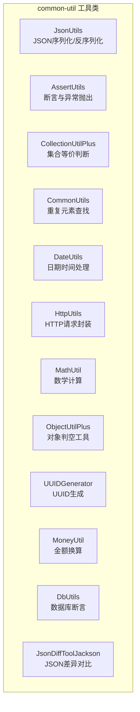
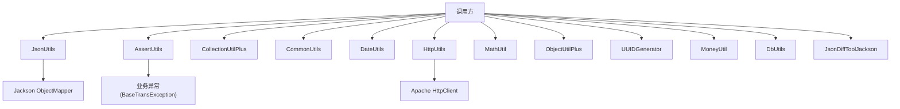
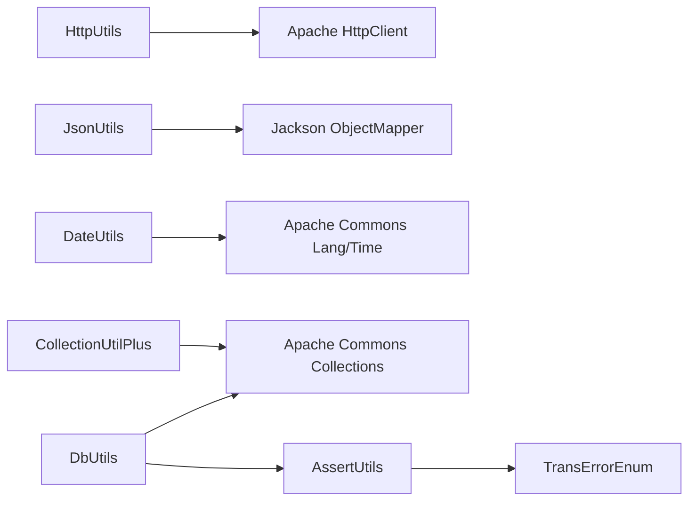

# 工具类库

<cite>
**本文引用的文件**   
- [JsonUtils.java](file://common-util/src/main/java/com/magicliang/transaction/sys/common/util/JsonUtils.java)
- [AssertUtils.java](file://common-util/src/main/java/com/magicliang/transaction/sys/common/util/AssertUtils.java)
- [CollectionUtilPlus.java](file://common-util/src/main/java/com/magicliang/transaction/sys/common/util/CollectionUtilPlus.java)
- [CommonUtils.java](file://common-util/src/main/java/com/magicliang/transaction/sys/common/util/CommonUtils.java)
- [DateUtils.java](file://common-util/src/main/java/com/magicliang/transaction/sys/common/util/DateUtils.java)
- [HttpUtils.java](file://common-util/src/main/java/com/magicliang/transaction/sys/common/util/HttpUtils.java)
- [MathUtil.java](file://common-util/src/main/java/com/magicliang/transaction/sys/common/util/MathUtil.java)
- [ObjectUtilPlus.java](file://common-util/src/main/java/com/magicliang/transaction/sys/common/util/ObjectUtilPlus.java)
- [UUIDGenerator.java](file://common-util/src/main/java/com/magicliang/transaction/sys/common/util/UUIDGenerator.java)
- [MoneyUtil.java](file://common-util/src/main/java/com/magicliang/transaction/sys/common/util/MoneyUtil.java)
- [DbUtils.java](file://common-util/src/main/java/com/magicliang/transaction/sys/common/util/DbUtils.java)
- [JsonDiffToolJackson.java](file://common-util/src/main/java/com/magicliang/transaction/sys/common/util/JsonDiffToolJackson.java)
- [CollectionUtilPlusTest.java](file://common-util/src/test/java/com/magicliang/transaction/sys/common/util/CollectionUtilPlusTest.java)
- [MathUtilTest.java](file://common-util/src/test/java/com/magicliang/transaction/sys/common/util/MathUtilTest.java)
- [ObjectUtilPlusTest.java](file://common-util/src/test/java/com/magicliang/transaction/sys/common/util/ObjectUtilPlusTest.java)
</cite>

## 目录
1. [简介](#简介)
2. [项目结构](#项目结构)
3. [核心组件](#核心组件)
4. [架构总览](#架构总览)
5. [详细组件分析](#详细组件分析)
6. [依赖分析](#依赖分析)
7. [性能考量](#性能考量)
8. [故障排查指南](#故障排查指南)
9. [结论](#结论)
10. [附录](#附录)

## 简介
本文件系统性梳理 common-util 模块中的各类实用工具类，覆盖 JSON 序列化与反序列化、断言与校验、集合与对象工具、通用方法、日期时间、HTTP 请求、数学计算、UUID 生成、金钱换算、数据库断言以及 JSON 差异对比等能力。文档面向不同技术背景读者，既提供方法级的参数与返回说明，也给出典型使用场景与最佳实践，帮助开发者快速掌握并高效应用这些工具类。

## 项目结构
common-util 模块位于 common-util/src/main/java/com/magicliang/transaction/sys/common/util 下，包含多个独立的工具类，均采用静态方法设计，便于直接调用；同时配套单元测试位于 common-util/src/test/java/com/magicliang/transaction/sys/common/util 下，验证关键行为。

图表来源
- [JsonUtils.java:1-293](file://common-util/src/main/java/com/magicliang/transaction/sys/common/util/JsonUtils.java#L1-L293)
- [AssertUtils.java:1-109](file://common-util/src/main/java/com/magicliang/transaction/sys/common/util/AssertUtils.java#L1-L109)
- [CollectionUtilPlus.java:1-36](file://common-util/src/main/java/com/magicliang/transaction/sys/common/util/CollectionUtilPlus.java#L1-L36)
- [CommonUtils.java:1-48](file://common-util/src/main/java/com/magicliang/transaction/sys/common/util/CommonUtils.java#L1-L48)
- [DateUtils.java:1-941](file://common-util/src/main/java/com/magicliang/transaction/sys/common/util/DateUtils.java#L1-L941)
- [HttpUtils.java:1-525](file://common-util/src/main/java/com/magicliang/transaction/sys/common/util/HttpUtils.java#L1-L525)
- [MathUtil.java:1-69](file://common-util/src/main/java/com/magicliang/transaction/sys/common/util/MathUtil.java#L1-L69)
- [ObjectUtilPlus.java:1-44](file://common-util/src/main/java/com/magicliang/transaction/sys/common/util/ObjectUtilPlus.java#L1-L44)
- [UUIDGenerator.java:1-44](file://common-util/src/main/java/com/magicliang/transaction/sys/common/util/UUIDGenerator.java#L1-L44)
- [MoneyUtil.java:1-154](file://common-util/src/main/java/com/magicliang/transaction/sys/common/util/MoneyUtil.java#L1-L154)
- [DbUtils.java:1-110](file://common-util/src/main/java/com/magicliang/transaction/sys/common/util/DbUtils.java#L1-L110)
- [JsonDiffToolJackson.java:1-370](file://common-util/src/main/java/com/magicliang/transaction/sys/common/util/JsonDiffToolJackson.java#L1-L370)

章节来源
- [JsonUtils.java:1-293](file://common-util/src/main/java/com/magicliang/transaction/sys/common/util/JsonUtils.java#L1-L293)
- [HttpUtils.java:1-525](file://common-util/src/main/java/com/magicliang/transaction/sys/common/util/HttpUtils.java#L1-L525)

## 核心组件
- JsonUtils：基于 Jackson 的 JSON 工具，支持多种序列化包含策略、驼峰到下划线命名转换、泛型集合与 Map 的反序列化、JsonNode 构造等。
- AssertUtils：统一断言入口，提供空值、非空、非空白、非空集合、单元素集合、相等性断言及布尔断言，配合业务错误码抛出领域异常。
- CollectionUtilPlus：增强集合工具，提供两集合“是否相等”的安全判断，内部处理空值边界。
- CommonUtils：通用方法，提供基于流的重复元素查找。
- DateUtils：日期时间处理，包含格式化、解析、区间计算、起止时刻、周/月/年计算、时间戳转换等。
- HttpUtils：HTTP 请求封装，支持 GET/POST、表单与 JSON、字符集、超时配置、SSL 代理、状态断言与资源关闭。
- MathUtil：数学计算，提供多数最大公约数、首数字提取、中位数占位实现。
- ObjectUtilPlus：对象判空工具，提供全部为空/不全为空/全部不为空的便捷判断。
- UUIDGenerator：UUID 生成器，提供短 UUID 与指定位数随机数生成。
- MoneyUtil：金额换算，提供分/元互转、百分比计算、格式化输出、向下取整等。
- DbUtils：数据库断言，统一检查查询/插入/更新条目数量与期望一致。
- JsonDiffToolJackson：基于 Jackson 的严格 JSON 内容比较工具，支持对象/数组/基本类型的差异对比与报告打印。

章节来源
- [JsonUtils.java:1-293](file://common-util/src/main/java/com/magicliang/transaction/sys/common/util/JsonUtils.java#L1-L293)
- [AssertUtils.java:1-109](file://common-util/src/main/java/com/magicliang/transaction/sys/common/util/AssertUtils.java#L1-L109)
- [CollectionUtilPlus.java:1-36](file://common-util/src/main/java/com/magicliang/transaction/sys/common/util/CollectionUtilPlus.java#L1-L36)
- [CommonUtils.java:1-48](file://common-util/src/main/java/com/magicliang/transaction/sys/common/util/CommonUtils.java#L1-L48)
- [DateUtils.java:1-941](file://common-util/src/main/java/com/magicliang/transaction/sys/common/util/DateUtils.java#L1-L941)
- [HttpUtils.java:1-525](file://common-util/src/main/java/com/magicliang/transaction/sys/common/util/HttpUtils.java#L1-L525)
- [MathUtil.java:1-69](file://common-util/src/main/java/com/magicliang/transaction/sys/common/util/MathUtil.java#L1-L69)
- [ObjectUtilPlus.java:1-44](file://common-util/src/main/java/com/magicliang/transaction/sys/common/util/ObjectUtilPlus.java#L1-L44)
- [UUIDGenerator.java:1-44](file://common-util/src/main/java/com/magicliang/transaction/sys/common/util/UUIDGenerator.java#L1-L44)
- [MoneyUtil.java:1-154](file://common-util/src/main/java/com/magicliang/transaction/sys/common/util/MoneyUtil.java#L1-L154)
- [DbUtils.java:1-110](file://common-util/src/main/java/com/magicliang/transaction/sys/common/util/DbUtils.java#L1-L110)
- [JsonDiffToolJackson.java:1-370](file://common-util/src/main/java/com/magicliang/transaction/sys/common/util/JsonDiffToolJackson.java#L1-L370)

## 架构总览
工具类整体遵循“静态工具方法 + 明确职责边界”的设计，避免引入外部框架耦合，仅在必要处使用 Apache Commons 与 Jackson。核心交互如下：

图表来源
- [AssertUtils.java:1-109](file://common-util/src/main/java/com/magicliang/transaction/sys/common/util/AssertUtils.java#L1-L109)
- [HttpUtils.java:1-525](file://common-util/src/main/java/com/magicliang/transaction/sys/common/util/HttpUtils.java#L1-L525)
- [JsonUtils.java:1-293](file://common-util/src/main/java/com/magicliang/transaction/sys/common/util/JsonUtils.java#L1-L293)
- [JsonDiffToolJackson.java:1-370](file://common-util/src/main/java/com/magicliang/transaction/sys/common/util/JsonDiffToolJackson.java#L1-L370)

## 详细组件分析

### JsonUtils（JSON 序列化/反序列化）
- 设计要点
  - 提供多 ObjectMapper 实例以适配不同序列化策略（包含空值/非空）与缓存策略，兼顾性能与 GC 友好性。
  - 支持驼峰到下划线命名转换，便于与后端或第三方接口对接。
  - 提供泛型集合、Map、JsonNode 的反序列化能力，简化复杂类型处理。
- 核心方法与用途
  - toJson(...)：对象序列化，默认 NON_EMPTY；支持 NON_NULL、自定义包含策略、禁用缓存。
  - toObject(...)：JSON 反序列化为指定类型。
  - toMapObject(...)：JSON 反序列化为 Map。
  - toList(...)：JSON 反序列化为 List。
  - toJsonNode(...)：构建 JsonNode。
  - toObjectCamelIgnore(...)：按蛇形命名策略反序列化。
- 参数与返回
  - toJson：object（任意对象）、include（包含策略）、jsonCached（是否启用缓存）→ 字符串；异常时返回空串。
  - toObject/toMapObject/toList/toObjectCamelIgnore：json（字符串）、clazz/elementClasses → 目标类型实例或集合；异常时返回 null。
  - toJsonNode：json → JsonNode；异常时返回 null。
- 使用建议
  - 优先使用默认 NON_EMPTY 策略减少冗余字段。
  - 需要与后端约定命名风格时使用蛇形转换方法。
  - 大量反序列化场景建议开启缓存；极端内存敏感场景可禁用缓存。
- 常见场景
  - DTO/VO 与 JSON 的互转。
  - 接口响应体解析与字段提取。
  - 日志打印前的 JSON 清洗与美化。

章节来源
- [JsonUtils.java:1-293](file://common-util/src/main/java/com/magicliang/transaction/sys/common/util/JsonUtils.java#L1-L293)

### AssertUtils（断言与异常抛出）
- 设计要点
  - 统一断言入口，结合 TransErrorEnum 与 BaseTransException，保证异常信息的一致性与可追踪性。
  - 提供对象、字符串、集合、相等性与布尔断言，覆盖常见前置条件校验。
- 核心方法与用途
  - assertNull/assertNotNull：对象空/非空断言。
  - assertNotBlank：字符串非空白断言。
  - assertNotEmpty：集合非空断言。
  - assertSingletonCollection：单元素集合断言。
  - assertEquals/isTrue：相等性与布尔断言。
- 参数与返回
  - 所有方法均为 void；不满足条件时抛出 BaseTransException。
- 使用建议
  - 在服务层/领域方法入口处集中使用，确保输入合法性。
  - 与 DbUtils 配合进行数据库操作后的条目数量断言。
- 常见场景
  - 参数校验、幂等校验、业务规则前置检查。

章节来源
- [AssertUtils.java:1-109](file://common-util/src/main/java/com/magicliang/transaction/sys/common/util/AssertUtils.java#L1-L109)
- [DbUtils.java:1-110](file://common-util/src/main/java/com/magicliang/transaction/sys/common/util/DbUtils.java#L1-L110)

### CollectionUtilPlus（集合等价判断）
- 设计要点
  - 在 CollectionUtils.equalCollection 基础上增加空值安全处理，避免空/非空混用导致的误判。
- 核心方法与用途
  - isEqualCollection/isNotEqualCollection：两集合是否相等的判断。
- 参数与返回
  - isEqualCollection(a, b)：两个集合 → 布尔；均为空视为相等，一空一非空视为不等。
- 使用建议
  - 适用于需要忽略顺序的集合比较，如 ID 集合比对。
- 常见场景
  - 订单子项 ID 比对、权限集合比对。

章节来源
- [CollectionUtilPlus.java:1-36](file://common-util/src/main/java/com/magicliang/transaction/sys/common/util/CollectionUtilPlus.java#L1-L36)
- [CollectionUtilPlusTest.java:1-35](file://common-util/src/test/java/com/magicliang/transaction/sys/common/util/CollectionUtilPlusTest.java#L1-L35)

### CommonUtils（通用方法）
- 设计要点
  - 基于 Java Stream 的重复元素查找，简洁直观。
- 核心方法与用途
  - findDuplicateByGrouping：在集合中找出重复元素。
- 参数与返回
  - 输入候选集合 → 重复元素集合（Set）。
- 使用建议
  - 适合小到中等规模集合的去重/重复检测。
- 常见场景
  - 用户 ID 列表去重、订单明细重复检测。

章节来源
- [CommonUtils.java:1-48](file://common-util/src/main/java/com/magicliang/transaction/sys/common/util/CommonUtils.java#L1-L48)

### DateUtils（日期时间处理）
- 设计要点
  - 提供多种常用格式常量与便捷方法，涵盖格式化/解析、区间计算、起止时刻、周/月/年计算、时间戳转换等。
- 核心方法与用途
  - formatDate/formatDateTime/convertDateToString/convertStringToDate/covertDateToDate：日期格式化/解析。
  - daysBetween/yearsBetween/caculateTimeIntervalSecond/Minute/Day：时间间隔计算。
  - getNextNumDay/getNextNumYear/addSecond2Date：日期增减。
  - isSameDay/isToday：同日判断。
  - setExactTime/toZeroTime：精确时间设置与清零。
  - getTodayMill/getYestdayMill/getTomorrowMill/getAfterDate/getSomeDayMill/getNightMill/getMillAfterYear：特定时刻时间戳。
  - formatYYYYMMDD/parseYYYYMMDD/parseYYYY_MM_DD/parseYYYYMMDDHHMMSS：常用格式解析。
  - formatYYYYMM/parseDate：月份格式化与解析。
  - getWeekNumByFirstDayOfWeekInYear/getYear/getDayOfMonthByDate：周数/年/月内日。
  - getPreMonth/getFirstDayOfNextMonth/getNextMonthFirstDay/getNextMonthLastDay：月份边界计算。
  - formatFromYYYYMMDD/formatFromLong/formatStrFromLong：格式化辅助。
  - formatYYYYMMDDHHMMSSToDate/getMonthlyExpirationDate/getYearlyExpirationDate：高级格式化与有效期计算。
- 参数与返回
  - 多数方法返回字符串或 Date；部分返回 long（时间戳）或 int（yyyyMMdd）。
- 使用建议
  - 优先使用常量格式，避免硬编码。
  - 跨时区场景建议统一使用系统默认时区或明确指定。
- 常见场景
  - 报表日期范围、账单周期计算、有效期推导。

章节来源
- [DateUtils.java:1-941](file://common-util/src/main/java/com/magicliang/transaction/sys/common/util/DateUtils.java#L1-L941)

### HttpUtils（HTTP 请求封装）
- 设计要点
  - 基于 Apache HttpClient，提供 GET/POST、表单与 JSON、字符集、超时配置、SSL 与代理、状态断言与资源关闭。
- 核心方法与用途
  - simpleGetInvoke/simplePostInvoke：简单 GET/POST。
  - simpleHttpInvoke：通用 HTTP 调用。
  - buildHttpClient/buildHttpsClient：客户端构建。
  - buildHttpGet/buildHttpPost：请求构建。
  - buildGetUrl：拼接 GET URL。
  - setCommonHttpMethod/buildRequestConfig：通用配置。
  - assertStatus：状态断言。
  - postData/postHttpsData：发送 JSON 数据。
- 参数与返回
  - 方法名含“simple”通常返回字符串；含“byte[]”返回字节数组；含“postData”返回响应体字符串。
- 使用建议
  - 生产环境建议复用连接池（buildHttpClient(true)），并合理设置超时。
  - HTTPS 场景需正确配置 SSL 与代理认证。
- 常见场景
  - 第三方支付回调签名校验、下游服务调用、文件下载。

章节来源
- [HttpUtils.java:1-525](file://common-util/src/main/java/com/magicliang/transaction/sys/common/util/HttpUtils.java#L1-L525)

### MathUtil（数学计算）
- 设计要点
  - 提供多数最大公约数、首数字提取、中位数占位实现。
- 核心方法与用途
  - greatestCommonDivisorOfNums：多数最大公约数。
  - convertToOneDigit：取首位数字。
  - getMiddle：泛型中位数占位（返回索引中位元素）。
- 参数与返回
  - greatestCommonDivisorOfNums：List<Long> → long。
  - convertToOneDigit：long → int。
  - getMiddle：T... → T。
- 使用建议
  - getMiddle 存在泛型与数值类型兼容性限制，使用时注意类型匹配。
- 常见场景
  - 权重分配、编号规则、统计指标。

章节来源
- [MathUtil.java:1-69](file://common-util/src/main/java/com/magicliang/transaction/sys/common/util/MathUtil.java#L1-L69)
- [MathUtilTest.java:1-40](file://common-util/src/test/java/com/magicliang/transaction/sys/common/util/MathUtilTest.java#L1-L40)

### ObjectUtilPlus（对象判空工具）
- 设计要点
  - 提供对象数组的空值判定，覆盖“全部为空/不全为空/全部不为空”三种场景。
- 核心方法与用途
  - allNull/notAllNull/allNotNull：判空工具。
- 参数与返回
  - allNull/notAllNull/allNotNull：Object... → 布尔。
- 使用建议
  - 与 CollectionUtilPlus 组合使用，提升集合判空安全性。
- 常见场景
  - 参数校验、默认值处理。

章节来源
- [ObjectUtilPlus.java:1-44](file://common-util/src/main/java/com/magicliang/transaction/sys/common/util/ObjectUtilPlus.java#L1-L44)
- [ObjectUtilPlusTest.java:1-23](file://common-util/src/test/java/com/magicliang/transaction/sys/common/util/ObjectUtilPlusTest.java#L1-L23)

### UUIDGenerator（UUID 生成）
- 设计要点
  - 提供短 UUID 与指定位数随机数生成，满足不同场景需求。
- 核心方法与用途
  - getUUID：生成短 UUID。
  - getRandomUuid：生成指定位数随机数字符串。
- 参数与返回
  - getUUID：无 → String。
  - getRandomUuid(randomBit)：int → String。
- 使用建议
  - 短 UUID 适合日志/追踪 ID；随机数适合业务编号前缀。
- 常见场景
  - 订单号生成、流水号生成。

章节来源
- [UUIDGenerator.java:1-44](file://common-util/src/main/java/com/magicliang/transaction/sys/common/util/UUIDGenerator.java#L1-L44)

### MoneyUtil（金额换算）
- 设计要点
  - 统一分/元换算与格式化，提供百分比计算、向下取整与最小价格规则。
- 核心方法与用途
  - calcPercentValue：分乘以百分比取整。
  - fenToYuan/yuanToFen：分/元互转。
  - fen2Yuan：分转元（BigDecimal）。
  - toString：金额格式化输出。
  - fen2YuanRoundDown：分转元并向下取整，小于阈值返回最小价格。
  - getRoundHalfUpPrice：整十数四舍五入。
  - yuan2fen：字符串/BigDecimal 元转分。
- 参数与返回
  - 多数方法返回 int/long/BigDecimal/String。
- 使用建议
  - 金融计算务必使用 BigDecimal，避免浮点误差。
- 常见场景
  - 优惠金额计算、价格策略、报表金额展示。

章节来源
- [MoneyUtil.java:1-154](file://common-util/src/main/java/com/magicliang/transaction/sys/common/util/MoneyUtil.java#L1-L154)

### DbUtils（数据库断言）
- 设计要点
  - 统一数据库操作断言，结合 AssertUtils 抛出业务异常，便于定位问题。
- 核心方法与用途
  - checkDbSelectExpected/checkDbSelectExpectedOne：查询条目断言。
  - checkDbInsertExpected/checkDbInsertExpectedOne：插入条目断言。
  - checkDbUpdateExpected/checkDbUpdateExpectedOne：更新条目断言。
  - check：通用断言。
- 参数与返回
  - 期望值、实际值、错误枚举、可变参数 → 抛出异常或通过。
- 使用建议
  - 单元测试与集成测试中配合 AssertUtils 使用，确保数据一致性。
- 常见场景
  - CRUD 操作后的结果校验。

章节来源
- [DbUtils.java:1-110](file://common-util/src/main/java/com/magicliang/transaction/sys/common/util/DbUtils.java#L1-L110)
- [AssertUtils.java:1-109](file://common-util/src/main/java/com/magicliang/transaction/sys/common/util/AssertUtils.java#L1-L109)

### JsonDiffToolJackson（JSON 差异对比）
- 设计要点
  - 基于 Jackson 的严格 JSON 内容比较工具，支持对象/数组/基本类型的差异对比与报告打印。
- 核心能力
  - compare：比较两个 JsonNode，返回差异列表。
  - printDiffSummary：打印差异摘要与统计。
  - loadJsonFromFile/loadJsonFromString：加载 JSON。
- 参数与返回
  - compare：JsonNode x2 + 路径 → List<Difference>。
  - printDiffSummary：List<Difference> → 控制台输出。
  - load：文件路径/字符串 → JsonNode。
- 使用建议
  - 用于接口契约验证、配置比对、日志回放比对。
- 常见场景
  - 接口响应比对、配置文件变更审计。

章节来源
- [JsonDiffToolJackson.java:1-370](file://common-util/src/main/java/com/magicliang/transaction/sys/common/util/JsonDiffToolJackson.java#L1-L370)

## 依赖分析
- 内聚性
  - 各工具类职责单一，内聚度高，便于维护与测试。
- 耦合性
  - 仅依赖 Apache Commons 与 Jackson，无循环依赖。
- 外部依赖
  - Jackson：JSON 处理。
  - Apache Commons：集合、字符串、时间工具。
  - Apache HttpClient：HTTP 请求。
- 风险点
  - HttpUtils 与 Jackson 的 ObjectMapper 缓存策略需根据场景选择，避免内存压力。
  - DateUtils 使用了 SimpleDateFormat，多线程环境下需注意线程安全与格式器复用。

图表来源
- [HttpUtils.java:1-525](file://common-util/src/main/java/com/magicliang/transaction/sys/common/util/HttpUtils.java#L1-L525)
- [JsonUtils.java:1-293](file://common-util/src/main/java/com/magicliang/transaction/sys/common/util/JsonUtils.java#L1-L293)
- [DateUtils.java:1-941](file://common-util/src/main/java/com/magicliang/transaction/sys/common/util/DateUtils.java#L1-L941)
- [CollectionUtilPlus.java:1-36](file://common-util/src/main/java/com/magicliang/transaction/sys/common/util/CollectionUtilPlus.java#L1-L36)
- [AssertUtils.java:1-109](file://common-util/src/main/java/com/magicliang/transaction/sys/common/util/AssertUtils.java#L1-L109)
- [DbUtils.java:1-110](file://common-util/src/main/java/com/magicliang/transaction/sys/common/util/DbUtils.java#L1-L110)

## 性能考量
- ObjectMapper 缓存
  - JsonUtils 提供缓存与禁用缓存两种模式，建议在高频反序列化场景启用缓存；极端内存敏感场景禁用缓存并关闭线程本地缓冲。
- HTTP 连接池
  - HttpUtils 支持连接池，生产环境建议启用，降低连接建立开销。
- 日期格式器
  - DateUtils 使用 SimpleDateFormat，建议复用格式器或采用 java.time.* 替代方案以提升并发安全与性能。
- 集合与流
  - CommonUtils 使用 Stream 进行重复元素查找，适合中小规模集合；大规模数据建议使用哈希表优化。

## 故障排查指南
- JSON 解析失败
  - 现象：toJson/toObject 等方法返回空串/空对象。
  - 排查：确认输入是否为 null；检查包含策略与命名策略；查看日志异常堆栈。
  - 参考
    - [JsonUtils.java:128-134](file://common-util/src/main/java/com/magicliang/transaction/sys/common/util/JsonUtils.java#L128-L134)
- HTTP 响应异常
  - 现象：assertStatus 抛出 IO 异常。
  - 排查：检查状态码、URL、参数、字符集、超时配置；确认代理与 SSL 配置。
  - 参考
    - [HttpUtils.java:409-418](file://common-util/src/main/java/com/magicliang/transaction/sys/common/util/HttpUtils.java#L409-L418)
- 断言失败
  - 现象：AssertUtils 抛出业务异常。
  - 排查：核对期望值与实际值、错误枚举、参数信息；结合 DbUtils 的断言信息定位。
  - 参考
    - [AssertUtils.java:103-107](file://common-util/src/main/java/com/magicliang/transaction/sys/common/util/AssertUtils.java#L103-L107)
    - [DbUtils.java:101-108](file://common-util/src/main/java/com/magicliang/transaction/sys/common/util/DbUtils.java#L101-L108)
- 日期解析异常
  - 现象：convertStringToDate 抛出异常。
  - 排查：确认格式与 lenient 设置；检查输入字符串是否符合格式。
  - 参考
    - [DateUtils.java:163-176](file://common-util/src/main/java/com/magicliang/transaction/sys/common/util/DateUtils.java#L163-L176)

章节来源
- [JsonUtils.java:128-134](file://common-util/src/main/java/com/magicliang/transaction/sys/common/util/JsonUtils.java#L128-L134)
- [HttpUtils.java:409-418](file://common-util/src/main/java/com/magicliang/transaction/sys/common/util/HttpUtils.java#L409-L418)
- [AssertUtils.java:103-107](file://common-util/src/main/java/com/magicliang/transaction/sys/common/util/AssertUtils.java#L103-L107)
- [DbUtils.java:101-108](file://common-util/src/main/java/com/magicliang/transaction/sys/common/util/DbUtils.java#L101-L108)
- [DateUtils.java:163-176](file://common-util/src/main/java/com/magicliang/transaction/sys/common/util/DateUtils.java#L163-L176)

## 结论
common-util 模块通过一组职责清晰、接口稳定的工具类，显著提升了代码质量与开发效率。建议在团队内推广统一使用这些工具类，配合断言与异常规范，形成一致的工程实践；在性能敏感场景下，依据本文的性能考量与最佳实践进行取舍与优化。

## 附录
- 最佳实践清单
  - JSON：优先使用 NON_EMPTY 策略；需要命名转换时使用蛇形策略；大流量场景启用 ObjectMapper 缓存。
  - 断言：在方法入口集中使用 AssertUtils；与 DbUtils 配合进行数据库操作校验。
  - HTTP：生产启用连接池；合理设置超时；HTTPS 正确配置 SSL 与代理。
  - 日期：复用格式器或采用 java.time.*；跨时区统一处理。
  - 金额：始终使用 BigDecimal；遵循分/元换算规则。
  - 集合：空值安全比较使用 CollectionUtilPlus；重复检测使用 CommonUtils。
  - UUID：短 UUID 用于追踪 ID；随机数用于编号前缀。
  - JSON 对比：使用 JsonDiffToolJackson 进行严格差异比对与报告。