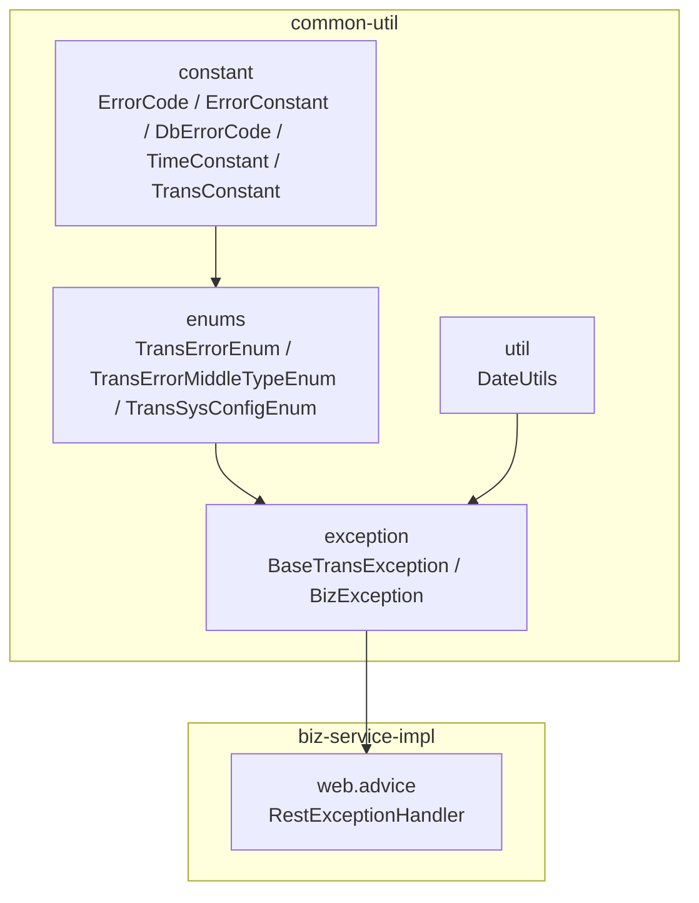
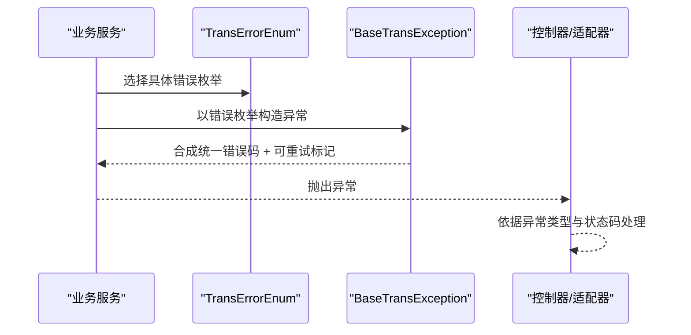
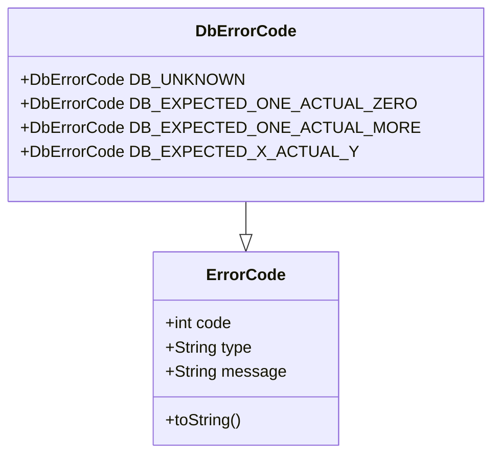
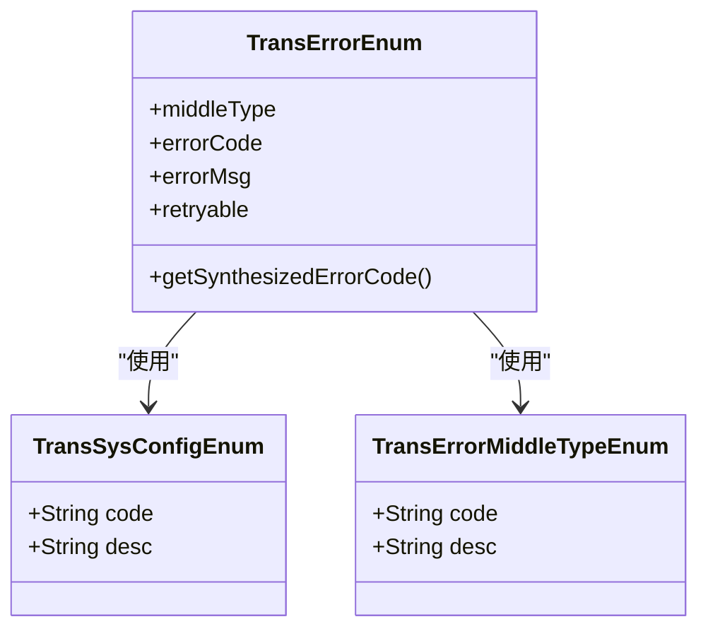
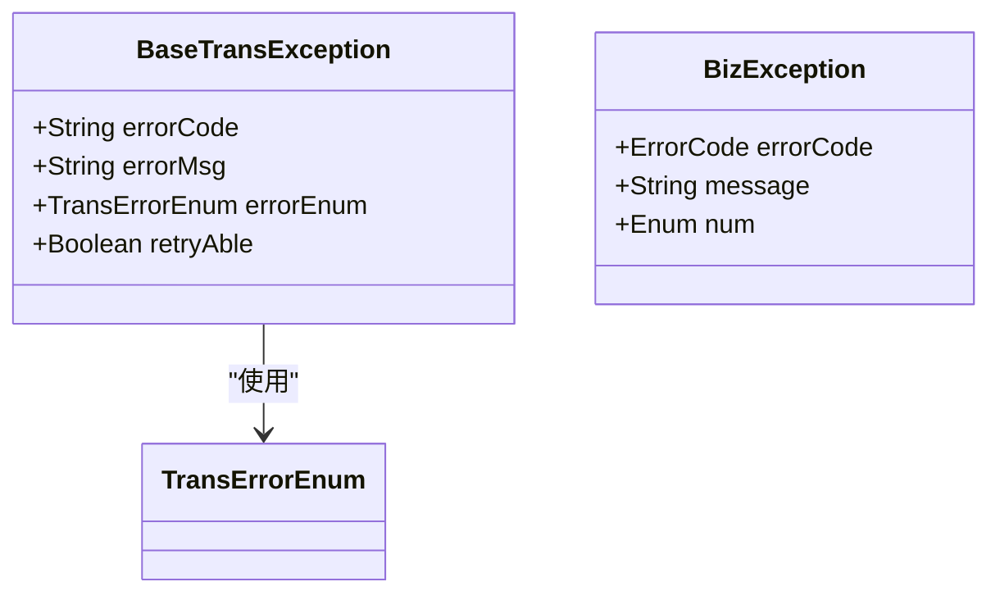
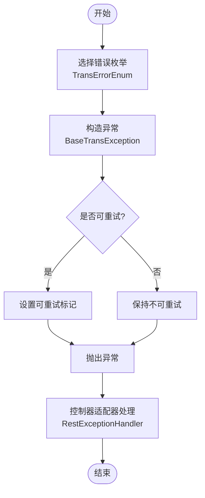
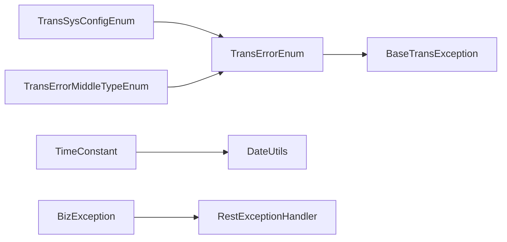

# 常量定义

<cite>
**本文档引用的文件**
- [ErrorCode.java](file://common-util/src/main/java/com/magicliang/transaction/sys/common/constant/ErrorCode.java)
- [ErrorConstant.java](file://common-util/src/main/java/com/magicliang/transaction/sys/common/constant/ErrorConstant.java)
- [DbErrorCode.java](file://common-util/src/main/java/com/magicliang/transaction/sys/common/constant/DbErrorCode.java)
- [TimeConstant.java](file://common-util/src/main/java/com/magicliang/transaction/sys/common/constant/TimeConstant.java)
- [TransConstant.java](file://common-util/src/main/java/com/magicliang/transaction/sys/common/constant/TransConstant.java)
- [TransErrorEnum.java](file://common-util/src/main/java/com/magicliang/transaction/sys/common/enums/TransErrorEnum.java)
- [TransErrorMiddleTypeEnum.java](file://common-util/src/main/java/com/magicliang/transaction/sys/common/enums/TransErrorMiddleTypeEnum.java)
- [TransSysConfigEnum.java](file://common-util/src/main/java/com/magicliang/transaction/sys/common/enums/TransSysConfigEnum.java)
- [BaseTransException.java](file://common-util/src/main/java/com/magicliang/transaction/sys/common/exception/BaseTransException.java)
- [BizException.java](file://common-util/src/main/java/com/magicliang/transaction/sys/common/exception/BizException.java)
- [DateUtils.java](file://common-util/src/main/java/com/magicliang/transaction/sys/common/util/DateUtils.java)
- [RestExceptionHandler.java](file://biz-service-impl/src/main/java/com/magicliang/transaction/sys/biz/service/impl/web/advice/RestExceptionHandler.java)
</cite>

## 目录
1. [简介](#简介)
2. [项目结构](#项目结构)
3. [核心组件](#核心组件)
4. [架构总览](#架构总览)
5. [详细组件分析](#详细组件分析)
6. [依赖关系分析](#依赖关系分析)
7. [性能考量](#性能考量)
8. [故障排查指南](#故障排查指南)
9. [结论](#结论)
10. [附录](#附录)

## 简介
本文件聚焦于 common-util 模块中的常量与错误码体系，系统性梳理以下内容：
- 错误码定义：ErrorCode 错误码对象、ErrorConstant 错误常量、DbErrorCode 数据库错误码
- 交易系统常量：TimeConstant 时间常量、TransConstant 版本常量
- 错误码体系：TransErrorEnum 交易错误枚举、TransErrorMiddleTypeEnum 中间类型枚举、TransSysConfigEnum 系统配置枚举
- 异常体系：BaseTransException 交易异常、BizException 通用业务异常
- 使用最佳实践：命名规范、组织方式、版本管理与可维护性提升
- 实际使用示例：如何在业务层引用与抛出统一的错误码与异常

## 项目结构
common-util 模块按职责划分为常量、枚举、异常与工具四大类，形成“统一错误码 + 统一异常”的基础设施层，支撑上层业务服务。

图表来源
- [ErrorCode.java:1-46](file://common-util/src/main/java/com/magicliang/transaction/sys/common/constant/ErrorCode.java#L1-L46)
- [DbErrorCode.java:1-47](file://common-util/src/main/java/com/magicliang/transaction/sys/common/constant/DbErrorCode.java#L1-L47)
- [TransErrorEnum.java:1-327](file://common-util/src/main/java/com/magicliang/transaction/sys/common/enums/TransErrorEnum.java#L1-L327)
- [BaseTransException.java:1-125](file://common-util/src/main/java/com/magicliang/transaction/sys/common/exception/BaseTransException.java#L1-L125)
- [RestExceptionHandler.java:1-40](file://biz-service-impl/src/main/java/com/magicliang/transaction/sys/biz/service/impl/web/advice/RestExceptionHandler.java#L1-L40)

章节来源
- [ErrorCode.java:1-46](file://common-util/src/main/java/com/magicliang/transaction/sys/common/constant/ErrorCode.java#L1-L46)
- [DbErrorCode.java:1-47](file://common-util/src/main/java/com/magicliang/transaction/sys/common/constant/DbErrorCode.java#L1-L47)
- [TransErrorEnum.java:1-327](file://common-util/src/main/java/com/magicliang/transaction/sys/common/enums/TransErrorEnum.java#L1-L327)
- [BaseTransException.java:1-125](file://common-util/src/main/java/com/magicliang/transaction/sys/common/exception/BaseTransException.java#L1-L125)
- [RestExceptionHandler.java:1-40](file://biz-service-impl/src/main/java/com/magicliang/transaction/sys/biz/service/impl/web/advice/RestExceptionHandler.java#L1-L40)

## 核心组件
- 错误码对象：ErrorCode 提供 code、type、message 的统一载体，便于序列化与传输
- 数据库错误码：DbErrorCode 继承 ErrorCode，提供数据库操作相关的标准错误标识
- 错误常量：ErrorConstant 定义错误提示文案的常量片段，避免魔法字符串
- 时间常量：TimeConstant 定义分钟、默认执行间隔等时间相关常量
- 交易常量：TransConstant 定义初始化版本号等交易域常量
- 交易错误枚举：TransErrorEnum 定义完整的业务/系统错误码，含可重试标记
- 中间类型枚举：TransErrorMiddleTypeEnum 定义“本系统/第二方/第三方”等错误来源分类
- 系统配置枚举：TransSysConfigEnum 定义系统标识（如交易核心、支付宝、微信）
- 交易异常：BaseTransException 基于错误枚举合成统一错误码，支持自定义覆盖
- 通用业务异常：BizException 支持以 ErrorCode 或枚举作为错误载体
- 工具类：DateUtils 提供日期格式化、时间计算等常用能力，内部复用时间常量

章节来源
- [ErrorCode.java:22-44](file://common-util/src/main/java/com/magicliang/transaction/sys/common/constant/ErrorCode.java#L22-L44)
- [DbErrorCode.java:19-46](file://common-util/src/main/java/com/magicliang/transaction/sys/common/constant/DbErrorCode.java#L19-L46)
- [ErrorConstant.java:12-29](file://common-util/src/main/java/com/magicliang/transaction/sys/common/constant/ErrorConstant.java#L12-L29)
- [TimeConstant.java:12-31](file://common-util/src/main/java/com/magicliang/transaction/sys/common/constant/TimeConstant.java#L12-L31)
- [TransConstant.java:12-26](file://common-util/src/main/java/com/magicliang/transaction/sys/common/constant/TransConstant.java#L12-L26)
- [TransErrorEnum.java:22-326](file://common-util/src/main/java/com/magicliang/transaction/sys/common/enums/TransErrorEnum.java#L22-L326)
- [TransErrorMiddleTypeEnum.java:17-77](file://common-util/src/main/java/com/magicliang/transaction/sys/common/enums/TransErrorMiddleTypeEnum.java#L17-L77)
- [TransSysConfigEnum.java:18-82](file://common-util/src/main/java/com/magicliang/transaction/sys/common/enums/TransSysConfigEnum.java#L18-L82)
- [BaseTransException.java:21-124](file://common-util/src/main/java/com/magicliang/transaction/sys/common/exception/BaseTransException.java#L21-L124)
- [BizException.java:22-92](file://common-util/src/main/java/com/magicliang/transaction/sys/common/exception/BizException.java#L22-L92)
- [DateUtils.java:33-59](file://common-util/src/main/java/com/magicliang/transaction/sys/common/util/DateUtils.java#L33-L59)

## 架构总览
统一错误码与异常体系通过“枚举 → 异常 → 控制器适配器”的路径贯穿应用层，确保错误语义清晰、可追踪、可重试控制。

图表来源
- [TransErrorEnum.java:22-326](file://common-util/src/main/java/com/magicliang/transaction/sys/common/enums/TransErrorEnum.java#L22-L326)
- [BaseTransException.java:48-124](file://common-util/src/main/java/com/magicliang/transaction/sys/common/exception/BaseTransException.java#L48-L124)
- [RestExceptionHandler.java:26-38](file://biz-service-impl/src/main/java/com/magicliang/transaction/sys/biz/service/impl/web/advice/RestExceptionHandler.java#L26-L38)

## 详细组件分析

### 错误码对象与数据库错误码
- 设计目的：以对象承载错误码三要素，便于跨进程传递与日志记录
- 命名规范：类名采用名词短语，字段采用驼峰命名；toString 使用反射风格，便于调试
- 使用场景：对外返回、日志打印、异常包装
- 数据库错误码：继承自 ErrorCode，提供数据库层面的标准错误标识，便于区分业务错误与数据访问错误

图表来源
- [ErrorCode.java:22-44](file://common-util/src/main/java/com/magicliang/transaction/sys/common/constant/ErrorCode.java#L22-L44)
- [DbErrorCode.java:19-46](file://common-util/src/main/java/com/magicliang/transaction/sys/common/constant/DbErrorCode.java#L19-L46)

章节来源
- [ErrorCode.java:22-44](file://common-util/src/main/java/com/magicliang/transaction/sys/common/constant/ErrorCode.java#L22-L44)
- [DbErrorCode.java:19-46](file://common-util/src/main/java/com/magicliang/transaction/sys/common/constant/DbErrorCode.java#L19-L46)

### 错误常量
- 设计目的：集中管理错误提示文案片段，避免魔法字符串，提升可维护性
- 命名规范：全大写常量名，单词间以下划线分隔
- 使用场景：校验失败、状态不合法等场景的错误提示拼接

章节来源
- [ErrorConstant.java:12-29](file://common-util/src/main/java/com/magicliang/transaction/sys/common/constant/ErrorConstant.java#L12-L29)

### 时间常量
- 设计目的：统一时间单位与默认调度间隔，减少魔法数字
- 命名规范：全大写常量名，语义明确
- 使用场景：定时任务、过期时间、窗口期计算等

章节来源
- [TimeConstant.java:12-31](file://common-util/src/main/java/com/magicliang/transaction/sys/common/constant/TimeConstant.java#L12-L31)

### 交易常量
- 设计目的：统一版本号等交易域常量
- 命名规范：全大写常量名
- 使用场景：版本迁移、幂等控制、兼容性判断

章节来源
- [TransConstant.java:12-26](file://common-util/src/main/java/com/magicliang/transaction/sys/common/constant/TransConstant.java#L12-L26)

### 交易错误码体系
- 层次结构：
  - TransSysConfigEnum：系统标识（如交易核心、支付宝、微信）
  - TransErrorMiddleTypeEnum：错误来源中间类型（本系统/第二方/第三方及其业务/系统两类）
  - TransErrorEnum：具体错误码，包含错误来源、错误码编号、默认消息、是否可重试
- 分类规则：
  - 本系统业务错误：SELF_BIZ
  - 本系统系统错误：SELF_SYS
  - 第二方业务错误：SECOND_BIZ
  - 第二方系统错误：SECOND_SYS
  - 第三方业务错误：THIRD_BIZ
  - 第三方系统错误：THIRD_SYS
- 合成规则：统一错误码 = 系统标识 + 中间类型 + 具体错误码编号
- 可重试规则：默认不可重试，仅在明确标记为可重试时才允许重试

图表来源
- [TransSysConfigEnum.java:18-82](file://common-util/src/main/java/com/magicliang/transaction/sys/common/enums/TransSysConfigEnum.java#L18-L82)
- [TransErrorMiddleTypeEnum.java:17-77](file://common-util/src/main/java/com/magicliang/transaction/sys/common/enums/TransErrorMiddleTypeEnum.java#L17-L77)
- [TransErrorEnum.java:22-326](file://common-util/src/main/java/com/magicliang/transaction/sys/common/enums/TransErrorEnum.java#L22-L326)

章节来源
- [TransSysConfigEnum.java:18-82](file://common-util/src/main/java/com/magicliang/transaction/sys/common/enums/TransSysConfigEnum.java#L18-L82)
- [TransErrorMiddleTypeEnum.java:17-77](file://common-util/src/main/java/com/magicliang/transaction/sys/common/enums/TransErrorMiddleTypeEnum.java#L17-L77)
- [TransErrorEnum.java:22-326](file://common-util/src/main/java/com/magicliang/transaction/sys/common/enums/TransErrorEnum.java#L22-L326)

### 异常体系
- BaseTransException：基于 TransErrorEnum 合成统一错误码，支持自定义错误码与消息覆盖，并可设置可重试标记
- BizException：通用业务异常，支持以 ErrorCode 或枚举作为错误载体，便于兼容历史错误模型

图表来源
- [BaseTransException.java:21-124](file://common-util/src/main/java/com/magicliang/transaction/sys/common/exception/BaseTransException.java#L21-L124)
- [BizException.java:22-92](file://common-util/src/main/java/com/magicliang/transaction/sys/common/exception/BizException.java#L22-L92)
- [TransErrorEnum.java:22-326](file://common-util/src/main/java/com/magicliang/transaction/sys/common/enums/TransErrorEnum.java#L22-L326)

章节来源
- [BaseTransException.java:21-124](file://common-util/src/main/java/com/magicliang/transaction/sys/common/exception/BaseTransException.java#L21-L124)
- [BizException.java:22-92](file://common-util/src/main/java/com/magicliang/transaction/sys/common/exception/BizException.java#L22-L92)

### 使用流程与最佳实践
- 统一错误码合成：通过 TransErrorEnum.getSynthesizedErrorCode() 生成全局唯一错误码
- 可重试控制：根据业务语义设置 retryable，避免盲目重试
- 文案与常量：结合 ErrorConstant 的文案片段进行错误提示拼接
- 异常抛出：优先使用 BaseTransException，必要时使用 BizException 保持兼容
- 控制器适配：在 RestExceptionHandler 中对 BizException 进行统一响应处理

图表来源
- [TransErrorEnum.java:304-326](file://common-util/src/main/java/com/magicliang/transaction/sys/common/enums/TransErrorEnum.java#L304-L326)
- [BaseTransException.java:102-124](file://common-util/src/main/java/com/magicliang/transaction/sys/common/exception/BaseTransException.java#L102-L124)
- [RestExceptionHandler.java:26-38](file://biz-service-impl/src/main/java/com/magicliang/transaction/sys/biz/service/impl/web/advice/RestExceptionHandler.java#L26-L38)

章节来源
- [TransErrorEnum.java:304-326](file://common-util/src/main/java/com/magicliang/transaction/sys/common/enums/TransErrorEnum.java#L304-L326)
- [BaseTransException.java:102-124](file://common-util/src/main/java/com/magicliang/transaction/sys/common/exception/BaseTransException.java#L102-L124)
- [RestExceptionHandler.java:26-38](file://biz-service-impl/src/main/java/com/magicliang/transaction/sys/biz/service/impl/web/advice/RestExceptionHandler.java#L26-L38)

## 依赖关系分析
- 枚举依赖：TransErrorEnum 依赖 TransSysConfigEnum 与 TransErrorMiddleTypeEnum 进行错误码合成
- 异常依赖：BaseTransException 依赖 TransErrorEnum 生成统一错误码
- 工具依赖：DateUtils 内部使用时间常量进行日期与时间计算
- 控制器依赖：RestExceptionHandler 依赖 BizException 进行统一响应

图表来源
- [TransSysConfigEnum.java:18-82](file://common-util/src/main/java/com/magicliang/transaction/sys/common/enums/TransSysConfigEnum.java#L18-L82)
- [TransErrorMiddleTypeEnum.java:17-77](file://common-util/src/main/java/com/magicliang/transaction/sys/common/enums/TransErrorMiddleTypeEnum.java#L17-L77)
- [TransErrorEnum.java:22-326](file://common-util/src/main/java/com/magicliang/transaction/sys/common/enums/TransErrorEnum.java#L22-L326)
- [BaseTransException.java:102-124](file://common-util/src/main/java/com/magicliang/transaction/sys/common/exception/BaseTransException.java#L102-L124)
- [TimeConstant.java:12-31](file://common-util/src/main/java/com/magicliang/transaction/sys/common/constant/TimeConstant.java#L12-L31)
- [DateUtils.java:33-59](file://common-util/src/main/java/com/magicliang/transaction/sys/common/util/DateUtils.java#L33-L59)
- [BizException.java:22-92](file://common-util/src/main/java/com/magicliang/transaction/sys/common/exception/BizException.java#L22-L92)
- [RestExceptionHandler.java:26-38](file://biz-service-impl/src/main/java/com/magicliang/transaction/sys/biz/service/impl/web/advice/RestExceptionHandler.java#L26-L38)

章节来源
- [TransSysConfigEnum.java:18-82](file://common-util/src/main/java/com/magicliang/transaction/sys/common/enums/TransSysConfigEnum.java#L18-L82)
- [TransErrorMiddleTypeEnum.java:17-77](file://common-util/src/main/java/com/magicliang/transaction/sys/common/enums/TransErrorMiddleTypeEnum.java#L17-L77)
- [TransErrorEnum.java:22-326](file://common-util/src/main/java/com/magicliang/transaction/sys/common/enums/TransErrorEnum.java#L22-L326)
- [BaseTransException.java:102-124](file://common-util/src/main/java/com/magicliang/transaction/sys/common/exception/BaseTransException.java#L102-L124)
- [TimeConstant.java:12-31](file://common-util/src/main/java/com/magicliang/transaction/sys/common/constant/TimeConstant.java#L12-L31)
- [DateUtils.java:33-59](file://common-util/src/main/java/com/magicliang/transaction/sys/common/util/DateUtils.java#L33-L59)
- [BizException.java:22-92](file://common-util/src/main/java/com/magicliang/transaction/sys/common/exception/BizException.java#L22-L92)
- [RestExceptionHandler.java:26-38](file://biz-service-impl/src/main/java/com/magicliang/transaction/sys/biz/service/impl/web/advice/RestExceptionHandler.java#L26-L38)

## 性能考量
- 错误码合成：枚举合成字符串开销极低，适合高频调用
- 异常栈捕获：仅在异常分支产生，避免在正常路径引入额外成本
- 工具类时间计算：使用 Calendar 与 SimpleDateFormat，注意并发安全与格式化开销，建议在热点路径复用格式器或改用现代时间 API

## 故障排查指南
- 错误码不一致：检查 TransErrorEnum.getSynthesizedErrorCode() 的合成逻辑，确认系统标识与中间类型编码正确
- 可重试误判：核对错误枚举的 retryable 字段，避免对不可重试错误进行重复处理
- 文案拼接问题：使用 ErrorConstant 的常量片段，避免硬编码
- 响应不一致：在 RestExceptionHandler 中对 BizException 进行统一处理，确保返回结构一致

章节来源
- [TransErrorEnum.java:304-326](file://common-util/src/main/java/com/magicliang/transaction/sys/common/enums/TransErrorEnum.java#L304-L326)
- [BaseTransException.java:102-124](file://common-util/src/main/java/com/magicliang/transaction/sys/common/exception/BaseTransException.java#L102-L124)
- [ErrorConstant.java:12-29](file://common-util/src/main/java/com/magicliang/transaction/sys/common/constant/ErrorConstant.java#L12-L29)
- [RestExceptionHandler.java:26-38](file://biz-service-impl/src/main/java/com/magicliang/transaction/sys/biz/service/impl/web/advice/RestExceptionHandler.java#L26-L38)

## 结论
通过统一的常量与错误码体系，common-util 模块实现了：
- 明确的错误语义与可追踪性
- 可重试控制与版本演进能力
- 良好的可维护性与扩展性
在实际开发中，建议严格遵循命名规范与使用流程，确保错误处理的一致性与可靠性。

## 附录
- 命名规范
  - 常量类：全大写 + 下划线分隔（如 TIME_CONSTANT）
  - 错误码对象：驼峰命名（如 errorCode）
  - 枚举：全大写 + 下划线分隔（如 ERROR_TYPE_ENUM）
- 组织方式
  - 常量类集中于 constant 包，枚举集中于 enums 包，异常集中于 exception 包
  - 工具类集中于 util 包，避免与业务逻辑耦合
- 版本管理
  - 通过 TransConstant 管理版本号，配合 TransErrorEnum 的系统标识与中间类型，确保错误码的向后兼容与演进