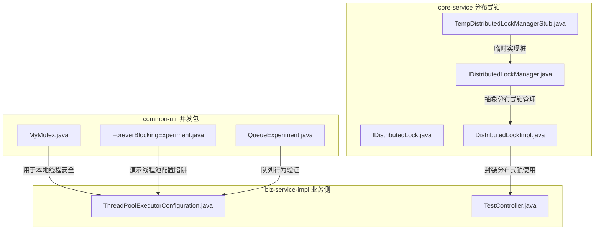
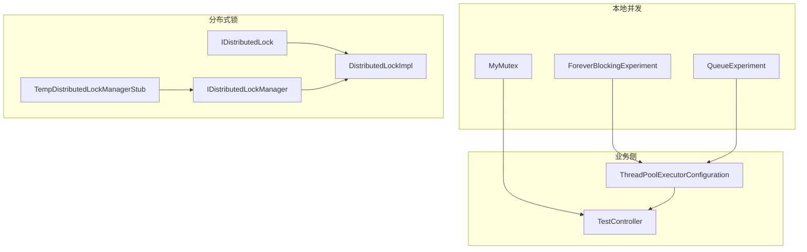
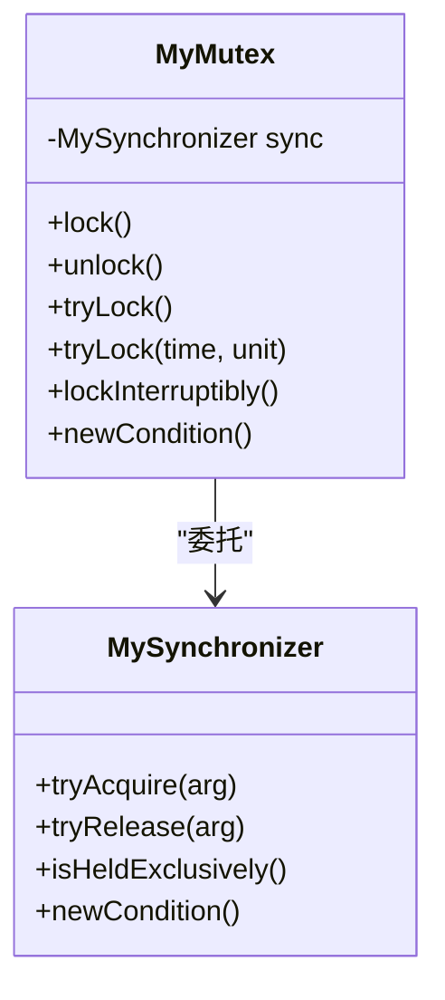
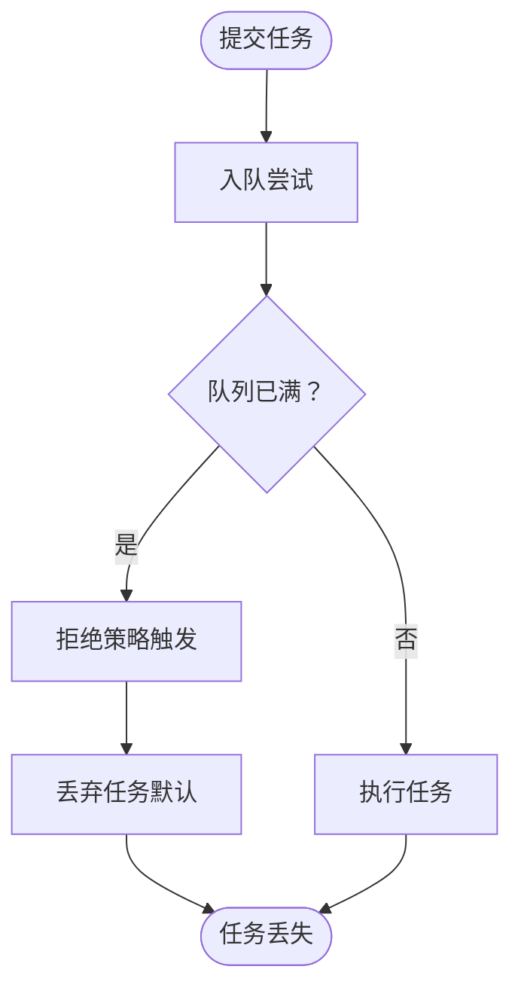
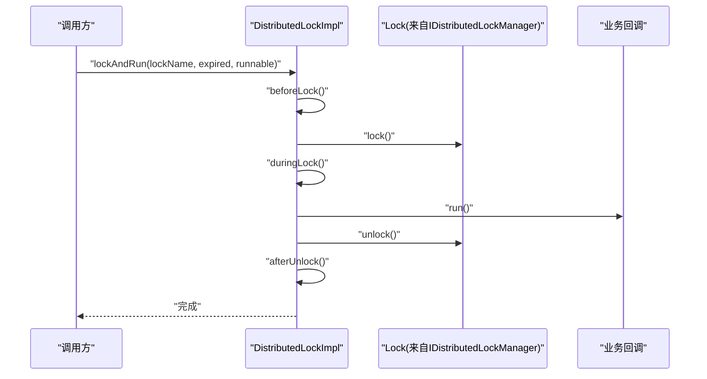
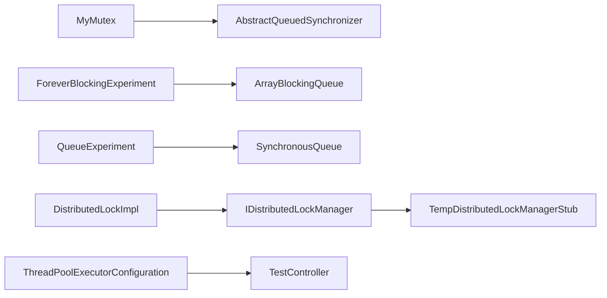

# 并发工具

<cite>
**本文引用的文件**   
- [MyMutex.java](file://common-util/src/main/java/com/magicliang/transaction/sys/common/concurrent/lock/MyMutex.java)
- [ForeverBlockingExperiment.java](file://common-util/src/main/java/com/magicliang/transaction/sys/common/concurrent/ForeverBlockingExperiment.java)
- [QueueExperiment.java](file://common-util/src/main/java/com/magicliang/transaction/sys/common/concurrent/QueueExperiment.java)
- [MyMutexTest.java](file://common-util/src/test/java/com/magicliang/transaction/sys/common/concurrent/lock/MyMutexTest.java)
- [LockTest.java](file://common-util/src/test/java/com/magicliang/transaction/sys/common/concurrent/lock/LockTest.java)
- [SemaphoreTest.java](file://common-util/src/test/java/com/magicliang/transaction/sys/common/concurrent/lock/SemaphoreTest.java)
- [ThreadPoolExecutorConfiguration.java](file://biz-service-impl/src/main/java/com/magicliang/transaction/sys/biz/service/impl/web/config/ThreadPoolExecutorConfiguration.java)
- [TestController.java](file://biz-service-impl/src/main/java/com/magicliang/transaction/sys/biz/service/impl/web/controller/TestController.java)
- [IDistributedLock.java](file://core-service/src/main/java/com/magicliang/transaction/sys/core/service/IDistributedLock.java)
- [DistributedLockImpl.java](file://core-service/src/main/java/com/magicliang/transaction/sys/core/service/impl/DistributedLockImpl.java)
- [IDistributedLockManager.java](file://core-service/src/main/java/com/magicliang/transaction/sys/core/manager/IDistributedLockManager.java)
- [TempDistributedLockManagerStub.java](file://core-service/src/main/java/com/magicliang/transaction/sys/core/manager/impl/TempDistributedLockManagerStub.java)
- [CollectionUtilPlus.java](file://common-util/src/main/java/com/magicliang/transaction/sys/common/util/CollectionUtilPlus.java)
- [ObjectUtilPlus.java](file://common-util/src/main/java/com/magicliang/transaction/sys/common/util/ObjectUtilPlus.java)
- [MathUtil.java](file://common-util/src/main/java/com/magicliang/transaction/sys/common/util/MathUtil.java)
- [AssertUtils.java](file://common-util/src/main/java/com/magicliang/transaction/sys/common/util/AssertUtils.java)
</cite>

## 目录
1. [简介](#简介)
2. [项目结构](#项目结构)
3. [核心组件](#核心组件)
4. [架构总览](#架构总览)
5. [详细组件分析](#详细组件分析)
6. [依赖分析](#依赖分析)
7. [性能考量](#性能考量)
8. [故障排查指南](#故障排查指南)
9. [结论](#结论)
10. [附录](#附录)

## 简介
本章节概述并发工具模块的目标与范围，重点覆盖 common-util 中的互斥锁实现、阻塞实验与队列实验，以及与分布式锁服务的衔接。文档旨在帮助读者理解如何通过这些工具实现线程安全、资源管理与同步控制，并给出最佳实践与使用示例，同时阐明本地互斥锁与分布式锁的差异与联系。

## 项目结构
并发工具模块位于 common-util 工程的并发包下，包含：
- 互斥锁实现：MyMutex（基于 AQS 的自定义互斥锁）
- 阻塞实验：ForeverBlockingExperiment（演示有缺陷的线程池配置）
- 队列实验：QueueExperiment（对同步队列行为的探索）

此外，核心服务层提供分布式锁接口与实现，业务侧提供线程池配置与异步接口示例，便于在高并发场景中组合使用。

**图表来源**
- [MyMutex.java:1-385](file://common-util/src/main/java/com/magicliang/transaction/sys/common/concurrent/lock/MyMutex.java#L1-L385)
- [ForeverBlockingExperiment.java:1-108](file://common-util/src/main/java/com/magicliang/transaction/sys/common/concurrent/ForeverBlockingExperiment.java#L1-L108)
- [QueueExperiment.java:1-36](file://common-util/src/main/java/com/magicliang/transaction/sys/common/concurrent/QueueExperiment.java#L1-L36)
- [IDistributedLock.java:1-98](file://core-service/src/main/java/com/magicliang/transaction/sys/core/service/IDistributedLock.java#L1-L98)
- [DistributedLockImpl.java:1-275](file://core-service/src/main/java/com/magicliang/transaction/sys/core/service/impl/DistributedLockImpl.java#L1-L275)
- [IDistributedLockManager.java:1-42](file://core-service/src/main/java/com/magicliang/transaction/sys/core/manager/IDistributedLockManager.java#L1-L42)
- [TempDistributedLockManagerStub.java:1-55](file://core-service/src/main/java/com/magicliang/transaction/sys/core/manager/impl/TempDistributedLockManagerStub.java#L1-L55)
- [ThreadPoolExecutorConfiguration.java:1-52](file://biz-service-impl/src/main/java/com/magicliang/transaction/sys/biz/service/impl/web/config/ThreadPoolExecutorConfiguration.java#L1-L52)
- [TestController.java:1-241](file://biz-service-impl/src/main/java/com/magicliang/transaction/sys/biz/service/impl/web/controller/TestController.java#L1-L241)

**章节来源**
- [MyMutex.java:1-385](file://common-util/src/main/java/com/magicliang/transaction/sys/common/concurrent/lock/MyMutex.java#L1-L385)
- [ForeverBlockingExperiment.java:1-108](file://common-util/src/main/java/com/magicliang/transaction/sys/common/concurrent/ForeverBlockingExperiment.java#L1-L108)
- [QueueExperiment.java:1-36](file://common-util/src/main/java/com/magicliang/transaction/sys/common/concurrent/QueueExperiment.java#L1-L36)
- [ThreadPoolExecutorConfiguration.java:1-52](file://biz-service-impl/src/main/java/com/magicliang/transaction/sys/biz/service/impl/web/config/ThreadPoolExecutorConfiguration.java#L1-L52)
- [TestController.java:1-241](file://biz-service-impl/src/main/java/com/magicliang/transaction/sys/biz/service/impl/web/controller/TestController.java#L1-L241)
- [IDistributedLock.java:1-98](file://core-service/src/main/java/com/magicliang/transaction/sys/core/service/IDistributedLock.java#L1-L98)
- [DistributedLockImpl.java:1-275](file://core-service/src/main/java/com/magicliang/transaction/sys/core/service/impl/DistributedLockImpl.java#L1-L275)
- [IDistributedLockManager.java:1-42](file://core-service/src/main/java/com/magicliang/transaction/sys/core/manager/IDistributedLockManager.java#L1-L42)
- [TempDistributedLockManagerStub.java:1-55](file://core-service/src/main/java/com/magicliang/transaction/sys/core/manager/impl/TempDistributedLockManagerStub.java#L1-L55)

## 核心组件
- MyMutex：基于 AQS 的不可重入互斥锁实现，提供 lock、unlock、tryLock、newCondition 等标准锁能力，强调“独占持有”语义与条件等待。
- ForeverBlockingExperiment：演示使用有界 ArrayBlockingQueue 的线程池在饱和时的阻塞行为，指出默认拒绝策略可能导致任务永久等待的问题。
- QueueExperiment：对同步队列（如 SynchronousQueue）行为进行实验性探索，辅助理解不同队列在吞吐与背压上的差异。
- 分布式锁服务：通过 IDistributedLock 接口与 DistributedLockImpl 实现，封装分布式锁获取、加锁执行、可中断加锁、计时试锁等能力，配合 IDistributedLockManager 抽象实现。

**章节来源**
- [MyMutex.java:20-247](file://common-util/src/main/java/com/magicliang/transaction/sys/common/concurrent/lock/MyMutex.java#L20-L247)
- [ForeverBlockingExperiment.java:36-67](file://common-util/src/main/java/com/magicliang/transaction/sys/common/concurrent/ForeverBlockingExperiment.java#L36-L67)
- [QueueExperiment.java:17-34](file://common-util/src/main/java/com/magicliang/transaction/sys/common/concurrent/QueueExperiment.java#L17-L34)
- [IDistributedLock.java:16-98](file://core-service/src/main/java/com/magicliang/transaction/sys/core/service/IDistributedLock.java#L16-L98)
- [DistributedLockImpl.java:41-237](file://core-service/src/main/java/com/magicliang/transaction/sys/core/service/impl/DistributedLockImpl.java#L41-L237)

## 架构总览
并发工具在应用中的角色与交互如下：
- 本地并发控制：MyMutex 提供轻量级线程安全；ForeverBlockingExperiment 与 QueueExperiment 用于验证线程池与队列行为。
- 异步与线程池：业务侧通过 ThreadPoolExecutorConfiguration 提供统一的线程池 Bean，TestController 展示异步接口。
- 分布式锁：core-service 层通过 IDistributedLock 与 DistributedLockImpl 封装分布式锁使用，IDistributedLockManager 抽象底层引擎，TempDistributedLockManagerStub 作为临时桩实现。

**图表来源**
- [MyMutex.java:1-385](file://common-util/src/main/java/com/magicliang/transaction/sys/common/concurrent/lock/MyMutex.java#L1-L385)
- [ForeverBlockingExperiment.java:1-108](file://common-util/src/main/java/com/magicliang/transaction/sys/common/concurrent/ForeverBlockingExperiment.java#L1-L108)
- [QueueExperiment.java:1-36](file://common-util/src/main/java/com/magicliang/transaction/sys/common/concurrent/QueueExperiment.java#L1-L36)
- [ThreadPoolExecutorConfiguration.java:1-52](file://biz-service-impl/src/main/java/com/magicliang/transaction/sys/biz/service/impl/web/config/ThreadPoolExecutorConfiguration.java#L1-L52)
- [TestController.java:1-241](file://biz-service-impl/src/main/java/com/magicliang/transaction/sys/biz/service/impl/web/controller/TestController.java#L1-L241)
- [IDistributedLock.java:1-98](file://core-service/src/main/java/com/magicliang/transaction/sys/core/service/IDistributedLock.java#L1-L98)
- [DistributedLockImpl.java:1-275](file://core-service/src/main/java/com/magicliang/transaction/sys/core/service/impl/DistributedLockImpl.java#L1-L275)
- [IDistributedLockManager.java:1-42](file://core-service/src/main/java/com/magicliang/transaction/sys/core/manager/IDistributedLockManager.java#L1-L42)
- [TempDistributedLockManagerStub.java:1-55](file://core-service/src/main/java/com/magicliang/transaction/sys/core/manager/impl/TempDistributedLockManagerStub.java#L1-L55)

## 详细组件分析

### MyMutex 互斥锁实现
- 设计目的：通过最小化实现展示 AQS 的核心机制，强调“独占持有”与“不可重入”的互斥语义，便于教学与验证。
- 实现原理：
  - 外层 Lock 接口委托给内部 MySynchronizer（继承 AQS），仅支持独占模式。
  - tryAcquire 仅在状态为 0 且 CAS 成功时获取；tryRelease 要求当前线程持有且状态非 0，随后释放。
  - isHeldExclusively 保证仅持有线程可释放，避免错误释放。
  - newCondition 返回 AQS 内置 ConditionObject，支持条件等待与唤醒。
- 使用场景：
  - 单实例资源保护（如单实例配置更新、全局计数器）。
  - 作为 AQS 学习与二次开发的基础模板。
- 注意事项：
  - 不可重入，嵌套获取会失败。
  - 释放必须由持有线程完成，否则抛出非法监视器状态异常。

**图表来源**
- [MyMutex.java:20-247](file://common-util/src/main/java/com/magicliang/transaction/sys/common/concurrent/lock/MyMutex.java#L20-L247)
- [MyMutex.java:260-383](file://common-util/src/main/java/com/magicliang/transaction/sys/common/concurrent/lock/MyMutex.java#L260-L383)

**章节来源**
- [MyMutex.java:20-247](file://common-util/src/main/java/com/magicliang/transaction/sys/common/concurrent/lock/MyMutex.java#L20-L247)
- [MyMutexTest.java:24-56](file://common-util/src/test/java/com/magicliang/transaction/sys/common/concurrent/lock/MyMutexTest.java#L24-L56)

### ForeverBlockingExperiment 阻塞实验
- 设计目的：演示在使用 ArrayBlockingQueue 时，若拒绝策略不当，可能导致任务在饱和状态下永久等待。
- 关键点：
  - 使用固定容量的 ArrayBlockingQueue 构造线程池。
  - 默认拒绝策略为丢弃（DiscardPolicy），导致后续任务无法被执行。
  - 该实验警示在高并发场景下应选择合适的拒绝策略（如 CallerRunsPolicy）或扩大队列/线程池容量。
- 使用建议：
  - 生产环境优先考虑 CallerRunsPolicy 或根据业务降级策略定制拒绝处理。
  - 结合监控指标（队列长度、活跃线程数、拒绝次数）动态调整线程池参数。

**图表来源**
- [ForeverBlockingExperiment.java:36-67](file://common-util/src/main/java/com/magicliang/transaction/sys/common/concurrent/ForeverBlockingExperiment.java#L36-L67)

**章节来源**
- [ForeverBlockingExperiment.java:36-67](file://common-util/src/main/java/com/magicliang/transaction/sys/common/concurrent/ForeverBlockingExperiment.java#L36-L67)

### QueueExperiment 队列实验
- 设计目的：通过实验性注释与示例，验证同步队列（如 SynchronousQueue）在 offer/transfer 场景下的行为特征，辅助理解不同队列的吞吐与背压特性。
- 关键观察：
  - 同步队列在 offer 时若无匹配消费者，通常返回失败，从而促使创建非核心线程。
  - 该行为有助于在高并发下快速扩展线程，但也需关注线程数量与上下文切换成本。
- 使用建议：
  - 对于强一致的“生产者-消费者”配对场景，优先考虑同步队列。
  - 对于缓冲与削峰填谷需求，可结合有界队列与合理的线程池参数。

**章节来源**
- [QueueExperiment.java:17-34](file://common-util/src/main/java/com/magicliang/transaction/sys/common/concurrent/QueueExperiment.java#L17-L34)

### 分布式锁服务（IDistributedLock 与 DistributedLockImpl）
- 设计目的：在分布式环境下提供统一的加锁与执行模型，屏蔽底层引擎差异，支持多种加锁策略与回调封装。
- 核心能力：
  - getLock：按名称与过期时间获取锁实例。
  - lockAndCall/lockAndRun：加锁后执行回调，自动处理异常与释放。
  - tryLock：支持“试锁”“计时试锁”“可中断阻塞”等多种策略。
  - 生命周期钩子：beforeLock、duringLock、afterUnlock、elseDo，便于埋点与可观测性。
- 与本地互斥锁的关系：
  - 本地锁（MyMutex）适用于单 JVM 内部资源保护。
  - 分布式锁适用于跨进程、跨节点的资源一致性控制。
- 最佳实践：
  - 明确锁粒度与作用域，避免长事务持锁。
  - 合理设置过期时间与重试策略，防止死锁与脑裂。
  - 使用 tryLock 与计时 tryLock 降低阻塞风险，必要时提供降级分支。

**图表来源**
- [DistributedLockImpl.java:94-112](file://core-service/src/main/java/com/magicliang/transaction/sys/core/service/impl/DistributedLockImpl.java#L94-L112)

**章节来源**
- [IDistributedLock.java:16-98](file://core-service/src/main/java/com/magicliang/transaction/sys/core/service/IDistributedLock.java#L16-L98)
- [DistributedLockImpl.java:41-237](file://core-service/src/main/java/com/magicliang/transaction/sys/core/service/impl/DistributedLockImpl.java#L41-L237)
- [IDistributedLockManager.java:15-42](file://core-service/src/main/java/com/magicliang/transaction/sys/core/manager/IDistributedLockManager.java#L15-L42)
- [TempDistributedLockManagerStub.java:20-55](file://core-service/src/main/java/com/magicliang/transaction/sys/core/manager/impl/TempDistributedLockManagerStub.java#L20-L55)

### 线程池配置与异步处理
- 线程池配置：通过 ThreadPoolExecutorConfiguration 提供统一的线程池 Bean，设置核心/最大线程数、队列容量、存活时间与拒绝策略。
- 异步接口：TestController 展示基于 CompletableFuture 的异步响应，便于在高并发场景下提升吞吐与延迟表现。
- 最佳实践：
  - 队列容量与拒绝策略需结合业务峰值与 SLA 设定。
  - 异步接口应与同步接口协同，避免阻塞关键路径。
  - 结合监控指标（排队时延、执行时延、拒绝率）持续优化。

**章节来源**
- [ThreadPoolExecutorConfiguration.java:29-50](file://biz-service-impl/src/main/java/com/magicliang/transaction/sys/biz/service/impl/web/config/ThreadPoolExecutorConfiguration.java#L29-L50)
- [TestController.java:102-105](file://biz-service-impl/src/main/java/com/magicliang/transaction/sys/biz/service/impl/web/controller/TestController.java#L102-L105)

## 依赖分析
- MyMutex 依赖 AQS 抽象同步器，实现独占锁语义，耦合度低，内聚性强。
- ForeverBlockingExperiment 与 QueueExperiment 为实验性代码，依赖 JDK 并发容器，不引入外部依赖。
- 分布式锁服务通过接口与实现分离，IDistributedLockManager 抽象底层引擎，便于替换与扩展。
- 业务侧线程池配置与异步接口与并发工具形成互补，共同支撑高并发场景。

**图表来源**
- [MyMutex.java:1-385](file://common-util/src/main/java/com/magicliang/transaction/sys/common/concurrent/lock/MyMutex.java#L1-L385)
- [ForeverBlockingExperiment.java:1-108](file://common-util/src/main/java/com/magicliang/transaction/sys/common/concurrent/ForeverBlockingExperiment.java#L1-L108)
- [QueueExperiment.java:1-36](file://common-util/src/main/java/com/magicliang/transaction/sys/common/concurrent/QueueExperiment.java#L1-L36)
- [DistributedLockImpl.java:1-275](file://core-service/src/main/java/com/magicliang/transaction/sys/core/service/impl/DistributedLockImpl.java#L1-L275)
- [IDistributedLockManager.java:1-42](file://core-service/src/main/java/com/magicliang/transaction/sys/core/manager/IDistributedLockManager.java#L1-L42)
- [TempDistributedLockManagerStub.java:1-55](file://core-service/src/main/java/com/magicliang/transaction/sys/core/manager/impl/TempDistributedLockManagerStub.java#L1-L55)
- [ThreadPoolExecutorConfiguration.java:1-52](file://biz-service-impl/src/main/java/com/magicliang/transaction/sys/biz/service/impl/web/config/ThreadPoolExecutorConfiguration.java#L1-L52)
- [TestController.java:1-241](file://biz-service-impl/src/main/java/com/magicliang/transaction/sys/biz/service/impl/web/controller/TestController.java#L1-L241)

**章节来源**
- [MyMutex.java:1-385](file://common-util/src/main/java/com/magicliang/transaction/sys/common/concurrent/lock/MyMutex.java#L1-L385)
- [ForeverBlockingExperiment.java:1-108](file://common-util/src/main/java/com/magicliang/transaction/sys/common/concurrent/ForeverBlockingExperiment.java#L1-L108)
- [QueueExperiment.java:1-36](file://common-util/src/main/java/com/magicliang/transaction/sys/common/concurrent/QueueExperiment.java#L1-L36)
- [DistributedLockImpl.java:1-275](file://core-service/src/main/java/com/magicliang/transaction/sys/core/service/impl/DistributedLockImpl.java#L1-L275)
- [IDistributedLockManager.java:1-42](file://core-service/src/main/java/com/magicliang/transaction/sys/core/manager/IDistributedLockManager.java#L1-L42)
- [TempDistributedLockManagerStub.java:1-55](file://core-service/src/main/java/com/magicliang/transaction/sys/core/manager/impl/TempDistributedLockManagerStub.java#L1-L55)
- [ThreadPoolExecutorConfiguration.java:1-52](file://biz-service-impl/src/main/java/com/magicliang/transaction/sys/biz/service/impl/web/config/ThreadPoolExecutorConfiguration.java#L1-L52)
- [TestController.java:1-241](file://biz-service-impl/src/main/java/com/magicliang/transaction/sys/biz/service/impl/web/controller/TestController.java#L1-L241)

## 性能考量
- 线程池参数调优：核心线程数、最大线程数、队列容量与存活时间需结合请求特征与硬件资源设定；拒绝策略直接影响吞吐与延迟。
- 队列选择：同步队列适合强一致配对场景；有界队列适合削峰填谷；无界队列存在内存压力风险。
- 锁竞争控制：尽量缩小临界区、减少锁持有时间；优先使用 tryLock 与计时 tryLock 降低阻塞概率。
- 分布式锁：合理设置过期时间与重试间隔，避免热点竞争；结合业务降级策略，防止雪崩效应。
- 异步化：将耗时操作异步化，配合线程池与限流策略，提升整体吞吐。

## 故障排查指南
- 线程池饱和阻塞：
  - 现象：任务提交后无响应，队列长度达到上限。
  - 排查：检查拒绝策略与队列容量；确认是否存在长时间运行的任务占用线程。
  - 处置：调整拒绝策略为 CallerRunsPolicy 或扩容线程池；优化任务执行时长。
- 分布式锁异常：
  - 现象：加锁失败、超时、死锁或脑裂。
  - 排查：核对锁名、过期时间与重试策略；检查异常日志与生命周期钩子输出。
  - 处置：缩短临界区、增加重试间隔、引入幂等与补偿机制。
- 条件等待与中断：
  - 现象：线程在 await/lockInterruptibly 中未按预期退出。
  - 排查：确认中断状态与 AQS park/unpark 行为；避免在阻塞 API 上误判中断。
  - 处置：在外部频繁中断并观察线程状态，确保 finally 释放锁。

**章节来源**
- [ForeverBlockingExperiment.java:36-67](file://common-util/src/main/java/com/magicliang/transaction/sys/common/concurrent/ForeverBlockingExperiment.java#L36-L67)
- [DistributedLockImpl.java:244-273](file://core-service/src/main/java/com/magicliang/transaction/sys/core/service/impl/DistributedLockImpl.java#L244-L273)
- [LockTest.java:32-143](file://common-util/src/test/java/com/magicliang/transaction/sys/common/concurrent/lock/LockTest.java#L32-L143)

## 结论
并发工具模块通过 MyMutex、ForeverBlockingExperiment、QueueExperiment 与分布式锁服务，构建了从本地互斥到分布式一致性的完整工具链。结合业务侧线程池配置与异步接口，可在高并发场景下实现高效、稳定与可观测的并发控制。实践中应重视锁粒度、队列选择、线程池参数与拒绝策略，以及分布式锁的过期与重试策略，以获得最佳性能与可靠性。

## 附录
- 实用工具类（与并发相关）：
  - 集合工具：CollectionUtilPlus 提供集合相等性判断增强。
  - 对象工具：ObjectUtilPlus 提供空值判定工具。
  - 断言工具：AssertUtils 提供统一断言入口，便于在并发场景下快速失败与定位问题。
  - 数学工具：MathUtil 提供通用数学运算辅助（与并发无直接关联，但可用于统计与采样）。

**章节来源**
- [CollectionUtilPlus.java:15-34](file://common-util/src/main/java/com/magicliang/transaction/sys/common/util/CollectionUtilPlus.java#L15-L34)
- [ObjectUtilPlus.java:12-43](file://common-util/src/main/java/com/magicliang/transaction/sys/common/util/ObjectUtilPlus.java#L12-L43)
- [AssertUtils.java:19-108](file://common-util/src/main/java/com/magicliang/transaction/sys/common/util/AssertUtils.java#L19-L108)
- [MathUtil.java:15-68](file://common-util/src/main/java/com/magicliang/transaction/sys/common/util/MathUtil.java#L15-L68)