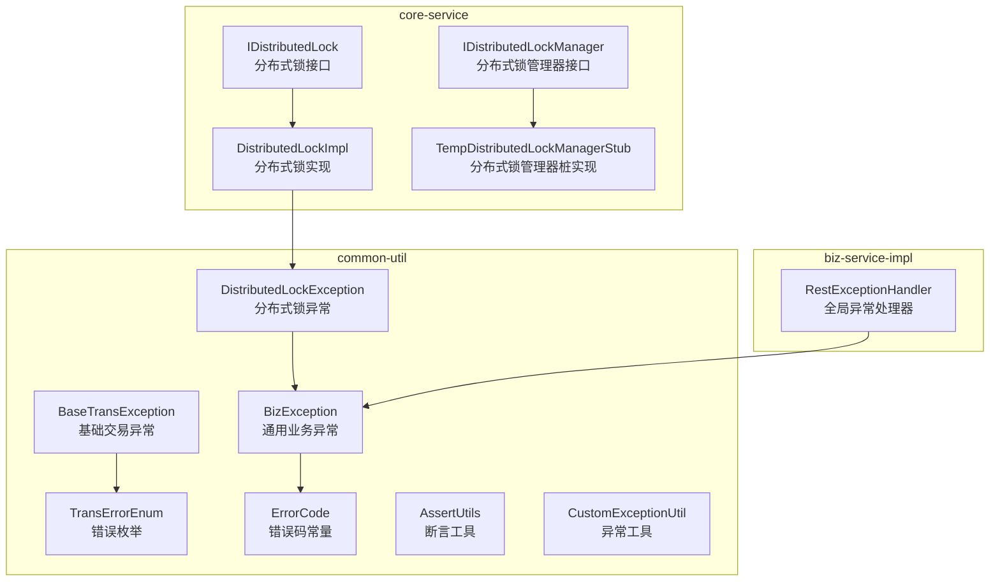
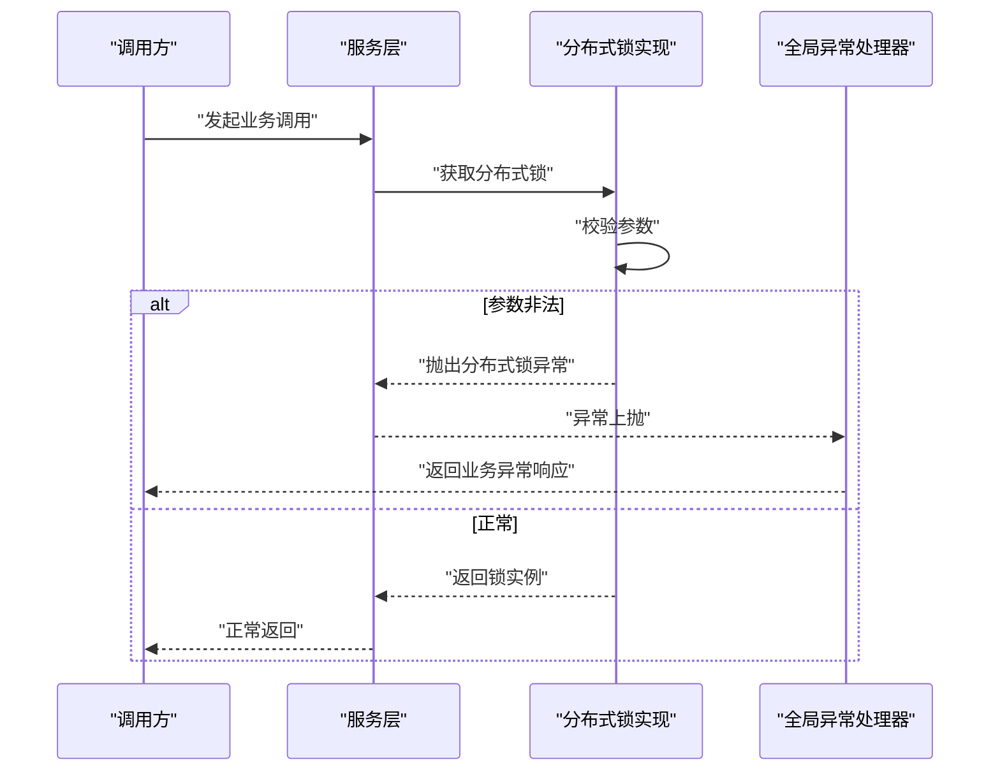
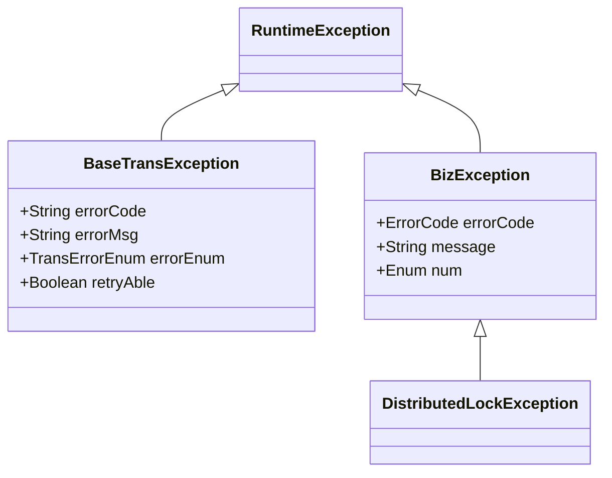
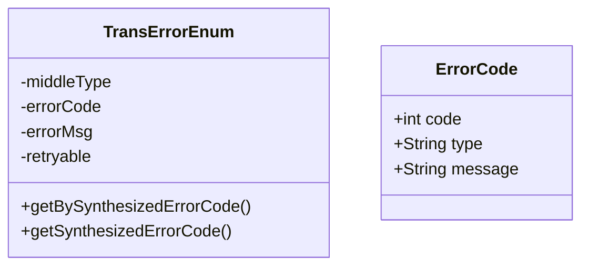
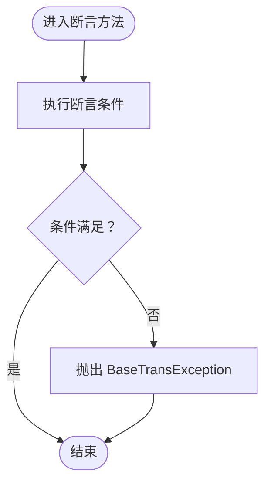
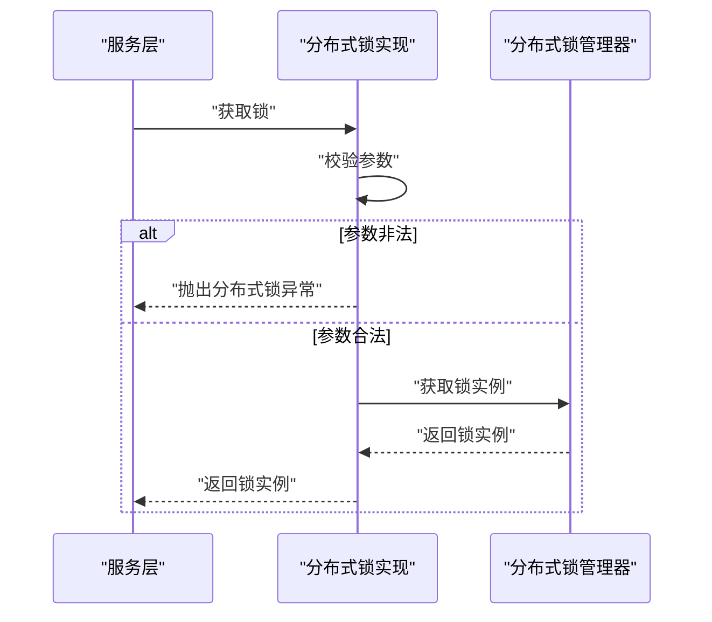
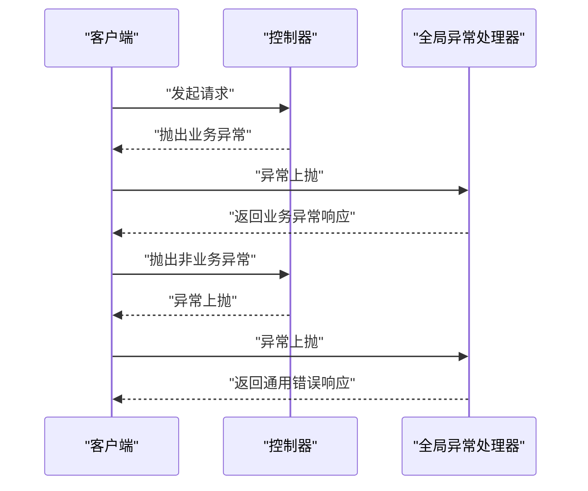
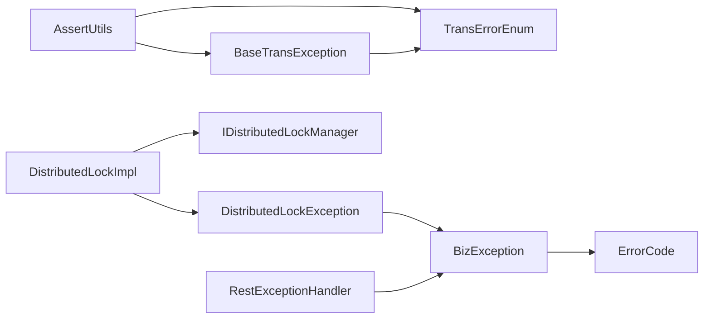

# 异常处理

<cite>
**本文引用的文件**
- [BaseTransException.java](file://common-util/src/main/java/com/magicliang/transaction/sys/common/exception/BaseTransException.java)
- [BizException.java](file://common-util/src/main/java/com/magicliang/transaction/sys/common/exception/BizException.java)
- [DistributedLockException.java](file://common-util/src/main/java/com/magicliang/transaction/sys/common/exception/DistributedLockException.java)
- [TransErrorEnum.java](file://common-util/src/main/java/com/magicliang/transaction/sys/common/enums/TransErrorEnum.java)
- [ErrorCode.java](file://common-util/src/main/java/com/magicliang/transaction/sys/common/constant/ErrorCode.java)
- [AssertUtils.java](file://common-util/src/main/java/com/magicliang/transaction/sys/common/util/AssertUtils.java)
- [CustomExceptionUtil.java](file://common-util/src/main/java/com/magicliang/transaction/sys/common/util/CustomExceptionUtil.java)
- [IDistributedLock.java](file://core-service/src/main/java/com/magicliang/transaction/sys/core/service/IDistributedLock.java)
- [DistributedLockImpl.java](file://core-service/src/main/java/com/magicliang/transaction/sys/core/service/impl/DistributedLockImpl.java)
- [IDistributedLockManager.java](file://core-service/src/main/java/com/magicliang/transaction/sys/core/manager/IDistributedLockManager.java)
- [TempDistributedLockManagerStub.java](file://core-service/src/main/java/com/magicliang/transaction/sys/core/manager/impl/TempDistributedLockManagerStub.java)
- [RestExceptionHandler.java](file://biz-service-impl/src/main/java/com/magicliang/transaction/sys/biz/service/impl/web/advice/RestExceptionHandler.java)
</cite>

## 目录
1. [简介](#简介)
2. [项目结构](#项目结构)
3. [核心组件](#核心组件)
4. [架构总览](#架构总览)
5. [详细组件分析](#详细组件分析)
6. [依赖分析](#依赖分析)
7. [性能考虑](#性能考虑)
8. [故障排查指南](#故障排查指南)
9. [结论](#结论)
10. [附录](#附录)

## 简介
本章节面向“common-util”模块中的异常处理体系，系统化梳理异常类的层次结构、继承关系与使用场景，并结合断言工具、分布式锁异常与Web层统一异常处理，给出异常处理的最佳实践与落地建议。目标是帮助开发者在不同层次（领域、服务、Web）正确使用异常，提升系统的健壮性与可维护性。

## 项目结构
异常处理相关代码主要分布在以下位置：
- common-util：异常基础类、断言工具、错误码与错误枚举
- core-service：分布式锁服务与管理器，内部使用分布式锁异常
- biz-service-impl：Web层统一异常处理器，对业务异常进行统一响应

图表来源
- [BaseTransException.java:1-125](file://common-util/src/main/java/com/magicliang/transaction/sys/common/exception/BaseTransException.java#L1-L125)
- [BizException.java:1-93](file://common-util/src/main/java/com/magicliang/transaction/sys/common/exception/BizException.java#L1-L93)
- [DistributedLockException.java:1-32](file://common-util/src/main/java/com/magicliang/transaction/sys/common/exception/DistributedLockException.java#L1-L32)
- [TransErrorEnum.java:1-327](file://common-util/src/main/java/com/magicliang/transaction/sys/common/enums/TransErrorEnum.java#L1-L327)
- [ErrorCode.java:1-46](file://common-util/src/main/java/com/magicliang/transaction/sys/common/constant/ErrorCode.java#L1-L46)
- [AssertUtils.java:1-109](file://common-util/src/main/java/com/magicliang/transaction/sys/common/util/AssertUtils.java#L1-L109)
- [CustomExceptionUtil.java:1-59](file://common-util/src/main/java/com/magicliang/transaction/sys/common/util/CustomExceptionUtil.java#L1-L59)
- [IDistributedLock.java:1-46](file://core-service/src/main/java/com/magicliang/transaction/sys/core/service/IDistributedLock.java#L1-L46)
- [DistributedLockImpl.java:1-50](file://core-service/src/main/java/com/magicliang/transaction/sys/core/service/impl/DistributedLockImpl.java#L1-L50)
- [IDistributedLockManager.java:1-42](file://core-service/src/main/java/com/magicliang/transaction/sys/core/manager/IDistributedLockManager.java#L1-L42)
- [TempDistributedLockManagerStub.java:1-55](file://core-service/src/main/java/com/magicliang/transaction/sys/core/manager/impl/TempDistributedLockManagerStub.java#L1-L55)
- [RestExceptionHandler.java:1-39](file://biz-service-impl/src/main/java/com/magicliang/transaction/sys/biz/service/impl/web/advice/RestExceptionHandler.java#L1-L39)

章节来源
- [BaseTransException.java:1-125](file://common-util/src/main/java/com/magicliang/transaction/sys/common/exception/BaseTransException.java#L1-L125)
- [BizException.java:1-93](file://common-util/src/main/java/com/magicliang/transaction/sys/common/exception/BizException.java#L1-L93)
- [DistributedLockException.java:1-32](file://common-util/src/main/java/com/magicliang/transaction/sys/common/exception/DistributedLockException.java#L1-L32)
- [TransErrorEnum.java:1-327](file://common-util/src/main/java/com/magicliang/transaction/sys/common/enums/TransErrorEnum.java#L1-L327)
- [ErrorCode.java:1-46](file://common-util/src/main/java/com/magicliang/transaction/sys/common/constant/ErrorCode.java#L1-L46)
- [AssertUtils.java:1-109](file://common-util/src/main/java/com/magicliang/transaction/sys/common/util/AssertUtils.java#L1-L109)
- [CustomExceptionUtil.java:1-59](file://common-util/src/main/java/com/magicliang/transaction/sys/common/util/CustomExceptionUtil.java#L1-L59)
- [IDistributedLock.java:1-46](file://core-service/src/main/java/com/magicliang/transaction/sys/core/service/IDistributedLock.java#L1-L46)
- [DistributedLockImpl.java:1-50](file://core-service/src/main/java/com/magicliang/transaction/sys/core/service/impl/DistributedLockImpl.java#L1-L50)
- [IDistributedLockManager.java:1-42](file://core-service/src/main/java/com/magicliang/transaction/sys/core/manager/IDistributedLockManager.java#L1-L42)
- [TempDistributedLockManagerStub.java:1-55](file://core-service/src/main/java/com/magicliang/transaction/sys/core/manager/impl/TempDistributedLockManagerStub.java#L1-L55)
- [RestExceptionHandler.java:1-39](file://biz-service-impl/src/main/java/com/magicliang/transaction/sys/biz/service/impl/web/advice/RestExceptionHandler.java#L1-L39)

## 核心组件
本节聚焦异常体系的核心类及其职责：
- BaseTransException：基于错误枚举与可选自定义错误码/消息的交易异常基类，支持是否可重试标记
- BizException：通用业务异常基类，支持多种构造方式（字符串、ErrorCode枚举、Throwable等）
- DistributedLockException：分布式锁专用异常，继承自BizException
- TransErrorEnum：交易错误枚举，提供合成错误码、默认消息与可重试标记
- ErrorCode：通用错误码常量载体
- AssertUtils：断言工具，统一在断言失败时抛出BaseTransException
- CustomExceptionUtil：异常工具，提供异常解包查找能力
- 分布式锁相关接口与实现：在加锁参数校验失败时抛出分布式锁异常
- RestExceptionHandler：Web层统一异常处理，区分业务异常与其他异常

章节来源
- [BaseTransException.java:21-124](file://common-util/src/main/java/com/magicliang/transaction/sys/common/exception/BaseTransException.java#L21-L124)
- [BizException.java:22-92](file://common-util/src/main/java/com/magicliang/transaction/sys/common/exception/BizException.java#L22-L92)
- [DistributedLockException.java:12-31](file://common-util/src/main/java/com/magicliang/transaction/sys/common/exception/DistributedLockException.java#L12-L31)
- [TransErrorEnum.java:22-326](file://common-util/src/main/java/com/magicliang/transaction/sys/common/enums/TransErrorEnum.java#L22-L326)
- [ErrorCode.java:22-45](file://common-util/src/main/java/com/magicliang/transaction/sys/common/constant/ErrorCode.java#L22-L45)
- [AssertUtils.java:19-108](file://common-util/src/main/java/com/magicliang/transaction/sys/common/util/AssertUtils.java#L19-L108)
- [CustomExceptionUtil.java:15-58](file://common-util/src/main/java/com/magicliang/transaction/sys/common/util/CustomExceptionUtil.java#L15-L58)
- [DistributedLockImpl.java:42-49](file://core-service/src/main/java/com/magicliang/transaction/sys/core/service/impl/DistributedLockImpl.java#L42-L49)
- [RestExceptionHandler.java:24-38](file://biz-service-impl/src/main/java/com/magicliang/transaction/sys/biz/service/impl/web/advice/RestExceptionHandler.java#L24-L38)

## 架构总览
异常处理在系统中的流转路径如下：
- 领域/服务层：通过断言工具或直接抛出异常（BaseTransException、BizException、DistributedLockException）
- Web层：由全局异常处理器统一拦截并按业务异常与非业务异常分别处理
- 日志与监控：异常携带错误码、消息与可重试标记，便于统一记录与告警

图表来源
- [DistributedLockImpl.java:42-49](file://core-service/src/main/java/com/magicliang/transaction/sys/core/service/impl/DistributedLockImpl.java#L42-L49)
- [RestExceptionHandler.java:26-38](file://biz-service-impl/src/main/java/com/magicliang/transaction/sys/biz/service/impl/web/advice/RestExceptionHandler.java#L26-L38)

## 详细组件分析

### 异常类层次与继承关系
- BaseTransException：继承自RuntimeException，包含错误码、错误消息、错误枚举与可重试标记；支持多种构造方式，优先使用传入的错误枚举合成错误码与默认消息，其次允许覆盖自定义错误码与消息
- BizException：继承自RuntimeException，支持多种构造方式，便于在不同场景快速构建业务异常
- DistributedLockException：继承自BizException，专门用于分布式锁相关场景的异常表达

图表来源
- [BaseTransException.java:21-124](file://common-util/src/main/java/com/magicliang/transaction/sys/common/exception/BaseTransException.java#L21-L124)
- [BizException.java:22-92](file://common-util/src/main/java/com/magicliang/transaction/sys/common/exception/BizException.java#L22-L92)
- [DistributedLockException.java:12-31](file://common-util/src/main/java/com/magicliang/transaction/sys/common/exception/DistributedLockException.java#L12-L31)

章节来源
- [BaseTransException.java:21-124](file://common-util/src/main/java/com/magicliang/transaction/sys/common/exception/BaseTransException.java#L21-L124)
- [BizException.java:22-92](file://common-util/src/main/java/com/magicliang/transaction/sys/common/exception/BizException.java#L22-L92)
- [DistributedLockException.java:12-31](file://common-util/src/main/java/com/magicliang/transaction/sys/common/exception/DistributedLockException.java#L12-L31)

### 错误枚举与错误码设计
- TransErrorEnum：提供多级错误分类（本系统业务/系统、第二方业务/系统、第三方业务/系统），每个枚举项包含中间类型、具体错误码与默认消息，并提供“是否可重试”的标记
- ErrorCode：通用错误码常量载体，便于BizException使用

图表来源
- [TransErrorEnum.java:22-326](file://common-util/src/main/java/com/magicliang/transaction/sys/common/enums/TransErrorEnum.java#L22-L326)
- [ErrorCode.java:22-45](file://common-util/src/main/java/com/magicliang/transaction/sys/common/constant/ErrorCode.java#L22-L45)

章节来源
- [TransErrorEnum.java:22-326](file://common-util/src/main/java/com/magicliang/transaction/sys/common/enums/TransErrorEnum.java#L22-L326)
- [ErrorCode.java:22-45](file://common-util/src/main/java/com/magicliang/transaction/sys/common/constant/ErrorCode.java#L22-L45)

### 断言工具与异常抛出
- AssertUtils：提供空值、非空、非空白、非空集合、单元素集合、相等性与布尔条件断言；断言失败时统一抛出BaseTransException，便于在各层快速表达业务前置条件失败

图表来源
- [AssertUtils.java:35-107](file://common-util/src/main/java/com/magicliang/transaction/sys/common/util/AssertUtils.java#L35-L107)
- [BaseTransException.java:102-123](file://common-util/src/main/java/com/magicliang/transaction/sys/common/exception/BaseTransException.java#L102-L123)

章节来源
- [AssertUtils.java:35-107](file://common-util/src/main/java/com/magicliang/transaction/sys/common/util/AssertUtils.java#L35-L107)
- [BaseTransException.java:102-123](file://common-util/src/main/java/com/magicliang/transaction/sys/common/exception/BaseTransException.java#L102-L123)

### 分布式锁异常与使用场景
- 分布式锁异常：在分布式锁实现中，当输入参数（如锁名、过期时间）非法时抛出DistributedLockException
- 使用场景：加锁前参数校验、锁资源初始化失败、锁引擎切换异常等

图表来源
- [DistributedLockImpl.java:42-49](file://core-service/src/main/java/com/magicliang/transaction/sys/core/service/impl/DistributedLockImpl.java#L42-L49)
- [DistributedLockException.java:12-31](file://common-util/src/main/java/com/magicliang/transaction/sys/common/exception/DistributedLockException.java#L12-L31)

章节来源
- [DistributedLockImpl.java:42-49](file://core-service/src/main/java/com/magicliang/transaction/sys/core/service/impl/DistributedLockImpl.java#L42-L49)
- [DistributedLockException.java:12-31](file://common-util/src/main/java/com/magicliang/transaction/sys/common/exception/DistributedLockException.java#L12-L31)

### Web层统一异常处理
- RestExceptionHandler：统一拦截运行时异常，将业务异常与非业务异常区分开来，分别返回合适的HTTP状态与响应体

图表来源
- [RestExceptionHandler.java:26-38](file://biz-service-impl/src/main/java/com/magicliang/transaction/sys/biz/service/impl/web/advice/RestExceptionHandler.java#L26-L38)

章节来源
- [RestExceptionHandler.java:26-38](file://biz-service-impl/src/main/java/com/magicliang/transaction/sys/biz/service/impl/web/advice/RestExceptionHandler.java#L26-L38)

## 依赖分析
- 异常类之间的依赖：BaseTransException与TransErrorEnum强关联；BizException与ErrorCode强关联；DistributedLockException依赖BizException
- 工具类依赖：AssertUtils依赖BaseTransException与TransErrorEnum；CustomExceptionUtil提供异常解包辅助
- 分布式锁依赖：DistributedLockImpl依赖DistributedLockException与IDistributedLockManager；IDistributedLockManager存在桩实现
- Web层依赖：RestExceptionHandler依赖BizException进行异常识别

图表来源
- [AssertUtils.java:3-4](file://common-util/src/main/java/com/magicliang/transaction/sys/common/util/AssertUtils.java#L3-L4)
- [BaseTransException.java](file://common-util/src/main/java/com/magicliang/transaction/sys/common/exception/BaseTransException.java#L3)
- [BizException.java](file://common-util/src/main/java/com/magicliang/transaction/sys/common/exception/BizException.java#L3)
- [DistributedLockException.java](file://common-util/src/main/java/com/magicliang/transaction/sys/common/exception/DistributedLockException.java#L1)
- [DistributedLockImpl.java](file://core-service/src/main/java/com/magicliang/transaction/sys/core/service/impl/DistributedLockImpl.java#L3)
- [IDistributedLockManager.java](file://core-service/src/main/java/com/magicliang/transaction/sys/core/manager/IDistributedLockManager.java#L3)
- [RestExceptionHandler.java](file://biz-service-impl/src/main/java/com/magicliang/transaction/sys/biz/service/impl/web/advice/RestExceptionHandler.java#L3)

章节来源
- [AssertUtils.java:3-4](file://common-util/src/main/java/com/magicliang/transaction/sys/common/util/AssertUtils.java#L3-L4)
- [BaseTransException.java](file://common-util/src/main/java/com/magicliang/transaction/sys/common/exception/BaseTransException.java#L3)
- [BizException.java](file://common-util/src/main/java/com/magicliang/transaction/sys/common/exception/BizException.java#L3)
- [DistributedLockException.java](file://common-util/src/main/java/com/magicliang/transaction/sys/common/exception/DistributedLockException.java#L1)
- [DistributedLockImpl.java](file://core-service/src/main/java/com/magicliang/transaction/sys/core/service/impl/DistributedLockImpl.java#L3)
- [IDistributedLockManager.java](file://core-service/src/main/java/com/magicliang/transaction/sys/core/manager/IDistributedLockManager.java#L3)
- [RestExceptionHandler.java](file://biz-service-impl/src/main/java/com/magicliang/transaction/sys/biz/service/impl/web/advice/RestExceptionHandler.java#L3)

## 性能考虑
- 异常开销：异常栈捕获与填充会带来一定性能成本，应避免在热路径频繁抛出异常
- 可重试标记：通过错误枚举的可重试标记，可在上层策略中决定是否重试，减少无效重试
- 统一异常处理：在Web层统一处理可降低重复逻辑与分支判断，提升整体性能与一致性

## 故障排查指南
- 定位根因：使用异常工具的异常解包方法，从嵌套异常链中找到最原始的异常类型与原因
- 参数校验失败：检查断言工具的调用点，确认前置条件是否满足
- 分布式锁异常：核对锁名与过期时间等参数合法性，确认锁管理器可用性
- Web层响应：确认异常是否被识别为业务异常，避免误判导致错误响应

章节来源
- [CustomExceptionUtil.java:47-57](file://common-util/src/main/java/com/magicliang/transaction/sys/common/util/CustomExceptionUtil.java#L47-L57)
- [AssertUtils.java:35-107](file://common-util/src/main/java/com/magicliang/transaction/sys/common/util/AssertUtils.java#L35-L107)
- [DistributedLockImpl.java:42-49](file://core-service/src/main/java/com/magicliang/transaction/sys/core/service/impl/DistributedLockImpl.java#L42-L49)
- [RestExceptionHandler.java:26-38](file://biz-service-impl/src/main/java/com/magicliang/transaction/sys/biz/service/impl/web/advice/RestExceptionHandler.java#L26-L38)

## 结论
通过统一的异常体系（BaseTransException、BizException、DistributedLockException）与配套工具（断言、异常解包），结合Web层统一异常处理，系统实现了异常的标准化表达与一致化处理。配合错误枚举与可重试标记，有助于在不同层次正确使用异常，提升系统的健壮性与可维护性。

## 附录
- 最佳实践清单
  - 在业务前置条件失败时使用断言工具抛出BaseTransException
  - 在分布式锁参数非法时抛出DistributedLockException
  - 在Web层统一拦截并区分业务异常与非业务异常
  - 利用错误枚举的可重试标记指导上层重试策略
  - 使用异常解包工具定位根因，避免忽略深层异常