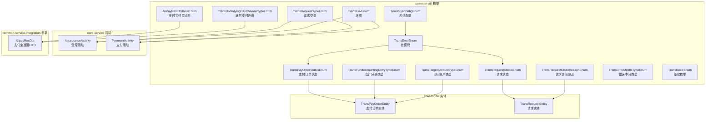
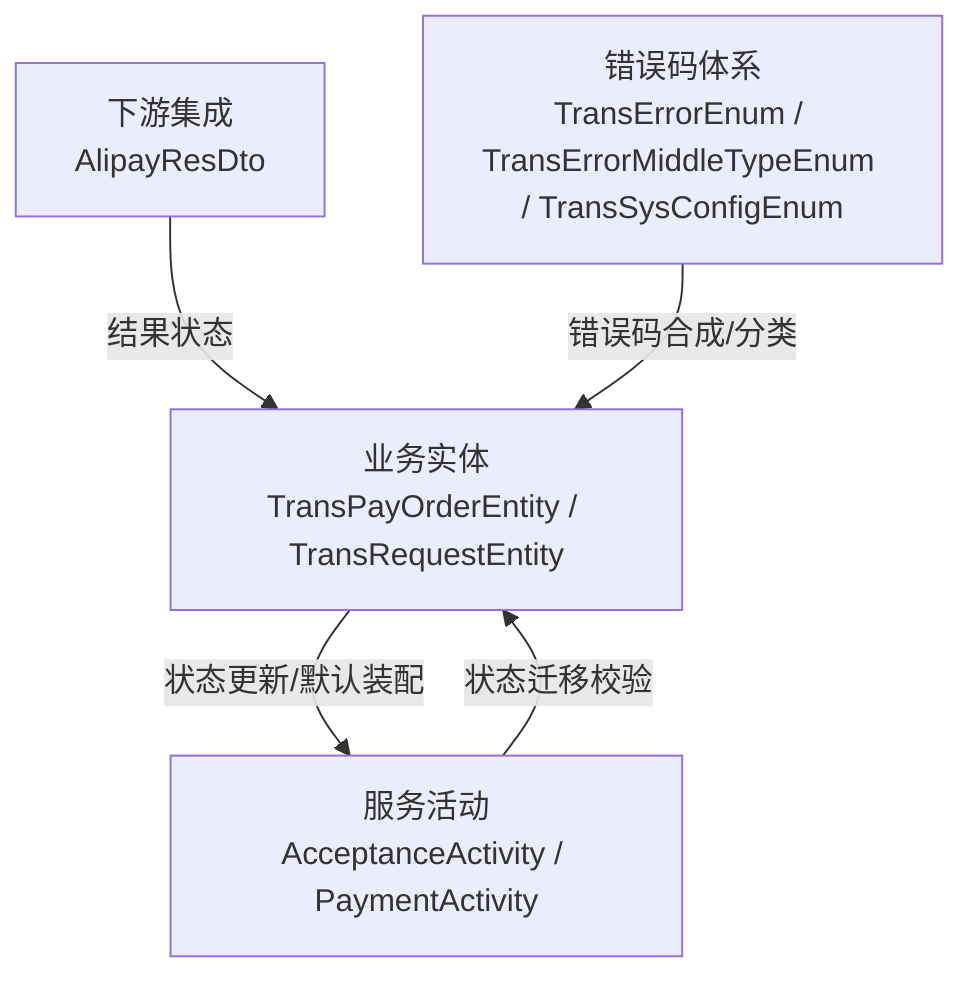
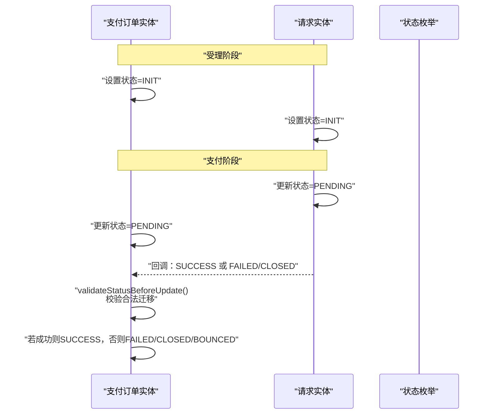
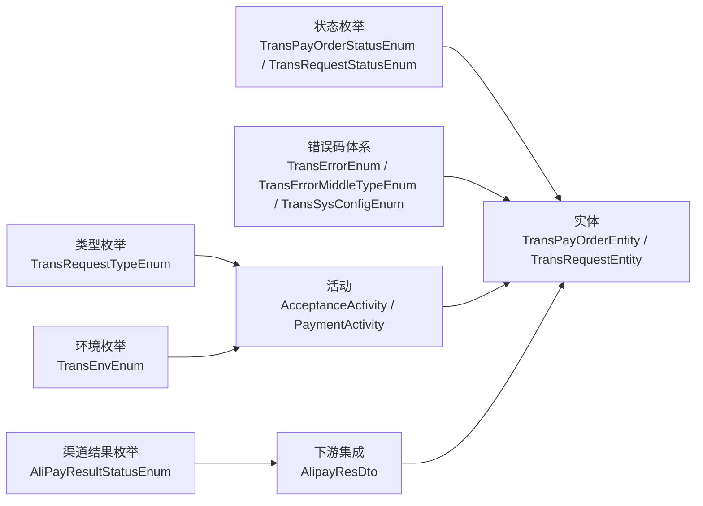

# 枚举类型

<cite>
**本文引用的文件**   
- [TransPayOrderStatusEnum.java](file://common-util/src/main/java/com/magicliang/transaction/sys/common/enums/TransPayOrderStatusEnum.java)
- [TransRequestStatusEnum.java](file://common-util/src/main/java/com/magicliang/transaction/sys/common/enums/TransRequestStatusEnum.java)
- [TransRequestTypeEnum.java](file://common-util/src/main/java/com/magicliang/transaction/sys/common/enums/TransRequestTypeEnum.java)
- [AliPayResultStatusEnum.java](file://common-util/src/main/java/com/magicliang/transaction/sys/common/enums/AliPayResultStatusEnum.java)
- [TransEnvEnum.java](file://common-util/src/main/java/com/magicliang/transaction/sys/common/enums/TransEnvEnum.java)
- [TransErrorEnum.java](file://common-util/src/main/java/com/magicliang/transaction/sys/common/enums/TransErrorEnum.java)
- [TransErrorMiddleTypeEnum.java](file://common-util/src/main/java/com/magicliang/transaction/sys/common/enums/TransErrorMiddleTypeEnum.java)
- [TransFundAccountingEntryTypeEnum.java](file://common-util/src/main/java/com/magicliang/transaction/sys/common/enums/TransFundAccountingEntryTypeEnum.java)
- [TransSysConfigEnum.java](file://common-util/src/main/java/com/magicliang/transaction/sys/common/enums/TransSysConfigEnum.java)
- [TransRequestCloseReasonEnum.java](file://common-util/src/main/java/com/magicliang/transaction/sys/common/enums/TransRequestCloseReasonEnum.java)
- [TransTargetAccountTypeEnum.java](file://common-util/src/main/java/com/magicliang/transaction/sys/common/enums/TransTargetAccountTypeEnum.java)
- [TransUnderlyingPayChannelTypeEnum.java](file://common-util/src/main/java/com/magicliang/transaction/sys/common/enums/TransUnderlyingPayChannelTypeEnum.java)
- [TransBasicEnum.java](file://common-util/src/main/java/com/magicliang/transaction/sys/common/enums/TransBasicEnum.java)
- [TransPayOrderEntity.java](file://core-model/src/main/java/com/magicliang/transaction/sys/core/model/entity/TransPayOrderEntity.java)
- [TransRequestEntity.java](file://core-model/src/main/java/com/magicliang/transaction/sys/core/model/entity/TransRequestEntity.java)
- [AcceptanceActivity.java](file://core-service/src/main/java/com/magicliang/transaction/sys/core/domain/activity/acceptance/AcceptanceActivity.java)
- [PaymentActivity.java](file://core-service/src/main/java/com/magicliang/transaction/sys/core/domain/activity/payment/PaymentActivity.java)
- [AlipayResDto.java](file://common-service-integration/src/main/java/com/magicliang/transaction/sys/common/service/integration/param/AlipayResDto.java)
</cite>

## 目录
1. [简介](#简介)
2. [项目结构](#项目结构)
3. [核心组件](#核心组件)
4. [架构总览](#架构总览)
5. [详细组件分析](#详细组件分析)
6. [依赖关系分析](#依赖关系分析)
7. [性能考量](#性能考量)
8. [故障排查指南](#故障排查指南)
9. [结论](#结论)
10. [附录](#附录)

## 简介
本文件聚焦于 common-util 模块中的业务与系统配置类枚举，系统性梳理支付相关状态与类型、支付渠道结果状态、系统环境与错误码体系、资金会计条目、系统配置项、请求关闭原因、目标账户类型、底层支付通道等枚举的设计与使用方式。文档从业务含义、取值范围、使用场景出发，结合状态迁移校验与实际业务流程，总结最佳实践与常见陷阱，帮助读者在复杂交易系统中以类型安全的方式正确使用这些枚举。

## 项目结构
- 枚举集中位于 common-util 模块的 enums 包下，覆盖支付订单状态、请求状态与类型、支付宝结果状态、环境、错误码、会计分录、系统配置、请求关闭原因、目标账户类型、底层支付通道等。
- 业务实体与服务活动通过直接调用枚举的静态方法或常量，实现状态迁移校验与默认值装配，确保跨模块协作的一致性与可维护性。

图表来源
- [TransPayOrderStatusEnum.java:1-205](file://common-util/src/main/java/com/magicliang/transaction/sys/common/enums/TransPayOrderStatusEnum.java#L1-L205)
- [TransRequestStatusEnum.java:1-163](file://common-util/src/main/java/com/magicliang/transaction/sys/common/enums/TransRequestStatusEnum.java#L1-L163)
- [TransRequestTypeEnum.java:1-99](file://common-util/src/main/java/com/magicliang/transaction/sys/common/enums/TransRequestTypeEnum.java#L1-L99)
- [AliPayResultStatusEnum.java:1-62](file://common-util/src/main/java/com/magicliang/transaction/sys/common/enums/AliPayResultStatusEnum.java#L1-L62)
- [TransEnvEnum.java:1-87](file://common-util/src/main/java/com/magicliang/transaction/sys/common/enums/TransEnvEnum.java#L1-L87)
- [TransErrorEnum.java:1-327](file://common-util/src/main/java/com/magicliang/transaction/sys/common/enums/TransErrorEnum.java#L1-L327)
- [TransFundAccountingEntryTypeEnum.java:1-78](file://common-util/src/main/java/com/magicliang/transaction/sys/common/enums/TransFundAccountingEntryTypeEnum.java#L1-L78)
- [TransSysConfigEnum.java:1-83](file://common-util/src/main/java/com/magicliang/transaction/sys/common/enums/TransSysConfigEnum.java#L1-L83)
- [TransRequestCloseReasonEnum.java:1-73](file://common-util/src/main/java/com/magicliang/transaction/sys/common/enums/TransRequestCloseReasonEnum.java#L1-L73)
- [TransTargetAccountTypeEnum.java:1-78](file://common-util/src/main/java/com/magicliang/transaction/sys/common/enums/TransTargetAccountTypeEnum.java#L1-L78)
- [TransUnderlyingPayChannelTypeEnum.java:1-82](file://common-util/src/main/java/com/magicliang/transaction/sys/common/enums/TransUnderlyingPayChannelTypeEnum.java#L1-L82)
- [TransErrorMiddleTypeEnum.java:1-78](file://common-util/src/main/java/com/magicliang/transaction/sys/common/enums/TransErrorMiddleTypeEnum.java#L1-L78)
- [TransBasicEnum.java:1-80](file://common-util/src/main/java/com/magicliang/transaction/sys/common/enums/TransBasicEnum.java#L1-L80)
- [TransPayOrderEntity.java:192-204](file://core-model/src/main/java/com/magicliang/transaction/sys/core/model/entity/TransPayOrderEntity.java#L192-L204)
- [TransRequestEntity.java:113-120](file://core-model/src/main/java/com/magicliang/transaction/sys/core/model/entity/TransRequestEntity.java#L113-L120)
- [AcceptanceActivity.java:169-180](file://core-service/src/main/java/com/magicliang/transaction/sys/core/domain/activity/acceptance/AcceptanceActivity.java#L169-L180)
- [PaymentActivity.java:191-201](file://core-service/src/main/java/com/magicliang/transaction/sys/core/domain/activity/payment/PaymentActivity.java#L191-L201)
- [AlipayResDto.java:110-131](file://common-service-integration/src/main/java/com/magicliang/transaction/sys/common/service/integration/param/AlipayResDto.java#L110-L131)

章节来源
- [TransPayOrderStatusEnum.java:1-205](file://common-util/src/main/java/com/magicliang/transaction/sys/common/enums/TransPayOrderStatusEnum.java#L1-L205)
- [TransRequestStatusEnum.java:1-163](file://common-util/src/main/java/com/magicliang/transaction/sys/common/enums/TransRequestStatusEnum.java#L1-L163)
- [TransRequestTypeEnum.java:1-99](file://common-util/src/main/java/com/magicliang/transaction/sys/common/enums/TransRequestTypeEnum.java#L1-L99)
- [AliPayResultStatusEnum.java:1-62](file://common-util/src/main/java/com/magicliang/transaction/sys/common/enums/AliPayResultStatusEnum.java#L1-L62)
- [TransEnvEnum.java:1-87](file://common-util/src/main/java/com/magicliang/transaction/sys/common/enums/TransEnvEnum.java#L1-L87)
- [TransErrorEnum.java:1-327](file://common-util/src/main/java/com/magicliang/transaction/sys/common/enums/TransErrorEnum.java#L1-L327)
- [TransFundAccountingEntryTypeEnum.java:1-78](file://common-util/src/main/java/com/magicliang/transaction/sys/common/enums/TransFundAccountingEntryTypeEnum.java#L1-L78)
- [TransSysConfigEnum.java:1-83](file://common-util/src/main/java/com/magicliang/transaction/sys/common/enums/TransSysConfigEnum.java#L1-L83)
- [TransRequestCloseReasonEnum.java:1-73](file://common-util/src/main/java/com/magicliang/transaction/sys/common/enums/TransRequestCloseReasonEnum.java#L1-L73)
- [TransTargetAccountTypeEnum.java:1-78](file://common-util/src/main/java/com/magicliang/transaction/sys/common/enums/TransTargetAccountTypeEnum.java#L1-L78)
- [TransUnderlyingPayChannelTypeEnum.java:1-82](file://common-util/src/main/java/com/magicliang/transaction/sys/common/enums/TransUnderlyingPayChannelTypeEnum.java#L1-L82)
- [TransErrorMiddleTypeEnum.java:1-78](file://common-util/src/main/java/com/magicliang/transaction/sys/common/enums/TransErrorMiddleTypeEnum.java#L1-L78)
- [TransBasicEnum.java:1-80](file://common-util/src/main/java/com/magicliang/transaction/sys/common/enums/TransBasicEnum.java#L1-L80)

## 核心组件
本节对关键枚举逐一说明其业务含义、取值范围与典型使用场景，并给出最佳实践建议。

- 支付订单状态枚举（TransPayOrderStatusEnum）
  - 业务含义：描述一笔支付订单从受理到完成的全生命周期状态，包含初始化、处理中、成功、失败、关闭、退票等。
  - 取值范围：包含多个终态与中间态，支持成功终态与多种失败终态的区分。
  - 使用场景：在实体状态更新前进行合法性校验，保证状态迁移符合业务规则；用于统计与报表的终态判定。
  - 最佳实践：统一通过静态校验方法进行迁移校验；区分“订单终态”与“请求终态”，避免混淆；对退票态进行特殊处理。
  
  章节来源
  - [TransPayOrderStatusEnum.java:26-62](file://common-util/src/main/java/com/magicliang/transaction/sys/common/enums/TransPayOrderStatusEnum.java#L26-L62)
  - [TransPayOrderStatusEnum.java:175-203](file://common-util/src/main/java/com/magicliang/transaction/sys/common/enums/TransPayOrderStatusEnum.java#L175-L203)
  - [TransPayOrderEntity.java:197-204](file://core-model/src/main/java/com/magicliang/transaction/sys/core/model/entity/TransPayOrderEntity.java#L197-L204)

- 交易请求状态枚举（TransRequestStatusEnum）
  - 业务含义：描述一次支付请求的生命周期状态，强调“受理即成功”的设计，失败可重试。
  - 取值范围：包含初始化、请求中、成功、失败、关闭等。
  - 使用场景：在受理与支付阶段更新请求状态；作为任务调度与重试控制的依据。
  - 最佳实践：请求成功后不再因回调改变状态；失败可重试但需遵循幂等与限流策略。
  
  章节来源
  - [TransRequestStatusEnum.java:27-55](file://common-util/src/main/java/com/magicliang/transaction/sys/common/enums/TransRequestStatusEnum.java#L27-L55)
  - [TransRequestStatusEnum.java:137-161](file://common-util/src/main/java/com/magicliang/transaction/sys/common/enums/TransRequestStatusEnum.java#L137-L161)
  - [TransRequestEntity.java:113-120](file://core-model/src/main/java/com/magicliang/transaction/sys/core/model/entity/TransRequestEntity.java#L113-L120)

- 交易请求类型枚举（TransRequestTypeEnum）
  - 业务含义：区分支付请求、基础通知、退票通知等不同类型的请求。
  - 取值范围：支付请求、基础通知、退票通知。
  - 使用场景：决定通知的发送优先级与处理策略；用于任务队列与调度。
  - 最佳实践：通知类型集合与优先级顺序需明确且稳定；避免混用不同类型的请求。
  
  章节来源
  - [TransRequestTypeEnum.java:22-38](file://common-util/src/main/java/com/magicliang/transaction/sys/common/enums/TransRequestTypeEnum.java#L22-L38)
  - [TransRequestTypeEnum.java:43-50](file://common-util/src/main/java/com/magicliang/transaction/sys/common/enums/TransRequestTypeEnum.java#L43-L50)

- 支付宝结果状态枚举（AliPayResultStatusEnum）
  - 业务含义：抽象支付宝侧返回的成功/失败状态，便于上游统一处理。
  - 取值范围：成功、失败。
  - 使用场景：构建/解析下游返回 DTO 时，统一状态码。
  - 最佳实践：通过预构建的不可变映射表进行 O(1) 查询；保持与下游协议一致。
  
  章节来源
  - [AliPayResultStatusEnum.java:18-29](file://common-util/src/main/java/com/magicliang/transaction/sys/common/enums/AliPayResultStatusEnum.java#L18-L29)
  - [AliPayResultStatusEnum.java:34-45](file://common-util/src/main/java/com/magicliang/transaction/sys/common/enums/AliPayResultStatusEnum.java#L34-L45)
  - [AlipayResDto.java:110-131](file://common-service-integration/src/main/java/com/magicliang/transaction/sys/common/service/integration/param/AlipayResDto.java#L110-L131)

- 系统环境枚举（TransEnvEnum）
  - 业务含义：标识运行环境（开发、测试、预发、生产）。
  - 取值范围：dev、test、staging、prod。
  - 使用场景：实体默认环境注入、日志与监控标签、配置加载。
  - 最佳实践：统一从配置中心读取环境字符串并转换为枚举。
  
  章节来源
  - [TransEnvEnum.java:18-39](file://common-util/src/main/java/com/magicliang/transaction/sys/common/enums/TransEnvEnum.java#L18-L39)
  - [AcceptanceActivity.java:176-179](file://core-service/src/main/java/com/magicliang/transaction/sys/core/domain/activity/acceptance/AcceptanceActivity.java#L176-L179)

- 错误码枚举（TransErrorEnum）与中间类型（TransErrorMiddleTypeEnum）、系统配置（TransSysConfigEnum）
  - 业务含义：统一错误码的分类与合成规则，支持本系统业务/系统、第二方/第三方等多层级错误来源。
  - 取值范围：按中间类型与具体错误码组合形成唯一合成错误码。
  - 使用场景：异常抛出与捕获、日志记录、对外返回。
  - 最佳实践：明确可重试与不可重试策略；错误码合成规则需全局一致。
  
  章节来源
  - [TransErrorEnum.java:22-276](file://common-util/src/main/java/com/magicliang/transaction/sys/common/enums/TransErrorEnum.java#L22-L276)
  - [TransErrorEnum.java:321-325](file://common-util/src/main/java/com/magicliang/transaction/sys/common/enums/TransErrorEnum.java#L321-L325)
  - [TransErrorMiddleTypeEnum.java:17-48](file://common-util/src/main/java/com/magicliang/transaction/sys/common/enums/TransErrorMiddleTypeEnum.java#L17-L48)
  - [TransSysConfigEnum.java:18-35](file://common-util/src/main/java/com/magicliang/transaction/sys/common/enums/TransSysConfigEnum.java#L18-L35)

- 资金会计条目类型（TransFundAccountingEntryTypeEnum）
  - 业务含义：资金记账方向（借/贷），用于会计分录生成。
  - 取值范围：借、贷。
  - 使用场景：生成会计凭证、对账与报表。
  - 最佳实践：与会计准则保持一致；避免方向错配导致的差错。
  
  章节来源
  - [TransFundAccountingEntryTypeEnum.java:19-30](file://common-util/src/main/java/com/magicliang/transaction/sys/common/enums/TransFundAccountingEntryTypeEnum.java#L19-L30)

- 请求关闭原因（TransRequestCloseReasonEnum）、目标账户类型（TransTargetAccountTypeEnum）、底层支付通道（TransUnderlyingPayChannelTypeEnum）
  - 业务含义：请求关闭策略依据、收款账户类型、底层支付通道与地址信息。
  - 取值范围：见各枚举定义。
  - 使用场景：请求关闭策略、账户结算、通道路由。
  - 最佳实践：通道地址与端口配置需与下游一致；账户类型与结算规则匹配。
  
  章节来源
  - [TransRequestCloseReasonEnum.java:18-25](file://common-util/src/main/java/com/magicliang/transaction/sys/common/enums/TransRequestCloseReasonEnum.java#L18-L25)
  - [TransTargetAccountTypeEnum.java:18-30](file://common-util/src/main/java/com/magicliang/transaction/sys/common/enums/TransTargetAccountTypeEnum.java#L18-L30)
  - [TransUnderlyingPayChannelTypeEnum.java:18-29](file://common-util/src/main/java/com/magicliang/transaction/sys/common/enums/TransUnderlyingPayChannelTypeEnum.java#L18-L29)

- 基础枚举（TransBasicEnum）
  - 业务含义：通用的基础枚举示例，演示了枚举映射与工具方法的实现模式。
  - 使用场景：作为其他枚举实现的参考模板。
  - 最佳实践：采用不可变映射提升查询性能；提供按 code/desc 的双入口查询。
  
  章节来源
  - [TransBasicEnum.java:19-41](file://common-util/src/main/java/com/magicliang/transaction/sys/common/enums/TransBasicEnum.java#L19-L41)

## 架构总览
以下图展示了枚举在系统中的角色与交互路径：业务实体通过枚举进行状态管理与默认装配；服务活动在受理与支付阶段更新状态；下游集成通过结果状态统一处理；错误码体系贯穿异常处理与日志输出。

图表来源
- [TransPayOrderEntity.java:197-204](file://core-model/src/main/java/com/magicliang/transaction/sys/core/model/entity/TransPayOrderEntity.java#L197-L204)
- [TransRequestEntity.java:113-120](file://core-model/src/main/java/com/magicliang/transaction/sys/core/model/entity/TransRequestEntity.java#L113-L120)
- [AcceptanceActivity.java:169-180](file://core-service/src/main/java/com/magicliang/transaction/sys/core/domain/activity/acceptance/AcceptanceActivity.java#L169-L180)
- [PaymentActivity.java:191-201](file://core-service/src/main/java/com/magicliang/transaction/sys/core/domain/activity/payment/PaymentActivity.java#L191-L201)
- [AlipayResDto.java:110-131](file://common-service-integration/src/main/java/com/magicliang/transaction/sys/common/service/integration/param/AlipayResDto.java#L110-L131)
- [TransErrorEnum.java:321-325](file://common-util/src/main/java/com/magicliang/transaction/sys/common/enums/TransErrorEnum.java#L321-L325)

## 详细组件分析

### 支付订单状态（TransPayOrderStatusEnum）与请求状态（TransRequestStatusEnum）状态机
- 设计要点
  - 明确区分“订单终态”与“请求终态”，订单成功后不再因回调改变状态。
  - 提供终态判定、成功终态判定、退票判定等便捷方法。
  - 通过静态校验方法约束状态迁移，防止非法跃迁。
- 使用示例路径
  - 订单状态更新：[TransPayOrderEntity.updateStatus:197-204](file://core-model/src/main/java/com/magicliang/transaction/sys/core/model/entity/TransPayOrderEntity.java#L197-L204)
  - 请求状态更新：[TransRequestEntity.updateStatus:113-120](file://core-model/src/main/java/com/magicliang/transaction/sys/core/model/entity/TransRequestEntity.java#L113-L120)
- 状态迁移序列图

图表来源
- [TransPayOrderStatusEnum.java:175-203](file://common-util/src/main/java/com/magicliang/transaction/sys/common/enums/TransPayOrderStatusEnum.java#L175-L203)
- [TransRequestStatusEnum.java:137-161](file://common-util/src/main/java/com/magicliang/transaction/sys/common/enums/TransRequestStatusEnum.java#L137-L161)
- [TransPayOrderEntity.java:197-204](file://core-model/src/main/java/com/magicliang/transaction/sys/core/model/entity/TransPayOrderEntity.java#L197-L204)
- [TransRequestEntity.java:113-120](file://core-model/src/main/java/com/magicliang/transaction/sys/core/model/entity/TransRequestEntity.java#L113-L120)

章节来源
- [TransPayOrderStatusEnum.java:26-62](file://common-util/src/main/java/com/magicliang/transaction/sys/common/enums/TransPayOrderStatusEnum.java#L26-L62)
- [TransRequestStatusEnum.java:27-55](file://common-util/src/main/java/com/magicliang/transaction/sys/common/enums/TransRequestStatusEnum.java#L27-L55)

### 支付请求类型（TransRequestTypeEnum）与通知优先级
- 设计要点
  - 通知类型集合与优先级顺序决定任务调度与发送顺序。
  - 通过集合与列表缓存减少重复计算。
- 使用示例路径
  - 通知类型集合：[NOTIFICATION_TYPE:43-50](file://common-util/src/main/java/com/magicliang/transaction/sys/common/enums/TransRequestTypeEnum.java#L43-L50)

章节来源
- [TransRequestTypeEnum.java:22-50](file://common-util/src/main/java/com/magicliang/transaction/sys/common/enums/TransRequestTypeEnum.java#L22-L50)

### 支付宝结果状态（AliPayResultStatusEnum）与下游集成
- 设计要点
  - 通过不可变映射表提供 O(1) 查询性能。
  - 与下游 DTO 构建器配合，统一状态设置。
- 使用示例路径
  - 成功/失败结果构建：[AlipayResDto.buildSuccessResult/buildFailureResult:110-131](file://common-service-integration/src/main/java/com/magicliang/transaction/sys/common/service/integration/param/AlipayResDto.java#L110-L131)
  - 枚举查询：[AliPayResultStatusEnum.getByCode:58-60](file://common-util/src/main/java/com/magicliang/transaction/sys/common/enums/AliPayResultStatusEnum.java#L58-L60)

章节来源
- [AliPayResultStatusEnum.java:18-60](file://common-util/src/main/java/com/magicliang/transaction/sys/common/enums/AliPayResultStatusEnum.java#L18-L60)
- [AlipayResDto.java:110-131](file://common-service-integration/src/main/java/com/magicliang/transaction/sys/common/service/integration/param/AlipayResDto.java#L110-L131)

### 系统环境（TransEnvEnum）与默认装配
- 设计要点
  - 将环境字符串转换为枚举，再写入实体字段，确保一致性。
- 使用示例路径
  - 环境装配：[AcceptanceActivity.assemblePayOrder:176-179](file://core-service/src/main/java/com/magicliang/transaction/sys/core/domain/activity/acceptance/AcceptanceActivity.java#L176-L179)

章节来源
- [TransEnvEnum.java:18-39](file://common-util/src/main/java/com/magicliang/transaction/sys/common/enums/TransEnvEnum.java#L18-L39)
- [AcceptanceActivity.java:176-179](file://core-service/src/main/java/com/magicliang/transaction/sys/core/domain/activity/acceptance/AcceptanceActivity.java#L176-L179)

### 错误码体系（TransErrorEnum/TransErrorMiddleTypeEnum/TransSysConfigEnum）
- 设计要点
  - 中间类型划分错误来源层级；系统配置提供前缀；合成规则形成全局唯一错误码。
  - 可重试标记用于策略控制。
- 使用示例路径
  - 合成错误码：[TransErrorEnum.getSynthesizedErrorCode:321-325](file://common-util/src/main/java/com/magicliang/transaction/sys/common/enums/TransErrorEnum.java#L321-L325)

章节来源
- [TransErrorEnum.java:22-276](file://common-util/src/main/java/com/magicliang/transaction/sys/common/enums/TransErrorEnum.java#L22-L276)
- [TransErrorMiddleTypeEnum.java:17-48](file://common-util/src/main/java/com/magicliang/transaction/sys/common/enums/TransErrorMiddleTypeEnum.java#L17-L48)
- [TransSysConfigEnum.java:18-35](file://common-util/src/main/java/com/magicliang/transaction/sys/common/enums/TransSysConfigEnum.java#L18-L35)

### 资金会计条目类型（TransFundAccountingEntryTypeEnum）
- 设计要点
  - 借/贷方向与会计准则一致，便于生成凭证与对账。
- 使用示例路径
  - 查询接口：[TransFundAccountingEntryTypeEnum.getByCode/getByDesc:48-76](file://common-util/src/main/java/com/magicliang/transaction/sys/common/enums/TransFundAccountingEntryTypeEnum.java#L48-L76)

章节来源
- [TransFundAccountingEntryTypeEnum.java:19-77](file://common-util/src/main/java/com/magicliang/transaction/sys/common/enums/TransFundAccountingEntryTypeEnum.java#L19-L77)

### 请求关闭原因（TransRequestCloseReasonEnum）、目标账户类型（TransTargetAccountTypeEnum）、底层支付通道（TransUnderlyingPayChannelTypeEnum）
- 设计要点
  - 关闭原因用于策略控制；账户类型与通道类型决定结算与路由。
- 使用示例路径
  - 关闭原因查询：[TransRequestCloseReasonEnum.getByCode/getByDesc:43-71](file://common-util/src/main/java/com/magicliang/transaction/sys/common/enums/TransRequestCloseReasonEnum.java#L43-L71)
  - 目标账户类型查询：[TransTargetAccountTypeEnum.getByCode/getByDesc:48-76](file://common-util/src/main/java/com/magicliang/transaction/sys/common/enums/TransTargetAccountTypeEnum.java#L48-L76)
  - 通道类型与地址：[TransUnderlyingPayChannelTypeEnum:18-81](file://common-util/src/main/java/com/magicliang/transaction/sys/common/enums/TransUnderlyingPayChannelTypeEnum.java#L18-L81)

章节来源
- [TransRequestCloseReasonEnum.java:18-72](file://common-util/src/main/java/com/magicliang/transaction/sys/common/enums/TransRequestCloseReasonEnum.java#L18-L72)
- [TransTargetAccountTypeEnum.java:18-77](file://common-util/src/main/java/com/magicliang/transaction/sys/common/enums/TransTargetAccountTypeEnum.java#L18-L77)
- [TransUnderlyingPayChannelTypeEnum.java:18-81](file://common-util/src/main/java/com/magicliang/transaction/sys/common/enums/TransUnderlyingPayChannelTypeEnum.java#L18-L81)

### 基础枚举（TransBasicEnum）最佳实践模板
- 设计要点
  - 不可变映射表、按 code/desc 查询、Key2Enum 方法命名规范。
- 使用示例路径
  - 映射初始化与查询：[TransBasicEnum:35-59](file://common-util/src/main/java/com/magicliang/transaction/sys/common/enums/TransBasicEnum.java#L35-L59)

章节来源
- [TransBasicEnum.java:19-79](file://common-util/src/main/java/com/magicliang/transaction/sys/common/enums/TransBasicEnum.java#L19-L79)

## 依赖关系分析
- 枚举之间的耦合度低，职责清晰：状态枚举用于实体状态迁移校验；类型枚举用于任务调度与通知策略；渠道结果枚举用于下游集成；错误码体系用于异常治理。
- 实体与活动通过枚举进行解耦：状态更新统一走枚举校验；默认装配统一走枚举转换。
- 下游集成通过结果状态枚举与 DTO 构建器对接，避免硬编码状态值。

图表来源
- [TransPayOrderStatusEnum.java:175-203](file://common-util/src/main/java/com/magicliang/transaction/sys/common/enums/TransPayOrderStatusEnum.java#L175-L203)
- [TransRequestStatusEnum.java:137-161](file://common-util/src/main/java/com/magicliang/transaction/sys/common/enums/TransRequestStatusEnum.java#L137-L161)
- [TransRequestTypeEnum.java:43-50](file://common-util/src/main/java/com/magicliang/transaction/sys/common/enums/TransRequestTypeEnum.java#L43-L50)
- [AliPayResultStatusEnum.java:34-45](file://common-util/src/main/java/com/magicliang/transaction/sys/common/enums/AliPayResultStatusEnum.java#L34-L45)
- [TransErrorEnum.java:321-325](file://common-util/src/main/java/com/magicliang/transaction/sys/common/enums/TransErrorEnum.java#L321-L325)
- [TransEnvEnum.java:57-85](file://common-util/src/main/java/com/magicliang/transaction/sys/common/enums/TransEnvEnum.java#L57-L85)
- [TransPayOrderEntity.java:197-204](file://core-model/src/main/java/com/magicliang/transaction/sys/core/model/entity/TransPayOrderEntity.java#L197-L204)
- [TransRequestEntity.java:113-120](file://core-model/src/main/java/com/magicliang/transaction/sys/core/model/entity/TransRequestEntity.java#L113-L120)
- [AcceptanceActivity.java:176-179](file://core-service/src/main/java/com/magicliang/transaction/sys/core/domain/activity/acceptance/AcceptanceActivity.java#L176-L179)
- [PaymentActivity.java:191-201](file://core-service/src/main/java/com/magicliang/transaction/sys/core/domain/activity/payment/PaymentActivity.java#L191-L201)
- [AlipayResDto.java:110-131](file://common-service-integration/src/main/java/com/magicliang/transaction/sys/common/service/integration/param/AlipayResDto.java#L110-L131)

## 性能考量
- 枚举查询优化
  - 使用不可变映射表（如 AliPayResultStatusEnum、TransBasicEnum）实现 O(1) 查询，避免遍历。
  - 对常用集合（如未支付状态、通知类型）进行缓存，减少重复计算。
- 状态迁移校验
  - 在实体状态更新前进行校验，避免无效状态写入数据库，降低回滚成本。
- 错误码合成
  - 合成规则简单明确，避免复杂拼接带来的性能损耗。

## 故障排查指南
- 状态迁移异常
  - 症状：订单或请求状态更新失败。
  - 排查：确认旧状态与新状态是否满足枚举提供的迁移规则；检查是否已到达终态。
  - 参考路径：[TransPayOrderStatusEnum.validateStatusBeforeUpdate:175-203](file://common-util/src/main/java/com/magicliang/transaction/sys/common/enums/TransPayOrderStatusEnum.java#L175-L203)、[TransRequestStatusEnum.validateStatusBeforeUpdate:137-161](file://common-util/src/main/java/com/magicliang/transaction/sys/common/enums/TransRequestStatusEnum.java#L137-L161)
- 环境装配错误
  - 症状：实体环境字段为空或不正确。
  - 排查：确认配置中心环境字符串与枚举定义一致；检查装配逻辑。
  - 参考路径：[AcceptanceActivity.assemblePayOrder:176-179](file://core-service/src/main/java/com/magicliang/transaction/sys/core/domain/activity/acceptance/AcceptanceActivity.java#L176-L179)
- 渠道结果状态不一致
  - 症状：下游返回状态与上游期望不一致。
  - 排查：核对 AliPayResultStatusEnum 定义与下游协议；检查 DTO 构建器状态设置。
  - 参考路径：[AliPayResultStatusEnum.getByCode:58-60](file://common-util/src/main/java/com/magicliang/transaction/sys/common/enums/AliPayResultStatusEnum.java#L58-L60)、[AlipayResDto.buildSuccessResult/buildFailureResult:110-131](file://common-service-integration/src/main/java/com/magicliang/transaction/sys/common/service/integration/param/AlipayResDto.java#L110-L131)
- 错误码识别困难
  - 症状：日志中错误码难以定位来源。
  - 排查：确认错误码合成规则与中间类型划分；核对系统配置前缀。
  - 参考路径：[TransErrorEnum.getSynthesizedErrorCode:321-325](file://common-util/src/main/java/com/magicliang/transaction/sys/common/enums/TransErrorEnum.java#L321-L325)

章节来源
- [TransPayOrderStatusEnum.java:175-203](file://common-util/src/main/java/com/magicliang/transaction/sys/common/enums/TransPayOrderStatusEnum.java#L175-L203)
- [TransRequestStatusEnum.java:137-161](file://common-util/src/main/java/com/magicliang/transaction/sys/common/enums/TransRequestStatusEnum.java#L137-L161)
- [AcceptanceActivity.java:176-179](file://core-service/src/main/java/com/magicliang/transaction/sys/core/domain/activity/acceptance/AcceptanceActivity.java#L176-L179)
- [AliPayResultStatusEnum.java:58-60](file://common-util/src/main/java/com/magicliang/transaction/sys/common/enums/AliPayResultStatusEnum.java#L58-L60)
- [AlipayResDto.java:110-131](file://common-service-integration/src/main/java/com/magicliang/transaction/sys/common/service/integration/param/AlipayResDto.java#L110-L131)
- [TransErrorEnum.java:321-325](file://common-util/src/main/java/com/magicliang/transaction/sys/common/enums/TransErrorEnum.java#L321-L325)

## 结论
通过对 common-util 中各类业务与系统配置枚举的系统化梳理，可以看出该系统在状态管理、类型区分、渠道对接、错误治理等方面采用了清晰的枚举设计与严格的使用规范。遵循本文的最佳实践与使用路径，可以在保证类型安全的同时，显著提升代码可读性与可维护性，并降低跨模块协作中的歧义与风险。

## 附录
- 命名规范建议
  - 枚举名称以业务域命名（如 TransXxxEnum），避免过短或无意义缩写。
  - code 字段使用稳定整数，desc 字段使用语义化英文或拼音，便于国际化与日志阅读。
- 扩展机制建议
  - 新增枚举时，优先参考 TransBasicEnum 的映射与查询模式；对常用集合进行缓存。
  - 新增状态枚举时，配套提供状态迁移校验方法与终态判定工具方法。
- 使用示例索引
  - 订单状态更新：[TransPayOrderEntity.updateStatus:197-204](file://core-model/src/main/java/com/magicliang/transaction/sys/core/model/entity/TransPayOrderEntity.java#L197-L204)
  - 请求状态更新：[TransRequestEntity.updateStatus:113-120](file://core-model/src/main/java/com/magicliang/transaction/sys/core/model/entity/TransRequestEntity.java#L113-L120)
  - 环境装配：[AcceptanceActivity.assemblePayOrder:176-179](file://core-service/src/main/java/com/magicliang/transaction/sys/core/domain/activity/acceptance/AcceptanceActivity.java#L176-L179)
  - 支付阶段状态迁移：[PaymentActivity.assemblePaymentRequestBeforePay:191-201](file://core-service/src/main/java/com/magicliang/transaction/sys/core/domain/activity/payment/PaymentActivity.java#L191-L201)
  - 支付宝结果构建：[AlipayResDto.buildSuccessResult/buildFailureResult:110-131](file://common-service-integration/src/main/java/com/magicliang/transaction/sys/common/service/integration/param/AlipayResDto.java#L110-L131)