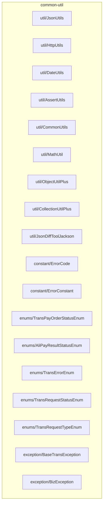
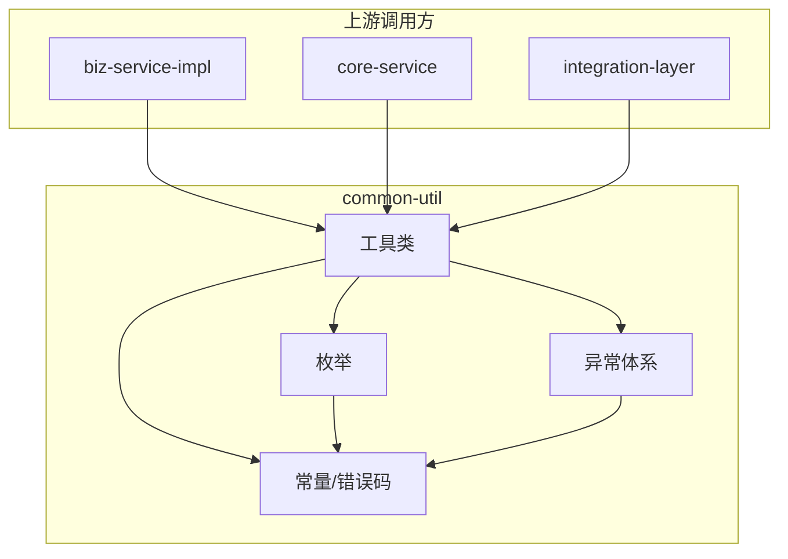
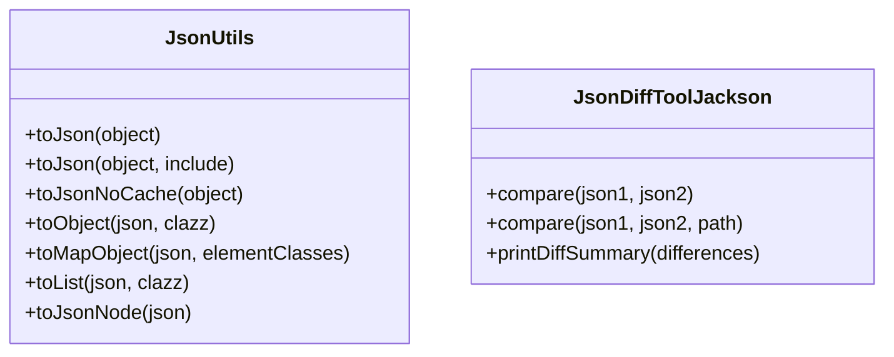
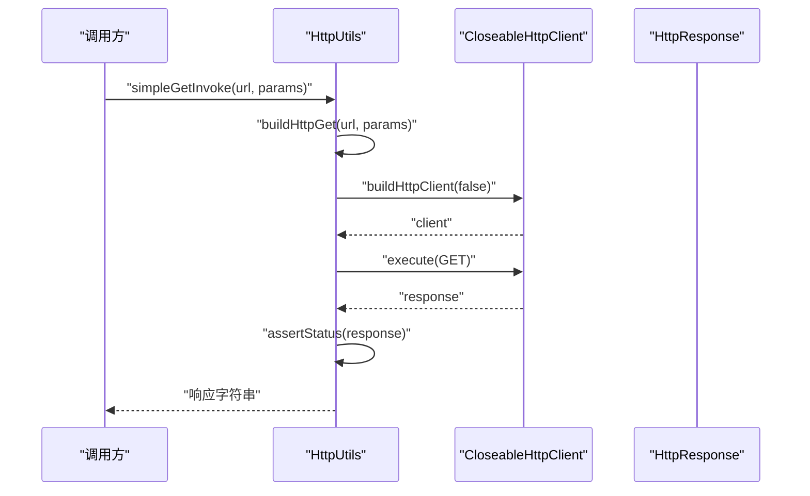
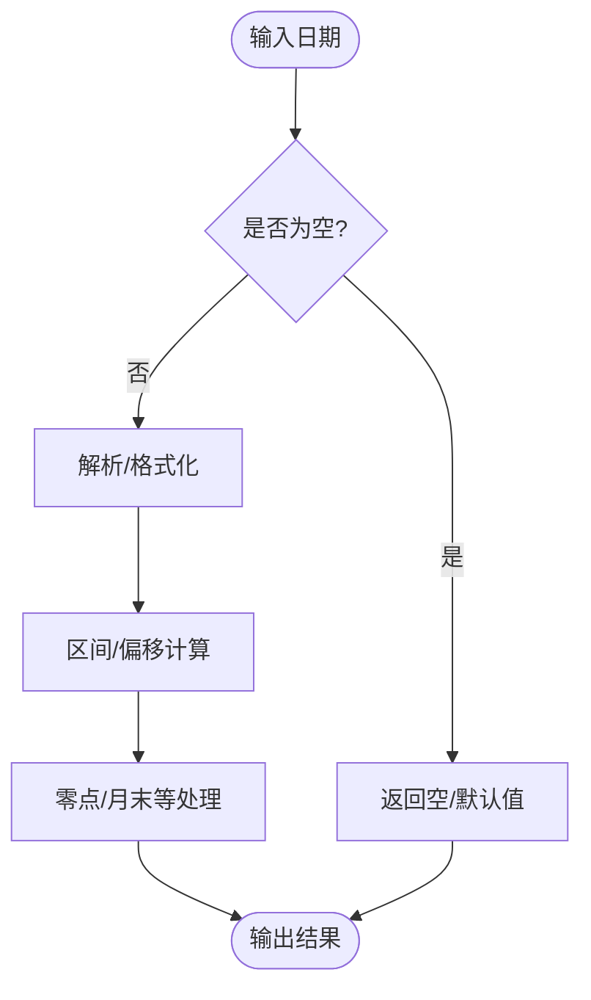
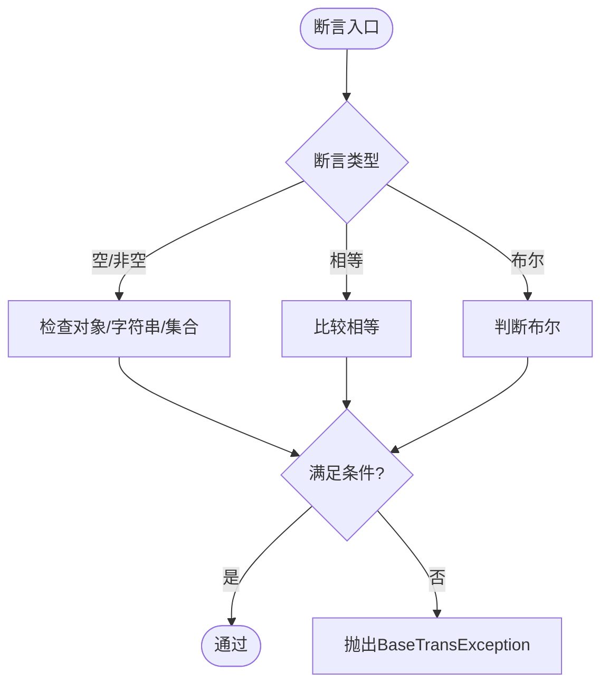
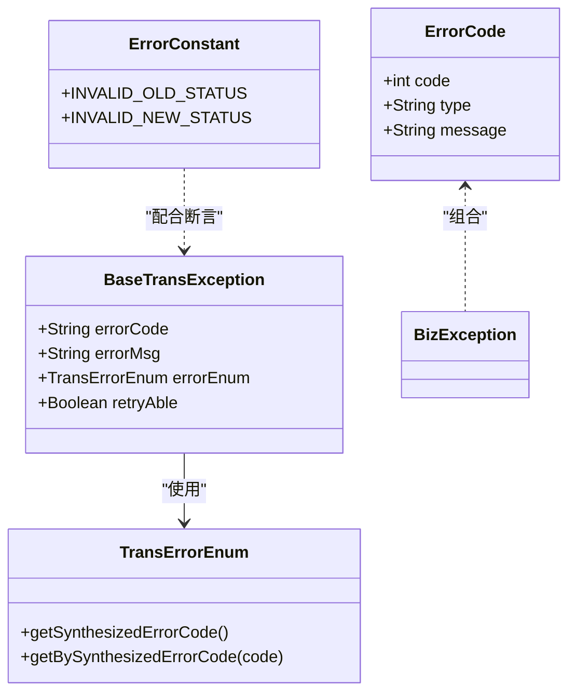
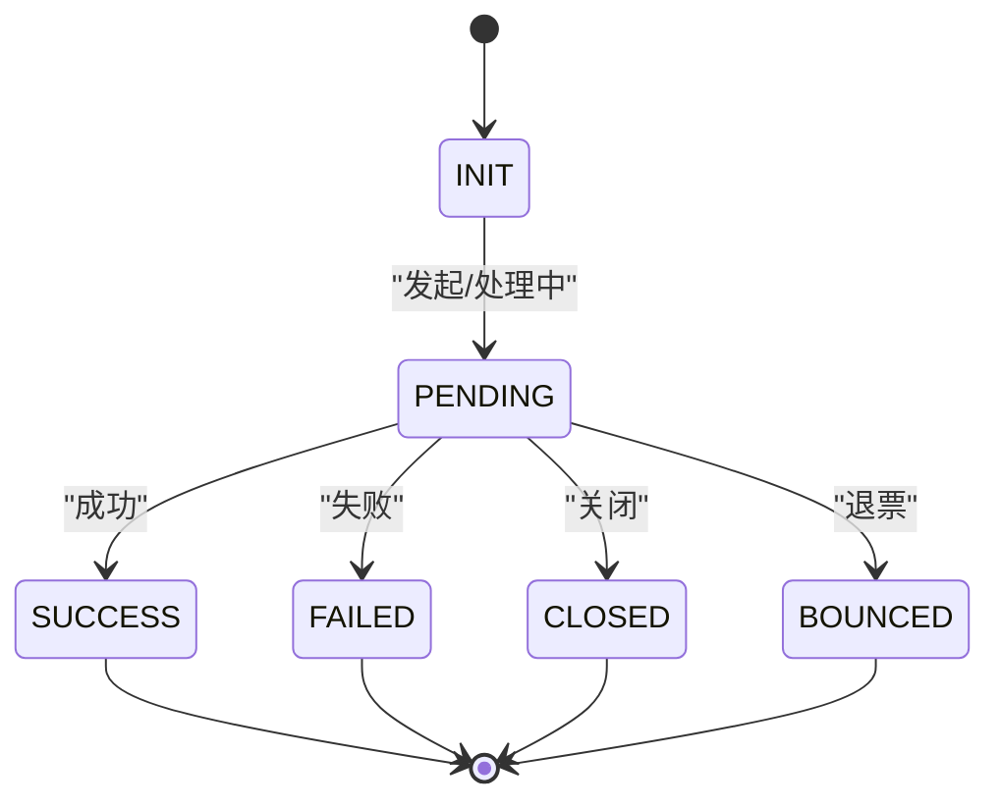
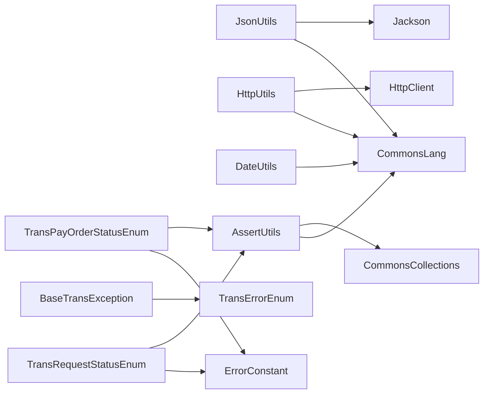

# 通用工具类层

<cite>
**本文引用的文件**
- [JsonUtils.java](file://common-util/src/main/java/com/magicliang/transaction/sys/common/util/JsonUtils.java)
- [AssertUtils.java](file://common-util/src/main/java/com/magicliang/transaction/sys/common/util/AssertUtils.java)
- [ErrorCode.java](file://common-util/src/main/java/com/magicliang/transaction/sys/common/constant/ErrorCode.java)
- [ErrorConstant.java](file://common-util/src/main/java/com/magicliang/transaction/sys/common/constant/ErrorConstant.java)
- [TransPayOrderStatusEnum.java](file://common-util/src/main/java/com/magicliang/transaction/sys/common/enums/TransPayOrderStatusEnum.java)
- [AliPayResultStatusEnum.java](file://common-util/src/main/java/com/magicliang/transaction/sys/common/enums/AliPayResultStatusEnum.java)
- [BaseTransException.java](file://common-util/src/main/java/com/magicliang/transaction/sys/common/exception/BaseTransException.java)
- [BizException.java](file://common-util/src/main/java/com/magicliang/transaction/sys/common/exception/BizException.java)
- [CommonUtils.java](file://common-util/src/main/java/com/magicliang/transaction/sys/common/util/CommonUtils.java)
- [DateUtils.java](file://common-util/src/main/java/com/magicliang/transaction/sys/common/util/DateUtils.java)
- [MathUtil.java](file://common-util/src/main/java/com/magicliang/transaction/sys/common/util/MathUtil.java)
- [ObjectUtilPlus.java](file://common-util/src/main/java/com/magicliang/transaction/sys/common/util/ObjectUtilPlus.java)
- [CollectionUtilPlus.java](file://common-util/src/main/java/com/magicliang/transaction/sys/common/util/CollectionUtilPlus.java)
- [HttpUtils.java](file://common-util/src/main/java/com/magicliang/transaction/sys/common/util/HttpUtils.java)
- [JsonDiffToolJackson.java](file://common-util/src/main/java/com/magicliang/transaction/sys/common/util/JsonDiffToolJackson.java)
- [TransErrorEnum.java](file://common-util/src/main/java/com/magicliang/transaction/sys/common/enums/TransErrorEnum.java)
- [TransRequestStatusEnum.java](file://common-util/src/main/java/com/magicliang/transaction/sys/common/enums/TransRequestStatusEnum.java)
- [TransRequestTypeEnum.java](file://common-util/src/main/java/com/magicliang/transaction/sys/common/enums/TransRequestTypeEnum.java)
</cite>

## 目录
1. [简介](#简介)
2. [项目结构](#项目结构)
3. [核心组件](#核心组件)
4. [架构总览](#架构总览)
5. [详细组件分析](#详细组件分析)
6. [依赖分析](#依赖分析)
7. [性能考量](#性能考量)
8. [故障排查指南](#故障排查指南)
9. [结论](#结论)
10. [附录](#附录)

## 简介
通用工具类层(common-util)是领域驱动交易系统的基础支撑模块，负责提供跨模块复用的工具类、常量定义、异常体系与枚举类型，确保系统在序列化/反序列化、断言校验、错误码合成、状态机管理、HTTP通信、日期与数学运算等方面具备一致、稳定、高性能的行为。该层通过高内聚、低耦合的工具类与枚举，显著降低重复代码，提升开发效率与可维护性。

## 项目结构
common-util模块按功能域划分包结构：
- util：通用工具类（JSON、HTTP、日期、集合、对象、数学、断言等）
- constant：错误码与常量定义
- enums：状态与业务枚举
- exception：异常体系
- type：类型接口
- aop、concurrent：扩展能力（非本次文档重点）

图表来源
- [JsonUtils.java:1-293](file://common-util/src/main/java/com/magicliang/transaction/sys/common/util/JsonUtils.java#L1-L293)
- [HttpUtils.java:1-525](file://common-util/src/main/java/com/magicliang/transaction/sys/common/util/HttpUtils.java#L1-L525)
- [DateUtils.java:1-941](file://common-util/src/main/java/com/magicliang/transaction/sys/common/util/DateUtils.java#L1-L941)
- [AssertUtils.java:1-109](file://common-util/src/main/java/com/magicliang/transaction/sys/common/util/AssertUtils.java#L1-L109)
- [CommonUtils.java:1-48](file://common-util/src/main/java/com/magicliang/transaction/sys/common/util/CommonUtils.java#L1-L48)
- [MathUtil.java:1-69](file://common-util/src/main/java/com/magicliang/transaction/sys/common/util/MathUtil.java#L1-L69)
- [ObjectUtilPlus.java:1-44](file://common-util/src/main/java/com/magicliang/transaction/sys/common/util/ObjectUtilPlus.java#L1-L44)
- [CollectionUtilPlus.java:1-36](file://common-util/src/main/java/com/magicliang/transaction/sys/common/util/CollectionUtilPlus.java#L1-L36)
- [JsonDiffToolJackson.java:1-370](file://common-util/src/main/java/com/magicliang/transaction/sys/common/util/JsonDiffToolJackson.java#L1-L370)
- [ErrorCode.java:1-46](file://common-util/src/main/java/com/magicliang/transaction/sys/common/constant/ErrorCode.java#L1-L46)
- [ErrorConstant.java:1-30](file://common-util/src/main/java/com/magicliang/transaction/sys/common/constant/ErrorConstant.java#L1-L30)
- [TransPayOrderStatusEnum.java:1-205](file://common-util/src/main/java/com/magicliang/transaction/sys/common/enums/TransPayOrderStatusEnum.java#L1-L205)
- [AliPayResultStatusEnum.java:1-62](file://common-util/src/main/java/com/magicliang/transaction/sys/common/enums/AliPayResultStatusEnum.java#L1-L62)
- [TransErrorEnum.java:1-327](file://common-util/src/main/java/com/magicliang/transaction/sys/common/enums/TransErrorEnum.java#L1-L327)
- [TransRequestStatusEnum.java:1-163](file://common-util/src/main/java/com/magicliang/transaction/sys/common/enums/TransRequestStatusEnum.java#L1-L163)
- [TransRequestTypeEnum.java:1-99](file://common-util/src/main/java/com/magicliang/transaction/sys/common/enums/TransRequestTypeEnum.java#L1-L99)
- [BaseTransException.java:1-125](file://common-util/src/main/java/com/magicliang/transaction/sys/common/exception/BaseTransException.java#L1-L125)
- [BizException.java:1-93](file://common-util/src/main/java/com/magicliang/transaction/sys/common/exception/BizException.java#L1-L93)

章节来源
- [JsonUtils.java:1-293](file://common-util/src/main/java/com/magicliang/transaction/sys/common/util/JsonUtils.java#L1-L293)
- [HttpUtils.java:1-525](file://common-util/src/main/java/com/magicliang/transaction/sys/common/util/HttpUtils.java#L1-L525)
- [DateUtils.java:1-941](file://common-util/src/main/java/com/magicliang/transaction/sys/common/util/DateUtils.java#L1-L941)
- [AssertUtils.java:1-109](file://common-util/src/main/java/com/magicliang/transaction/sys/common/util/AssertUtils.java#L1-L109)
- [ErrorCode.java:1-46](file://common-util/src/main/java/com/magicliang/transaction/sys/common/constant/ErrorCode.java#L1-L46)
- [ErrorConstant.java:1-30](file://common-util/src/main/java/com/magicliang/transaction/sys/common/constant/ErrorConstant.java#L1-L30)
- [TransPayOrderStatusEnum.java:1-205](file://common-util/src/main/java/com/magicliang/transaction/sys/common/enums/TransPayOrderStatusEnum.java#L1-L205)
- [AliPayResultStatusEnum.java:1-62](file://common-util/src/main/java/com/magicliang/transaction/sys/common/enums/AliPayResultStatusEnum.java#L1-L62)
- [BaseTransException.java:1-125](file://common-util/src/main/java/com/magicliang/transaction/sys/common/exception/BaseTransException.java#L1-L125)
- [BizException.java:1-93](file://common-util/src/main/java/com/magicliang/transaction/sys/common/exception/BizException.java#L1-L93)
- [CommonUtils.java:1-48](file://common-util/src/main/java/com/magicliang/transaction/sys/common/util/CommonUtils.java#L1-L48)
- [DateUtils.java:1-941](file://common-util/src/main/java/com/magicliang/transaction/sys/common/util/DateUtils.java#L1-L941)
- [MathUtil.java:1-69](file://common-util/src/main/java/com/magicliang/transaction/sys/common/util/MathUtil.java#L1-L69)
- [ObjectUtilPlus.java:1-44](file://common-util/src/main/java/com/magicliang/transaction/sys/common/util/ObjectUtilPlus.java#L1-L44)
- [CollectionUtilPlus.java:1-36](file://common-util/src/main/java/com/magicliang/transaction/sys/common/util/CollectionUtilPlus.java#L1-L36)
- [JsonDiffToolJackson.java:1-370](file://common-util/src/main/java/com/magicliang/transaction/sys/common/util/JsonDiffToolJackson.java#L1-L370)
- [TransErrorEnum.java:1-327](file://common-util/src/main/java/com/magicliang/transaction/sys/common/enums/TransErrorEnum.java#L1-L327)
- [TransRequestStatusEnum.java:1-163](file://common-util/src/main/java/com/magicliang/transaction/sys/common/enums/TransRequestStatusEnum.java#L1-L163)
- [TransRequestTypeEnum.java:1-99](file://common-util/src/main/java/com/magicliang/transaction/sys/common/enums/TransRequestTypeEnum.java#L1-L99)

## 核心组件
- 工具类库
  - JSON序列化/反序列化与差异对比：JsonUtils、JsonDiffToolJackson
  - HTTP客户端封装：HttpUtils
  - 日期与时间处理：DateUtils
  - 断言与校验：AssertUtils
  - 集合与对象工具：CollectionUtilPlus、ObjectUtilPlus
  - 数学与通用工具：MathUtil、CommonUtils
- 常量与错误码
  - 错误码模型：ErrorCode
  - 错误常量：ErrorConstant
- 异常体系
  - 交易异常基类：BaseTransException
  - 通用业务异常：BizException
- 枚举类型
  - 支付订单状态：TransPayOrderStatusEnum
  - 支付宝结果状态：AliPayResultStatusEnum
  - 交易错误枚举：TransErrorEnum
  - 交易请求状态：TransRequestStatusEnum
  - 交易请求类型：TransRequestTypeEnum

章节来源
- [JsonUtils.java:1-293](file://common-util/src/main/java/com/magicliang/transaction/sys/common/util/JsonUtils.java#L1-L293)
- [JsonDiffToolJackson.java:1-370](file://common-util/src/main/java/com/magicliang/transaction/sys/common/util/JsonDiffToolJackson.java#L1-L370)
- [HttpUtils.java:1-525](file://common-util/src/main/java/com/magicliang/transaction/sys/common/util/HttpUtils.java#L1-L525)
- [DateUtils.java:1-941](file://common-util/src/main/java/com/magicliang/transaction/sys/common/util/DateUtils.java#L1-L941)
- [AssertUtils.java:1-109](file://common-util/src/main/java/com/magicliang/transaction/sys/common/util/AssertUtils.java#L1-L109)
- [CollectionUtilPlus.java:1-36](file://common-util/src/main/java/com/magicliang/transaction/sys/common/util/CollectionUtilPlus.java#L1-L36)
- [ObjectUtilPlus.java:1-44](file://common-util/src/main/java/com/magicliang/transaction/sys/common/util/ObjectUtilPlus.java#L1-L44)
- [MathUtil.java:1-69](file://common-util/src/main/java/com/magicliang/transaction/sys/common/util/MathUtil.java#L1-L69)
- [CommonUtils.java:1-48](file://common-util/src/main/java/com/magicliang/transaction/sys/common/util/CommonUtils.java#L1-L48)
- [ErrorCode.java:1-46](file://common-util/src/main/java/com/magicliang/transaction/sys/common/constant/ErrorCode.java#L1-L46)
- [ErrorConstant.java:1-30](file://common-util/src/main/java/com/magicliang/transaction/sys/common/constant/ErrorConstant.java#L1-L30)
- [BaseTransException.java:1-125](file://common-util/src/main/java/com/magicliang/transaction/sys/common/exception/BaseTransException.java#L1-L125)
- [BizException.java:1-93](file://common-util/src/main/java/com/magicliang/transaction/sys/common/exception/BizException.java#L1-L93)
- [TransPayOrderStatusEnum.java:1-205](file://common-util/src/main/java/com/magicliang/transaction/sys/common/enums/TransPayOrderStatusEnum.java#L1-L205)
- [AliPayResultStatusEnum.java:1-62](file://common-util/src/main/java/com/magicliang/transaction/sys/common/enums/AliPayResultStatusEnum.java#L1-L62)
- [TransErrorEnum.java:1-327](file://common-util/src/main/java/com/magicliang/transaction/sys/common/enums/TransErrorEnum.java#L1-L327)
- [TransRequestStatusEnum.java:1-163](file://common-util/src/main/java/com/magicliang/transaction/sys/common/enums/TransRequestStatusEnum.java#L1-L163)
- [TransRequestTypeEnum.java:1-99](file://common-util/src/main/java/com/magicliang/transaction/sys/common/enums/TransRequestTypeEnum.java#L1-L99)

## 架构总览
通用工具类层通过“工具类 + 常量 + 枚举 + 异常”的组合，向上游服务与领域逻辑提供统一的能力入口，向下对接第三方库（Jackson、Apache HttpClient、Apache Commons等），形成稳定的基础设施层。

图表来源
- [JsonUtils.java:1-293](file://common-util/src/main/java/com/magicliang/transaction/sys/common/util/JsonUtils.java#L1-L293)
- [HttpUtils.java:1-525](file://common-util/src/main/java/com/magicliang/transaction/sys/common/util/HttpUtils.java#L1-L525)
- [TransPayOrderStatusEnum.java:1-205](file://common-util/src/main/java/com/magicliang/transaction/sys/common/enums/TransPayOrderStatusEnum.java#L1-L205)
- [BaseTransException.java:1-125](file://common-util/src/main/java/com/magicliang/transaction/sys/common/exception/BaseTransException.java#L1-L125)
- [ErrorCode.java:1-46](file://common-util/src/main/java/com/magicliang/transaction/sys/common/constant/ErrorCode.java#L1-L46)

## 详细组件分析

### JSON工具链：JsonUtils 与 JsonDiffToolJackson
- JsonUtils
  - 提供多策略序列化（包含/排除空值）、反序列化、Map/List转换、JsonNode构建等能力
  - 内置多实例ObjectMapper，支持缓存与禁用缓存两种模式，兼顾性能与GC友好
  - 统一异常日志输出，避免异常传播到上层
- JsonDiffToolJackson
  - 基于Jackson的严格JSON内容比较，支持对象键差异、数组长度差异、元素差异等
  - 输出差异类型与路径，便于定位问题

图表来源
- [JsonUtils.java:1-293](file://common-util/src/main/java/com/magicliang/transaction/sys/common/util/JsonUtils.java#L1-L293)
- [JsonDiffToolJackson.java:1-370](file://common-util/src/main/java/com/magicliang/transaction/sys/common/util/JsonDiffToolJackson.java#L1-L370)

章节来源
- [JsonUtils.java:1-293](file://common-util/src/main/java/com/magicliang/transaction/sys/common/util/JsonUtils.java#L1-L293)
- [JsonDiffToolJackson.java:1-370](file://common-util/src/main/java/com/magicliang/transaction/sys/common/util/JsonDiffToolJackson.java#L1-L370)

### HTTP工具：HttpUtils
- 封装GET/POST、HTTPS、请求配置、状态校验、资源释放等
- 提供简单调用与复杂场景配置，统一字符集与超时策略
- 通过静态常量集中管理超时与字符集，便于全局一致性

图表来源
- [HttpUtils.java:1-525](file://common-util/src/main/java/com/magicliang/transaction/sys/common/util/HttpUtils.java#L1-L525)

章节来源
- [HttpUtils.java:1-525](file://common-util/src/main/java/com/magicliang/transaction/sys/common/util/HttpUtils.java#L1-L525)

### 日期工具：DateUtils
- 提供日期格式化/解析、区间计算、时分秒截断、零点/月末/周数计算等常用能力
- 统一日志记录与异常处理，保证边界条件安全

图表来源
- [DateUtils.java:1-941](file://common-util/src/main/java/com/magicliang/transaction/sys/common/util/DateUtils.java#L1-L941)

章节来源
- [DateUtils.java:1-941](file://common-util/src/main/java/com/magicliang/transaction/sys/common/util/DateUtils.java#L1-L941)

### 断言工具：AssertUtils
- 提供对象/字符串/集合/相等性/布尔表达式的断言，统一抛出BaseTransException
- 与TransErrorEnum/ErrorConstant配合，保证错误信息与错误码的一致性

图表来源
- [AssertUtils.java:1-109](file://common-util/src/main/java/com/magicliang/transaction/sys/common/util/AssertUtils.java#L1-L109)
- [BaseTransException.java:1-125](file://common-util/src/main/java/com/magicliang/transaction/sys/common/exception/BaseTransException.java#L1-L125)
- [TransErrorEnum.java:1-327](file://common-util/src/main/java/com/magicliang/transaction/sys/common/enums/TransErrorEnum.java#L1-L327)
- [ErrorConstant.java:1-30](file://common-util/src/main/java/com/magicliang/transaction/sys/common/constant/ErrorConstant.java#L1-L30)

章节来源
- [AssertUtils.java:1-109](file://common-util/src/main/java/com/magicliang/transaction/sys/common/util/AssertUtils.java#L1-L109)
- [BaseTransException.java:1-125](file://common-util/src/main/java/com/magicliang/transaction/sys/common/exception/BaseTransException.java#L1-L125)
- [TransErrorEnum.java:1-327](file://common-util/src/main/java/com/magicliang/transaction/sys/common/enums/TransErrorEnum.java#L1-L327)
- [ErrorConstant.java:1-30](file://common-util/src/main/java/com/magicliang/transaction/sys/common/constant/ErrorConstant.java#L1-L30)

### 集合与对象工具：CollectionUtilPlus、ObjectUtilPlus
- CollectionUtilPlus：增强集合相等性判断，兼容空值场景
- ObjectUtilPlus：批量对象空值判断（全空/全非空）

章节来源
- [CollectionUtilPlus.java:1-36](file://common-util/src/main/java/com/magicliang/transaction/sys/common/util/CollectionUtilPlus.java#L1-L36)
- [ObjectUtilPlus.java:1-44](file://common-util/src/main/java/com/magicliang/transaction/sys/common/util/ObjectUtilPlus.java#L1-L44)

### 数学与通用工具：MathUtil、CommonUtils
- MathUtil：最大公约数、首数字提取、中位数辅助
- CommonUtils：查找集合重复元素

章节来源
- [MathUtil.java:1-69](file://common-util/src/main/java/com/magicliang/transaction/sys/common/util/MathUtil.java#L1-L69)
- [CommonUtils.java:1-48](file://common-util/src/main/java/com/magicliang/transaction/sys/common/util/CommonUtils.java#L1-L48)

### 错误码与异常体系
- 错误码模型：ErrorCode（code/type/message）
- 错误常量：ErrorConstant（错误提示前缀）
- 交易异常基类：BaseTransException（支持错误枚举、自定义错误码/消息、可重试标记）
- 通用业务异常：BizException（支持多种构造方式）

图表来源
- [ErrorCode.java:1-46](file://common-util/src/main/java/com/magicliang/transaction/sys/common/constant/ErrorCode.java#L1-L46)
- [ErrorConstant.java:1-30](file://common-util/src/main/java/com/magicliang/transaction/sys/common/constant/ErrorConstant.java#L1-L30)
- [BaseTransException.java:1-125](file://common-util/src/main/java/com/magicliang/transaction/sys/common/exception/BaseTransException.java#L1-L125)
- [BizException.java:1-93](file://common-util/src/main/java/com/magicliang/transaction/sys/common/exception/BizException.java#L1-L93)
- [TransErrorEnum.java:1-327](file://common-util/src/main/java/com/magicliang/transaction/sys/common/enums/TransErrorEnum.java#L1-L327)

章节来源
- [ErrorCode.java:1-46](file://common-util/src/main/java/com/magicliang/transaction/sys/common/constant/ErrorCode.java#L1-L46)
- [ErrorConstant.java:1-30](file://common-util/src/main/java/com/magicliang/transaction/sys/common/constant/ErrorConstant.java#L1-L30)
- [BaseTransException.java:1-125](file://common-util/src/main/java/com/magicliang/transaction/sys/common/exception/BaseTransException.java#L1-L125)
- [BizException.java:1-93](file://common-util/src/main/java/com/magicliang/transaction/sys/common/exception/BizException.java#L1-L93)
- [TransErrorEnum.java:1-327](file://common-util/src/main/java/com/magicliang/transaction/sys/common/enums/TransErrorEnum.java#L1-L327)

### 枚举类型与状态机
- 支付订单状态：TransPayOrderStatusEnum（INIT/PENDING/SUCCESS/FAILED/CLOSED/BOUNCED），提供终态判定、退票判定、状态迁移校验
- 支付宝结果状态：AliPayResultStatusEnum（SUCCESS/FAILURE），提供快速映射
- 交易请求状态：TransRequestStatusEnum（INIT/PENDING/SUCCESS/FAILED/CLOSED），提供终态与迁移校验
- 交易请求类型：TransRequestTypeEnum（PAYMENT/BASIC_NOTIFICATION/BOUNCED_NOTIFICATION），用于区分通知类型
- 交易错误枚举：TransErrorEnum（按中间类型分层，支持合成错误码）

图表来源
- [TransPayOrderStatusEnum.java:1-205](file://common-util/src/main/java/com/magicliang/transaction/sys/common/enums/TransPayOrderStatusEnum.java#L1-L205)
- [TransRequestStatusEnum.java:1-163](file://common-util/src/main/java/com/magicliang/transaction/sys/common/enums/TransRequestStatusEnum.java#L1-L163)

章节来源
- [TransPayOrderStatusEnum.java:1-205](file://common-util/src/main/java/com/magicliang/transaction/sys/common/enums/TransPayOrderStatusEnum.java#L1-L205)
- [AliPayResultStatusEnum.java:1-62](file://common-util/src/main/java/com/magicliang/transaction/sys/common/enums/AliPayResultStatusEnum.java#L1-L62)
- [TransRequestStatusEnum.java:1-163](file://common-util/src/main/java/com/magicliang/transaction/sys/common/enums/TransRequestStatusEnum.java#L1-L163)
- [TransRequestTypeEnum.java:1-99](file://common-util/src/main/java/com/magicliang/transaction/sys/common/enums/TransRequestTypeEnum.java#L1-L99)
- [TransErrorEnum.java:1-327](file://common-util/src/main/java/com/magicliang/transaction/sys/common/enums/TransErrorEnum.java#L1-L327)

## 依赖分析
- 工具类依赖
  - JsonUtils依赖Jackson与Apache Commons Lang
  - HttpUtils依赖Apache HttpClient与Commons Lang/Validation
  - DateUtils依赖Java标准库与Commons Lang/Time
- 枚举与异常
  - 枚举广泛被工具类与业务层使用
  - 异常体系向上游提供统一的错误承载
- 常量与错误码
  - 错误常量与错误码模型为异常与断言提供统一的错误信息来源

图表来源
- [JsonUtils.java:1-293](file://common-util/src/main/java/com/magicliang/transaction/sys/common/util/JsonUtils.java#L1-L293)
- [HttpUtils.java:1-525](file://common-util/src/main/java/com/magicliang/transaction/sys/common/util/HttpUtils.java#L1-L525)
- [DateUtils.java:1-941](file://common-util/src/main/java/com/magicliang/transaction/sys/common/util/DateUtils.java#L1-L941)
- [AssertUtils.java:1-109](file://common-util/src/main/java/com/magicliang/transaction/sys/common/util/AssertUtils.java#L1-L109)
- [BaseTransException.java:1-125](file://common-util/src/main/java/com/magicliang/transaction/sys/common/exception/BaseTransException.java#L1-L125)
- [TransPayOrderStatusEnum.java:1-205](file://common-util/src/main/java/com/magicliang/transaction/sys/common/enums/TransPayOrderStatusEnum.java#L1-L205)
- [TransRequestStatusEnum.java:1-163](file://common-util/src/main/java/com/magicliang/transaction/sys/common/enums/TransRequestStatusEnum.java#L1-L163)
- [ErrorConstant.java:1-30](file://common-util/src/main/java/com/magicliang/transaction/sys/common/constant/ErrorConstant.java#L1-L30)

章节来源
- [JsonUtils.java:1-293](file://common-util/src/main/java/com/magicliang/transaction/sys/common/util/JsonUtils.java#L1-L293)
- [HttpUtils.java:1-525](file://common-util/src/main/java/com/magicliang/transaction/sys/common/util/HttpUtils.java#L1-L525)
- [DateUtils.java:1-941](file://common-util/src/main/java/com/magicliang/transaction/sys/common/util/DateUtils.java#L1-L941)
- [AssertUtils.java:1-109](file://common-util/src/main/java/com/magicliang/transaction/sys/common/util/AssertUtils.java#L1-L109)
- [BaseTransException.java:1-125](file://common-util/src/main/java/com/magicliang/transaction/sys/common/exception/BaseTransException.java#L1-L125)
- [TransPayOrderStatusEnum.java:1-205](file://common-util/src/main/java/com/magicliang/transaction/sys/common/enums/TransPayOrderStatusEnum.java#L1-L205)
- [TransRequestStatusEnum.java:1-163](file://common-util/src/main/java/com/magicliang/transaction/sys/common/enums/TransRequestStatusEnum.java#L1-L163)
- [ErrorConstant.java:1-30](file://common-util/src/main/java/com/magicliang/transaction/sys/common/constant/ErrorConstant.java#L1-L30)

## 性能考量
- JSON序列化
  - 提供缓存与禁用缓存两种ObjectMapper实例，按场景选择以平衡吞吐与GC压力
  - 非空字段策略减少冗余数据，降低网络与存储开销
- HTTP客户端
  - 连接池与超时配置可按并发场景调整
  - 统一字符集与状态校验，避免重复解析与异常分支
- 日期与集合
  - 使用流式处理与预计算（如枚举缓存）提升性能
  - 零点/月末等计算采用Calendar与格式化器，注意线程安全与本地化

## 故障排查指南
- JSON相关
  - 反序列化失败：查看日志并确认输入格式；必要时切换至严格模式或启用宽松模式
  - 差异定位：使用JsonDiffToolJackson输出差异类型与路径，快速定位字段差异
- HTTP相关
  - 状态异常：检查assertStatus与响应码；核对超时与字符集配置
  - 资源泄露：确认响应与客户端均正确关闭
- 断言与异常
  - 断言失败：结合TransErrorEnum与ErrorConstant定位具体错误类型与提示
  - 异常传播：BaseTransException支持自定义错误码/消息与可重试标记，便于上层策略处理
- 日期与集合
  - 日期边界：关注零点/月末/周数计算的边界条件
  - 集合相等：使用CollectionUtilPlus增强判断，避免空值导致的NPE

章节来源
- [JsonUtils.java:1-293](file://common-util/src/main/java/com/magicliang/transaction/sys/common/util/JsonUtils.java#L1-L293)
- [JsonDiffToolJackson.java:1-370](file://common-util/src/main/java/com/magicliang/transaction/sys/common/util/JsonDiffToolJackson.java#L1-L370)
- [HttpUtils.java:1-525](file://common-util/src/main/java/com/magicliang/transaction/sys/common/util/HttpUtils.java#L1-L525)
- [AssertUtils.java:1-109](file://common-util/src/main/java/com/magicliang/transaction/sys/common/util/AssertUtils.java#L1-L109)
- [BaseTransException.java:1-125](file://common-util/src/main/java/com/magicliang/transaction/sys/common/exception/BaseTransException.java#L1-L125)
- [ErrorConstant.java:1-30](file://common-util/src/main/java/com/magicliang/transaction/sys/common/constant/ErrorConstant.java#L1-L30)
- [DateUtils.java:1-941](file://common-util/src/main/java/com/magicliang/transaction/sys/common/util/DateUtils.java#L1-L941)
- [CollectionUtilPlus.java:1-36](file://common-util/src/main/java/com/magicliang/transaction/sys/common/util/CollectionUtilPlus.java#L1-L36)

## 结论
通用工具类层通过标准化的工具类、清晰的错误码与异常体系、以及完备的枚举状态机，为上层业务提供了高复用、高可靠、易维护的基础设施。遵循本文档的最佳实践，可在保证性能的同时，显著降低重复代码与维护成本。

## 附录
- 使用建议
  - JSON：根据场景选择缓存策略；严格模式用于对外接口，宽松模式用于内部兼容
  - HTTP：统一超时与字符集；在高并发场景启用连接池
  - 断言：统一使用AssertUtils，结合TransErrorEnum与ErrorConstant
  - 日期：注意时区与本地化；避免在多线程共享Calendar实例
  - 枚举：优先使用工具方法与状态机校验，避免硬编码状态值
- 最佳实践
  - 错误信息国际化：在上层统一处理错误码与消息映射
  - 日志记录：在工具类中仅记录必要错误，避免过度打印
  - 可重试策略：通过BaseTransException.retryAble字段控制上层重试逻辑