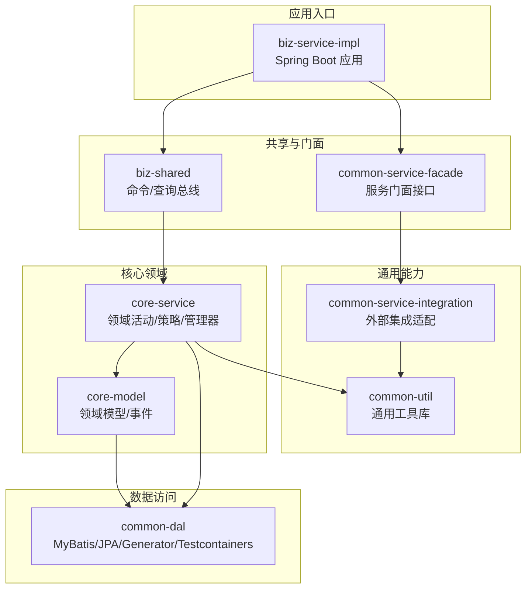
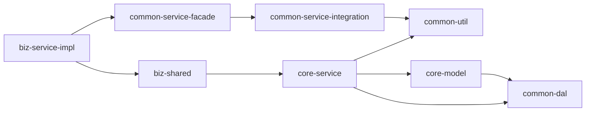
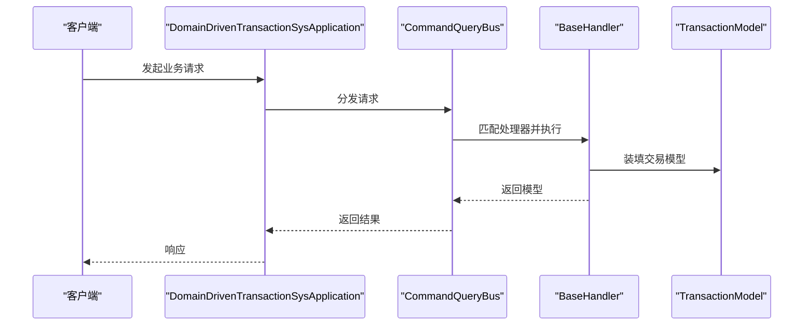
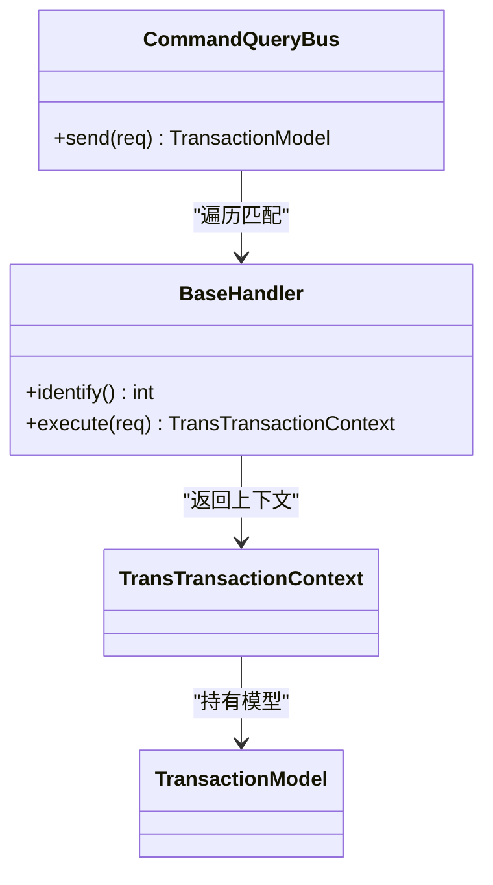
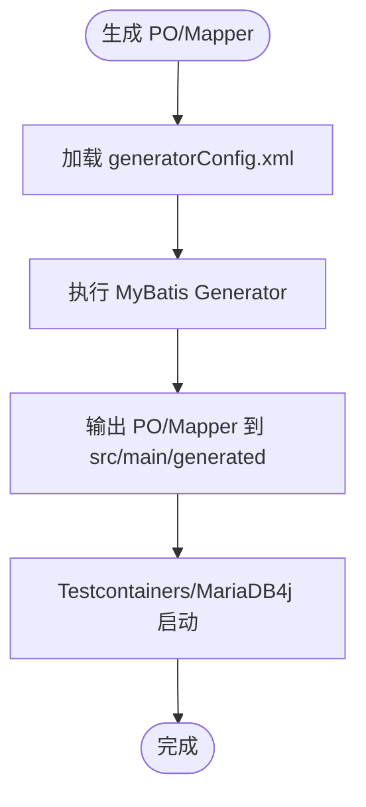
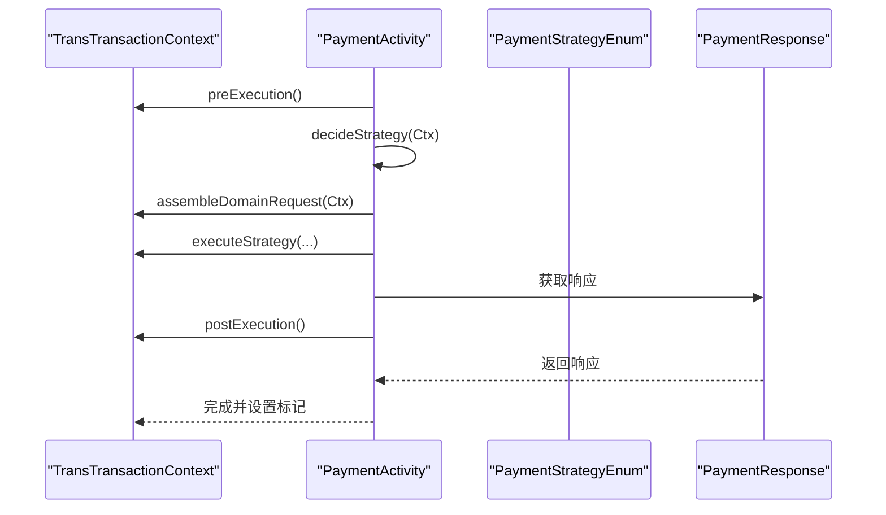
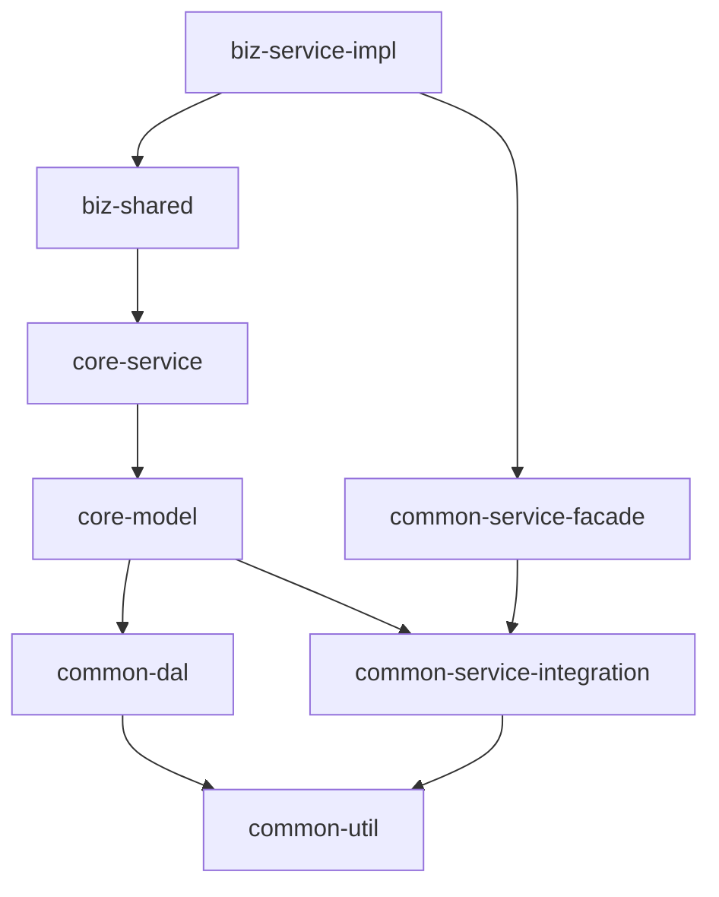

# 项目结构

<cite>
**本文档引用的文件**
- [settings.gradle](file://settings.gradle)
- [build.gradle](file://build.gradle)
- [script-plugin.gradle](file://script-plugin.gradle)
- [biz-service-impl/build.gradle](file://biz-service-impl/build.gradle)
- [biz-shared/build.gradle](file://biz-shared/build.gradle)
- [common-dal/build.gradle](file://common-dal/build.gradle)
- [common-service-facade/build.gradle](file://common-service-facade/build.gradle)
- [common-service-integration/build.gradle](file://common-service-integration/build.gradle)
- [common-util/build.gradle](file://common-util/build.gradle)
- [core-model/build.gradle](file://core-model/build.gradle)
- [core-service/build.gradle](file://core-service/build.gradle)
- [biz-service-impl/src/main/java/com/magicliang/transaction/sys/DomainDrivenTransactionSysApplication.java](file://biz-service-impl/src/main/java/com/magicliang/transaction/sys/DomainDrivenTransactionSysApplication.java)
- [biz-shared/src/main/java/com/magicliang/transaction/sys/biz/shared/locator/CommandQueryBus.java](file://biz-shared/src/main/java/com/magicliang/transaction/sys/biz/shared/locator/CommandQueryBus.java)
- [common-dal/src/main/java/com/magicliang/transaction/sys/common/dal/mybatis/po/TransPayOrderPo.java](file://common-dal/src/main/java/com/magicliang/transaction/sys/common/dal/mybatis/po/TransPayOrderPo.java)
- [common-service-facade/src/main/java/com/magicliang/transaction/sys/common/service/facade/PayChannelService.java](file://common-service-facade/src/main/java/com/magicliang/transaction/sys/common/service/facade/PayChannelService.java)
- [common-service-integration/src/main/java/com/magicliang/transaction/sys/common/service/integration/delegate/alipay/IAlipayDelegate.java](file://common-service-integration/src/main/java/com/magicliang/transaction/sys/common/service/integration/delegate/alipay/IAlipayDelegate.java)
- [common-util/src/main/java/com/magicliang/transaction/sys/common/util/JsonUtils.java](file://common-util/src/main/java/com/magicliang/transaction/sys/common/util/JsonUtils.java)
- [core-model/src/main/java/com/magicliang/transaction/sys/core/model/entity/TransPayOrderEntity.java](file://core-model/src/main/java/com/magicliang/transaction/sys/core/model/entity/TransPayOrderEntity.java)
- [core-service/src/main/java/com/magicliang/transaction/sys/core/domain/activity/payment/PaymentActivity.java](file://core-service/src/main/java/com/magicliang/transaction/sys/core/domain/activity/payment/PaymentActivity.java)
</cite>

## 目录
1. [简介](#简介)
2. [项目结构](#项目结构)
3. [核心组件](#核心组件)
4. [架构总览](#架构总览)
5. [详细组件分析](#详细组件分析)
6. [依赖分析](#依赖分析)
7. [性能考量](#性能考量)
8. [故障排查指南](#故障排查指南)
9. [结论](#结论)
10. [附录](#附录)

## 简介
本项目采用领域驱动设计（DDD）思想，围绕“交易”核心业务域构建，采用 Gradle 多模块工程组织，划分出 biz-service-impl、biz-shared、common-dal、common-service-facade、common-service-integration、common-util、core-model、core-service 八个核心模块，分别承担“业务实现入口”“共享业务能力”“数据访问层”“通用服务门面”“外部集成适配”“通用工具库”“领域模型”“核心领域服务”的职责。通过清晰的模块边界与依赖方向，实现代码复用、职责分离、测试隔离与可演进的架构。

## 项目结构
- 多模块 Gradle 构建：根项目通过 settings.gradle 声明子模块，各模块独立维护 build.gradle，统一继承根项目的插件与依赖管理策略。
- 模块命名与职责：
  - biz-service-impl：业务服务实现入口，负责对外暴露 Web/RPC/Facade 能力，聚合其他模块并打包为可运行的 Spring Boot 应用。
  - biz-shared：共享业务能力与命令/查询分发总线，屏蔽具体实现细节，向上提供统一的业务接口。
  - common-dal：数据访问层，封装 MyBatis/JPA、数据源配置、MyBatis Generator、Testcontainers 等。
  - common-service-facade：通用服务门面接口定义，向下对接 core-service 或外部系统。
  - common-service-integration：外部系统集成适配层，如支付宝等第三方通道的委托接口与参数封装。
  - common-util：通用工具库，提供 JSON、集合、断言、并发、APM 等基础能力。
  - core-model：领域模型与事件，定义聚合根、值对象、实体、规范等，承载业务不变量。
  - core-service：核心领域服务与活动编排，包含策略、活动、管理器、事件监听等。
- Gradle 配置：
  - 根 build.gradle 统一 Java Toolchain、依赖管理、JUnit 版本、仓库镜像、插件应用与测试配置。
  - 各子模块按需声明对其他模块的 api/implementation 依赖，避免循环依赖并控制可见性。
  - biz-service-impl 作为可执行应用启用 bootJar；其余模块默认禁用。

图表来源
- [settings.gradle:6-14](file://settings.gradle#L6-L14)
- [biz-service-impl/build.gradle:5-23](file://biz-service-impl/build.gradle#L5-L23)
- [biz-shared/build.gradle:1-3](file://biz-shared/build.gradle#L1-L3)
- [common-dal/build.gradle:28-53](file://common-dal/build.gradle#L28-L53)
- [common-service-facade/build.gradle:1-11](file://common-service-facade/build.gradle#L1-L11)
- [common-service-integration/build.gradle:1-3](file://common-service-integration/build.gradle#L1-L3)
- [common-util/build.gradle:8-39](file://common-util/build.gradle#L8-L39)
- [core-model/build.gradle:1-5](file://core-model/build.gradle#L1-L5)
- [core-service/build.gradle:1-5](file://core-service/build.gradle#L1-L5)

章节来源
- [settings.gradle:1-16](file://settings.gradle#L1-L16)
- [build.gradle:15-310](file://build.gradle#L15-L310)
- [biz-service-impl/build.gradle:1-80](file://biz-service-impl/build.gradle#L1-L80)
- [biz-shared/build.gradle:1-11](file://biz-shared/build.gradle#L1-L11)
- [common-dal/build.gradle:1-62](file://common-dal/build.gradle#L1-L62)
- [common-service-facade/build.gradle:1-11](file://common-service-facade/build.gradle#L1-L11)
- [common-service-integration/build.gradle:1-11](file://common-service-integration/build.gradle#L1-L11)
- [common-util/build.gradle:1-47](file://common-util/build.gradle#L1-L47)
- [core-model/build.gradle:1-15](file://core-model/build.gradle#L1-L15)
- [core-service/build.gradle:1-13](file://core-service/build.gradle#L1-L13)

## 核心组件
- 应用入口与启动
  - biz-service-impl 提供 DomainDrivenTransactionSysApplication，启用事务管理、加载 XML 配置与属性文件，支持 CommandLineRunner 初始化与资源销毁钩子。
- 共享业务总线
  - biz-shared 的 CommandQueryBus 负责根据请求类型分发到对应 BaseHandler，统一异常处理与执行耗时记录。
- 数据访问层
  - common-dal 提供 MyBatis Mapper/PO、JPA Starter、MyBatis Generator 插件、Embedded/MariaDB4j、Testcontainers 等，支撑本地与容器化测试环境。
- 通用服务门面
  - common-service-facade 定义 PayChannelService 等门面接口，向上屏蔽实现细节。
- 外部集成适配
  - common-service-integration 定义 IAlipayDelegate 等委托接口，封装第三方通道参数与返回。
- 通用工具库
  - common-util 提供 JsonUtils、断言、集合、HTTP、UUID、APM 等工具，统一序列化策略与缓存开关。
- 领域模型
  - core-model 定义 TransPayOrderEntity 等聚合根与状态机、转换器、校验器、事件等。
- 核心领域服务
  - core-service 提供 PaymentActivity 等活动编排、策略选择、前置/后置检查与幂等控制。

章节来源
- [biz-service-impl/src/main/java/com/magicliang/transaction/sys/DomainDrivenTransactionSysApplication.java:52-150](file://biz-service-impl/src/main/java/com/magicliang/transaction/sys/DomainDrivenTransactionSysApplication.java#L52-L150)
- [biz-shared/src/main/java/com/magicliang/transaction/sys/biz/shared/locator/CommandQueryBus.java:25-79](file://biz-shared/src/main/java/com/magicliang/transaction/sys/biz/shared/locator/CommandQueryBus.java#L25-L79)
- [common-dal/src/main/java/com/magicliang/transaction/sys/common/dal/mybatis/po/TransPayOrderPo.java:1-120](file://common-dal/src/main/java/com/magicliang/transaction/sys/common/dal/mybatis/po/TransPayOrderPo#L1-L120)
- [common-service-facade/src/main/java/com/magicliang/transaction/sys/common/service/facade/PayChannelService.java:12-15](file://common-service-facade/src/main/java/com/magicliang/transaction/sys/common/service/facade/PayChannelService.java#L12-L15)
- [common-service-integration/src/main/java/com/magicliang/transaction/sys/common/service/integration/delegate/alipay/IAlipayDelegate.java:15-30](file://common-service-integration/src/main/java/com/magicliang/transaction/sys/common/service/integration/delegate/alipay/IAlipayDelegate.java#L15-L30)
- [common-util/src/main/java/com/magicliang/transaction/sys/common/util/JsonUtils.java:30-293](file://common-util/src/main/java/com/magicliang/transaction/sys/common/util/JsonUtils.java#L30-L293)
- [core-model/src/main/java/com/magicliang/transaction/sys/core/model/entity/TransPayOrderEntity.java:27-216](file://core-model/src/main/java/com/magicliang/transaction/sys/core/model/entity/TransPayOrderEntity#L27-L216)
- [core-service/src/main/java/com/magicliang/transaction/sys/core/domain/activity/payment/PaymentActivity.java:36-202](file://core-service/src/main/java/com/magicliang/transaction/sys/core/domain/activity/payment/PaymentActivity.java#L36-L202)

## 架构总览
- 分层与边界
  - 表现层：biz-service-impl 提供 Web/RPC/Facade 入口。
  - 领域层：core-service 编排活动与策略，core-model 承载不变量。
  - 基础设施层：common-dal 提供持久化与数据源，common-service-integration 提供外部通道适配，common-util 提供通用能力。
  - 共享层：biz-shared 提供命令/查询总线与业务编排。
- 依赖方向
  - 从外向内：biz-service-impl -> biz-shared -> core-service -> core-model -> common-dal -> common-util
  - 从外向内：biz-service-impl -> common-service-facade -> common-service-integration -> common-util
- 可运行性
  - biz-service-impl 启用 bootJar 并包含 Spring Boot 启动类；其余模块禁用 bootJar，仅打包为库。

图表来源
- [biz-service-impl/build.gradle:5-23](file://biz-service-impl/build.gradle#L5-L23)
- [biz-shared/build.gradle:1-3](file://biz-shared/build.gradle#L1-L3)
- [core-model/build.gradle:1-5](file://core-model/build.gradle#L1-L5)
- [core-service/build.gradle:1-5](file://core-service/build.gradle#L1-L5)
- [common-dal/build.gradle:28-53](file://common-dal/build.gradle#L28-L53)
- [common-service-facade/build.gradle:1-11](file://common-service-facade/build.gradle#L1-L11)
- [common-service-integration/build.gradle:1-3](file://common-service-integration/build.gradle#L1-L3)
- [common-util/build.gradle:8-39](file://common-util/build.gradle#L8-L39)

## 详细组件分析

### biz-service-impl（业务服务实现入口）
- 职责
  - Spring Boot 应用入口，加载 XML 配置与属性文件，初始化数据源连接与线程池，提供 Web/RPC/Facade 能力。
- 关键点
  - 启用事务管理与自定义属性源，CommandLineRunner 用于启动阶段初始化与资源销毁钩子。
  - 依赖 biz-shared 与 common-service-facade，启用 bootJar。
- 测试组织
  - 通过 sourceSets 合并 integration 与 unit 测试目录，统一测试任务。

图表来源
- [biz-service-impl/src/main/java/com/magicliang/transaction/sys/DomainDrivenTransactionSysApplication.java:62-150](file://biz-service-impl/src/main/java/com/magicliang/transaction/sys/DomainDrivenTransactionSysApplication.java#L62-L150)
- [biz-shared/src/main/java/com/magicliang/transaction/sys/biz/shared/locator/CommandQueryBus.java:42-77](file://biz-shared/src/main/java/com/magicliang/transaction/sys/biz/shared/locator/CommandQueryBus.java#L42-L77)

章节来源
- [biz-service-impl/build.gradle:5-23](file://biz-service-impl/build.gradle#L5-L23)
- [biz-service-impl/src/main/java/com/magicliang/transaction/sys/DomainDrivenTransactionSysApplication.java:52-150](file://biz-service-impl/src/main/java/com/magicliang/transaction/sys/DomainDrivenTransactionSysApplication.java#L52-L150)

### biz-shared（共享业务能力与命令/查询总线）
- 职责
  - 提供统一的命令/查询分发总线 CommandQueryBus，屏蔽具体处理器实现，集中异常与耗时统计。
- 关键点
  - 通过 Spring 注入 BaseHandler 列表，按请求类型匹配处理器并执行，异常时填充错误码与错误信息。
- 与 core-service 的关系
  - 通过 api 依赖 core-service，承接领域活动与策略的编排。

图表来源
- [biz-shared/src/main/java/com/magicliang/transaction/sys/biz/shared/locator/CommandQueryBus.java:25-79](file://biz-shared/src/main/java/com/magicliang/transaction/sys/biz/shared/locator/CommandQueryBus.java#L25-L79)

章节来源
- [biz-shared/build.gradle:1-3](file://biz-shared/build.gradle#L1-L3)
- [biz-shared/src/main/java/com/magicliang/transaction/sys/biz/shared/locator/CommandQueryBus.java:16-79](file://biz-shared/src/main/java/com/magicliang/transaction/sys/biz/shared/locator/CommandQueryBus.java#L16-L79)

### common-dal（数据访问层）
- 职责
  - 提供 MyBatis Mapper/PO、JPA Starter、MyBatis Generator 插件、Embedded/MariaDB4j、Testcontainers 等，支撑本地与容器化测试环境。
- 关键点
  - 通过 mybatisGenerator 插件与配置文件生成 PO/Mapper，集成 PageHelper、MySQL/MariaDB 驱动与 Testcontainers。
  - 依赖 common-util 提供的基础能力。

图表来源
- [common-dal/build.gradle:2-26](file://common-dal/build.gradle#L2-L26)
- [common-dal/build.gradle:28-53](file://common-dal/build.gradle#L28-L53)

章节来源
- [common-dal/build.gradle:1-62](file://common-dal/build.gradle#L1-L62)
- [common-dal/src/main/java/com/magicliang/transaction/sys/common/dal/mybatis/po/TransPayOrderPo.java:1-120](file://common-dal/src/main/java/com/magicliang/transaction/sys/common/dal/mybatis/po/TransPayOrderPo#L1-L120)

### common-service-facade（通用服务门面）
- 职责
  - 定义通用服务接口（如 PayChannelService），向上屏蔽实现细节，向下对接 core-service 或外部系统。
- 关键点
  - 作为接口层，便于替换实现与扩展。

章节来源
- [common-service-facade/build.gradle:1-11](file://common-service-facade/build.gradle#L1-L11)
- [common-service-facade/src/main/java/com/magicliang/transaction/sys/common/service/facade/PayChannelService.java:12-15](file://common-service-facade/src/main/java/com/magicliang/transaction/sys/common/service/facade/PayChannelService.java#L12-L15)

### common-service-integration（外部集成适配）
- 职责
  - 提供第三方通道（如支付宝）的委托接口与参数封装，屏蔽外部协议差异。
- 关键点
  - IAlipayDelegate 定义标准支付方法，参数与返回 DTO 封装。

章节来源
- [common-service-integration/build.gradle:1-11](file://common-service-integration/build.gradle#L1-L11)
- [common-service-integration/src/main/java/com/magicliang/transaction/sys/common/service/integration/delegate/alipay/IAlipayDelegate.java:15-30](file://common-service-integration/src/main/java/com/magicliang/transaction/sys/common/service/integration/delegate/alipay/IAlipayDelegate.java#L15-L30)

### common-util（通用工具库）
- 职责
  - 提供 JSON、集合、断言、HTTP、UUID、APM 等通用能力，统一序列化策略与缓存开关。
- 关键点
  - JsonUtils 提供多种序列化策略与缓存控制，满足不同场景性能与 GC 需求。

章节来源
- [common-util/build.gradle:8-39](file://common-util/build.gradle#L8-L39)
- [common-util/src/main/java/com/magicliang/transaction/sys/common/util/JsonUtils.java:30-293](file://common-util/src/main/java/com/magicliang/transaction/sys/common/util/JsonUtils.java#L30-L293)

### core-model（领域模型）
- 职责
  - 定义聚合根（如 TransPayOrderEntity）、值对象、实体、规范与事件，承载业务不变量。
- 关键点
  - 聚合根包含状态机与时间戳字段，提供状态迁移与浅拷贝能力。

章节来源
- [core-model/build.gradle:1-5](file://core-model/build.gradle#L1-L5)
- [core-model/src/main/java/com/magicliang/transaction/sys/core/model/entity/TransPayOrderEntity.java:27-216](file://core-model/src/main/java/com/magicliang/transaction/sys/core/model/entity/TransPayOrderEntity#L27-L216)

### core-service（核心领域服务）
- 职责
  - 提供领域活动（如 PaymentActivity）编排、策略选择、前置/后置检查与幂等控制。
- 关键点
  - PaymentActivity 在 preExecution 中进行幂等与状态校验，在 postExecution 中校验响应并影响后续活动。

图表来源
- [core-service/src/main/java/com/magicliang/transaction/sys/core/domain/activity/payment/PaymentActivity.java:52-169](file://core-service/src/main/java/com/magicliang/transaction/sys/core/domain/activity/payment/PaymentActivity.java#L52-L169)

章节来源
- [core-service/build.gradle:1-13](file://core-service/build.gradle#L1-L13)
- [core-service/src/main/java/com/magicliang/transaction/sys/core/domain/activity/payment/PaymentActivity.java:36-202](file://core-service/src/main/java/com/magicliang/transaction/sys/core/domain/activity/payment/PaymentActivity.java#L36-L202)

## 依赖分析
- 模块间依赖方向
  - biz-service-impl -> biz-shared, common-service-facade
  - biz-shared -> core-service
  - core-model -> common-util, common-service-integration, common-dal
  - core-service -> core-model
  - common-dal -> common-util
  - common-service-integration -> common-util
- 依赖管理策略
  - 根 build.gradle 统一 Java Toolchain、JUnit 版本、仓库镜像与插件应用。
  - 各模块使用 api/implementation 控制依赖可见性，避免循环依赖。
- 可运行性与打包
  - biz-service-impl 启用 bootJar；其余模块禁用 bootJar，仅打包为库。

图表来源
- [settings.gradle:6-14](file://settings.gradle#L6-L14)
- [biz-service-impl/build.gradle:5-23](file://biz-service-impl/build.gradle#L5-L23)
- [biz-shared/build.gradle:1-3](file://biz-shared/build.gradle#L1-L3)
- [core-model/build.gradle:1-5](file://core-model/build.gradle#L1-L5)
- [core-service/build.gradle:1-5](file://core-service/build.gradle#L1-L5)
- [common-dal/build.gradle:28-53](file://common-dal/build.gradle#L28-L53)
- [common-service-integration/build.gradle:1-3](file://common-service-integration/build.gradle#L1-L3)
- [common-util/build.gradle:8-39](file://common-util/build.gradle#L8-L39)

章节来源
- [build.gradle:15-310](file://build.gradle#L15-L310)
- [biz-service-impl/build.gradle:5-23](file://biz-service-impl/build.gradle#L5-L23)
- [biz-shared/build.gradle:1-3](file://biz-shared/build.gradle#L1-L3)
- [core-model/build.gradle:1-5](file://core-model/build.gradle#L1-L5)
- [core-service/build.gradle:1-5](file://core-service/build.gradle#L1-L5)
- [common-dal/build.gradle:28-53](file://common-dal/build.gradle#L28-L53)
- [common-service-integration/build.gradle:1-3](file://common-service-integration/build.gradle#L1-L3)
- [common-util/build.gradle:8-39](file://common-util/build.gradle#L8-L39)

## 性能考量
- JSON 序列化
  - common-util 的 JsonUtils 提供多种序列化策略与缓存开关，建议在高吞吐场景启用缓存策略，在 GC 敏感场景禁用缓存。
- ORM 与数据源
  - common-dal 使用 MyBatis 与 PageHelper，结合 Testcontainers 与 Embedded 数据源，提升测试效率与一致性。
- 并发与线程池
  - biz-service-impl 提供线程池配置与 Web 过滤器，建议结合实际流量压测优化线程池大小与队列策略。
- 依赖可见性
  - 通过 api/implementation 控制依赖传播，减少不必要的编译与运行时开销。

## 故障排查指南
- 启动失败（数据源相关）
  - 若使用自动配置数据源，请确认配置完整；若使用 XML 或自定义配置，请排除自动配置以避免冲突。
- 测试环境
  - 使用 Testcontainers/MariaDB4j 启动嵌入式数据库，确保 Docker 可用与端口未被占用。
- 日志与监控
  - 启用 log4j2 与 OpenTelemetry 相关依赖，结合 APM 工具定位性能瓶颈。
- 单元与集成测试
  - 通过 sourceSets 合并测试目录，使用 JUnit 5 平台与 Spring Boot Test，确保测试隔离与可重复执行。

章节来源
- [biz-service-impl/src/main/java/com/magicliang/transaction/sys/DomainDrivenTransactionSysApplication.java:22-51](file://biz-service-impl/src/main/java/com/magicliang/transaction/sys/DomainDrivenTransactionSysApplication.java#L22-L51)
- [common-dal/build.gradle:37-42](file://common-dal/build.gradle#L37-L42)
- [common-util/build.gradle:217-220](file://common-util/build.gradle#L217-L220)

## 结论
本项目通过清晰的模块划分与依赖方向，实现了领域驱动交易系统的高内聚、低耦合与可演进性。biz-service-impl 作为应用入口，biz-shared 提供统一编排，core-service/Model 承载核心领域逻辑，common-* 模块提供通用能力与外部集成，形成从外向内的稳定依赖结构。配合 Gradle 多模块构建与统一依赖管理，提升了代码复用、职责分离与测试隔离能力。

## 附录
- Gradle 配置要点
  - 根 build.gradle 统一 Java Toolchain、JUnit 版本、仓库镜像与插件应用。
  - 各子模块按需声明 api/implementation 依赖，biz-service-impl 启用 bootJar。
- 模块清单
  - biz-service-impl、biz-shared、common-dal、common-service-facade、common-service-integration、common-util、core-model、core-service