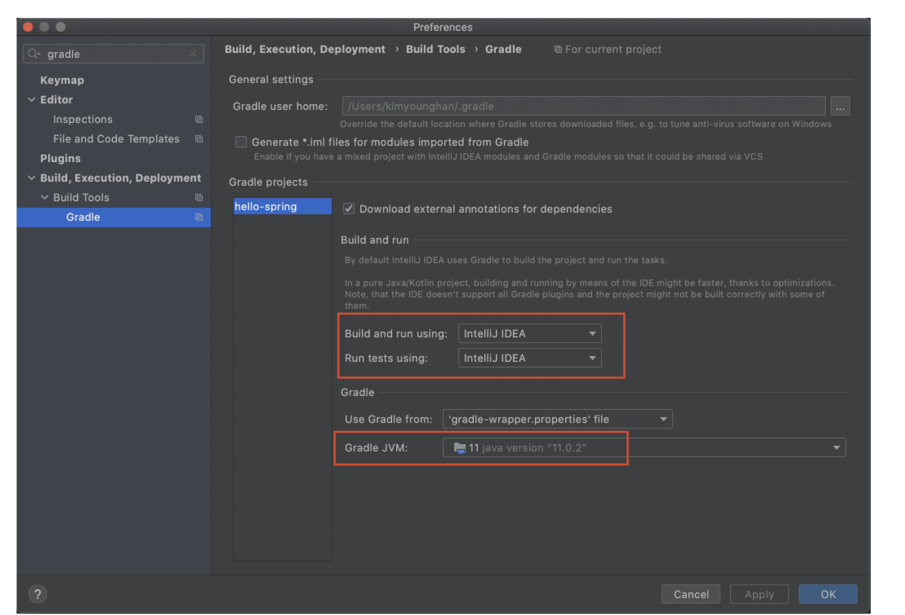

# domain-driven-transaction-sys

一个领域驱动设计的交易系统的例子

TODO：一个留给我自己的问题：我到底要不要让这个服务构造成一个 k8s 的微服务，要不要把所有最佳实践引入这个开源项目里来？ TODO：

1. 梳理 gradle task。
2. 实现一个 Spring WebFlux 的 reactor controller。
3. 引入 mariadb4j 做集成测试用。
4. docker 化：准备加一个带有 MySQL 的 k8s 集群。
5. mock 支付环节。
6. 写模型设计和系统分层的输入。
7. 实现线程池开源化。
8. 实现基于db 的最大努力型事务。

## how to build it

`./gradlew clean build -x test --stacktrace`

# 架构解说

## 经典 gradle 架构

application

- src
- main
- test
- settings.gradle
- build.gradle
- gradle.properties

## gradle 多模块架构

注意，新增 module 最好只增加 gradle module。

    - module1
        -src
            - main
            -test
        - settings.gradle
        - build.gradle
    - module2
        -src
            - main
            -test
        - settings.gradle
        - build.gradle
    - settings.gradle
    - build.gradle
    - gradle.properties

# 如何修复gradle运行问题

