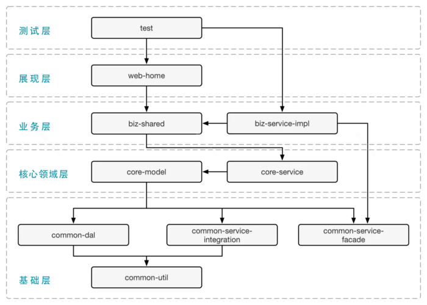
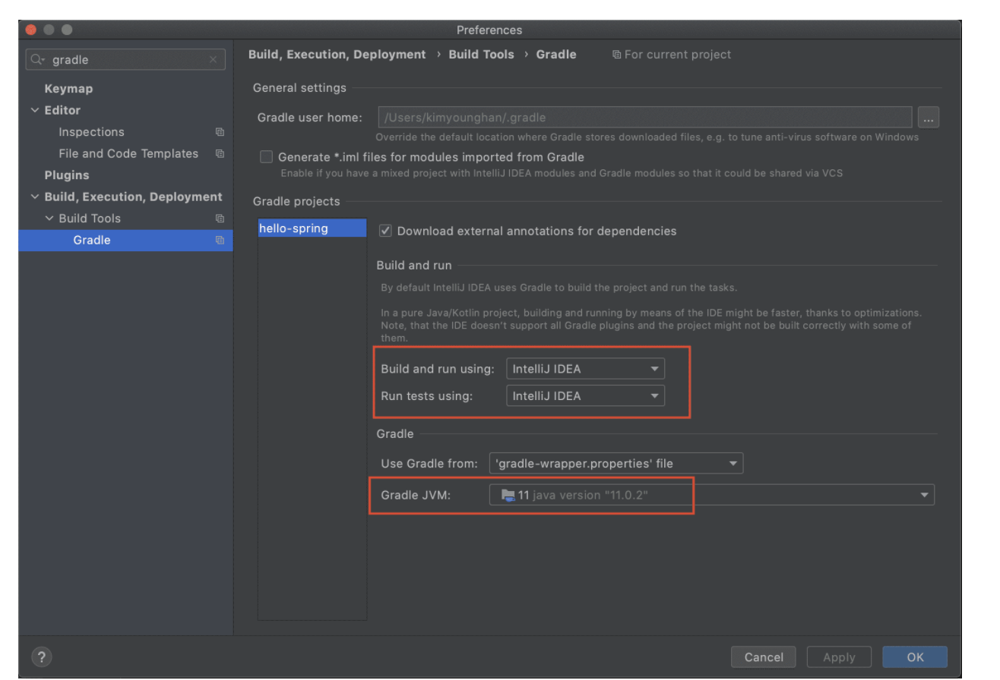

# domain-driven-transaction-sys

**一个领域驱动设计的交易系统的示例项目**

## 项目简介

本项目是一个基于领域驱动设计(DDD)原则构建的交易系统示例,展示了如何在 Java 8 + Spring Boot 2.7.18 环境下实现企业级的交易系统架构。项目采用 Gradle 多模块构建,遵循 SOFA 分层架构设计。

## 技术栈

- **Java**: 8 (使用 Gradle Toolchain 管理)
- **Spring Boot**: 2.7.18
- **Spring Cloud**: 2021.0.8
- **构建工具**: Gradle 8.6
- **持久层**: 
  - Spring Data JPA
  - MyBatis 2.3.2
  - MySQL / MariaDB
- **测试框架**: JUnit 5.9.3
- **日志**: Log4j2
- **可观测性**: OpenTelemetry 2.10.0

## 项目结构

```
domain-driven-transaction-sys
├── biz-service-impl/        # 业务服务实现层
├── biz-shared/              # 业务共享模块
├── common-dal/              # 数据访问层
├── common-service-facade/   # 服务门面层
├── common-service-integration/ # 服务集成层
├── common-util/             # 通用工具类
├── core-model/              # 核心领域模型
└── core-service/            # 核心服务层
```

### 模块说明

- **biz-service-impl**: 业务服务实现,包含 WebFlux 和 Web MVC 支持,是应用的可启动模块
- **biz-shared**: 业务共享模块,提供业务级别的共享组件
- **common-dal**: 数据访问层,集成 JPA 和 MyBatis,支持多数据源
- **common-service-facade**: 服务门面,定义对外暴露的服务接口
- **common-service-integration**: 服务集成层,处理第三方系统集成
- **common-util**: 通用工具类库
- **core-model**: 核心领域模型,包含领域实体、值对象、聚合根等
- **core-service**: 核心领域服务,实现业务逻辑

## 快速开始

### 环境要求

- JDK 8 (推荐使用 SDKMAN 安装: `sdk install java 8.0.432`)
- Gradle 8.6 (项目自带 Gradle Wrapper)

### 构建项目

```bash
# 清理并构建(跳过测试)
./gradlew clean build -x test --stacktrace

# 完整构建(包含测试)
./gradlew clean build
```

### 运行测试

```bash
# 运行所有测试
./gradlew test

# 运行所有测试并生成聚合报告
./gradlew testAggregateTestReport

# 运行指定测试类
./gradlew test --tests com.magicliang.transaction.sys.aop.factory.ProxyFactoryTest

# 运行指定测试方法
./gradlew test --tests 'com.magicliang.transaction.sys.DomainDrivenTransactionSysApplicationIntegrationTest.testGetWildCardType'

# 使用通配符运行测试
./gradlew test --tests com.magicliang.transaction.sys.DomainDrivenTransactionSysApplicationIntegrationTest.*test*
```

## 数据库 Profile 说明

项目通过 Spring Profile 机制支持多种数据库接入方式，通过 `application.yml` 中的 `spring.profiles.active` 切换，或在启动参数中指定 `--spring.profiles.active=xxx`。

### Profile 总览

| Profile | 数据库类型 | 适用环节 | 是否需要外部数据库 | 前置条件 |
|---|---|---|---|---|
| `local-tc-dev` (默认) | MariaDB (Docker 容器) | 本地开发、集成测试 | 否 | 安装并运行 Docker 或 Podman |
| `local-mariadb4j-dev` | MariaDB (嵌入式二进制) | 本地开发、集成测试 | 否 | 仅支持 x86 架构 |
| `local-mysql-dev` | MySQL 8.0+ | 本地开发 | 是 | 本地安装并启动 MySQL |
| `staging` | 由部署环境提供 | 预发环境 | 是 | 环境数据库连接配置 |
| `prod` | 由部署环境提供 | 生产环境 | 是 | 环境数据库连接配置 |

### 自包含 Profile（无需配置外部数据库连接）

以下 Profile 内置了数据库的完整生命周期管理，启动时自动创建数据库、执行 DDL，开发者无需手动安装或配置任何数据库：

**`local-tc-dev`（推荐，默认激活）**
- 通过 Testcontainers 自动启动 MariaDB 10.11 Docker 容器
- 支持所有芯片架构（ARM64/AMD64/x86_64）和操作系统
- 容器运行时支持 **Docker Desktop** 和 **Podman**
- 自动创建 `test_master` 和 `test_slave1` 双数据库，执行 `sql/mysql/schema.ddl` 初始化
- 数据库初始化由 `EmbeddedTestcontainersDbConfig` 手动管理（`spring.sql.init.mode=never`），不依赖 Spring Boot 自动初始化
- 首次运行自动拉取镜像（约 400MB），后续使用缓存

**`local-mariadb4j-dev`**
- 通过 mariadb4j 在 JVM 进程内解压并启动 MariaDB 原生二进制
- 在端口 4306（master）和 4307（slave）启动两个独立实例
- 仅支持 x86_64 架构，ARM 芯片（Apple Silicon 等）不可用
- 无需 Docker，无需安装任何数据库

### 外部数据库 Profile（需要配置数据库连接属性）

以下 Profile 需要开发者自行准备数据库实例，并在配置中提供正确的连接信息：

**`local-mysql-dev`**
- 连接本地运行的 MySQL 8.0+ 实例
- 需要在 `application.yml` 中配置 `spring.datasource.master.jdbc-url`、`username`、`password` 等属性
- 需要手动创建数据库和执行 DDL
- 配置类：`DataSourceConfig.java`，通过 `@ConfigurationProperties` 绑定属性

**`staging` / `prod`**
- 由部署环境（K8s ConfigMap、环境变量等）提供数据库连接配置
- 项目中不包含具体的数据源配置，需由运维或部署流程注入

### 使用 Docker Desktop 运行（推荐）

安装 Docker Desktop 后，无需额外配置，直接运行：

```bash
# 使用默认 Profile（local-tc-dev）
./gradlew test

# 启动应用
./gradlew bootRun
```

### 使用 Podman 运行（macOS/Linux 替代方案）

如果使用 Podman 替代 Docker，需要额外配置：

**1. 安装并启动 Podman**

```bash
# macOS
brew install podman
podman machine init
podman machine start
```

**2. 配置 Testcontainers 使用 Podman socket**

创建 `~/.testcontainers.properties`：

```properties
docker.host=unix:///var/folders/<your-path>/podman/podman-machine-default-api.sock
ryuk.container.privileged=true
testcontainers.reuse.enable=true
```

获取实际 socket 路径：

```bash
podman machine inspect --format '{{.ConnectionInfo.PodmanSocket.Path}}'
```

**3. 配置镜像加速（可选，网络受限时使用）**

编辑 Podman 虚拟机内的 `/etc/containers/registries.conf`：

```bash
podman machine ssh
sudo vi /etc/containers/registries.conf
```

添加镜像加速配置：

```toml
[[registry]]
location = "docker.io"
[[registry.mirror]]
location = "docker.m.daocloud.io"
```

**4. 运行测试**

```bash
# 设置 DOCKER_HOST 环境变量指向 Podman socket
export DOCKER_HOST="unix://$(podman machine inspect --format '{{.ConnectionInfo.PodmanSocket.Path}}')"
export TESTCONTAINERS_RYUK_DISABLED=true

# 运行测试
./gradlew test

# 或一行命令
DOCKER_HOST="unix://$(podman machine inspect --format '{{.ConnectionInfo.PodmanSocket.Path}}')" \
  TESTCONTAINERS_RYUK_DISABLED=true \
  ./gradlew test
```

### 切换 Profile

```bash
# 使用默认 Profile（local-tc-dev，需要 Docker/Podman）
./gradlew test

# 指定其他 Profile
./gradlew test -Dspring.profiles.active=local-mariadb4j-dev
./gradlew bootRun -Dspring.profiles.active=local-mysql-dev
```

## Docker + K8s 部署

项目支持通过 Docker 容器化 + Kubernetes 集群化部署，使用 **Podman** 替代 Docker、**minikube** 作为本地 K8s 环境。支持 dev / staging / prod 三套独立环境，每个环境拥有独立的 MariaDB 数据库（持久化存储）和独立的 Java 应用 Pod。

### 部署架构概览

```
┌─────────────── minikube cluster ───────────────────┐
│                                                     │
│  ┌─── ddts-dev ─────────────────────────────────┐  │
│  │  MariaDB Pod (10.11) ◄── App Pod (JDK 8)    │  │
│  │     PVC 1Gi               1 replica          │  │
│  │     ClusterIP:3306        LoadBalancer:8502   │  │
│  └──────────────────────────────────────────────┘  │
│                                                     │
│  ┌─── ddts-staging ─────────────────────────────┐  │
│  │  MariaDB Pod ◄── App Pod                     │  │
│  │     PVC 5Gi       1 replica                  │  │
│  └──────────────────────────────────────────────┘  │
│                                                     │
│  ┌─── ddts-prod ────────────────────────────────┐  │
│  │  MariaDB Pod ◄── App Pod                     │  │
│  │     PVC 20Gi      2 replicas                 │  │
│  └──────────────────────────────────────────────┘  │
│                                                     │
└─────────────────────────────────────────────────────┘
         │ minikube tunnel
         ▼
   localhost:8502
```

### 部署文件目录结构

```
deploy/
├── docker/
│   └── Dockerfile                          # 两阶段构建（JDK 8 编译 → JRE 8 运行）
├── k8s/
│   ├── dev/                                # dev 环境 K8s 清单
│   │   ├── 00-namespace.yaml               # 命名空间 ddts-dev
│   │   ├── 01-mariadb-secret.yaml          # MariaDB root 密码
│   │   ├── 02-mariadb-init-configmap.yaml  # 数据库初始化 SQL（schema.ddl）
│   │   ├── 03-mariadb-pvc.yaml             # 持久化卷声明（1Gi）
│   │   ├── 04-mariadb-deployment.yaml      # MariaDB 10.11 Deployment
│   │   ├── 05-mariadb-service.yaml         # MariaDB ClusterIP Service
│   │   ├── 06-app-configmap.yaml           # Spring Boot 环境变量配置
│   │   ├── 07-app-secret.yaml              # 数据库连接密码
│   │   ├── 08-app-deployment.yaml          # Java 应用 Deployment
│   │   └── 09-app-service.yaml             # 应用 LoadBalancer Service
│   ├── staging/                            # staging 环境（同结构，更大资源配额）
│   └── prod/                               # prod 环境（同结构，2副本，最大配额）
└── scripts/
    ├── env-init.sh                         # 一键安装工具链
    └── env-start.sh                        # 一键启动/销毁/查看环境
```

### 快速部署

#### 1. 安装基础工具

`env-init.sh` 会自动检测操作系统（macOS/Linux），幂等安装 JDK 8、Podman、kubectl、minikube，并启动 minikube 集群：

```bash
./deploy/scripts/env-init.sh
```

支持的系统和包管理器：
- **macOS**: Homebrew (`brew`)
- **Debian/Ubuntu**: APT (`apt`)
- **RHEL/Fedora/CentOS**: DNF/YUM (`dnf`/`yum`)

已安装的工具会自动跳过，脚本可重复执行。

#### 2. 启动环境

`env-start.sh` 会自动构建 Docker 镜像、加载到 minikube、部署 K8s 清单、等待就绪、启动 LoadBalancer tunnel：

```bash
# 启动 dev 环境
./deploy/scripts/env-start.sh dev

# 启动 staging 环境
./deploy/scripts/env-start.sh staging

# 启动 prod 环境
./deploy/scripts/env-start.sh prod
```

启动完成后，脚本会打印访问地址（通常为 `http://127.0.0.1:8502`）。

#### 3. 查看环境状态

```bash
./deploy/scripts/env-start.sh dev --status
```

输出包括 Pod 运行状态、Service 信息、PVC 使用情况。

#### 4. 销毁环境

```bash
./deploy/scripts/env-start.sh dev --destroy
```

会删除整个 namespace 及其所有资源（包括持久化数据）。

### 三套环境参数差异

| 参数 | dev | staging | prod |
|------|-----|---------|------|
| Namespace | `ddts-dev` | `ddts-staging` | `ddts-prod` |
| PVC 容量 | 1Gi | 5Gi | 20Gi |
| MariaDB 内存 | 256Mi-512Mi | 512Mi-1Gi | 1Gi-2Gi |
| App 副本数 | 1 | 1 | 2 |
| JVM 参数 | `-Xms256m -Xmx512m` | `-Xms512m -Xmx1g` | `-Xms1g -Xmx2g` |
| App 内存 | 512Mi-768Mi | 768Mi-1.5Gi | 1.5Gi-3Gi |
| 日志配置 | log4j2-offline.xml | log4j2-online.xml | log4j2-online.xml |

### Dockerfile 说明

采用两阶段构建优化镜像大小和构建缓存：

- **Stage 1 (builder)**: 基于 `eclipse-temurin:8-jdk`，使用项目自带的 `gradlew` 编译 bootJar。构建配置文件优先复制以利用 Docker 层缓存——源码变更不会重新下载依赖。
- **Stage 2 (runtime)**: 基于 `eclipse-temurin:8-jre`，仅包含运行时。以非 root 用户 `app` 运行，暴露端口 8502。

手动构建镜像：

```bash
podman build -t domain-driven-transaction-sys:latest -f deploy/docker/Dockerfile .
```

### K8s 配置工作原理

K8s 部署复用现有的 `local-mysql-dev` Spring Profile，通过环境变量覆盖连接参数：

| 环境变量 | 来源 | 用途 |
|---------|------|------|
| `SPRING_PROFILES_ACTIVE` | ConfigMap | 激活 `local-mysql-dev` profile |
| `SPRING_DATASOURCE_MASTER_JDBC_URL` | ConfigMap | 主库连接串（指向 K8s 内部 `mariadb-svc:3306`） |
| `SPRING_DATASOURCE_SLAVE1_JDBC_URL` | ConfigMap | 从库连接串 |
| `SPRING_DATASOURCE_MASTER_PASSWORD` | Secret | 主库密码 |
| `SPRING_DATASOURCE_SLAVE1_PASSWORD` | Secret | 从库密码 |
| `JAVA_OPTS` | ConfigMap | JVM 参数 |
| `COMMON_ENV` | ConfigMap | 业务环境标识 |
| `LOGGING_CONFIG` | ConfigMap | 日志配置路径 |

`DataSourceConfig.java` 中的 `@ConfigurationProperties(prefix="spring.datasource.master")` 支持 Spring Boot 的松绑定规则，K8s 环境变量 `SPRING_DATASOURCE_MASTER_JDBC_URL` 自动映射为 `spring.datasource.master.jdbc-url`。

MariaDB 数据库初始化利用官方镜像的 `/docker-entrypoint-initdb.d/` 机制：首次启动（PVC 为空）时自动执行 ConfigMap 中的 SQL 脚本创建 `test_master` 和 `test_slave1` 数据库并执行 schema.ddl。

### 与 IDEA 开发的兼容性

K8s 部署不修改任何现有代码。IDEA 中继续使用默认的 `local-tc-dev` profile 启动 `DomainDrivenTransactionSysApplication`，Testcontainers 自动管理临时 MariaDB 容器，数据不持久化，行为与此前完全一致。

### 常用 kubectl 命令

```bash
# 查看 Pod 状态
kubectl get pods -n ddts-dev

# 查看应用日志
kubectl logs -n ddts-dev -l app=ddts-app -f

# 查看 Service（获取外部 IP）
kubectl get svc -n ddts-dev

# 进入 MariaDB 容器
kubectl exec -it -n ddts-dev deploy/mariadb -- mysql -uroot -p

# 端口转发（不用 tunnel 的替代方案）
kubectl port-forward -n ddts-dev svc/ddts-app-svc 8502:8502
```

## 架构设计

### SOFA 分层架构

项目遵循 SOFA (Service Oriented Fabric Architecture) 分层原则,实现清晰的职责分离:



**分层说明**:
- **展示层**: 处理 HTTP 请求,参数校验,响应封装
- **应用层**: 编排业务流程,事务管理
- **领域层**: 核心业务逻辑,领域模型
- **基础层**: 数据访问,第三方集成,技术支撑

### Gradle 多模块架构

采用 Gradle 多模块构建,每个模块职责清晰,依赖关系明确:

```
biz-service-impl
  ├── biz-shared
  ├── common-service-facade
  └── (Spring Boot dependencies)

core-model
  ├── common-util
  ├── common-service-integration
  └── common-dal
```

## 开发指南

### 代码规范

- 尽量对列表使用浅拷贝后再操作,避免影响原列表及其 subList
- 使用 Rich Object 设计模式,封装业务行为
- 遵循领域驱动设计原则,将业务逻辑集中在领域层

### 测试策略

项目支持单元测试和集成测试:

```groovy
sourceSets {
    test.java.srcDirs = ['src/test/integration/java', 'src/test/unit/java']
}
```

测试任务支持并行执行,提升测试效率:

```groovy
test {
    maxParallelForks = Runtime.runtime.availableProcessors()
}
```

## 待办事项

### 架构优化

- [x] 评估是否将服务改造为 K8s 微服务架构
- [ ] 引入更多最佳实践到开源项目

### 功能实现

- [ ] 梳理 Gradle Task，完善集成测试和单元测试用例
- [ ] 实现 Spring WebFlux Reactor Controller
- [ ] 引入 mariadb4j 用于集成测试
- [x] 脚本 Docker 化,准备 MySQL + K8s 集群
- [ ] Mock 支付环节
- [ ] 补充模型设计和系统分层文档
- [ ] 实现线程池开源化
- [ ] 实现基于 DB 的最大努力型事务
- [ ] 实现聚合根(Aggregate Root)的工厂方法化
- [ ] 实现值对象(Value Object)的构建
- [ ] 补全 JPA 映射方法
- [ ] 补全 MyBatis 映射方法
- [ ] 实现动态生成或 Immutable List 的 DRM/MCC/apollo/rainbow 方案

## GitHub SSH 免登录配置

如果遇到 `git push` 时提示 "Authentication failed" 或要求输入用户名密码,说明仓库使用的是 HTTPS URL 而非 SSH URL。

### 配置步骤

1. **检查 SSH 密钥**
   ```bash
   ls -la ~/.ssh/
   # 应该能看到 id_rsa 和 id_rsa.pub
   ```

2. **复制公钥内容**
   ```bash
   cat ~/.ssh/id_rsa.pub
   ```

3. **添加公钥到 GitHub**
   - 访问: https://github.com/settings/keys
   - 点击 "New SSH key"
   - 粘贴公钥内容并保存

4. **测试 SSH 连接**
   ```bash
   ssh -T git@github.com
   # 成功会显示: Hi username! You've successfully authenticated
   ```

5. **更新 remote URL 为 SSH 格式**
   ```bash
   # 查看当前 remote URL
   git remote -v
   
   # 如果是 HTTPS URL,改为 SSH URL
   git remote set-url origin git@github.com:magicliang/domain-driven-transaction-sys.git
   
   # 验证修改
   git remote -v
   ```

### URL 格式对比

- ❌ **HTTPS**: `https://github.com/magicliang/domain-driven-transaction-sys.git` (需要输入密码)
- ✅ **SSH**: `git@github.com:magicliang/domain-driven-transaction-sys.git` (免密登录)

## 最近更新

- `f6cce91` - docs: 添加 GitHub SSH 免登录配置说明
- `475545e` - feat: 添加 JsonDiffToolJackson 工具类及完整测试
- `62094b7` - chore: 删除 ArrayDeque 等多个数据结构类文件
- `755b709` - feat: 新增空间优化的动态规划方法及多场景测试
- `f8b3a6d` - docs: 为二维和一维DP数组添加初始条件及逻辑注释

## 常见问题

### 如何修复 Gradle 运行问题?



## 许可证

本项目仅供学习和参考使用。

## 贡献

欢迎提交 Issue 和 Pull Request!